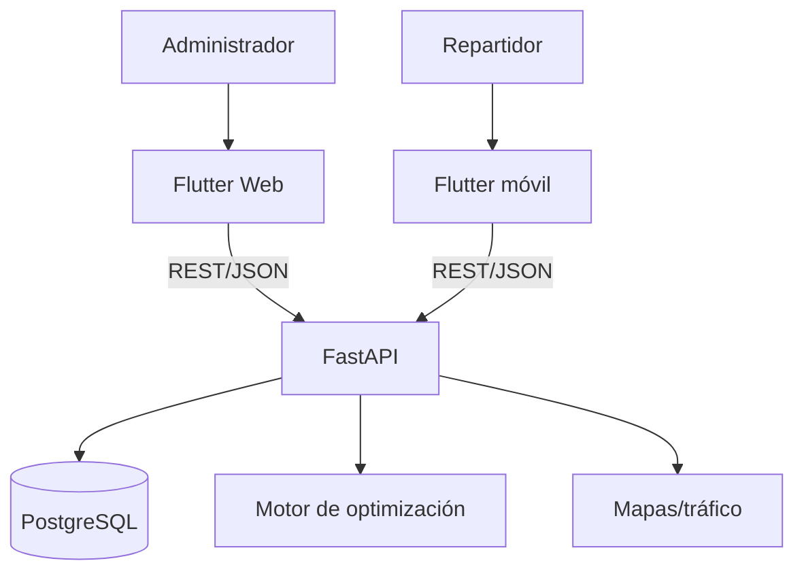
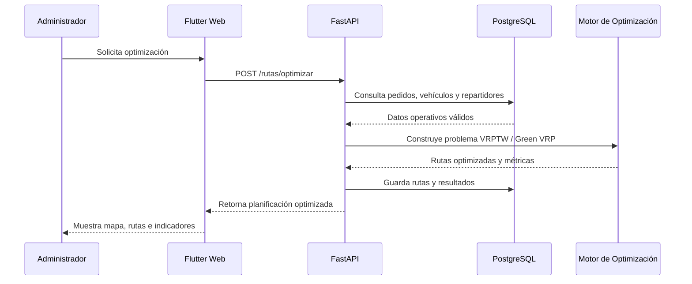

# EcoLogística Huancayo

## Optimizador de Rutas Sostenibles para DistriRápido S.A.C.

## 1. Información general

| Campo | Valor |
|---|---|
| Integrante | **Jordy Steve Chancasanampa Torres** |
| Modalidad | Proyecto individual |
| Curso | Taller de Proyectos 2 - Ingeniería de Sistemas e Informática |
| Aplicación Web | **Flutter Web - Administrador** |
| Aplicación móvil | **Flutter - Repartidor** |
| Backend | FastAPI/Python |
| Base de datos | PostgreSQL |
| Mockups | Figma |
| Gestión | Scrum + Jira |
| Versión documental | 1.0.0 |

> **Cómo leer esta tabla:** resume la propuesta real. Web y móvil son aplicaciones independientes y atienden roles diferentes.

## 2. Contexto

El proyecto toma como línea base la consigna **EcoLogística Lima** y conserva sus datos, RF, RNF, restricciones y metas. Por decisión del estudiante, la propuesta se denomina **EcoLogística Huancayo**. No se inventan datos locales de Huancayo para sustituir cifras del caso base.

La línea base describe más de 250 entregas diarias, 15 camionetas, 35% de costos asociados a combustible/mantenimiento, aproximadamente 3.5 t de CO₂ mensuales y 22% de entregas fuera de ventana.

## 3. Objetivo

Gestionar la operación logística y optimizar rutas de última milla mediante metaheurísticas para VRPTW/Green VRP, reduciendo distancia, consumo, emisiones y penalizaciones, con visualización, operación móvil y reportes de sostenibilidad.

## 4. Arquitectura de canales



> **Interpretación del gráfico:** el administrador y el repartidor no comparten la misma interfaz. Ambos clientes dependen de una API común, que concentra reglas y seguridad.

## 5. Navegación documental - Fase 01 Inicio

| N.° | Documento | Enlace |
|---:|---|---|
| 01 | 01. Selección del enfoque del proyecto | [Abrir](docs/01%20Inicio/01.%20Selecci%C3%B3n%20del%20enfoque%20del%20proyecto%20V_1_0_0.md) |
| 02 | 02. Acta de constitución | [Abrir](docs/01%20Inicio/02.%20Acta%20de%20constituci%C3%B3n%20V_1_0_0.md) |
| 03 | 03. Declaración de la visión | [Abrir](docs/01%20Inicio/03.%20Declaraci%C3%B3n%20de%20la%20visi%C3%B3n%20V_1_0_0.md) |
| 04 | 04. Registro de supuestos y restricciones | [Abrir](docs/01%20Inicio/04.%20Registro%20de%20supuestos%20y%20restricciones%20V_1_0_0.md) |
| 05 | 05. Registro de interesados | [Abrir](docs/01%20Inicio/05.%20Registro%20de%20interesados%20V_1_0_0.md) |
| 06 | 06. Requisitos funcionales | [Abrir](docs/01%20Inicio/06.%20Requisitos%20funcionales%20V_1_0_0.md) |
| 07 | 07. Requisitos no funcionales | [Abrir](docs/01%20Inicio/07.%20Requisitos%20no%20funcionales%20V_1_0_0.md) |
| 08 | 08. Usuarios | [Abrir](docs/01%20Inicio/08.%20Usuarios%20V_1_0_0.md) |
| 09 | 09. Reglas de negocio | [Abrir](docs/01%20Inicio/09.%20Reglas%20de%20negocio%20V_1_0_0.md) |
| 10 | 10. Stack tecnológico | [Abrir](docs/01%20Inicio/10.%20Stack%20tecnol%C3%B3gico%20V_1_0_0.md) |
| 11 | 11. Base de datos | [Abrir](docs/01%20Inicio/11.%20Base%20de%20datos%20V_1_0_0.md) |
| 12 | 12. Modelo C4 | [Abrir](docs/01%20Inicio/12.%20Modelo%20C4%20V_1_0_0.md) |
| 13 | 13. Restricciones | [Abrir](docs/01%20Inicio/13.%20Restricciones%20V_1_0_0.md) |

> **Cómo leer esta tabla:** todos los artefactos de Inicio son navegables desde aquí. Cada archivo también incluye enlaces de regreso, anterior y siguiente.

## 6. Navegación documental - Fase 02 Planificación

| N.° | Documento | Enlace |
|---:|---|---|
| 01 | 01 Transformando a ágil | [Abrir](docs/02%20Planificaci%C3%B3n/01%20Transformando%20a%20%C3%A1gil%20V_1_0_0.md) |
| 02 | 02 Artefactos Jira | [Abrir](docs/02%20Planificaci%C3%B3n/02%20Artefactos%20Jira%20V_1_0_0.md) |
| 03 | 03 Registro de riesgos | [Abrir](docs/02%20Planificaci%C3%B3n/03%20Registro%20de%20riesgos%20V_1_0_0.md) |
| 04 | 04 Presupuesto del proyecto | [Abrir](docs/02%20Planificaci%C3%B3n/04%20Presupuesto%20del%20proyecto%20V_1_0_0.md) |

> **Cómo leer esta tabla:** reúne los cuatro artefactos exigidos para Planificación y mantiene navegación bidireccional con el README.

## 7. Roles de aplicación

| Actor | Canal | Funciones principales |
|---|---|---|
| Administrador | Flutter Web | Flota, repartidores, clientes, pedidos, optimización, mapa global, dashboard, reportes. |
| Repartidor | Flutter móvil | Mi ruta, pendientes, estado de entrega, alertas, incidentes. |

> **Cómo leer esta tabla:** es la regla principal de UX y autorización del proyecto.

## 8. Requisitos

- [Requisitos funcionales](docs/01%20Inicio/06.%20Requisitos%20funcionales%20V_1_0_0.md)
- [Requisitos no funcionales](docs/01%20Inicio/07.%20Requisitos%20no%20funcionales%20V_1_0_0.md)
- [Reglas de negocio](docs/01%20Inicio/09.%20Reglas%20de%20negocio%20V_1_0_0.md)
- [Usuarios y RBAC](docs/01%20Inicio/08.%20Usuarios%20V_1_0_0.md)

## 9. Figma

Los mockups se diseñarán en **Figma**. Se deben preparar, como mínimo, pantallas de login, dashboard, flota, repartidores, pedidos, optimización/mapa, reportes, login móvil, mi ruta, detalle de entrega e incidentes.

**Enlace Figma:** `PENDIENTE - insertar URL real del archivo Figma`.

## 10. Scrum y Jira

La ejecución usa **7 Sprints de 2 semanas**. La definición completa de Product Backlog, Sprint Goals, Story Points, Product Increment, Sprint Review, Retrospective y evidencias Jira está en:

- [Transformando a ágil](docs/02%20Planificaci%C3%B3n/01%20Transformando%20a%20%C3%A1gil%20V_1_0_0.md)
- [Artefactos Jira](docs/02%20Planificaci%C3%B3n/02%20Artefactos%20Jira%20V_1_0_0.md)

## 11. Sprints

| Sprint | Semanas | Objetivo |
|---|---:|---|
| S1 | 1-2 | Base técnica, seguridad, BD y Figma. |
| S2 | 3-4 | Flota y repartidores. |
| S3 | 5-6 | Pedidos y clientes. |
| S4 | 7-8 | Optimización base. |
| S5 | 9-10 | Mapa Web y operación móvil. |
| S6 | 11-12 | Reoptimización, dashboard y reportes. |
| S7 | 13-14 | Compensación, QA, seguridad, accesibilidad y release. |

> **Cómo leer esta tabla:** esta es la hoja de ruta Scrum que debe reflejarse en Jira. Cada Sprint tiene detalle completo en el artefacto Jira.

## 12. Base de datos

El modelo conceptual, lógico, físico, índices y DDL están en [11. Base de datos](docs/01%20Inicio/11.%20Base%20de%20datos%20V_1_0_0.md).

## 13. Arquitectura C4

Los diagramas de contexto, contenedores, componentes y flujos están en [12. Modelo C4](docs/01%20Inicio/12.%20Modelo%20C4%20V_1_0_0.md).

## 14. Presupuesto

El proyecto mantiene dos conceptos separados:

- **Estimación profesional según la consigna.**
- **Gasto real del estudiante**, registrado solo cuando existe desembolso verificable.

Ver [04 Presupuesto del proyecto](docs/02%20Planificaci%C3%B3n/04%20Presupuesto%20del%20proyecto%20V_1_0_0.md).

## 15. Flujo Arquitectónico de Optimización



> **Interpretación del gráfico:** este bloque reemplaza el diagrama con conflicto Git que producía `Unable to render rich display`. No contiene marcadores `<<<<<<<`, `=======` o `>>>>>>>`.

## 16. Workflow Jira


> **Interpretación del gráfico:** una historia no llega a Done solo porque “funciona”; primero debe pasar revisión y QA y cumplir Definition of Done.

## 17. Definition of Done

- Aceptación BDD aprobada.
- Pruebas ejecutadas.
- Cobertura objetivo ≥80% cuando aplica.
- Sin vulnerabilidades críticas conocidas.
- Figma respetado si cambia interfaz.
- RNF aplicables verificados.
- Documentación/OpenAPI actualizada.
- Commit/PR/evidencia vinculados a Jira.

## 18. Estructura del repositorio

```text
README.md
docs/
  01 Inicio/
    01. Selección del enfoque del proyecto V_1_0_0.md
    ...
    13. Restricciones V_1_0_0.md
  02 Planificación/
    01 Transformando a ágil V_1_0_0.md
    02 Artefactos Jira V_1_0_0.md
    03 Registro de riesgos V_1_0_0.md
    04 Presupuesto del proyecto V_1_0_0.md

# Estructura propuesta al iniciar código
apps/
  ecologistica_web/
  ecologistica_mobile/
backend/
database/
```

> **Interpretación:** la primera parte es la estructura documental actual; la segunda es propuesta de desarrollo y se crea cuando empiece la implementación.

## 19. Estado actual

| Elemento | Estado |
|---|---|
| Inicio documental | Preparado |
| Planificación Scrum/Jira | Preparada |
| Arquitectura | Preparada |
| BD | Preparada |
| Figma | Pendiente de URL y mockups reales |
| Jira | Pendiente de parametrización/capturas reales |
| Flutter Web | Pendiente de implementación |
| Flutter móvil | Pendiente de implementación |
| Backend | Pendiente de implementación |

> **Cómo leer esta tabla:** distingue documentación terminada de evidencia o software que todavía debe construirse. No se presentan capturas ficticias como si Jira/Figma ya estuvieran configurados.

## 20. Autor

**Jordy Steve Chancasanampa Torres**  
Proyecto individual — Taller de Proyectos 2 — Ingeniería de Sistemas e Informática.
