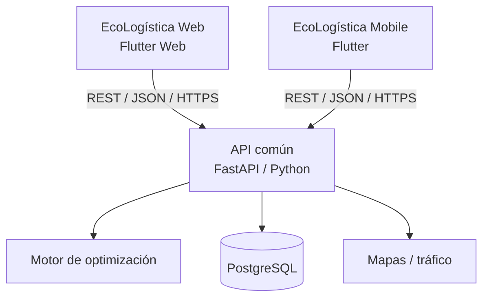

# EcoLogística Huancayo

## Optimizador de Rutas Sostenibles para DistriRápido S.A.C.

[](https://flutter.dev/)
[](https://dart.dev/)
[](https://fastapi.tiangolo.com/)
[](https://www.postgresql.org/)
[](#estado-actual)

---

## 1. Información general

| Campo | Información |
|---|---|
| Proyecto | **EcoLogística Huancayo - Optimizador de Rutas Sostenibles para DistriRápido S.A.C.** |
| Integrante | **Jordy Steve Chancasanampa Torres** |
| Modalidad | Proyecto individual |
| Curso | Taller de Proyectos 2 - Ingeniería de Sistemas e Informática |
| Versión documental | 1.0.0 |
| Fecha base | 27/09/2026 |
| Enfoque | Ágil / Adaptativo con Scrum |
| Aplicación web | **Flutter Web - proyecto independiente** |
| Aplicación móvil | **Flutter - proyecto independiente** |
| Backend propuesto | FastAPI / Python |
| Base de datos | PostgreSQL |

---

## 2. Descripción del proyecto

**EcoLogística Huancayo** toma como base la consigna académica de *EcoLogística Lima* y conserva su problema, requisitos funcionales, requisitos no funcionales, restricciones, métricas, estándares y caso de negocio.

La personalización del proyecto corresponde al **nombre de la propuesta** y a la **decisión tecnológica de implementación** realizada por el estudiante.

El sistema busca gestionar pedidos, flota, conductores y clientes; calcular rutas optimizadas de última milla; considerar ventanas de tiempo, consumo de combustible, emisiones de CO₂ y restricciones operativas; visualizar rutas; generar indicadores y producir reportes de sostenibilidad.

---

## 3. Propuesta real de implementación

La solución tendrá **dos aplicaciones Flutter separadas**.



### 3.1 Flutter Web

Aplicación independiente orientada principalmente a:

- administración;
- gestión de flota;
- gestión de conductores;
- gestión de pedidos;
- clientes;
- configuración y ejecución de optimización;
- visualización de rutas;
- dashboard;
- reportes;
- sostenibilidad.

### 3.2 Flutter móvil

Aplicación independiente orientada principalmente al conductor:

- autenticación;
- ruta asignada;
- entregas pendientes;
- alertas;
- estados de entrega;
- reporte de incidentes;
- consulta operativa.

### 3.3 Backend común

La API centraliza:

- autenticación;
- autorización;
- reglas de negocio;
- validación;
- persistencia;
- motor de optimización;
- indicadores;
- generación de reportes;
- integraciones externas.

---

## 4. Objetivo general

Desarrollar un MVP funcional que permita:

1. gestionar pedidos, vehículos, conductores y clientes;
2. calcular rutas optimizadas;
3. reducir distancia, combustible, emisiones y tardanzas;
4. visualizar rutas en mapas;
5. reoptimizar ante cambios;
6. mostrar indicadores de sostenibilidad;
7. generar reportes descargables;
8. mantener seguridad, accesibilidad, trazabilidad y calidad.

---

## 5. Requisitos funcionales principales

| Código | Requisito |
|---|---|
| RF-01 | Gestión de Flota |
| RF-02 | Gestión de Pedidos |
| RF-03 | Generación de Rutas Optimizadas |
| RF-04 | Visualización de Rutas en Mapa |
| RF-05 | Dashboard de Indicadores |
| RF-06 | Reportes de Sostenibilidad |
| RF-07 | Reoptimización Dinámica |
| RF-08 | Gestión de Conductores |
| RF-09 | Módulo de Clientes |
| RF-10 | Plan de Compensación de Carbono |

---

## 6. Requisitos no funcionales

- Rendimiento del optimizador.
- Seguridad basada en OWASP Top 10.
- Accesibilidad WCAG 2.1 AA.
- Escalabilidad.
- Usabilidad.
- Disponibilidad.
- Documentación técnica y funcional.

---

## 7. Arquitectura resumida

El proyecto utiliza una arquitectura con:

- dos clientes Flutter independientes;
- backend centralizado;
- persistencia PostgreSQL;
- motor de optimización desacoplado;
- integraciones encapsuladas;
- API REST documentada con OpenAPI/Swagger.

La arquitectura detallada se encuentra en:

➡️ [12. Modelo C4](docs/01%20Inicio/12.%20Modelo%20C4%20V_1_0_0.md)

---

# Fase 01: Inicio del Proyecto

Los documentos siguientes corresponden a la fase `docs/01 Inicio/`.

| N.° | Documento | Enlace |
|---:|---|---|
| 01 | Selección del enfoque del proyecto | [Abrir](docs/01%20Inicio/01.%20Selecci%C3%B3n%20del%20enfoque%20del%20proyecto%20V_1_0_0.md) |
| 02 | Acta de constitución | [Abrir](docs/01%20Inicio/02.%20Acta%20de%20constituci%C3%B3n%20V_1_0_0.md) |
| 03 | Declaración de la visión | [Abrir](docs/01%20Inicio/03.%20Declaraci%C3%B3n%20de%20la%20visi%C3%B3n%20V_1_0_0.md) |
| 04 | Registro de supuestos y restricciones | [Abrir](docs/01%20Inicio/04.%20Registro%20de%20supuestos%20y%20restricciones%20V_1_0_0.md) |
| 05 | Registro de interesados | [Abrir](docs/01%20Inicio/05.%20Registro%20de%20interesados%20V_1_0_0.md) |
| 06 | Requisitos funcionales | [Abrir](docs/01%20Inicio/06.%20Requisitos%20funcionales%20V_1_0_0.md) |
| 07 | Requisitos no funcionales | [Abrir](docs/01%20Inicio/07.%20Requisitos%20no%20funcionales%20V_1_0_0.md) |
| 08 | Usuarios | [Abrir](docs/01%20Inicio/08.%20Usuarios%20V_1_0_0.md) |
| 09 | Reglas de negocio | [Abrir](docs/01%20Inicio/09.%20Reglas%20de%20negocio%20V_1_0_0.md) |
| 10 | Stack tecnológico | [Abrir](docs/01%20Inicio/10.%20Stack%20tecnol%C3%B3gico%20V_1_0_0.md) |
| 11 | Base de datos | [Abrir](docs/01%20Inicio/11.%20Base%20de%20datos%20V_1_0_0.md) |
| 12 | Modelo C4 | [Abrir](docs/01%20Inicio/12.%20Modelo%20C4%20V_1_0_0.md) |
| 13 | Restricciones | [Abrir](docs/01%20Inicio/13.%20Restricciones%20V_1_0_0.md) |

---

# Fase 02: Planificación del Proyecto

Los cuatro documentos obligatorios se encuentran en `docs/02 Planificación/`.

| N.° | Documento | Enlace |
|---:|---|---|
| 01 | Transformando a ágil | [Abrir](docs/02%20Planificaci%C3%B3n/01%20Transformando%20a%20%C3%A1gil%20V_1_0_0.md) |
| 02 | Artefactos Jira | [Abrir](docs/02%20Planificaci%C3%B3n/02%20Artefactos%20Jira%20V_1_0_0.md) |
| 03 | Registro de riesgos | [Abrir](docs/02%20Planificaci%C3%B3n/03%20Registro%20de%20riesgos%20V_1_0_0.md) |
| 04 | Presupuesto del proyecto | [Abrir](docs/02%20Planificaci%C3%B3n/04%20Presupuesto%20del%20proyecto%20V_1_0_0.md) |

---

## 10. Organización del repositorio

### Documentación existente

```text
.
├── README.md
└── docs/
    ├── 01 Inicio/
    │   ├── 01. Selección del enfoque del proyecto V_1_0_0.md
    │   ├── 02. Acta de constitución V_1_0_0.md
    │   ├── 03. Declaración de la visión V_1_0_0.md
    │   ├── 04. Registro de supuestos y restricciones V_1_0_0.md
    │   ├── 05. Registro de interesados V_1_0_0.md
    │   ├── 06. Requisitos funcionales V_1_0_0.md
    │   ├── 07. Requisitos no funcionales V_1_0_0.md
    │   ├── 08. Usuarios V_1_0_0.md
    │   ├── 09. Reglas de negocio V_1_0_0.md
    │   ├── 10. Stack tecnológico V_1_0_0.md
    │   ├── 11. Base de datos V_1_0_0.md
    │   ├── 12. Modelo C4 V_1_0_0.md
    │   └── 13. Restricciones V_1_0_0.md
    └── 02 Planificación/
        ├── 01 Transformando a ágil V_1_0_0.md
        ├── 02 Artefactos Jira V_1_0_0.md
        ├── 03 Registro de riesgos V_1_0_0.md
        └── 04 Presupuesto del proyecto V_1_0_0.md
```

### Estructura propuesta para el desarrollo

> Esta parte corresponde a la propuesta técnica de implementación y puede crearse cuando se inicie el código.

```text
.
├── apps/
│   ├── ecologistica_web/
│   │   └── Flutter Web
│   └── ecologistica_mobile/
│       └── Flutter Mobile
├── backend/
│   └── api/
├── database/
│   └── migrations/
├── docs/
│   ├── 01 Inicio/
│   └── 02 Planificación/
└── README.md
```

---

## 11. Gestión ágil

### Marco

- Scrum.
- Sprint de 2 semanas.
- Backlog priorizado.
- Story Points con Fibonacci.
- Sprint Goal.
- Definition of Done.
- Sprint Review.
- Sprint Retrospective.

### Workflow en Jira

```text
To Do
  ↓
In Progress
  ↓
In Review / QA
  ↓
Done
```

### Release inicial

`v1.0.0-MVP`

---

## 12. Sprint 1

### Sprint Goal

> Construir la base operativa segura para registrar vehículos, conductores y pedidos que alimentarán el posterior motor de optimización.

### Alcance inicial

- EN-002 Seguridad base.
- US-001 Gestión de flota.
- US-008 Gestión de conductores.
- US-002 Gestión de pedidos.

Los detalles completos están en:

➡️ [02 Artefactos Jira](docs/02%20Planificaci%C3%B3n/02%20Artefactos%20Jira%20V_1_0_0.md)

---

## 13. Definition of Done

Un elemento no se considera finalizado hasta cumplir, según corresponda:

- criterios BDD/Gherkin;
- cobertura unitaria ≥ 80%;
- pruebas de integración;
- análisis estático sin vulnerabilidades críticas;
- revisión de código;
- documentación actualizada;
- API actualizada;
- migraciones controladas;
- ausencia de secretos en el repositorio;
- cumplimiento de RF/RNF relacionados.

---

## 14. Base de datos

Base de datos propuesta:

**PostgreSQL**

Principales entidades:

- usuario;
- vehículo;
- conductor;
- cliente;
- preferencia de entrega;
- pedido;
- ruta;
- detalle de ruta;
- incidente;
- reporte de sostenibilidad;
- compensación de carbono.

➡️ [Ver modelo conceptual, lógico y físico](docs/01%20Inicio/11.%20Base%20de%20datos%20V_1_0_0.md)

---

## 15. Seguridad

Se consideran:

- autenticación;
- autorización RBAC;
- mínimo privilegio;
- validación server-side;
- prevención de inyección;
- protección XSS/CSRF según arquitectura;
- secretos fuera del repositorio;
- HTTPS;
- logs sin información sensible;
- pruebas de seguridad;
- OWASP Top 10.

---

## 16. Calidad y estándares

El proyecto contempla:

- ISO/IEC 25010;
- OWASP Top 10;
- WCAG 2.1 AA;
- W3C cuando corresponda a la salida web;
- Green Software;
- ISO 14083 para la dimensión de emisiones logísticas.

---

## 17. Presupuesto: estimado vs. gasto real

El proyecto mantiene dos registros separados:

### Presupuesto académico estimado

Corresponde al escenario profesional de la consigna y se aproxima al marco indicado de **USD 135,000**.

### Gasto real del estudiante

Solo se registrarán desembolsos efectivamente realizados por **Jordy Steve Chancasanampa Torres**.

No se inventan gastos.

➡️ [Ver presupuesto y control de gastos reales](docs/02%20Planificaci%C3%B3n/04%20Presupuesto%20del%20proyecto%20V_1_0_0.md)

---

## 18. Evidencias Jira

La documentación de Jira requiere evidencias reales de:

1. Roadmap.
2. Backlog priorizado.
3. Sprint Planning y Sprint Goal.
4. Tablero Scrum.
5. Releases.

Las imágenes deben insertarse cuando Jira haya sido configurado y deben mostrar únicamente el panel necesario, no el escritorio o navegador completo.

---

## 19. Estado actual

| Área | Estado |
|---|---|
| Nombre del proyecto | Definido |
| Enfoque | Definido |
| Acta de constitución | Documentada |
| Visión | Documentada |
| RF | Documentados |
| RNF | Documentados |
| Usuarios/RBAC | Documentados |
| Reglas de negocio | Documentadas |
| Stack | **Definido: Flutter Web + Flutter móvil separados** |
| Base de datos | Diseñada |
| Arquitectura C4 | Diseñada |
| Planificación ágil | Documentada |
| Riesgos | Documentados |
| Presupuesto | Estimado + control real separado |
| Jira | Pendiente de completar con evidencias reales |
| Código Flutter Web | Pendiente de inicio |
| Código Flutter móvil | Pendiente de inicio |
| Backend | Pendiente de inicio |

---

## 20. Control de versiones

La documentación utiliza versionado semántico:

```text
V_X_Y_Z
```

Ejemplos:

- `V_1_0_0` versión inicial;
- `V_1_1_0` cambio menor relevante;
- `V_2_0_0` revisión estructural.

Los nombres definidos por la consigna deben conservarse exactamente cuando se entreguen.

---

## 21. Autor

**Jordy Steve Chancasanampa Torres**  
Proyecto individual — Taller de Proyectos 2  
Ingeniería de Sistemas e Informática

---

## 22. Nota de alcance

Este repositorio documenta un proyecto académico basado en la consigna de **EcoLogística Lima**.  
El nombre **EcoLogística Huancayo** identifica la propuesta individual del estudiante.  
Los datos, cifras, requisitos y restricciones provenientes de la consigna se mantienen como línea base del caso mientras no exista una modificación formal documentada.
