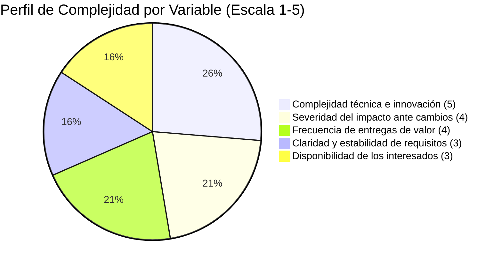

# Selección del enfoque del proyecto

## 1. Metadatos del documento

| Campo | Información |
|---|---|
| Nombre del proyecto | EcoLogística Lima - Optimizador de Rutas Sostenibles para DistriRápido S.A.C. |
| Integrante | Jordy Steve Chancasanampa Torres |
| Fecha | 28/08/2026 |
| Versión | 1.0.0 |

## 2. Objetivo del documento

El presente documento tiene como finalidad evaluar las características de **EcoLogística Lima** mediante una matriz de ponderación de variables, con el propósito de seleccionar y justificar el enfoque de gestión más adecuado entre predictivo, ágil o híbrido.

La decisión considera la naturaleza del producto, la estabilidad de los requisitos, la complejidad técnica, la necesidad de adaptación, la participación de los interesados y la frecuencia con la que el proyecto puede entregar valor.

## 3. Matriz de ponderación de variables

La escala empleada comprende valores de **1 a 5**. Los valores bajos representan condiciones más favorables para una planificación predominantemente predictiva; los valores altos reflejan una mayor necesidad de adaptación, experimentación, iteración y entrega incremental.

| ID | Variable | Puntuación (1-5) | Justificación técnica |
|---|---|---:|---|
| V-01 | Claridad y estabilidad de requisitos | 3 | La consigna establece requerimientos funcionales, no funcionales, restricciones y estándares desde el inicio. Sin embargo, dichos elementos deben completarse y adaptarse a la realidad geográfica y operativa de Lima Metropolitana, por lo que existe un nivel moderado de cambio esperado. |
| V-02 | Complejidad técnica e innovación | 5 | El proyecto integra metaheurísticas para resolver VRPTW y Green VRP, datos georreferenciados, mapas interactivos, datos de tráfico, indicadores ambientales, reportes y reoptimización dinámica. La combinación de estos componentes implica alta complejidad técnica y necesidad de pruebas progresivas. |
| V-03 | Severidad del impacto ante cambios | 4 | Cambios en pedidos, ventanas de tiempo, disponibilidad de vehículos, tráfico, restricciones viales o criterios ambientales pueden alterar el cálculo de rutas y obligar a reoptimizar la solución. El impacto de los cambios es significativo, aunque puede controlarse mediante una arquitectura modular y gestión de versiones. |
| V-04 | Disponibilidad de los interesados | 3 | El proyecto requiere validar necesidades de operación logística, conductores, clientes y responsables de gestión. La retroalimentación puede obtenerse de forma periódica durante revisiones y pruebas, pero no se asume disponibilidad permanente de todos los interesados. |
| V-05 | Frecuencia de entregas de valor | 4 | El cronograma propuesto se organiza en cuatro iteraciones durante 14 semanas, permitiendo obtener entregables parciales como requisitos, gestión de flota, optimización inicial, mapas, dashboard, reportes y reoptimización dinámica. |
|  | **Puntaje total** | **19/25** | **El resultado muestra una necesidad alta de adaptación, pero coexistente con requisitos, restricciones y entregables definidos desde el inicio.** |

## 4. Criterios de interpretación

Para interpretar la matriz se establecen los siguientes rangos orientativos:

| Puntaje total | Orientación predominante | Característica principal |
|---:|---|---|
| 5 - 10 | Predictiva | Requisitos altamente estables, bajo nivel de incertidumbre y planificación detallada desde el inicio. |
| 11 - 20 | Híbrida | Coexistencia de elementos planificables con componentes que requieren iteración, validación y adaptación. |
| 21 - 25 | Ágil | Alta incertidumbre, cambios frecuentes, entregas muy continuas y fuerte necesidad de adaptación. |

El proyecto obtiene **19 puntos**, ubicándose en el rango **Híbrido**. El resultado es coherente con la consigna: existen requisitos, restricciones, estándares, presupuesto y entregables definidos, pero el desarrollo técnico se realiza de manera iterativa y requiere experimentación con algoritmos de optimización, integración de datos y validación progresiva.

## 5. Diagrama de radar del enfoque

A continuación, se presenta la representación visual y ponderada del perfil de complejidad del proyecto.

La siguiente tabla descriptiva representa el perfil del proyecto en una escala de cinco niveles:

| Variable | Valor | Representación | Lectura |
|---|---:|---|---|
| Claridad y estabilidad de requisitos | 3 | ███░░ | Estabilidad media |
| Complejidad técnica e innovación | 5 | █████ | Complejidad muy alta |
| Severidad del impacto ante cambios | 4 | ████░ | Impacto alto |
| Disponibilidad de los interesados | 3 | ███░░ | Disponibilidad media |
| Frecuencia de entregas de valor | 4 | ████░ | Frecuencia alta |

**Perfil resultante:** el proyecto presenta una base estructurada que favorece la planificación, pero también una complejidad e incertidumbre técnica que exige iteración y adaptación.

## 6. Resultado de la evaluación

La evaluación obtiene **19/25 puntos (76 %)**. El perfil no corresponde a un proyecto completamente predictivo ni a uno puramente ágil.

Por un lado, el proyecto cuenta desde el inicio con un objetivo general, requerimientos funcionales y no funcionales, restricciones realistas, estándares de calidad, presupuesto referencial, entregables y un cronograma de 14 semanas. Estos elementos requieren control de alcance, documentación, seguimiento y gestión formal.

Por otro lado, la optimización de rutas mediante metaheurísticas, la integración con datos geográficos y de tráfico, el cumplimiento de ventanas de tiempo, la medición de emisiones de CO₂ y la reoptimización dinámica requieren experimentación técnica y mejoras sucesivas.

Por ello, el resultado respalda un **enfoque Híbrido**, combinando planificación y control con ejecución iterativa.

## 7. Enfoque seleccionado

Se selecciona un **enfoque de gestión Híbrido** para EcoLogística Lima.

El componente **predictivo** se utilizará para:

- Definir y controlar el alcance de alto nivel.
- Gestionar requisitos, restricciones y estándares.
- Establecer hitos, presupuesto y criterios de aceptación.
- Mantener trazabilidad documental.
- Controlar cambios que afecten alcance, tiempo, costo o calidad.

El componente **ágil/adaptativo** se utilizará para:

- Desarrollar la solución en cuatro iteraciones.
- Construir y validar progresivamente los módulos.
- Probar y ajustar la metaheurística seleccionada.
- Refinar la experiencia de usuario.
- Incorporar resultados de pruebas de rendimiento.
- Ajustar la integración con mapas y datos de tráfico.
- Mejorar la reoptimización dinámica ante eventos operativos.

## 8. Justificación técnica

La elección del enfoque híbrido responde a la combinación de dos características principales del proyecto.

Primero, EcoLogística Lima posee un marco de trabajo definido. La solución debe gestionar flota, pedidos y conductores; generar rutas optimizadas; visualizar rutas en un mapa; mostrar indicadores de sostenibilidad; generar reportes y permitir reoptimización dinámica. Asimismo, existen restricciones de costo, tiempo, tecnología, datos, seguridad, accesibilidad, ambiente y normativa que deben mantenerse bajo control.

Segundo, la solución contiene componentes de alta incertidumbre técnica. La calidad de una metaheurística no puede evaluarse únicamente mediante planificación previa: debe implementarse, probarse con diferentes conjuntos de pedidos, medir tiempos de respuesta y calidad de las rutas, y ajustarse de manera progresiva. Lo mismo ocurre con la integración de tráfico, georreferenciación y restricciones reales de Lima Metropolitana.

El enfoque híbrido permite conservar la disciplina de gestión necesaria para los entregables académicos y técnicos, sin perder la capacidad de aprender y adaptar la solución durante la construcción.

## 9. Alineación con PMBOK 7

La selección del enfoque se alinea con la **Guía PMBOK®, Séptima Edición**, particularmente con el principio de **adaptación al contexto del proyecto (tailoring)**.

La aplicación del enfoque híbrido se relaciona con los siguientes elementos:

- **Enfoque en el valor:** cada iteración debe producir resultados verificables que acerquen la plataforma a la reducción de distancia, costos, emisiones y retrasos.
- **Adaptación:** el ciclo de vida se ajusta a las características reales del producto y no obliga al proyecto a utilizar un único enfoque de manera rígida.
- **Participación de los interesados:** administradores, responsables de operaciones, conductores, clientes y evaluadores pueden aportar retroalimentación en momentos definidos.
- **Pensamiento sistémico:** la optimización de rutas depende de la interacción entre pedidos, vehículos, conductores, tráfico, ventanas de tiempo, costos y restricciones ambientales.
- **Gestión de la complejidad:** los componentes algorítmicos y de integración se validan progresivamente para reducir incertidumbre.
- **Calidad:** se incorporan pruebas funcionales, de rendimiento, seguridad, accesibilidad y aceptación durante el desarrollo.
- **Medición:** se utilizan indicadores como distancia, combustible, CO₂, cumplimiento de ventanas de tiempo y tiempo de ejecución del algoritmo.
- **Gestión de la incertidumbre:** las pruebas y revisiones permiten responder a cambios de datos, rendimiento o condiciones operativas sin perder el control del proyecto.

Por tanto, el enfoque híbrido constituye una adaptación consciente del modelo de gestión a las necesidades de EcoLogística Lima.

## 10. Conclusión

El análisis de las cinco variables determinó un resultado de **19 sobre 25 puntos**, correspondiente a una orientación **Híbrida**.

EcoLogística Lima cuenta con un alcance de alto nivel, requerimientos, restricciones, estándares y entregables suficientemente definidos para aplicar prácticas predictivas de planificación y control. Al mismo tiempo, la elevada complejidad de la optimización de rutas, la integración de datos geográficos y de tráfico, y la necesidad de validar el rendimiento técnico hacen necesaria una ejecución iterativa.

En consecuencia, el enfoque híbrido permite equilibrar **gobernanza, trazabilidad y control** con **adaptabilidad, experimentación y entrega incremental de valor**, manteniendo coherencia con los principios de PMBOK 7 y con el cronograma adaptativo planteado para el proyecto.
