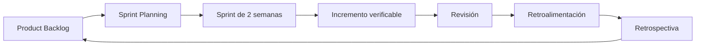

# 01. Selección del enfoque del proyecto

## 1. Metadatos

| Campo | Valor |
|---|---|
| Nombre del proyecto | **EcoLogística Huancayo - Optimizador de Rutas Sostenibles para DistriRápido S.A.C.** |
| Integrante | **Jordy Steve Chancasanampa Torres** |
| Integrantes | **Jordy Steve Chancasanampa Torres** |
| Fecha | **27/09/2026** |
| Versión | **1.0.0** |
| Curso | Taller de Proyectos 2 - Ingeniería de Sistemas e Informática |
| Caso base | Consigna “EcoLogística Lima” |
| Observación de alcance | Se conserva el caso operativo, requisitos, restricciones, métricas y condiciones definidos por la consigna. La personalización realizada corresponde al **nombre del proyecto**, incorporando la referencia a Huancayo. |

## 2. Objetivo del documento

Determinar y justificar el enfoque de gestión más adecuado para el proyecto, considerando que la solución combina requisitos funcionales definidos, restricciones reales, integración con servicios geográficos y de tráfico, un algoritmo de optimización para VRPTW/Green VRP, requisitos de sostenibilidad y entregas incrementales durante el curso.

La escala utilizada es:

- **1:** comportamiento predominantemente predictivo.
- **2:** baja necesidad de adaptación.
- **3:** equilibrio entre predictibilidad y adaptación.
- **4:** alta necesidad de adaptación.
- **5:** comportamiento altamente adaptativo.

## 3. Matriz de ponderación de variables

| Variable | Puntaje (1-5) | Evidencia del proyecto | Interpretación |
|---|---:|---|---|
| Claridad y estabilidad de requisitos | 3 | La consigna define RF-01 a RF-10, RNF-01 a RNF-07 y restricciones RES-01 a RES-12, pero exige completar y ampliar detalles durante el proyecto. | Existe una línea base clara, aunque habrá refinamiento. |
| Complejidad técnica e innovación | 5 | Se requiere resolver VRPTW/Green VRP con metaheurísticas, reoptimización dinámica, mapas, tráfico, métricas ambientales y reportes. | Alta experimentación y aprendizaje técnico. |
| Severidad del impacto ante cambios | 4 | Cambios en datos de tráfico, reglas de negocio, restricciones vehiculares o modelo de optimización pueden afectar rutas, costos y tiempos. | Los cambios deben evaluarse tempranamente y por iteraciones. |
| Disponibilidad de interesados | 3 | El proyecto académico requiere validación docente y contempla usuarios operativos como administrativos, conductores y clientes. | La retroalimentación puede ser periódica, no necesariamente continua. |
| Frecuencia de entregas de valor | 4 | El cronograma de la consigna organiza el desarrollo en iteraciones y exige un MVP progresivo. | Conviene entregar capacidades funcionales de forma incremental. |

**Promedio de adaptabilidad:** (3 + 5 + 4 + 3 + 4) / 5 = **3.8 / 5**.

## 4. Perfil visual del enfoque

La consigna permite representar el perfil mediante un gráfico de radar o una tabla descriptiva. Para garantizar renderizado estable en GitHub, se utiliza la siguiente representación textual equivalente:

| Eje | 1 | 2 | 3 | 4 | 5 | Valor |
|---|---|---|---|---|---|---:|
| Claridad/estabilidad |  |  | ● |  |  | 3 |
| Complejidad/innovación |  |  |  |  | ● | 5 |
| Impacto de cambios |  |  |  | ● |  | 4 |
| Disponibilidad de interesados |  |  | ● |  |  | 3 |
| Frecuencia de valor |  |  |  | ● |  | 4 |

## 5. Enfoque seleccionado

Se selecciona un **enfoque Ágil/Adaptativo**, con **Scrum** como marco operativo para la planificación de iteraciones y **PMBOK 7.ª edición** como referencia de gobernanza, trazabilidad, gestión de interesados, riesgos y adaptación.

## 6. Justificación técnica

1. **El problema no tiene una única solución evidente.** La calidad de una ruta depende simultáneamente de distancia, tiempo, consumo, emisiones y penalizaciones por ventanas de tiempo.
2. **La solución requiere experimentación.** La consigna admite distintas metaheurísticas, por lo que el equipo debe comparar resultados y ajustar parámetros.
3. **La información operacional cambia.** Nuevos pedidos, cancelaciones, accidentes y averías obligan a reoptimizar.
4. **La construcción es incremental.** Primero se consolidan requisitos y datos, luego gestión de flota/pedidos, después optimización, visualización, indicadores y reportes.
5. **Los RNF deben verificarse continuamente.** Rendimiento, seguridad, accesibilidad, disponibilidad y escalabilidad no pueden evaluarse únicamente al final.
6. **PMBOK 7 permite tailoring.** Se aplican principios de adaptación del enfoque, entrega de valor, participación de interesados, gestión de incertidumbre y medición.

## 7. Forma de trabajo adoptada

```mermaid
flowchart LR
    A[Product Backlog] --> B[Sprint Planning]
    B --> C[Sprint de 2 semanas]
    C --> D[Incremento verificable]
    D --> E[Revisión]
    E --> F[Retroalimentación]
    F --> G[Retrospectiva]
    G --> A
```

### Artefactos de gestión

- Product Backlog priorizado.
- Épicas, Historias de Usuario e Historias Técnicas.
- Sprint Goal.
- Criterios de aceptación BDD/Gherkin.
- Definition of Done.
- Registro de riesgos.
- Control de cambios mediante Git y versionado semántico.
- Evidencias de Jira.
- Incrementos funcionales revisables.

## 8. Criterios para revisar la decisión

La decisión deberá reconsiderarse si ocurre alguna de las siguientes condiciones:

- el docente modifica sustancialmente el alcance;
- una integración externa impide cumplir los tiempos establecidos;
- el algoritmo no alcanza los límites de rendimiento;
- las restricciones normativas obligan a rediseñar módulos;
- se detecta que una parte del alcance requiere una planificación más predictiva.

## 9. Conclusión

El perfil de **3.8/5** evidencia una necesidad alta de adaptación. Por ello, el proyecto será gestionado de manera **Ágil/Adaptativa**, manteniendo documentación, trazabilidad, métricas y control de riesgos para satisfacer las exigencias académicas y técnicas de la consigna.
