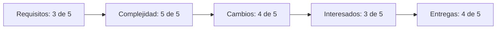

[⌂ README principal](../../README.md) | [Siguiente: 02. Acta de constitución →](02.%20Acta%20de%20constituci%C3%B3n%20V_1_0_0.md)

# 01. Selección del enfoque del proyecto

## 1. Metadatos

| Campo | Valor |
|---|---|
| Proyecto | **EcoLogística Huancayo - Optimizador de Rutas Sostenibles para DistriRápido S.A.C.** |
| Integrante | **Jordy Steve Chancasanampa Torres** |
| Modalidad | Proyecto individual |
| Fecha | **27/09/2026** |
| Versión | **1.0.0** |
| Marco de referencia | PMBOK 7 + Scrum |

> **Cómo leer esta tabla:** resume la identificación y las decisiones base del documento. Permite comprobar que todos los artefactos pertenecen al mismo proyecto, versión e integrante.

## 2. Propósito

Determinar el enfoque de gestión más adecuado para un proyecto que combina requisitos definidos por la consigna, alta complejidad algorítmica, restricciones reales, integración de datos externos y entregas incrementales.

## 3. Escala de ponderación

| Valor | Interpretación |
|---:|---|
| 1 | Predominantemente predictivo; requisitos estables y bajo cambio. |
| 2 | Baja necesidad de adaptación. |
| 3 | Equilibrio entre planificación y adaptación. |
| 4 | Alta necesidad de adaptación. |
| 5 | Entorno altamente adaptativo, incierto o experimental. |

> **Cómo leer esta tabla:** valores altos favorecen un enfoque adaptativo. No es una nota de calidad del proyecto; representa cuánta adaptación requiere su gestión.

## 4. Matriz de ponderación

| Variable | Puntaje | Justificación aplicada al proyecto |
|---|---:|---|
| Claridad y estabilidad de requisitos | 3 | La consigna define RF, RNF y restricciones mínimas, pero obliga a completarlos y refinarlos durante el desarrollo. |
| Complejidad técnica e innovación | 5 | El proyecto combina VRPTW, Green VRP, metaheurísticas, georreferenciación, reoptimización y métricas ambientales. |
| Severidad del impacto ante cambios | 4 | Cambios en ventanas de tiempo, tráfico, disponibilidad o restricciones pueden modificar rutas y costos. |
| Disponibilidad de interesados | 3 | El proyecto académico tiene validación docente periódica y actores operativos definidos en el caso. |
| Frecuencia de entregas de valor | 4 | El curso exige avances graduales e iterativos y un MVP verificable. |
| **Promedio** | **3.8/5** | **Perfil de alta adaptación.** |

> **Cómo leer esta tabla:** el promedio de 3.8/5 indica que conviene una gestión iterativa. La línea base de requisitos evita improvisación, mientras Scrum permite reaccionar a riesgos técnicos y cambios.

## 5. Representación del perfil

```mermaid
flowchart LR
    A[Requisitos: 3 de 5] --> B[Complejidad: 5 de 5]
    B --> C[Cambios: 4 de 5]
    C --> D[Interesados: 3 de 5]
    D --> E[Entregas: 4 de 5]
```

> **Interpretación del gráfico:** la mayor puntuación está en complejidad técnica; por eso el riesgo principal no es solo documentar requisitos, sino validar tempranamente el algoritmo, las integraciones y el rendimiento.

## 6. Decisión

Se adopta un **enfoque Ágil/Adaptativo con Scrum**, complementado por prácticas de gobernanza y trazabilidad de PMBOK 7.

### Razones

1. La solución requiere experimentación algorítmica.
2. Los datos operativos pueden cambiar durante la ejecución.
3. El MVP debe crecer por incrementos demostrables.
4. Los RNF deben validarse de forma continua.
5. El proyecto es individual, por lo que se necesita limitar trabajo en curso y priorizar valor/riesgo.

## 7. Cadencia seleccionada

| Elemento | Decisión |
|---|---|
| Duración del Sprint | 2 semanas |
| Total de Sprints | 7 |
| Horizonte | 14 semanas |
| Herramienta ALM | Jira Software |
| Control de versiones | Git |
| Diseño UI/UX | Figma |
| Revisión | Al final de cada Sprint |
| Retrospectiva | Al final de cada Sprint |

> **Cómo leer esta tabla:** la cadencia de 7 Sprints es la forma operativa de Scrum en Jira. Las 4 iteraciones académicas de la consigna se conservan como hitos de control del curso.

## 8. Relación entre iteraciones académicas y Scrum

| Iteración de la consigna | Semanas | Relación con Sprints | Entregable dominante |
|---|---:|---|---|
| Iteración 1 | 1-3 | Sprint 1 + inicio Sprint 2 | Requisitos, BD y mockups. |
| Iteración 2 | 4-7 | cierre Sprint 2 + Sprints 3-4 parcial | Flota, pedidos y optimización base. |
| Iteración 3 | 8-11 | cierre Sprint 4 + Sprints 5-6 parcial | Mapa, dashboard y reportes. |
| Iteración 4 | 12-14 | cierre Sprint 6 + Sprint 7 | Reoptimización, pruebas y cierre. |

> **Cómo leer esta tabla:** las iteraciones del curso y los Sprints no son equivalentes. Jira trabajará con Sprints de dos semanas, mientras el docente puede revisar entregables en los hitos de la consigna.

## 9. Conclusión

El proyecto se gestionará con Scrum porque necesita incrementos pequeños, inspección frecuente, evidencia verificable en Jira y capacidad de adaptación sin perder la línea base documental.

---

[⌂ README principal](../../README.md) | [Siguiente: 02. Acta de constitución →](02.%20Acta%20de%20constituci%C3%B3n%20V_1_0_0.md)
