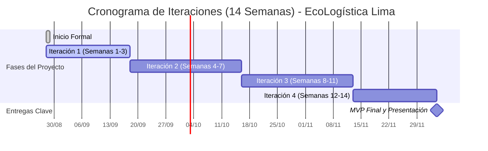

# Acta de constitución del proyecto

## 1. Metadatos del documento

| Campo | Información |
|---|---|
| Nombre del proyecto | EcoLogística Lima - Optimizador de Rutas Sostenibles para DistriRápido S.A.C. |
| Integrante | Jordy Steve Chancasanampa Torres |
| Fecha | 28/08/2026 |
| Versión | 1.0.0 |
| Estado | Aprobación inicial |
| Director del proyecto | Jordy Steve Chancasanampa Torres |
| Patrocinador de referencia | Gerencia de Operaciones de DistriRápido S.A.C. |

## 2. Propósito y justificación del proyecto

### 2.1. Situación actual

DistriRápido S.A.C. es una empresa ficticia de operación logística ubicada en San Juan de Lurigancho, Lima, que realiza más de 250 entregas diarias en San Juan de Lurigancho, El Agustino, Santa Anita y Ate.

La operación presenta cuatro problemas principales:

- Alta congestión vehicular en vías críticas.
- Elevado costo de combustible y mantenimiento, que representa aproximadamente el 35 % de los costos totales.
- Emisión aproximada de 3.5 toneladas de CO₂ mensuales por parte de una flota de 15 camionetas, mayormente diésel.
- Incumplimiento de ventanas de tiempo: aproximadamente 22 % de las entregas se realizan fuera del horario acordado.

### 2.2. Problema identificado

La planificación convencional de rutas no integra de manera suficiente variables de tráfico, capacidad vehicular, ventanas de tiempo, consumo de combustible, emisiones, restricciones viales y eventos dinámicos. Esta situación incrementa el costo operativo, reduce el cumplimiento de entregas y genera un impacto ambiental negativo.

### 2.3. Oportunidad

Existe la oportunidad de utilizar una plataforma web con técnicas de optimización para apoyar la toma de decisiones logísticas y generar rutas sostenibles de última milla. La solución permitirá centralizar información de pedidos, vehículos, conductores, tráfico y restricciones, generando indicadores verificables de eficiencia operativa y sostenibilidad.

### 2.4. Justificación

EcoLogística Lima se justifica por su capacidad para:

- Reducir recorridos innecesarios.
- Disminuir consumo de combustible y emisiones de CO₂.
- Mejorar el cumplimiento de ventanas de tiempo.
- Facilitar la gestión de flota, pedidos y conductores.
- Brindar información visual mediante mapas interactivos.
- Proporcionar indicadores y reportes de sostenibilidad.
- Reoptimizar rutas ante eventos operativos.
- Apoyar decisiones basadas en datos.

## 3. Objetivos medibles del proyecto

### 3.1. Objetivo general

Diseñar, desarrollar e implementar un MVP de una plataforma web denominada **EcoLogística Lima** que optimice rutas de reparto de última milla para DistriRápido S.A.C., considerando distancia, tiempo, combustible, emisiones de CO₂, ventanas de tiempo, tráfico y restricciones operativas.

### 3.2. Objetivos SMART

| ID | Dimensión | Objetivo SMART | Indicador | Meta |
|---|---|---|---|---|
| OBJ-01 | Alcance | Implementar durante las 14 semanas del proyecto un MVP que cubra como mínimo el 70 % de los requerimientos funcionales RF-01 al RF-07, priorizando gestión de flota, pedidos, generación de rutas, mapa, dashboard y reportes. | Cobertura de requerimientos funcionales del MVP | ≥ 70 % |
| OBJ-02 | Cronograma | Completar las cuatro iteraciones definidas y entregar la versión final al cierre de la semana 14. | Iteraciones completadas dentro del plazo | 4 de 4 |
| OBJ-03 | Costo | Mantener el desarrollo del MVP dentro del presupuesto referencial máximo de S/ 500,000 establecido para el caso, controlando desviaciones mediante seguimiento periódico. | Variación presupuestal | ≤ 10 % |
| OBJ-04 | Calidad | Lograr que el algoritmo genere una solución válida en un máximo de 45 segundos para hasta 150 pedidos y 15 vehículos, y que la reoptimización ante cambios críticos se realice en menos de 30 segundos. | Tiempo de ejecución | ≤ 45 s; reoptimización < 30 s |
| OBJ-05 | Calidad | Alcanzar al menos 90 % de casos de prueba críticos aprobados antes de la presentación final. | Tasa de aprobación de pruebas críticas | ≥ 90 % |
| OBJ-06 | Valor | Obtener, en las pruebas comparativas del MVP, una reducción mínima propuesta del 10 % en distancia o costo de ruta frente a una estrategia secuencial de referencia. | Mejora frente a línea base | ≥ 10 % |

## 4. Alcance de alto nivel

### 4.1. Incluye

- Gestión de vehículos y características de la flota.
- Gestión de pedidos, coordenadas, prioridad y ventanas de entrega.
- Gestión de conductores.
- Módulo básico de clientes y preferencias de entrega.
- Implementación de una metaheurística para optimización de rutas.
- Consideración de VRPTW y criterios de Green VRP.
- Visualización de rutas en mapa interactivo.
- Dashboard de distancia, combustible, CO₂ y cumplimiento.
- Reportes de sostenibilidad.
- Reoptimización dinámica ante cambios operativos.
- Consideración de restricciones viales, ambientales, tecnológicas y de datos.
- Documentación técnica, pruebas y presentación final.

### 4.2. No incluye

- Renovación física de la flota de DistriRápido S.A.C.
- Compra real de vehículos eléctricos o conversión real a GNV.
- Implementación física de proyectos de reforestación.
- Sustitución de sistemas oficiales de tránsito.
- Garantía de disponibilidad de servicios externos de terceros.
- Despliegue comercial masivo fuera del alcance académico del MVP.
- Automatización completa de todos los procesos administrativos de la empresa.

## 5. Requisitos de alto nivel

### 5.1. Requisitos funcionales

| ID | Requisito de alto nivel |
|---|---|
| RF-01 | Registrar y gestionar vehículos con información de capacidad, consumo y factor de emisión. |
| RF-02 | Registrar pedidos con ubicación, peso, volumen, ventana de tiempo, prioridad y tipo de producto. |
| RF-03 | Generar rutas optimizadas mediante una metaheurística considerando distancia, tiempo, combustible, CO₂ y penalizaciones. |
| RF-04 | Visualizar las rutas optimizadas en un mapa interactivo. |
| RF-05 | Mostrar un dashboard de indicadores operativos, económicos y ambientales. |
| RF-06 | Generar reportes descargables de sostenibilidad. |
| RF-07 | Reoptimizar rutas ante nuevos pedidos, cancelaciones, accidentes o averías. |
| RF-08 | Registrar y gestionar conductores y su disponibilidad. |
| RF-09 | Gestionar preferencias de entrega de los clientes. |
| RF-10 | Calcular emisiones y proponer un plan de compensación de carbono. |

### 5.2. Requisitos no funcionales

| ID | Requisito de alto nivel |
|---|---|
| RNF-01 | Generar soluciones válidas en máximo 45 segundos para hasta 150 pedidos y 15 vehículos; reoptimizar en menos de 30 segundos ante cambios críticos. |
| RNF-02 | Aplicar medidas de seguridad alineadas con OWASP Top 10 y protección de datos personales. |
| RNF-03 | Cumplir criterios de accesibilidad WCAG 2.1 nivel AA. |
| RNF-04 | Diseñar una arquitectura escalable hasta 1,000 pedidos diarios y 50 vehículos. |
| RNF-05 | Mantener una interfaz simple y usable para conductores con diferentes niveles de alfabetización digital. |
| RNF-06 | Considerar una disponibilidad objetivo de 99.5 % durante el horario operativo definido. |
| RNF-07 | Documentar arquitectura, API, manuales y proceso de desarrollo. |

## 6. Riesgos macro

| ID | Riesgo | Probabilidad | Impacto | Nivel | Respuesta inicial |
|---|---|---|---|---|---|
| R-01 | El algoritmo no alcanza el tiempo o la calidad esperada para conjuntos grandes de pedidos. | Media | Alta | Alto | Crear pruebas de rendimiento tempranas, ajustar parámetros y comparar alternativas metaheurísticas. |
| R-02 | Datos geográficos o de tráfico incompletos o imprecisos afectan la calidad de las rutas. | Alta | Alta | Alto | Utilizar fuentes alternativas, datos simulados controlados y carga manual de incidencias. |
| R-03 | Dependencia de APIs externas genera costos, límites de consumo o indisponibilidad. | Media | Alta | Alto | Priorizar OpenStreetMap/Leaflet cuando sea viable y abstraer integraciones externas. |
| R-04 | El alcance resulta excesivo para un proyecto desarrollado por un único integrante. | Alta | Alta | Crítico | Priorizar el MVP, limitar funcionalidades secundarias y gestionar estrictamente el backlog y los cambios. |
| R-05 | Retrasos en una iteración comprometen la entrega de la semana 14. | Media | Alta | Alto | Revisar avance semanalmente y aplicar contingencia de alcance. |
| R-06 | Vulnerabilidades web o manejo inadecuado de datos personales. | Media | Alta | Alto | Aplicar validaciones, controles de acceso, pruebas de seguridad y buenas prácticas OWASP. |
| R-07 | Cambios en restricciones operativas o normativas exigen modificar reglas de optimización. | Media | Media | Medio | Parametrizar reglas y mantener trazabilidad de requisitos. |
| R-08 | La integración simultánea de mapas, optimización y dashboard aumenta la complejidad del sistema. | Media | Alta | Alto | Diseñar arquitectura modular e integrar por incrementos. |

## 7. Resumen de hitos

| ID | Hito | Entregable | Fecha estimada |
|---|---|---|---|
| H-01 | Inicio formal del proyecto | Acta de constitución y artefactos de inicio | 28/08/2026 |
| H-02 | Cierre de Iteración 1 | Requisitos, investigación, base de datos y mockups | 17/09/2026 |
| H-03 | Cierre de Iteración 2 | Gestión de flota, pedidos, optimización inicial y pruebas preliminares | 15/10/2026 |
| H-04 | Cierre de Iteración 3 | Mapa, dashboard, reportes e integración de tráfico | 12/11/2026 |
| H-05 | Cierre de Iteración 4 | Optimización avanzada, reoptimización, pruebas, documentación y presentación | 03/12/2026 |

## 8. Presupuesto estimado inicial

El presupuesto corresponde al escenario referencial del caso para el desarrollo del MVP.

| Categoría | Descripción | Monto estimado |
|---|---|---:|
| Desarrollo de software | Backend, frontend, algoritmo de optimización e integración | S/ 280,000 |
| Infraestructura y servicios | Nube, almacenamiento, APIs, monitoreo y herramientas | S/ 80,000 |
| Pruebas y seguridad | Rendimiento, seguridad, accesibilidad y aceptación | S/ 40,000 |
| UX e investigación | Investigación de contexto, prototipos y validación | S/ 25,000 |
| Gestión y documentación | Gestión del proyecto, documentación técnica y manuales | S/ 25,000 |
| Reserva de contingencia | Riesgos técnicos, integraciones y cambios controlados | S/ 50,000 |
| **Total estimado** |  | **S/ 500,000** |

**Costo operativo anual de referencia:** S/ 120,000 para mantenimiento y soporte, fuera del presupuesto inicial de construcción del MVP.

## 9. Asignación del Director del Proyecto

| Campo | Información |
|---|---|
| Director del Proyecto | Jordy Steve Chancasanampa Torres |
| Rol | Project Manager y responsable del desarrollo |
| Autoridad | Autoridad operativa sobre planificación, priorización, diseño técnico, seguimiento, documentación y control de cambios dentro del alcance académico |
| Reporta a | Docente evaluador y patrocinador de referencia del caso |

### 9.1. Responsabilidades

- Mantener el plan y los artefactos de gestión.
- Priorizar el alcance del MVP.
- Diseñar y desarrollar la solución.
- Gestionar requisitos y cambios.
- Realizar seguimiento de cronograma, riesgos y calidad.
- Ejecutar y documentar pruebas.
- Controlar el repositorio y las versiones.
- Preparar documentación y presentación final.
- Comunicar desviaciones relevantes.

### 9.2. Nivel de autoridad

El Director del Proyecto puede aprobar ajustes técnicos y repriorizaciones que no alteren el objetivo general, el presupuesto máximo del caso ni los hitos académicos. Los cambios que modifiquen sustancialmente alcance, fecha final, criterios de evaluación o restricciones obligatorias deben escalarse al docente o patrocinador de referencia.

## 10. Gobernanza del proyecto

La gobernanza se realizará mediante:

- Revisión semanal de avance.
- Control de versiones en Git/GitHub.
- Registro de cambios relevantes.
- Seguimiento de riesgos y restricciones.
- Revisión de entregables al cierre de cada iteración.
- Validación de criterios de aceptación antes de incorporar funcionalidades al MVP.
- Escalamiento de desviaciones críticas al docente evaluador.

## 11. Criterios de éxito del proyecto

El proyecto se considerará exitoso si:

- Se completa el MVP con al menos 70 % de RF-01 a RF-07.
- Se completan las cuatro iteraciones dentro de las 14 semanas.
- El algoritmo cumple los objetivos principales de rendimiento.
- Se visualizan rutas optimizadas en un mapa interactivo.
- Se muestran indicadores de distancia, combustible, CO₂ y cumplimiento.
- Se generan reportes de sostenibilidad.
- Se documentan arquitectura, API, manuales y pruebas.
- Se demuestra una mejora medible frente a una línea base.
- Se mantiene trazabilidad entre requisitos, diseño, implementación y pruebas.

## 12. Aprobación del Acta de Constitución

La aprobación de esta acta autoriza formalmente el inicio de EcoLogística Lima y reconoce a **Jordy Steve Chancasanampa Torres** como Director del Proyecto y responsable del desarrollo dentro del contexto académico.

| Rol | Responsable | Estado |
|---|---|---|
| Director del Proyecto | Jordy Steve Chancasanampa Torres | Aceptado |
| Patrocinador de referencia | Gerencia de Operaciones de DistriRápido S.A.C. | Pendiente de validación académica |
| Evaluación académica | Docente del curso | Pendiente |
