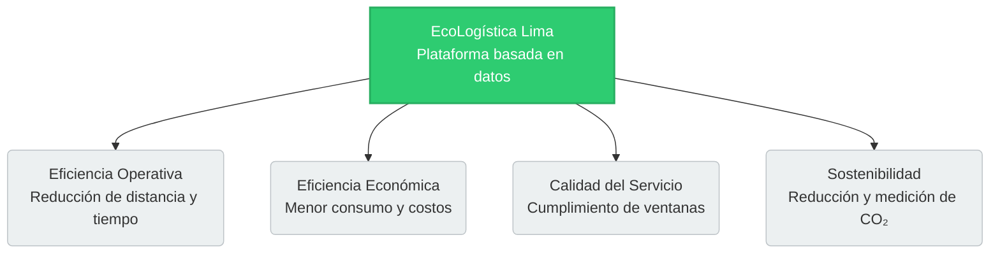

# Declaración de la visión

## 1. Metadatos del documento

| Campo | Información |
|---|---|
| Nombre del proyecto | EcoLogística Lima - Optimizador de Rutas Sostenibles para DistriRápido S.A.C. |
| Integrante | Jordy Steve Chancasanampa Torres |
| Fecha | 28/08/2026 |
| Versión | 1.0.0 |

## 2. Visión del producto

**Para** DistriRápido S.A.C., sus responsables de operaciones, despachadores y conductores,

**Quienes** necesitan reducir ineficiencias en la planificación de rutas de última milla, disminuir costos operativos, reducir emisiones de CO₂ y mejorar el cumplimiento de ventanas de entrega,

**El** producto **EcoLogística Lima**

**Que es un** sistema web de optimización logística sostenible,

**Que** gestiona flota, pedidos y conductores; genera rutas optimizadas mediante metaheurísticas; visualiza recorridos en mapas; considera tráfico, ventanas de tiempo y criterios ambientales; y muestra indicadores de eficiencia y sostenibilidad,

**A diferencia de** la planificación manual, las rutas secuenciales o el uso aislado de aplicaciones de mapas que no integran restricciones logísticas, económicas y ambientales,

**Nuestro producto** integra en una sola plataforma la optimización VRPTW y Green VRP, la reoptimización dinámica, la medición de CO₂, el análisis de costos y la generación de reportes para apoyar decisiones logísticas sostenibles en el contexto de Lima Metropolitana.

## 3. Propuesta de valor

EcoLogística Lima busca transformar la planificación de reparto en un proceso basado en datos. La propuesta de valor se centra en equilibrar cuatro dimensiones:

- **Eficiencia operativa:** reducir distancia, tiempo y recorridos innecesarios.
- **Eficiencia económica:** disminuir consumo de combustible y costos asociados.
- **Calidad del servicio:** mejorar el cumplimiento de ventanas de tiempo.
- **Sostenibilidad:** medir, reducir y reportar las emisiones de CO₂ de la operación.

A continuación, se ilustran los pilares estratégicos de la propuesta de valor.

    
## 4. Usuarios objetivo

| Usuario | Necesidad principal | Valor esperado |
|---|---|---|
| Responsable de operaciones | Planificar y controlar rutas | Mejor uso de vehículos, tiempo y combustible |
| Despachador logístico | Asignar pedidos y rutas | Menor esfuerzo de planificación y mayor trazabilidad |
| Conductor | Recibir una ruta clara y actualizada | Menos desvíos, alertas y mejor secuencia de entregas |
| Gerencia | Conocer desempeño operativo y ambiental | Indicadores para tomar decisiones |
| Cliente final | Recibir pedidos dentro de la ventana acordada | Mayor puntualidad y confiabilidad |

## 5. Objetivos estratégicos del producto

| ID | Objetivo estratégico | KPI | Línea base | Meta propuesta | Método de medición |
|---|---|---|---|---|---|
| OE-01 | Mejorar la puntualidad de entregas | % de entregas dentro de ventana | 78 % | ≥ 90 % en escenarios de validación | Comparación de entregas simuladas/registradas dentro y fuera de ventana |
| OE-02 | Reducir recorridos innecesarios | Distancia total por conjunto de pedidos | Ruta secuencial de referencia | ≥ 10 % de reducción | Comparación entre línea base y ruta optimizada |
| OE-03 | Reducir impacto ambiental | kg de CO₂ estimado por ruta | Línea base sin optimización | ≥ 10 % de reducción | Cálculo con distancia y factor de emisión |
| OE-04 | Reducir consumo de combustible | Litros estimados por ruta | Línea base sin optimización | ≥ 10 % de reducción | Consumo estimado según distancia y rendimiento vehicular |
| OE-05 | Cumplir el rendimiento técnico | Tiempo de generación de solución | No aplica | ≤ 45 s para hasta 150 pedidos y 15 vehículos | Pruebas automatizadas de rendimiento |
| OE-06 | Responder a cambios operativos | Tiempo de reoptimización | No aplica | < 30 s en escenarios críticos | Pruebas de reoptimización |
| OE-07 | Entregar un MVP funcional | Cobertura RF-01 a RF-07 | 0 % | ≥ 70 % | Matriz de trazabilidad y pruebas de aceptación |
| OE-08 | Mantener calidad de servicio | Disponibilidad en horario operativo | No aplica | 99.5 % como objetivo de diseño | Monitoreo en ambiente de prueba/despliegue |

## 6. Principios de diseño del producto

- La optimización debe producir resultados comprensibles para usuarios no especializados.
- La interfaz debe priorizar claridad, accesibilidad y facilidad de uso.
- Las restricciones de tránsito, seguridad, datos y ambiente deben ser parametrizables.
- La sostenibilidad debe medirse mediante indicadores verificables.
- Las integraciones externas deben desacoplarse para reducir dependencia tecnológica.
- El sistema debe permitir crecimiento futuro sin rediseño completo.
- Las decisiones de ruta deben mantener trazabilidad respecto de pedidos, vehículos y restricciones.

## 7. Resultado esperado

Al finalizar el proyecto se espera disponer de un MVP demostrable que evidencie cómo la optimización algorítmica puede mejorar la planificación de última milla de DistriRápido S.A.C., mostrando de forma integrada la ruta propuesta, los indicadores operativos y ambientales, y la capacidad de responder a cambios del contexto.

## 8. Conclusión

La visión de EcoLogística Lima orienta el producto hacia una logística urbana más eficiente, medible y sostenible. La plataforma no se limita a calcular rutas: integra gestión operativa, optimización, visualización, medición ambiental y capacidad de adaptación, generando valor para la empresa, los conductores, los clientes y el entorno.
