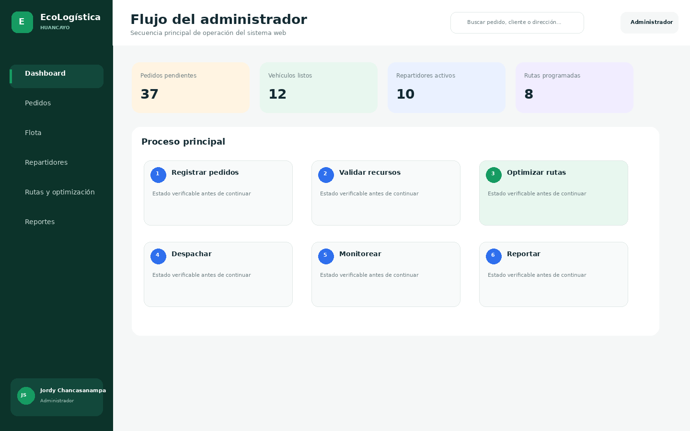
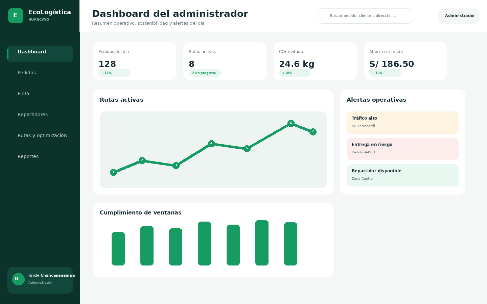
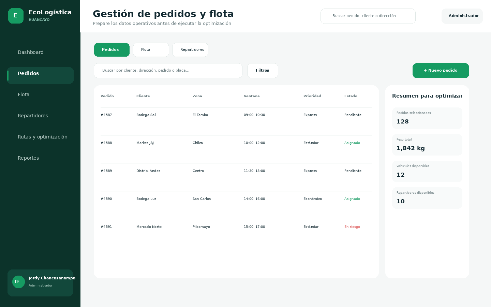
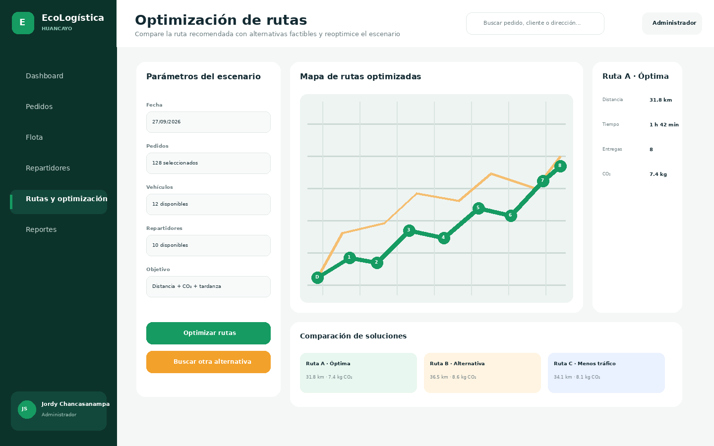
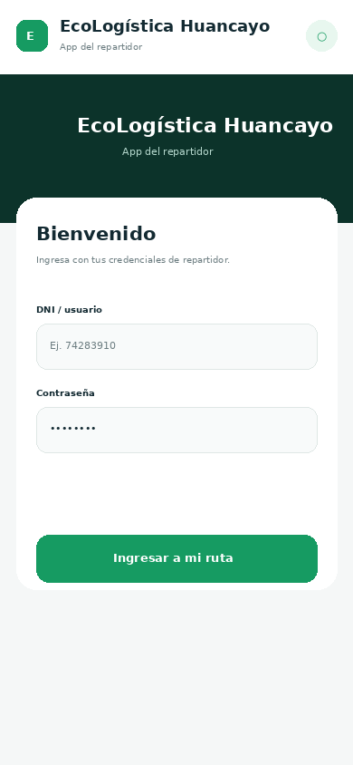
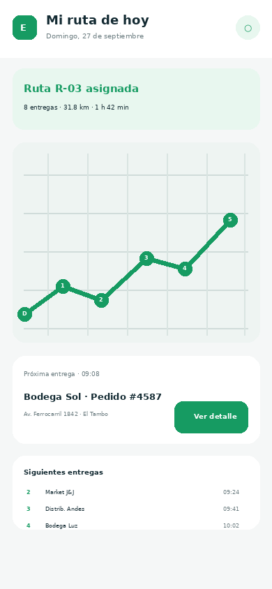
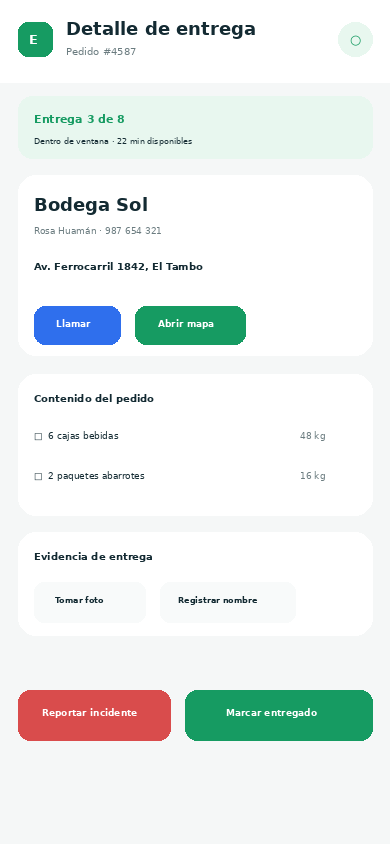
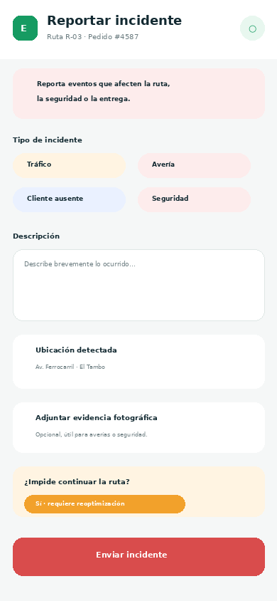

[⌂ README principal](../../README.md) | [← Anterior: 02. Acta de constitución](02.%20Acta%20de%20constituci%C3%B3n%20V_1_0_0.md) | [Siguiente: 04. Registro de supuestos y restricciones →](04.%20Registro%20de%20supuestos%20y%20restricciones%20V_1_0_0.md)

# 03. Declaración de la visión

## 1. Metadatos

| Campo | Valor |
|---|---|
| Proyecto | **EcoLogística Huancayo - Optimizador de Rutas Sostenibles para DistriRápido S.A.C.** |
| Integrante | **Jordy Steve Chancasanampa Torres** |
| Modalidad | Proyecto individual |
| Fecha | **27/09/2026** |
| Versión | **1.0.0** |

> **Resumen de la tabla:** resume la identificación y las decisiones base del documento. Permite comprobar que todos los artefactos pertenecen al mismo proyecto, versión e integrante.

## 2. Plantilla de visión

| Elemento | Declaración |
|---|---|
| Para | Administradores de la operación logística y repartidores de DistriRápido S.A.C. |
| Quienes | Necesitan planificar y ejecutar entregas reduciendo distancia, tardanzas, combustible y emisiones. |
| Producto | EcoLogística Huancayo. |
| Categoría | Sistema de optimización de rutas con aplicación Web administrativa y aplicación móvil para repartidor. |
| Beneficio clave | Centraliza gestión, optimización, operación y medición de sostenibilidad. |
| A diferencia de | Planificación manual o secuencial sin optimización multicriterio ni medición ambiental integrada. |
| Diferenciador | Integra VRPTW/Green VRP, reoptimización, mapa, movilidad del repartidor y métricas ambientales. |

> **Resumen de la tabla:** convierte la idea del producto en una declaración de valor. El administrador y el repartidor tienen experiencias diferentes, pero comparten una única lógica de negocio en backend.

## 3. Usuarios y canales

| Usuario | Aplicación | Funciones principales |
|---|---|---|
| Administrador | Flutter Web | Flota, repartidores, pedidos, clientes, optimización, mapa, KPIs, reportes y configuración. |
| Repartidor | Flutter móvil | Ruta asignada, entregas pendientes, estado de entrega, alertas e incidentes. |

> **Resumen de la tabla:** define de forma explícita qué interfaz usa cada actor. Evita que futuras historias de usuario asignen una funcionalidad al canal equivocado.

## 4. Objetivos estratégicos y KPIs

| Objetivo | KPI | Meta inicial |
|---|---|---|
| Optimización utilizable | Tiempo de cálculo | ≤45 s para 150 pedidos/15 vehículos. |
| Adaptación operativa | Tiempo de reoptimización | <30 s. |
| Puntualidad | % entregas dentro de ventana | Medir y comparar contra línea base. |
| Sostenibilidad | kg CO₂/ruta y CO₂ evitado | Disponible por ruta y periodo. |
| Eficiencia económica | Combustible y ahorro estimado | Disponible en dashboard/reporte. |
| Disponibilidad | Uptime operativo | ≥99.5% de 05:00 a 22:00. |
| Accesibilidad | Verificación WCAG | Nivel AA en criterios aplicables. |

> **Resumen de la tabla:** los KPIs son criterios de evaluación del producto, no solo estadísticas visuales. Deben conectarse con pruebas y reportes.

## 5. Principios de producto

- El administrador toma decisiones desde Flutter Web.
- El repartidor opera desde Flutter móvil.
- El motor de optimización se ejecuta en backend, no en el dispositivo móvil.
- No se exponen credenciales ni acceso directo a PostgreSQL desde Flutter.
- La sostenibilidad forma parte del cálculo y del reporte.
- Los mockups se diseñan en Figma antes de consolidar la UI.

## 6. Figma

| Artefacto de diseño | Estado | Evidencia |
|---|---|---|
| Flujo administrador Web | **Completado** | [Abrir prototipo en Figma](https://www.figma.com/design/gRNmDQ2ZkvYdIMnVBenjwp/EcoLog%C3%ADstica-Huancayo---Mockups-PFA?node-id=7-2&t=obsj5zdLuwtRreHl-4) |
| Dashboard administrador | **Completado** | [Abrir prototipo en Figma](https://www.figma.com/design/gRNmDQ2ZkvYdIMnVBenjwp/EcoLog%C3%ADstica-Huancayo---Mockups-PFA?node-id=7-99&t=obsj5zdLuwtRreHl-4) |
| Gestión de pedidos/flota | **Completado** | [Abrir prototipo en Figma](https://www.figma.com/design/gRNmDQ2ZkvYdIMnVBenjwp/EcoLog%C3%ADstica-Huancayo---Mockups-PFA?node-id=7-246&t=obsj5zdLuwtRreHl-4) |
| Mapa y optimización Web | **Completado** | [Abrir prototipo en Figma](https://www.figma.com/design/gRNmDQ2ZkvYdIMnVBenjwp/EcoLog%C3%ADstica-Huancayo---Mockups-PFA?node-id=7-378&t=obsj5zdLuwtRreHl-4) |
| Login móvil repartidor | **Completado** | [Abrir prototipo en Figma](https://www.figma.com/design/gRNmDQ2ZkvYdIMnVBenjwp/EcoLog%C3%ADstica-Huancayo---Mockups-PFA?node-id=8-2&t=TYDM37LCB3EmQghl-4) |
| Ruta actual y pendientes | **Completado** | [Abrir prototipo en Figma](https://www.figma.com/design/gRNmDQ2ZkvYdIMnVBenjwp/EcoLog%C3%ADstica-Huancayo---Mockups-PFA?node-id=8-25&t=TYDM37LCB3EmQghl-4) |
| Detalle de entrega | **Completado** | [Abrir prototipo en Figma](https://www.figma.com/design/gRNmDQ2ZkvYdIMnVBenjwp/EcoLog%C3%ADstica-Huancayo---Mockups-PFA?node-id=8-88&t=TYDM37LCB3EmQghl-4) |
| Reporte de incidente | **Completado** | [Abrir prototipo en Figma](https://www.figma.com/design/gRNmDQ2ZkvYdIMnVBenjwp/EcoLog%C3%ADstica-Huancayo---Mockups-PFA?node-id=8-147&t=TYDM37LCB3EmQghl-4) |

> **Resumen de la tabla:** los ocho mockups representan las interfaces principales del proyecto. Las cuatro primeras corresponden al administrador en Flutter Web y las cuatro últimas al repartidor en Flutter móvil. Cada enlace abre directamente el artefacto correspondiente en Figma.

### 6.1 Evidencias visuales de los mockups

#### 6.1.1 Flujo administrador Web

[Abrir pantalla en Figma](https://www.figma.com/design/gRNmDQ2ZkvYdIMnVBenjwp/EcoLog%C3%ADstica-Huancayo---Mockups-PFA?node-id=7-2&t=obsj5zdLuwtRreHl-4)

> **Descripción de la imagen:** Muestra el flujo principal del administrador: registrar pedidos, validar recursos, optimizar rutas, despachar, monitorear y generar reportes.

#### 6.1.2 Dashboard administrador

[Abrir pantalla en Figma](https://www.figma.com/design/gRNmDQ2ZkvYdIMnVBenjwp/EcoLog%C3%ADstica-Huancayo---Mockups-PFA?node-id=7-99&t=obsj5zdLuwtRreHl-4)

> **Descripción de la imagen:** Presenta KPIs operativos y ambientales, rutas activas, alertas y acciones prioritarias para el administrador.

#### 6.1.3 Gestión de pedidos/flota

[Abrir pantalla en Figma](https://www.figma.com/design/gRNmDQ2ZkvYdIMnVBenjwp/EcoLog%C3%ADstica-Huancayo---Mockups-PFA?node-id=7-246&t=obsj5zdLuwtRreHl-4)

> **Descripción de la imagen:** Permite consultar y filtrar pedidos, revisar recursos disponibles y validar los datos antes de ejecutar la optimización.

#### 6.1.4 Mapa y optimización Web

[Abrir pantalla en Figma](https://www.figma.com/design/gRNmDQ2ZkvYdIMnVBenjwp/EcoLog%C3%ADstica-Huancayo---Mockups-PFA?node-id=7-378&t=obsj5zdLuwtRreHl-4)

> **Descripción de la imagen:** Representa la ruta óptima y otras alternativas factibles, con paradas, métricas y la opción de buscar una nueva alternativa.

#### 6.1.5 Login móvil repartidor

[Abrir pantalla en Figma](https://www.figma.com/design/gRNmDQ2ZkvYdIMnVBenjwp/EcoLog%C3%ADstica-Huancayo---Mockups-PFA?node-id=8-2&t=TYDM37LCB3EmQghl-4)

> **Descripción de la imagen:** Pantalla de acceso del repartidor para ingresar a la aplicación móvil y consultar la ruta que le fue asignada.

#### 6.1.6 Ruta actual y pendientes

[Abrir pantalla en Figma](https://www.figma.com/design/gRNmDQ2ZkvYdIMnVBenjwp/EcoLog%C3%ADstica-Huancayo---Mockups-PFA?node-id=8-25&t=TYDM37LCB3EmQghl-4)

> **Descripción de la imagen:** Muestra el trazado de la ruta asignada, paradas numeradas, próxima entrega y entregas pendientes.

#### 6.1.7 Detalle de entrega

[Abrir pantalla en Figma](https://www.figma.com/design/gRNmDQ2ZkvYdIMnVBenjwp/EcoLog%C3%ADstica-Huancayo---Mockups-PFA?node-id=8-88&t=TYDM37LCB3EmQghl-4)

> **Descripción de la imagen:** Concentra información del cliente y del pedido, acciones de contacto, evidencia y confirmación de entrega.

#### 6.1.8 Reporte de incidente

[Abrir pantalla en Figma](https://www.figma.com/design/gRNmDQ2ZkvYdIMnVBenjwp/EcoLog%C3%ADstica-Huancayo---Mockups-PFA?node-id=8-147&t=TYDM37LCB3EmQghl-4)

> **Descripción de la imagen:** Permite reportar tráfico, avería, cliente ausente o seguridad, indicando ubicación y si el evento requiere reoptimización.

---

[⌂ README principal](../../README.md) | [← Anterior: 02. Acta de constitución](02.%20Acta%20de%20constituci%C3%B3n%20V_1_0_0.md) | [Siguiente: 04. Registro de supuestos y restricciones →](04.%20Registro%20de%20supuestos%20y%20restricciones%20V_1_0_0.md)
