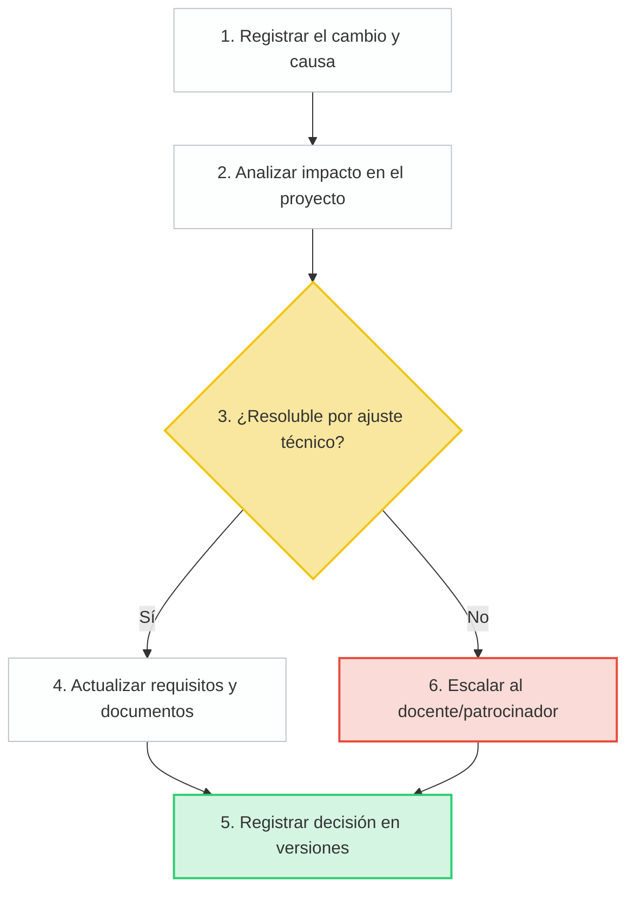

# Registro de supuestos y restricciones

## 1. Metadatos del documento

| Campo | Información |
|---|---|
| Nombre del proyecto | EcoLogística Lima - Optimizador de Rutas Sostenibles para DistriRápido S.A.C. |
| Integrante | Jordy Steve Chancasanampa Torres |
| Fecha | 28/08/2026 |
| Versión | 1.0.0 |

## 2. Propósito

El presente registro identifica los supuestos que condicionan la planificación y las restricciones que limitan las alternativas de ejecución del proyecto. Su revisión será continua y cualquier cambio relevante deberá reflejarse en los artefactos de gestión correspondientes.

## 3. Registro de supuestos

| ID | Descripción | Categoría | Grado de impacto | Estrategia de validación |
|---|---|---|---|---|
| SUP-01 | Se dispondrá de datos geográficos suficientes para representar direcciones, coordenadas y puntos de referencia de Lima Metropolitana. | Técnica | Alto | Probar geocodificación con una muestra de direcciones reales y puntos de referencia durante la Iteración 1. |
| SUP-02 | OpenStreetMap/Leaflet u otra alternativa seleccionada permitirá representar las rutas requeridas por el MVP. | Técnica | Medio | Implementar un prototipo de mapa con trazado y marcadores antes del cierre de la Iteración 2. |
| SUP-03 | La metaheurística seleccionada podrá producir soluciones válidas dentro de los límites de rendimiento definidos después de su ajuste. | Técnica | Alto | Ejecutar pruebas con conjuntos crecientes de pedidos y comparar tiempos y calidad de solución. |
| SUP-04 | Será posible obtener o simular información de tráfico e incidentes para validar la reoptimización dinámica. | Técnica | Alto | Evaluar APIs disponibles y preparar un conjunto de datos simulados como contingencia. |
| SUP-05 | La flota de referencia de 15 vehículos y el volumen de más de 250 entregas diarias representan adecuadamente el caso de estudio. | Operativa | Alto | Mantener estos valores como escenario base y contrastarlos con casos de prueba escalados. |
| SUP-06 | Los pedidos contendrán información mínima suficiente: ubicación, peso/volumen, prioridad y ventana de tiempo. | Operativa | Alto | Definir reglas de validación de datos y rechazar registros incompletos en las pruebas. |
| SUP-07 | Los roles operativos podrán proporcionar retroalimentación representativa mediante entrevistas, revisión del caso o validaciones académicas. | Operativa | Medio | Registrar retroalimentación en revisiones de iteración y convertir hallazgos relevantes en cambios controlados. |
| SUP-08 | El costo referencial de combustible, mantenimiento y otros parámetros económicos será suficiente para realizar comparaciones dentro del caso académico. | Financiera | Medio | Parametrizar los costos para poder actualizarlos sin modificar el algoritmo. |
| SUP-09 | El presupuesto referencial de S/ 500,000 se utilizará como límite de planificación del MVP del caso. | Financiera | Alto | Mantener un control presupuestal por categorías y revisar desviaciones en cada hito. |
| SUP-10 | Los costos de nube y APIs se mantendrán dentro de la reserva prevista o podrán reemplazarse por alternativas de código abierto. | Financiera | Medio | Estimar consumo antes de integrar servicios de pago y definir alternativas gratuitas o simuladas. |
| SUP-11 | El proyecto podrá completarse por un único integrante si se prioriza estrictamente el MVP y se limita el alcance secundario. | Operativa | Alto | Revisar semanalmente carga de trabajo, avance y alcance; aplicar recorte controlado si existe desviación crítica. |
| SUP-12 | Los indicadores de CO₂ podrán calcularse utilizando distancia recorrida y factores de emisión configurables por vehículo. | Técnica | Alto | Verificar fórmulas con casos manuales y pruebas automatizadas. |

## 4. Registro de restricciones

| ID | Descripción | Categoría | Severidad | Flexibilidad de negociación |
|---|---|---|---|---|
| RES-01 | El presupuesto inicial referencial para el MVP es de S/ 500,000. | Costo | Alta | Baja |
| RES-02 | El proyecto académico debe organizarse y completarse dentro de 14 semanas y cuatro iteraciones. | Tiempo | Alta | Baja |
| RES-03 | El desarrollo es realizado por un único integrante, por lo que la capacidad simultánea de análisis, desarrollo, pruebas y documentación es limitada. | Tiempo | Alta | Baja |
| RES-04 | La solución debe utilizar tecnologías web compatibles con una arquitectura de código abierto, priorizando Python para backend, React/Vue para frontend, PostgreSQL y Leaflet/OpenStreetMap u opciones equivalentes justificadas. | Tecnología | Alta | Media |
| RES-05 | El algoritmo debe generar una solución válida en máximo 45 segundos para hasta 150 pedidos y 15 vehículos. | Tecnología | Alta | Baja |
| RES-06 | La reoptimización ante cambios críticos debe buscar tiempos menores a 30 segundos. | Tecnología | Alta | Baja |
| RES-07 | El sistema debe ser responsive y considerar conexiones de baja velocidad. | Tecnología | Media | Baja |
| RES-08 | La precisión y disponibilidad de datos de tráfico de terceros no está bajo control del proyecto; debe existir un mecanismo de contingencia mediante datos simulados o carga manual. | Tecnología | Alta | Baja |
| RES-09 | Se deben implementar controles de seguridad y autorización acordes con OWASP Top 10 y con la protección de datos personales. | Normativa | Alta | Baja |
| RES-10 | La interfaz debe considerar accesibilidad WCAG 2.1 AA como criterio de diseño. | Normativa | Media | Baja |
| RES-11 | El proyecto debe considerar restricciones de tránsito, seguridad vial, zonas sensibles y condiciones ambientales aplicables al contexto de Lima descritas en la consigna. | Normativa | Alta | Baja |
| RES-12 | La evaluación de calidad del software debe considerar características de ISO/IEC 25010 y la medición de la huella de carbono debe alinearse con el enfoque de ISO 14083 indicado para el proyecto. | Normativa | Alta | Media |
| RES-13 | El MVP debe documentar arquitectura, manual de usuario, manual de administrador, API y pruebas. | Tiempo | Alta | Baja |
| RES-14 | Las dependencias externas de mapas, nube o tráfico pueden imponer límites de uso o costos en moneda extranjera. | Costo | Media | Media |

## 5. Priorización de restricciones críticas

Se consideran restricciones críticas aquellas cuya violación puede impedir la aceptación del proyecto:

- Cumplimiento del plazo de 14 semanas.
- Cobertura mínima del MVP.
- Rendimiento del algoritmo.
- Protección de datos y seguridad.
- Disponibilidad de una estrategia de mapas y georreferenciación.
- Documentación y evidencia de pruebas.
- Control del alcance debido a que el proyecto es desarrollado por un único integrante.

## 6. Gestión de cambios

Cuando un supuesto deje de ser válido o una restricción cambie, se aplicará el siguiente procedimiento:

1. Registrar el cambio y su causa.
2. Analizar impacto en alcance, tiempo, costo, calidad y riesgos.
3. Determinar si el cambio puede resolverse mediante ajuste técnico o repriorización.
4. Actualizar requisitos y documentos afectados.
5. Registrar la decisión en el control de versiones.
6. Escalar al docente los cambios que comprometan entregables o criterios académicos obligatorios.

## 7. Conclusión

Los supuestos y restricciones de EcoLogística Lima muestran que la viabilidad del proyecto depende tanto de factores técnicos como operativos y económicos. La identificación temprana de estas condiciones permite reducir incertidumbre, priorizar el MVP y mantener coherencia entre la planificación, el desarrollo y la evaluación final.
