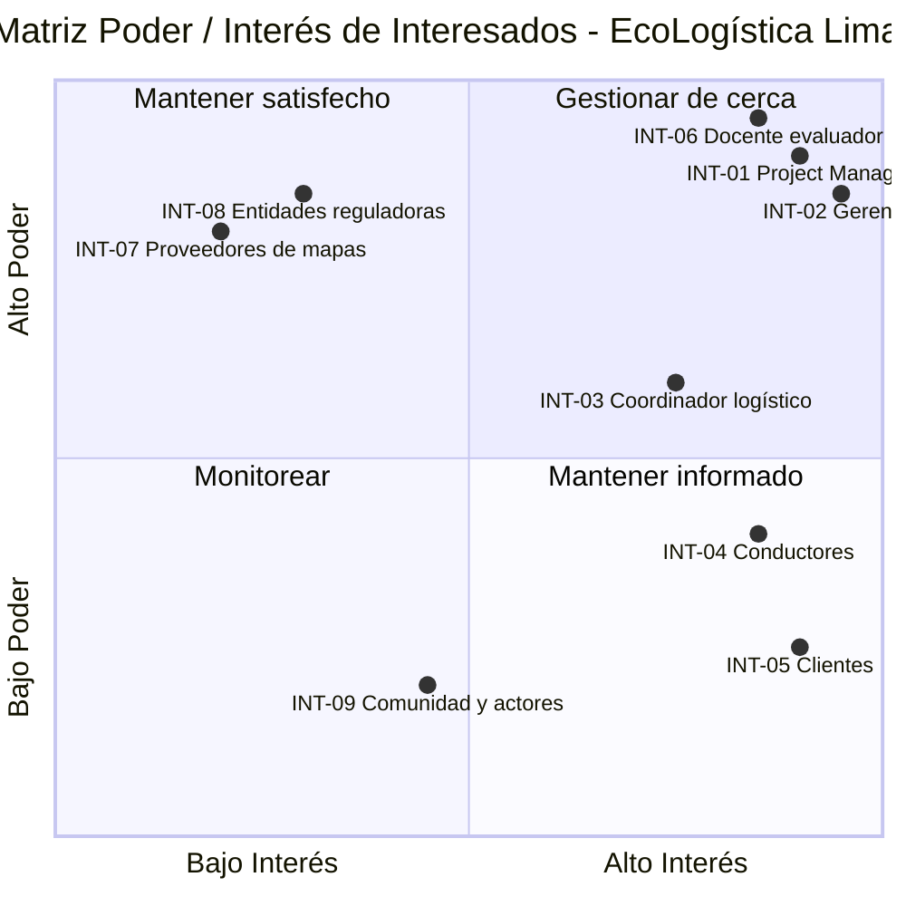

# Registro de interesados

## 1. Metadatos del documento

| Campo | Información |
|---|---|
| Nombre del proyecto | EcoLogística Lima - Optimizador de Rutas Sostenibles para DistriRápido S.A.C. |
| Integrante | Jordy Steve Chancasanampa Torres |
| Fecha | 28/08/2026 |
| Versión | 1.0.0 |

## 2. Propósito

El presente registro identifica a los interesados que pueden influir en EcoLogística Lima o verse afectados por sus resultados. Debido a que DistriRápido S.A.C. es una empresa ficticia del caso académico, no se inventan datos personales de contacto; los roles simulados se gestionan mediante el canal académico o de validación definido para el proyecto.

## 3. Matriz de identificación de interesados

| ID | Nombre / Rol | Organización / Área | Información de contacto | Categoría |
|---|---|---|---|---|
| INT-01 | Jordy Steve Chancasanampa Torres - Project Manager y desarrollador | Equipo del proyecto | Repositorio GitHub y canal académico | Interno |
| INT-02 | Gerencia de Operaciones / Patrocinador de referencia | DistriRápido S.A.C. | N/A - rol ficticio del caso; canal de validación académica | Interno |
| INT-03 | Coordinador o despachador logístico | DistriRápido S.A.C. - Operaciones | N/A - rol ficticio del caso | Interno |
| INT-04 | Conductores de reparto | DistriRápido S.A.C. - Flota | N/A - rol ficticio del caso | Interno |
| INT-05 | Clientes: bodegas, mercados y pequeños comerciantes | Clientes de DistriRápido S.A.C. | N/A - grupo de usuarios representado en el caso | Externo |
| INT-06 | Docente evaluador | Universidad Continental | Aula virtual / canal académico | Externo |
| INT-07 | Proveedores de mapas, geodatos y tráfico | OpenStreetMap, proveedores de APIs y fuentes de tráfico | Documentación técnica del proveedor | Externo |
| INT-08 | Entidades reguladoras y autoridades de transporte | MTC, Municipalidad Metropolitana y entidades relacionadas | Canales públicos oficiales | Externo |
| INT-09 | Comunidad y actores ambientales | Población de zonas atendidas / iniciativas ambientales | Canales públicos o institucionales | Externo |

## 4. Matriz Poder / Interés

| ID | Interesado | Poder | Interés | Cuadrante | Justificación | Estrategia |
|---|---|---|---|---|---|---|
| INT-01 | Project Manager y desarrollador | Alto | Alto | Gestionar de cerca | Controla directamente planificación, diseño, desarrollo, pruebas y documentación. | Seguimiento diario y control semanal de objetivos. |
| INT-02 | Gerencia de Operaciones | Alto | Alto | Gestionar de cerca | Define necesidades operativas y representa el valor esperado por la empresa. | Validar alcance, indicadores, criterios de aceptación y cambios relevantes. |
| INT-03 | Coordinador logístico | Medio | Alto | Mantener informado / involucrar | Utiliza la planificación de rutas y conoce las restricciones operativas. | Revisiones funcionales al cierre de iteraciones. |
| INT-04 | Conductores | Medio | Alto | Mantener informado | Son usuarios directos de rutas y alertas; su experiencia influye en usabilidad y factibilidad. | Validaciones de interfaz y flujo de uso. |
| INT-05 | Clientes | Bajo | Alto | Mantener informado | Se ven afectados por puntualidad y calidad del servicio, pero no controlan el proyecto. | Considerar necesidades de ventanas y preferencias de entrega. |
| INT-06 | Docente evaluador | Alto | Alto | Gestionar de cerca | Evalúa el cumplimiento de la consigna, rúbrica, documentación y resultados. | Reportar avances y mantener trazabilidad de entregables. |
| INT-07 | Proveedores de mapas y tráfico | Alto | Bajo | Mantener satisfecho | Sus servicios pueden condicionar integraciones, límites de uso y disponibilidad. | Revisar términos, límites y alternativas técnicas. |
| INT-08 | Entidades reguladoras | Alto | Bajo | Mantener satisfecho | El proyecto debe considerar requisitos legales, tránsito, seguridad y datos. | Verificar cumplimiento y documentar restricciones relevantes. |
| INT-09 | Comunidad y actores ambientales | Bajo | Medio | Monitorear / mantener informado | La operación logística genera impactos ambientales y sociales indirectos. | Incorporar indicadores ambientales y evitar rutas sensibles cuando corresponda. |

## 5. Representación por cuadrantes

La siguiente gráfica posiciona visualmente a los interesados según su nivel de poder e interés.

### 5.1. Alto poder / Alto interés - Gestionar de cerca

- INT-01 Project Manager y desarrollador.
- INT-02 Gerencia de Operaciones.
- INT-06 Docente evaluador.

### 5.2. Alto poder / Bajo interés - Mantener satisfecho

- INT-07 Proveedores de mapas y tráfico.
- INT-08 Entidades reguladoras y autoridades.

### 5.3. Bajo o medio poder / Alto interés - Mantener informado

- INT-03 Coordinador logístico.
- INT-04 Conductores.
- INT-05 Clientes.

### 5.4. Bajo poder / Bajo o medio interés - Monitorear

- INT-09 Comunidad y actores ambientales.

## 6. Estrategia de gestión y comunicación

| ID / Grupo | Información a comunicar | Frecuencia | Formato / Canal | Responsable |
|---|---|---|---|---|
| INT-01 | Avance, riesgos, tareas, cambios y calidad | Diaria / semanal | Tablero personal, GitHub y revisión semanal | Jordy Steve Chancasanampa Torres |
| INT-02 | Estado del proyecto, alcance, KPIs, riesgos y decisiones | Al cierre de cada iteración | Informe breve y demostración | Project Manager |
| INT-03 | Funcionalidades de pedidos, rutas y dashboard | Cada iteración | Demostración funcional / prototipo | Project Manager |
| INT-04 | Ruta asignada, interfaz, alertas y usabilidad | Iteraciones 2 a 4 | Prueba guiada / mockup / demo | Project Manager |
| INT-05 | Preferencias, ventanas y experiencia de entrega | Según validación | Escenarios de uso / revisión de requisitos | Project Manager |
| INT-06 | Cumplimiento de consigna, rúbrica, artefactos, avances y bloqueos | Semanal o según el curso | Aula virtual, repositorio y sustentación | Jordy Steve Chancasanampa Torres |
| INT-07 | Requisitos de integración, límites de API y cambios técnicos | Cuando exista integración | Documentación técnica / pruebas | Project Manager |
| INT-08 | Restricciones normativas, seguridad y datos | En análisis y antes de entrega | Revisión documental | Project Manager |
| INT-09 | Indicadores de emisiones y efectos ambientales | Al cierre de Iteraciones 3 y 4 | Dashboard y reporte de sostenibilidad | Project Manager |

## 7. Estrategias específicas de participación

### Gestionar de cerca

Se mantendrá visibilidad frecuente del estado del proyecto, se solicitará validación de decisiones relevantes y se escalarán desviaciones que comprometan el alcance o la evaluación.

### Mantener satisfecho

Se verificará que las decisiones técnicas respeten condiciones de uso, restricciones normativas y dependencias externas, evitando cambios innecesarios que incrementen el riesgo.

### Mantener informado

Se comunicarán avances funcionales y se recogerá retroalimentación sobre operación, usabilidad y necesidades de entrega.

### Monitorear

Se observarán impactos indirectos, especialmente ambientales y sociales, incorporando información relevante a los indicadores y restricciones del sistema.

## 8. Gestión de expectativas

Las principales expectativas a gestionar son:

- La gerencia espera reducción de costos, retrasos y emisiones.
- Los conductores necesitan rutas claras, realistas y fáciles de utilizar.
- Los clientes esperan entregas dentro de las ventanas acordadas.
- El docente espera cumplimiento de la consigna, la rúbrica y evidencia técnica.
- El Project Manager debe equilibrar todas estas expectativas con la limitación de desarrollar el proyecto de manera individual.

## 9. Conclusión

El análisis de interesados confirma que EcoLogística Lima depende de una coordinación adecuada entre necesidades operativas, técnicas, académicas y regulatorias. La clasificación Poder/Interés permite concentrar el esfuerzo de comunicación en los actores que tienen mayor capacidad de decisión, sin descuidar a los usuarios directos y a los grupos afectados por la operación logística.
