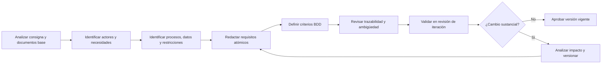

# Requisitos Funcionales y Elicitación Holística

## 1. Metadatos del documento

| Campo | Información |
|---|---|
| Nombre del proyecto | EcoLogística Lima - Optimizador de Rutas Sostenibles para DistriRápido S.A.C. |
| Integrante | Jordy Steve Chancasanampa Torres |
| Fecha | 04/09/2026 |
| Versión | 1.0.0 |
| Estado | Línea base inicial de requisitos funcionales |
| Ruta de repositorio | `docs/01 Inicio/06. Requisitos funcionales V_1_0_0.md` |

## 2. Objetivo del documento

El presente documento define el marco de **elicitación holística y ética** y la especificación atómica de los requisitos funcionales de **EcoLogística Lima**.

La finalidad es transformar las necesidades descritas en la consigna del proyecto, el acta de constitución, la declaración de visión, el registro de supuestos y restricciones y el registro de interesados en requisitos verificables, trazables y libres de ambigüedad.

Cada requisito funcional expresa estrictamente **qué comportamiento debe ofrecer el sistema**, evitando incorporar decisiones prematuras de implementación dentro de su descripción atómica. Las decisiones de tecnología, arquitectura, persistencia, frameworks, APIs y despliegue serán tratadas en los documentos técnicos correspondientes.

## 3. Alcance de la elicitación

La elicitación cubre las capacidades necesarias para apoyar la planificación y ejecución logística de última milla de DistriRápido S.A.C. dentro del caso académico de Lima Metropolitana.

Se consideran como dominios principales:

- gestión de flota;
- gestión de pedidos;
- gestión de conductores;
- gestión de clientes y preferencias de entrega;
- generación y actualización de rutas;
- visualización geográfica;
- indicadores operativos, económicos y ambientales;
- reportes de sostenibilidad;
- compensación de carbono;
- registro de incidencias y condiciones operativas;
- autenticación y autorización de usuarios.

La cobertura funcional mantiene trazabilidad con los requerimientos RF-01 a RF-10 proporcionados en la consigna y los amplía cuando una restricción o condición local exige un comportamiento funcional adicional.

---

# 4. Marco de Elicitación Holística y Ética

## 4.1. Principio de elicitación holística

La elicitación no se limita a recopilar funciones solicitadas por un único actor. Se analiza el sistema desde una perspectiva integral que considera simultáneamente:

1. **Personas:** gerencia, coordinación logística, conductores, clientes y evaluadores.
2. **Procesos:** recepción de pedidos, asignación de recursos, cálculo de rutas, reparto, seguimiento y reporte.
3. **Datos:** vehículos, pedidos, coordenadas, ventanas de tiempo, conductores, incidencias, tráfico e indicadores.
4. **Contexto local:** congestión, direcciones no estandarizadas, conectividad variable, seguridad vial y restricciones urbanas.
5. **Sostenibilidad:** combustible, emisiones de CO₂ y compensación ambiental.
6. **Ética y privacidad:** minimización de datos personales, control de acceso, transparencia y no discriminación.
7. **Calidad de servicio:** puntualidad, trazabilidad, disponibilidad de información y capacidad de respuesta ante cambios.

## 4.2. Fuentes de elicitación

| Fuente | Tipo | Información utilizada | Aplicación en requisitos |
|---|---|---|---|
| Consigna oficial de EcoLogística Lima | Documental | Contexto, RF-01 a RF-10, RNF, restricciones y condiciones locales | Fuente primaria de capacidades funcionales |
| Acta de constitución | Documental | Objetivo, alcance, objetivos medibles y criterios de éxito | Priorización y delimitación del MVP |
| Declaración de visión | Documental | Usuarios objetivo, propuesta de valor y KPIs | Validación de valor esperado |
| Registro de supuestos y restricciones | Documental | Condiciones técnicas, operativas, económicas y normativas | Identificación de funciones derivadas |
| Registro de interesados | Documental | Roles, influencia, necesidades y estrategia de participación | Identificación de actores y escenarios |
| Revisiones de iteración | Validación planificada | Retroalimentación funcional sobre incrementos | Refinamiento controlado de requisitos |
| Prototipos y escenarios de uso | Validación planificada | Comprensión de flujos y errores | Refinamiento de criterios de aceptación |

> **Limitación metodológica:** DistriRápido S.A.C. es una empresa ficticia del caso académico. Por ello, este documento no declara entrevistas reales ni evidencia de campo que no haya sido efectivamente obtenida. Las validaciones con roles empresariales se consideran simuladas o académicas hasta contar con evidencia real documentada.

## 4.3. Grupos de usuarios considerados

| Grupo | Necesidad principal | Riesgo si no se considera |
|---|---|---|
| Gerencia de Operaciones | Conocer desempeño, costos, emisiones y cumplimiento | Decisiones sin indicadores verificables |
| Coordinador / despachador logístico | Registrar pedidos, asignar recursos y obtener rutas viables | Planificación lenta o inconsistente |
| Conductores | Recibir rutas claras y actualizadas y reportar incidencias | Desvíos, retrasos o uso incorrecto del sistema |
| Clientes | Registrar preferencias y recibir entregas dentro de la ventana acordada | Incumplimiento de servicio |
| Administrador del sistema | Gestionar catálogos, usuarios y parámetros autorizados | Datos inconsistentes o accesos inadecuados |
| Docente / auditor académico | Verificar trazabilidad, cumplimiento y evidencia | Falta de demostrabilidad del PFA |

## 4.4. Perspectiva glocal

El proyecto adopta una perspectiva **glocal**: aplica principios generales de ingeniería de requisitos, calidad, seguridad, accesibilidad y sostenibilidad, pero los adapta al contexto operativo de Lima Metropolitana descrito por la consigna.

| Dimensión global | Adaptación local considerada |
|---|---|
| Georreferenciación | Direcciones no estandarizadas y uso de puntos de referencia |
| Optimización logística | Congestión, ventanas de tiempo, restricciones viales y cambios operativos |
| Seguridad vial | Zonas sensibles, incidentes y necesidad de alternativas de ruta |
| Accesibilidad | Usuarios con distintos niveles de alfabetización digital |
| Conectividad | Operación en escenarios con conectividad limitada o inestable |
| Sostenibilidad | Medición de combustible, CO₂ y equivalentes ambientales |
| Protección de datos | Tratamiento limitado de datos personales de clientes y conductores |
| Experiencia de usuario | Lenguaje comprensible y acciones esenciales para operación logística |

## 4.5. Perspectiva ética

La elicitación incorpora los siguientes principios:

### 4.5.1. Minimización de datos

Solo se solicitarán los datos necesarios para ejecutar las funciones del sistema. No se incorporarán datos sensibles que no resulten indispensables para la operación.

### 4.5.2. Propósito explícito

Cada dato recolectado deberá estar vinculado a una finalidad funcional concreta, como asignación de rutas, contacto operativo, identificación del conductor o cumplimiento de una ventana de entrega.

### 4.5.3. Control de acceso

Las capacidades del sistema deberán quedar disponibles únicamente para los perfiles autorizados, evitando que un usuario consulte o modifique información que no necesita para cumplir su función.

### 4.5.4. Transparencia de resultados

Los indicadores y resultados de optimización deberán presentarse de forma comprensible. El sistema no debe ocultar las condiciones relevantes que afectan una ruta, como restricciones, incidencias o ventanas de tiempo.

### 4.5.5. No discriminación

La asignación de rutas y recursos debe basarse en restricciones operativas verificables y no en atributos personales irrelevantes de conductores o clientes.

### 4.5.6. Seguridad y supervisión humana

Las recomendaciones de ruta apoyan la toma de decisiones. Ante una condición insegura, inconsistente o excepcional, un usuario autorizado debe poder revisar la información y registrar una incidencia.

### 4.5.7. Accesibilidad e inclusión

Los requisitos consideran que existen usuarios con diferentes niveles de experiencia digital y posibles limitaciones visuales o motrices, por lo que los flujos esenciales deben ser comprensibles y verificables.

## 4.6. Proceso de elicitación y validación

## 4.7. Reglas de calidad para la redacción de requisitos

Todo requisito funcional de este documento debe cumplir las siguientes reglas:

- expresar una única capacidad principal;
- utilizar una acción observable y verificable;
- indicar el detonante o condición de ejecución;
- evitar términos ambiguos como "fácil", "eficiente", "adecuado", "rápido" o "amigable" sin una medida verificable;
- evitar especificar frameworks, lenguajes, patrones, motores de base de datos o proveedores dentro de la descripción atómica;
- mantener trazabilidad hacia la fuente que origina la necesidad;
- disponer de criterios de aceptación verificables;
- contemplar una ruta principal, una ruta alternativa válida y un caso de error o borde.

---

# 5. Convenciones de especificación

## 5.1. Identificación

Los requisitos se codifican con el formato `RF-XXX`.

La consigna original utiliza códigos `RF-01` a `RF-10`. Para cumplir la estructura atómica exigida, estos requisitos de alto nivel se descomponen en requisitos `RF-001` en adelante, manteniendo una matriz explícita de correspondencia.

## 5.2. Prioridad

| Prioridad | Significado |
|---|---|
| Alta | Necesario para el MVP, la operación principal o el cumplimiento de una condición crítica |
| Media | Aporta valor relevante, pero puede implementarse después de las funciones nucleares |
| Baja | Complementario o postergable sin impedir la demostración principal del MVP |

## 5.3. Formato de criterios de aceptación

Cada requisito usa criterios BDD con tres rutas:

- **Ruta Gold:** comportamiento principal esperado.
- **Ruta Feliz:** alternativa válida y permitida.
- **Ruta Infeliz:** error, dato inválido, conflicto o interrupción controlada.

---

# 6. Matriz de correspondencia con la consigna

| Requisito de la consigna | Capacidad original | Requisitos atómicos relacionados |
|---|---|---|
| RF-01 | Gestión de flota | RF-001, RF-002, RF-003 |
| RF-02 | Gestión de pedidos | RF-004, RF-005 |
| RF-03 | Generación de rutas optimizadas | RF-006 |
| RF-04 | Visualización de rutas en mapa | RF-007 |
| RF-05 | Dashboard de indicadores | RF-008 |
| RF-06 | Reportes de sostenibilidad | RF-009 |
| RF-07 | Reoptimización dinámica | RF-010 |
| RF-08 | Gestión de conductores | RF-011, RF-012 |
| RF-09 | Módulo de clientes | RF-013 |
| RF-10 | Plan de compensación de carbono | RF-014 |
| Restricciones de datos y seguridad vial | Carga manual de condiciones e incidencias | RF-015 |
| Restricciones viales, ambientales y de infraestructura | Gestión de restricciones operativas | RF-016 |
| RNF-02 / restricción de autorización | Acceso controlado al sistema | RF-017, RF-018 |

---

# 7. Catálogo de Requisitos Funcionales Atómicos

## RF-001: Registrar vehículo

- **Descripción Atómica:** El sistema debe registrar un vehículo cuando un usuario autorizado proporcione todos los datos obligatorios de la unidad.
- **Prioridad:** Alta
- **Origen:** Consigna RF-01.
- **Datos mínimos:** placa, tipo, capacidad de carga, consumo de combustible, factor de emisión de CO₂ y año de fabricación.

### Criterios de Aceptación

#### Ruta Gold

**DADO** que un usuario autorizado se encuentra registrando una unidad  
**Y** proporciona todos los datos obligatorios con valores válidos  
**CUANDO** confirma el registro  
**ENTONCES** el sistema almacena el vehículo y confirma su creación con un identificador único.

#### Ruta Feliz

**DADO** que la unidad posee una antigüedad elevada o un factor de emisión alto  
**CUANDO** el usuario registra datos válidos  
**ENTONCES** el sistema registra la unidad y conserva sus características para la evaluación posterior de restricciones.

#### Ruta Infeliz

**DADO** que falta un dato obligatorio, existe una placa duplicada o un valor numérico es inválido  
**CUANDO** el usuario intenta confirmar el registro  
**ENTONCES** el sistema rechaza la operación, conserva la consistencia de los datos e informa los campos que deben corregirse.

---

## RF-002: Actualizar datos de vehículo

- **Descripción Atómica:** El sistema debe actualizar la información de un vehículo cuando un usuario autorizado modifica datos permitidos de una unidad existente.
- **Prioridad:** Media
- **Origen:** Descomposición de Consigna RF-01.

### Criterios de Aceptación

#### Ruta Gold

**DADO** que el vehículo existe y el usuario posee permiso de modificación  
**CUANDO** cambia uno o más datos permitidos y confirma  
**ENTONCES** el sistema guarda los nuevos valores y mantiene la identidad del vehículo.

#### Ruta Feliz

**DADO** que el usuario modifica únicamente disponibilidad o características operativas permitidas  
**CUANDO** confirma el cambio  
**ENTONCES** el sistema actualiza esos valores sin alterar los datos no modificados.

#### Ruta Infeliz

**DADO** que el vehículo no existe, el usuario no tiene permiso o el nuevo valor incumple una regla de validación  
**CUANDO** se intenta guardar la modificación  
**ENTONCES** el sistema no aplica el cambio e informa el motivo.

---

## RF-003: Cambiar estado operativo de vehículo

- **Descripción Atómica:** El sistema debe cambiar el estado operativo de un vehículo cuando un usuario autorizado lo declara disponible, no disponible o fuera de servicio.
- **Prioridad:** Alta
- **Origen:** Ampliación necesaria de Consigna RF-01 para asignación de rutas.

### Criterios de Aceptación

#### Ruta Gold

**DADO** que un vehículo registrado no tiene una condición que impida el cambio  
**CUANDO** el usuario autorizado selecciona un nuevo estado operativo  
**ENTONCES** el sistema actualiza el estado y lo considera en las siguientes operaciones de planificación.

#### Ruta Feliz

**DADO** que un vehículo está temporalmente fuera de servicio  
**CUANDO** el usuario lo marca como no disponible  
**ENTONCES** el sistema conserva su historial y evita considerarlo como unidad disponible.

#### Ruta Infeliz

**DADO** que el cambio de estado contradice una condición activa registrada  
**CUANDO** el usuario intenta confirmar el cambio  
**ENTONCES** el sistema no aplica el estado incompatible e informa la condición que lo impide.

---

## RF-004: Registrar pedido

- **Descripción Atómica:** El sistema debe registrar un pedido cuando un usuario autorizado proporciona los datos obligatorios de la entrega.
- **Prioridad:** Alta
- **Origen:** Consigna RF-02.
- **Datos mínimos:** cliente, ubicación de entrega, peso, volumen, ventana de tiempo, prioridad y tipo de producto.

### Criterios de Aceptación

#### Ruta Gold

**DADO** que un usuario autorizado ingresa un pedido con datos completos y válidos  
**CUANDO** confirma el registro  
**ENTONCES** el sistema crea el pedido y lo deja disponible para la planificación de rutas.

#### Ruta Feliz

**DADO** que la dirección no posee nomenclatura estandarizada  
**Y** el usuario proporciona coordenadas o un punto de referencia suficiente  
**CUANDO** confirma el pedido  
**ENTONCES** el sistema registra la ubicación utilizando la información alternativa válida.

#### Ruta Infeliz

**DADO** que el pedido no contiene una ubicación utilizable, una ventana válida o los datos mínimos de carga  
**CUANDO** el usuario intenta registrarlo  
**ENTONCES** el sistema rechaza el registro e identifica la información faltante o inconsistente.

---

## RF-005: Actualizar estado de pedido

- **Descripción Atómica:** El sistema debe actualizar el estado de un pedido cuando ocurre una modificación operativa autorizada sobre una entrega existente.
- **Prioridad:** Alta
- **Origen:** Descomposición de Consigna RF-02 y soporte a RF-07 de la consigna.

### Criterios de Aceptación

#### Ruta Gold

**DADO** que el pedido existe  
**CUANDO** un usuario autorizado cambia su estado a un estado permitido  
**ENTONCES** el sistema registra el nuevo estado y lo utiliza en la planificación vigente.

#### Ruta Feliz

**DADO** que un pedido todavía puede modificarse sin invalidar una entrega completada  
**CUANDO** se actualiza su prioridad, ventana o condición operativa autorizada  
**ENTONCES** el sistema conserva el pedido y registra la modificación para su posterior evaluación.

#### Ruta Infeliz

**DADO** que el pedido ya fue completado o la transición solicitada no está permitida  
**CUANDO** se intenta cambiar su estado  
**ENTONCES** el sistema rechaza la transición e informa el motivo.

---

## RF-006: Generar rutas optimizadas

- **Descripción Atómica:** El sistema debe generar una propuesta de rutas cuando existan pedidos pendientes y recursos operativos válidos para planificar.
- **Prioridad:** Alta
- **Origen:** Consigna RF-03.
- **Resultado esperado:** conjunto de rutas que considere distancia, tiempo, capacidad, combustible, emisiones, ventanas de entrega y restricciones operativas aplicables.

### Criterios de Aceptación

#### Ruta Gold

**DADO** que existen pedidos pendientes, vehículos disponibles y conductores habilitados  
**Y** las restricciones requeridas están disponibles  
**CUANDO** el usuario solicita generar la planificación  
**ENTONCES** el sistema devuelve una propuesta de rutas válida con asignación de pedidos y recursos.

#### Ruta Feliz

**DADO** que existen varias soluciones válidas para el mismo conjunto de pedidos  
**CUANDO** se genera la planificación  
**ENTONCES** el sistema presenta una solución válida y sus indicadores de comparación para apoyar la decisión operativa.

#### Ruta Infeliz

**DADO** que no existe una combinación factible por capacidad, disponibilidad, ventana de tiempo o restricción operativa  
**CUANDO** se solicita generar la planificación  
**ENTONCES** el sistema informa que no se encontró una solución válida e identifica las restricciones o pedidos conflictivos disponibles para revisión.

---

## RF-007: Visualizar rutas planificadas

- **Descripción Atómica:** El sistema debe visualizar una ruta planificada cuando un usuario autorizado selecciona una planificación disponible.
- **Prioridad:** Alta
- **Origen:** Consigna RF-04.

### Criterios de Aceptación

#### Ruta Gold

**DADO** que existe una planificación con rutas válidas  
**CUANDO** el usuario selecciona una ruta  
**ENTONCES** el sistema muestra su trazado, secuencia de entregas, puntos de parada y tiempos estimados disponibles.

#### Ruta Feliz

**DADO** que existen condiciones de congestión, zonas sensibles o restricciones registradas  
**CUANDO** el usuario visualiza la ruta  
**ENTONCES** el sistema presenta dichas condiciones junto con la ruta para facilitar su interpretación.

#### Ruta Infeliz

**DADO** que la ruta seleccionada no existe o sus datos geográficos son insuficientes  
**CUANDO** el usuario intenta visualizarla  
**ENTONCES** el sistema informa la imposibilidad de representar la ruta y no muestra información geográfica engañosa.

---

## RF-008: Consultar dashboard de indicadores

- **Descripción Atómica:** El sistema debe mostrar los indicadores de una operación logística cuando un usuario autorizado consulta el dashboard correspondiente.
- **Prioridad:** Alta
- **Origen:** Consigna RF-05.
- **Indicadores mínimos:** distancia, emisiones de CO₂, combustible, cumplimiento de ventanas de tiempo, ahorro frente a línea base y equivalentes ambientales.

### Criterios de Aceptación

#### Ruta Gold

**DADO** que existen datos calculados para una operación o periodo  
**CUANDO** el usuario abre el dashboard  
**ENTONCES** el sistema muestra los indicadores disponibles con su unidad de medida y periodo de referencia.

#### Ruta Feliz

**DADO** que el usuario consulta un subconjunto válido de rutas o un periodo específico  
**CUANDO** aplica el filtro  
**ENTONCES** el sistema actualiza los indicadores al ámbito seleccionado.

#### Ruta Infeliz

**DADO** que no existen datos suficientes para calcular un indicador  
**CUANDO** se consulta el dashboard  
**ENTONCES** el sistema identifica el indicador como no disponible y evita presentar un valor inventado.

---

## RF-009: Generar reporte de sostenibilidad

- **Descripción Atómica:** El sistema debe generar un reporte de sostenibilidad cuando un usuario autorizado selecciona un periodo o conjunto de rutas con datos disponibles.
- **Prioridad:** Alta
- **Origen:** Consigna RF-06.

### Criterios de Aceptación

#### Ruta Gold

**DADO** que existen datos válidos de rutas, emisiones y costos para el ámbito seleccionado  
**CUANDO** el usuario solicita el reporte  
**ENTONCES** el sistema genera un documento descargable con el resumen operativo, económico y ambiental correspondiente.

#### Ruta Feliz

**DADO** que el usuario selecciona un periodo menor o un subconjunto de rutas  
**CUANDO** solicita el reporte  
**ENTONCES** el sistema genera el documento utilizando únicamente el alcance seleccionado.

#### Ruta Infeliz

**DADO** que faltan datos indispensables para elaborar el reporte  
**CUANDO** el usuario intenta generarlo  
**ENTONCES** el sistema no presenta resultados incompletos como definitivos e informa qué información impide completar el reporte.

---

## RF-010: Reoptimizar rutas ante cambios operativos

- **Descripción Atómica:** El sistema debe recalcular una planificación cuando se registre un cambio operativo que afecte una ruta vigente.
- **Prioridad:** Alta
- **Origen:** Consigna RF-07.
- **Detonantes contemplados:** nuevo pedido, cancelación, accidente, avería, incidencia de tráfico o cambio relevante de disponibilidad.

### Criterios de Aceptación

#### Ruta Gold

**DADO** que existe una planificación vigente  
**Y** se registra un cambio que afecta su factibilidad o conveniencia  
**CUANDO** se solicita la reoptimización  
**ENTONCES** el sistema genera una nueva propuesta considerando el estado actualizado.

#### Ruta Feliz

**DADO** que el cambio afecta únicamente una parte de la operación  
**CUANDO** se solicita recalcular  
**ENTONCES** el sistema conserva la información aún válida y produce una planificación actualizada para la situación vigente.

#### Ruta Infeliz

**DADO** que los datos del evento son insuficientes o el nuevo escenario no tiene solución factible  
**CUANDO** se intenta reoptimizar  
**ENTONCES** el sistema mantiene identificable la última planificación válida e informa la causa que impide generar una nueva.

---

## RF-011: Registrar conductor

- **Descripción Atómica:** El sistema debe registrar un conductor cuando un usuario autorizado proporciona los datos obligatorios de identificación y operación.
- **Prioridad:** Media
- **Origen:** Consigna RF-08.
- **Datos mínimos:** nombre, documento de identificación, licencia, experiencia, disponibilidad horaria, contacto y punto de partida cuando corresponda.

### Criterios de Aceptación

#### Ruta Gold

**DADO** que el usuario proporciona los datos obligatorios del conductor  
**CUANDO** confirma el registro  
**ENTONCES** el sistema crea el registro del conductor y lo deja disponible según su estado operativo.

#### Ruta Feliz

**DADO** que el conductor posee un punto de partida distinto a la sede principal  
**CUANDO** se registra una ubicación válida  
**ENTONCES** el sistema conserva el punto de partida para su uso en la planificación.

#### Ruta Infeliz

**DADO** que falta un dato obligatorio, existe un documento duplicado o la licencia registrada no es válida según las reglas configuradas  
**CUANDO** se intenta confirmar  
**ENTONCES** el sistema rechaza el registro e informa los datos que requieren corrección.

---

## RF-012: Actualizar disponibilidad de conductor

- **Descripción Atómica:** El sistema debe actualizar la disponibilidad de un conductor cuando un usuario autorizado registra su condición operativa para un periodo determinado.
- **Prioridad:** Alta
- **Origen:** Descomposición de Consigna RF-08.

### Criterios de Aceptación

#### Ruta Gold

**DADO** que el conductor existe  
**CUANDO** se registra un periodo válido de disponibilidad  
**ENTONCES** el sistema actualiza su disponibilidad para las planificaciones correspondientes.

#### Ruta Feliz

**DADO** que el conductor modifica su disponibilidad antes de una planificación definitiva  
**CUANDO** el cambio es autorizado  
**ENTONCES** el sistema utiliza la información actualizada en la siguiente planificación.

#### Ruta Infeliz

**DADO** que el periodo registrado es inválido o se superpone con una condición incompatible  
**CUANDO** se intenta guardar  
**ENTONCES** el sistema rechaza el cambio e informa el conflicto.

---

## RF-013: Registrar preferencias de entrega del cliente

- **Descripción Atómica:** El sistema debe registrar las preferencias de entrega de un cliente cuando un usuario autorizado proporciona condiciones válidas asociadas a su punto de entrega.
- **Prioridad:** Media
- **Origen:** Consigna RF-09.
- **Preferencias contempladas:** horarios, puntos de referencia y restricciones de acceso.

### Criterios de Aceptación

#### Ruta Gold

**DADO** que el cliente existe  
**CUANDO** se registran preferencias válidas de entrega  
**ENTONCES** el sistema las asocia al cliente y las deja disponibles para futuras planificaciones.

#### Ruta Feliz

**DADO** que el cliente utiliza horarios variables  
**CUANDO** se registra una preferencia válida para un periodo o pedido específico  
**ENTONCES** el sistema conserva la preferencia con el alcance indicado.

#### Ruta Infeliz

**DADO** que la preferencia contiene un horario inválido o una condición imposible de interpretar  
**CUANDO** se intenta guardar  
**ENTONCES** el sistema rechaza esa preferencia e informa el dato que debe corregirse.

---

## RF-014: Calcular propuesta de compensación de carbono

- **Descripción Atómica:** El sistema debe calcular una propuesta de compensación cuando existen emisiones de CO₂ cuantificadas para el periodo seleccionado.
- **Prioridad:** Media
- **Origen:** Consigna RF-10.

### Criterios de Aceptación

#### Ruta Gold

**DADO** que existen emisiones calculadas para un periodo  
**Y** existen parámetros de equivalencia ambiental vigentes en el caso  
**CUANDO** el usuario solicita la propuesta de compensación  
**ENTONCES** el sistema muestra la cantidad de CO₂ a compensar y su equivalencia según los parámetros configurados.

#### Ruta Feliz

**DADO** que el usuario selecciona un subconjunto de rutas  
**CUANDO** solicita el cálculo  
**ENTONCES** el sistema calcula la compensación únicamente para las emisiones del alcance seleccionado.

#### Ruta Infeliz

**DADO** que no existen emisiones calculadas o faltan parámetros de equivalencia  
**CUANDO** se solicita la compensación  
**ENTONCES** el sistema informa que el cálculo no puede completarse y no genera una equivalencia sin fundamento.

---

## RF-015: Registrar incidencia operativa

- **Descripción Atómica:** El sistema debe registrar una incidencia cuando un usuario autorizado reporta un evento que puede afectar la operación o una ruta.
- **Prioridad:** Alta
- **Origen:** Ampliación derivada de las restricciones de datos, tráfico y seguridad vial de la consigna.
- **Incidencias contempladas:** accidente, congestión, bloqueo, avería, riesgo de seguridad u otra condición operativa parametrizada.

### Criterios de Aceptación

#### Ruta Gold

**DADO** que el usuario autorizado identifica una incidencia  
**CUANDO** registra tipo, ubicación, momento y descripción mínima válida  
**ENTONCES** el sistema almacena la incidencia y la deja disponible para evaluar su impacto sobre las rutas.

#### Ruta Feliz

**DADO** que una fuente externa no dispone de información actualizada  
**CUANDO** un usuario autorizado registra manualmente una incidencia válida  
**ENTONCES** el sistema conserva el reporte manual diferenciándolo por su origen.

#### Ruta Infeliz

**DADO** que la incidencia no contiene ubicación utilizable, tipo o información mínima requerida  
**CUANDO** se intenta registrar  
**ENTONCES** el sistema rechaza el registro e informa los campos pendientes.

---

## RF-016: Registrar restricción operativa de ruta

- **Descripción Atómica:** El sistema debe registrar una restricción operativa cuando un usuario autorizado define una condición que limita el tránsito o la asignación de recursos.
- **Prioridad:** Media
- **Origen:** Ampliación derivada de restricciones viales, ambientales, sociales y de infraestructura de la consigna.
- **Ejemplos de condición:** zona restringida, franja horaria, tipo de vía, limitación por vehículo o zona sensible.

### Criterios de Aceptación

#### Ruta Gold

**DADO** que el usuario autorizado define una restricción con ámbito, condición y vigencia válidos  
**CUANDO** confirma el registro  
**ENTONCES** el sistema almacena la restricción para su consideración en las planificaciones afectadas.

#### Ruta Feliz

**DADO** que una restricción es temporal  
**CUANDO** se registra una vigencia definida  
**ENTONCES** el sistema la aplica únicamente dentro del periodo registrado.

#### Ruta Infeliz

**DADO** que la restricción carece de ámbito, condición o vigencia coherente cuando esta sea obligatoria  
**CUANDO** se intenta guardar  
**ENTONCES** el sistema rechaza el registro e identifica la inconsistencia.

---

## RF-017: Autenticar usuario

- **Descripción Atómica:** El sistema debe autenticar a un usuario cuando este presenta credenciales válidas para iniciar una sesión.
- **Prioridad:** Alta
- **Origen:** Requisito funcional derivado de RNF-02 y de las restricciones de autorización de la consigna.

### Criterios de Aceptación

#### Ruta Gold

**DADO** que el usuario posee una cuenta activa  
**Y** presenta credenciales válidas  
**CUANDO** solicita iniciar sesión  
**ENTONCES** el sistema crea una sesión autenticada asociada a su identidad.

#### Ruta Feliz

**DADO** que el usuario se encuentra autenticado y su sesión continúa vigente  
**CUANDO** accede a una función permitida  
**ENTONCES** el sistema mantiene la sesión sin solicitar nuevamente las credenciales en cada acción.

#### Ruta Infeliz

**DADO** que las credenciales son inválidas, la cuenta está inactiva o no puede verificarse la identidad  
**CUANDO** se intenta iniciar sesión  
**ENTONCES** el sistema deniega el acceso y muestra un mensaje que no revela información sensible de la cuenta.

---

## RF-018: Autorizar operación por perfil

- **Descripción Atómica:** El sistema debe autorizar una operación cuando el perfil autenticado posee permiso para ejecutar la capacidad solicitada.
- **Prioridad:** Alta
- **Origen:** Requisito funcional derivado de la restricción de acceso a información necesaria para cada rol.

### Criterios de Aceptación

#### Ruta Gold

**DADO** que el usuario está autenticado  
**Y** su perfil posee permiso sobre la operación solicitada  
**CUANDO** intenta ejecutarla  
**ENTONCES** el sistema permite la operación.

#### Ruta Feliz

**DADO** que el usuario posee permiso de consulta pero no de modificación  
**CUANDO** accede al recurso  
**ENTONCES** el sistema permite consultar la información autorizada y mantiene bloqueadas las acciones no permitidas.

#### Ruta Infeliz

**DADO** que el usuario está autenticado pero su perfil no posee el permiso requerido  
**CUANDO** intenta ejecutar la operación  
**ENTONCES** el sistema deniega la acción, mantiene el estado de la información y registra el resultado según las reglas de auditoría que se definan.

---

# 8. Matriz resumida de requisitos

| ID | Requisito | Prioridad | Fuente principal | MVP |
|---|---|---|---|---|
| RF-001 | Registrar vehículo | Alta | RF-01 | Sí |
| RF-002 | Actualizar datos de vehículo | Media | RF-01 | Parcial |
| RF-003 | Cambiar estado operativo de vehículo | Alta | RF-01 | Sí |
| RF-004 | Registrar pedido | Alta | RF-02 | Sí |
| RF-005 | Actualizar estado de pedido | Alta | RF-02 / RF-07 | Sí |
| RF-006 | Generar rutas optimizadas | Alta | RF-03 | Sí |
| RF-007 | Visualizar rutas planificadas | Alta | RF-04 | Sí |
| RF-008 | Consultar dashboard de indicadores | Alta | RF-05 | Sí |
| RF-009 | Generar reporte de sostenibilidad | Alta | RF-06 | Sí |
| RF-010 | Reoptimizar rutas ante cambios operativos | Alta | RF-07 | Sí |
| RF-011 | Registrar conductor | Media | RF-08 | Posterior al núcleo mínimo |
| RF-012 | Actualizar disponibilidad de conductor | Alta | RF-08 | Recomendado |
| RF-013 | Registrar preferencias de entrega del cliente | Media | RF-09 | Posterior al núcleo mínimo |
| RF-014 | Calcular propuesta de compensación de carbono | Media | RF-10 | Posterior al núcleo mínimo |
| RF-015 | Registrar incidencia operativa | Alta | Restricciones de datos / seguridad | Recomendado |
| RF-016 | Registrar restricción operativa de ruta | Media | Restricciones del proyecto | Recomendado |
| RF-017 | Autenticar usuario | Alta | RNF-02 / autorización | Sí |
| RF-018 | Autorizar operación por perfil | Alta | Restricción normativa / seguridad | Sí |

---

# 9. Trazabilidad con objetivos del proyecto

| Objetivo / necesidad | Requisitos relacionados |
|---|---|
| Gestionar flota y recursos | RF-001, RF-002, RF-003, RF-011, RF-012 |
| Gestionar pedidos y preferencias | RF-004, RF-005, RF-013 |
| Optimizar rutas | RF-006, RF-010, RF-015, RF-016 |
| Visualizar la operación | RF-007 |
| Medir desempeño y sostenibilidad | RF-008, RF-009, RF-014 |
| Responder a cambios operativos | RF-005, RF-010, RF-015, RF-016 |
| Proteger el acceso a la información | RF-017, RF-018 |

---

# 10. Criterios de preparación para desarrollo

Un requisito se considera preparado para ser desarrollado cuando:

- su descripción atómica está aprobada;
- posee prioridad;
- cuenta con criterios Gold, Feliz e Infeliz;
- identifica su fuente;
- no contiene términos ambiguos sin métrica;
- no mezcla varias acciones principales;
- sus datos de entrada y resultado esperado son comprensibles;
- no contradice una restricción vigente;
- puede asociarse posteriormente con reglas de negocio, requisitos no funcionales, pruebas y componentes de arquitectura.

# 11. Gestión de cambios de requisitos

Cualquier cambio funcional debe seguir el siguiente flujo:

1. registrar el cambio solicitado y su origen;
2. identificar el requisito afectado;
3. analizar impacto en alcance, cronograma, costo, calidad, datos y riesgos;
4. actualizar criterios de aceptación y trazabilidad;
5. determinar si el cambio exige incremento de versión;
6. conservar la versión anterior en el historial Git;
7. validar el cambio en la revisión correspondiente.

Una corrección menor de redacción que no altere el comportamiento puede registrarse como cambio menor de mantenimiento. Un cambio que altere comportamiento, alcance, estructura o criterios de aceptación deberá producir una nueva versión conforme al esquema de versionamiento definido para el proyecto.

# 12. Conclusión

La elicitación funcional de EcoLogística Lima transforma las capacidades generales de la consigna en requisitos atómicos y verificables, manteniendo trazabilidad con el contexto logístico de Lima Metropolitana y con los artefactos de inicio ya elaborados.

La especificación resultante evita descripciones ambiguas y separa el **qué debe hacer el sistema** de las decisiones sobre **cómo será implementado**. Además, los criterios BDD incorporan rutas principales, alternativas válidas y escenarios de error, lo que permite utilizar este documento como base para la trazabilidad posterior con reglas de negocio, requisitos no funcionales, arquitectura, base de datos y plan de pruebas.
