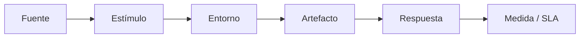

# Requisitos No Funcionales (RNF)

## 1. Metadatos del documento

| Campo | Información |
|---|---|
| Nombre del proyecto | EcoLogística Lima - Optimizador de Rutas Sostenibles para DistriRápido S.A.C. |
| Integrante | Jordy Steve Chancasanampa Torres |
| Fecha | 04/09/2026 |
| Versión | 1.0.0 |
| Estado | Línea base inicial de requisitos no funcionales |
| Ruta de repositorio | `docs/01 Inicio/07. Requisitos no funcionales V_1_0_0.md` |

## 2. Objetivo del documento

El presente documento define los **Requisitos No Funcionales (RNF)** de **EcoLogística Lima** mediante atributos de calidad verificables, escenarios de calidad y métricas SMART.

La especificación adopta la estructura de escenario de calidad empleada en **arc42**:

> **Fuente → Estímulo → Entorno → Artefacto → Respuesta → Medida**

La clasificación de los atributos de calidad se alinea con las características de **ISO/IEC 25010** indicadas en la consigna: adecuación funcional, eficiencia de desempeño, compatibilidad, usabilidad, fiabilidad, seguridad, mantenibilidad y portabilidad.

El propósito es evitar expresiones subjetivas como *rápido*, *seguro*, *fácil*, *robusto*, *intuitivo* o *escalable* sin una condición objetiva de verificación.

---

# 3. Fuentes y criterio de derivación

## 3.1. Fuentes documentales del proyecto

Los RNF se derivan de los siguientes artefactos del proyecto:

| Fuente | Información utilizada |
|---|---|
| Consigna oficial de EcoLogística Lima | RNF-01 a RNF-07, restricciones locales, estándares y normas obligatorias |
| Acta de constitución | Requisitos no funcionales de alto nivel, objetivos medibles, riesgos y criterios de éxito |
| Declaración de la visión | KPIs de rendimiento, disponibilidad y principios de diseño |
| Registro de supuestos y restricciones | Restricciones tecnológicas, normativas, de seguridad, conectividad y documentación |
| Requisitos funcionales V_1_0_0 | Flujos críticos que deben ser protegidos, medidos y verificados |
| Selección del enfoque del proyecto | Necesidad de pruebas progresivas, trazabilidad y control dentro del enfoque híbrido |

## 3.2. Regla para métricas no cuantificadas por la consigna

La consigna ya proporciona umbrales explícitos para rendimiento, reoptimización, escalabilidad, disponibilidad y conformidad WCAG. Sin embargo, algunos requisitos de seguridad, usabilidad, compatibilidad y documentación se expresan cualitativamente.

Para cumplir la directriz del entregable —**ningún atributo de calidad sin umbral cuantitativo explícito**— este documento incorpora métricas de línea base con dos tipos de origen:

- **Consigna:** valor numérico o criterio explícito suministrado por el caso.
- **Métrica de proyecto V1.0.0:** umbral operacional introducido en este documento para hacer verificable una exigencia cualitativa de la consigna. Estos valores podrán ajustarse mediante control de cambios si las pruebas del MVP justifican una modificación.

## 3.3. Principios de redacción

Todo RNF debe:

1. Expresar un atributo de calidad observable.
2. Definir un escenario concreto de estímulo y respuesta.
3. Establecer una métrica o condición de aceptación cuantificable.
4. Identificar el entorno en el cual se medirá.
5. Definir el artefacto o parte del sistema afectada.
6. Ser independiente de una tecnología concreta, salvo que la consigna obligue expresamente a cumplir un estándar.
7. Poder asociarse a una evidencia de prueba.
8. Mantener trazabilidad con la consigna y los demás documentos del proyecto.

---

# 4. Modelo de Escenario de Calidad

| Elemento | Definición |
|---|---|
| Fuente | Actor, evento, sistema externo o condición que origina el estímulo |
| Estímulo | Evento que pone a prueba el atributo de calidad |
| Entorno | Estado operativo en el cual ocurre el estímulo |
| Artefacto | Parte del sistema afectada |
| Respuesta | Comportamiento observable que debe producir el sistema |
| Medida | Umbral cuantitativo o criterio de conformidad que determina aceptación o rechazo |

---

# 5. Matriz de Cobertura ISO/IEC 25010

| Característica ISO/IEC 25010 | RNF relacionados | Aplicación en EcoLogística Lima |
|---|---|---|
| Adecuación funcional | RNF-011 | Cobertura del MVP y cumplimiento verificable de las capacidades priorizadas |
| Eficiencia de desempeño | RNF-001, RNF-002, RNF-006 | Tiempo de optimización, reoptimización y capacidad de crecimiento |
| Compatibilidad | RNF-009, RNF-012 | Operación en distintos tamaños de pantalla y matriz de navegadores objetivo |
| Usabilidad | RNF-005, RNF-007 | Accesibilidad y ejecución comprensible de tareas críticas |
| Fiabilidad | RNF-008 | Disponibilidad durante el horario operativo |
| Seguridad | RNF-003, RNF-004 | Autenticación, autorización y protección de datos personales |
| Mantenibilidad | RNF-010, RNF-013 | Documentación, trazabilidad y verificabilidad de cambios |
| Portabilidad | RNF-009, RNF-012 | Adaptación a dispositivos web y entornos de navegación objetivo |

---

# 6. Resumen Ejecutivo de RNF

| ID | Categoría ISO 25010 | Atributo | Medida principal | Origen del umbral | Prioridad |
|---|---|---|---|---|---|
| RNF-001 | Eficiencia de desempeño | Generación de rutas | `≤ 45 s` para hasta 150 pedidos y 15 vehículos | Consigna | Alta |
| RNF-002 | Eficiencia de desempeño | Reoptimización | `< 30 s` ante cambios críticos | Consigna | Alta |
| RNF-003 | Seguridad | Autenticación y autorización | 100 % de pruebas negativas de acceso crítico bloqueadas; 0 vulnerabilidades críticas/altas abiertas al cierre | Métrica de proyecto V1.0.0 derivada de OWASP | Alta |
| RNF-004 | Seguridad | Protección de datos personales | 100 % de campos personales inventariados y con finalidad/rol; 0 exposiciones no autorizadas en pruebas | Métrica de proyecto V1.0.0 derivada de Ley 29733 y restricciones | Alta |
| RNF-005 | Usabilidad | Accesibilidad | Cumplimiento WCAG 2.1 nivel AA en el 100 % de criterios aplicables a flujos críticos | Consigna + métrica de verificación | Alta |
| RNF-006 | Eficiencia de desempeño | Escalabilidad | Capacidad de gestionar hasta 1,000 pedidos diarios y 50 vehículos | Consigna | Alta |
| RNF-007 | Usabilidad | Facilidad de uso para conductores | `≥ 90 %` de éxito en tareas críticas y `≤ 10 %` de errores de operación en prueba de usabilidad | Métrica de proyecto V1.0.0 | Alta |
| RNF-008 | Fiabilidad | Disponibilidad | `≥ 99.5 %` durante 05:00-22:00 | Consigna | Alta |
| RNF-009 | Compatibilidad / Portabilidad | Responsive y conectividad limitada | 100 % de flujos críticos completables bajo perfiles de prueba 2G/3G y en resoluciones objetivo | Consigna + métrica de proyecto V1.0.0 | Media |
| RNF-010 | Mantenibilidad | Documentación | 100 % de artefactos técnicos obligatorios presentes y versionados | Consigna + métrica de verificación | Alta |
| RNF-011 | Adecuación funcional | Cobertura del MVP | `≥ 70 %` de RF-01 a RF-07 implementados y aprobados | Consigna / Acta | Alta |
| RNF-012 | Compatibilidad / Portabilidad | Interoperabilidad web | 100 % de flujos críticos aprobados en la matriz de navegadores objetivo y 0 defectos bloqueantes de validación | Métrica de proyecto V1.0.0 derivada de W3C | Media |
| RNF-013 | Mantenibilidad | Trazabilidad de calidad | 100 % de RNF con evidencia de prueba y trazabilidad hacia fuente y artefacto afectado | Métrica de proyecto V1.0.0 | Alta |

---

# 7. Catálogo Detallado de Escenarios de Calidad

## RNF-001: Rendimiento de generación de rutas

- **Categoría ISO/IEC 25010:** Eficiencia de desempeño.
- **Prioridad:** Alta.
- **Origen:** RNF-01 de la consigna y objetivo técnico del proyecto.
- **Objetivo:** Limitar el tiempo de cálculo de una solución válida para el escenario máximo de evaluación definido por la consigna.

### Escenario de Calidad

| Elemento | Especificación |
|---|---|
| **Fuente** | Coordinador logístico o usuario autorizado |
| **Estímulo** | Solicita generar una ruta optimizada para un conjunto de pedidos |
| **Entorno** | Operación normal con hasta 150 pedidos y 15 vehículos cargados en el escenario de prueba |
| **Artefacto** | Módulo de optimización de rutas |
| **Respuesta** | El sistema procesa las restricciones aplicables y devuelve una solución válida o informa de forma explícita que el conjunto no posee solución factible |
| **Medida / SLA** | El tiempo transcurrido desde la aceptación de la solicitud hasta la entrega del resultado debe ser `≤ 45 segundos` |

### Método de verificación

1. Preparar escenarios de 50, 100 y 150 pedidos con hasta 15 vehículos.
2. Ejecutar como mínimo 10 corridas por escenario de prueba.
3. Registrar tiempo de inicio, tiempo de término y validez de la solución.
4. El escenario máximo se considera aprobado únicamente si la solución válida cumple el límite de 45 segundos en la prueba de aceptación definida para el MVP.

### Evidencia esperada

- log de tiempos de ejecución;
- conjunto de datos utilizado;
- resultado de la ruta;
- caso de prueba de rendimiento;
- tabla comparativa de ejecuciones.

---

## RNF-002: Rendimiento de reoptimización dinámica

- **Categoría ISO/IEC 25010:** Eficiencia de desempeño.
- **Prioridad:** Alta.
- **Origen:** RNF-01 y RF-07 de la consigna.
- **Objetivo:** Responder a cambios operativos críticos sin superar el límite establecido por el caso.

### Escenario de Calidad

| Elemento | Especificación |
|---|---|
| **Fuente** | Coordinador logístico, conductor o evento operativo registrado |
| **Estímulo** | Se registra un nuevo pedido, cancelación, accidente o avería que exige recalcular una ruta |
| **Entorno** | Operación con una planificación vigente y datos suficientes para recalcular |
| **Artefacto** | Módulo de reoptimización dinámica |
| **Respuesta** | El sistema recalcula la solución considerando el cambio y presenta la ruta actualizada |
| **Medida / SLA** | El tiempo de reoptimización debe ser `< 30 segundos` desde la aceptación del cambio hasta la disponibilidad del nuevo resultado |

### Método de verificación

- Ejecutar casos separados para nuevo pedido, cancelación, accidente y avería.
- Registrar el tiempo total de reoptimización.
- Confirmar que el resultado conserve consistencia con pedidos, vehículos, conductores y restricciones vigentes.

### Evidencia esperada

- caso de prueba por tipo de evento;
- registro de tiempo;
- ruta previa y ruta recalculada;
- resultado de validación.

---

## RNF-003: Seguridad de autenticación y autorización

- **Categoría ISO/IEC 25010:** Seguridad.
- **Prioridad:** Alta.
- **Origen:** RNF-02, OWASP Top 10 y restricciones de autorización del caso.
- **Tipo de umbral:** Métrica de proyecto V1.0.0 para operacionalizar una exigencia cualitativa de la consigna.

### Escenario de Calidad

| Elemento | Especificación |
|---|---|
| **Fuente** | Usuario no autenticado, usuario autenticado sin privilegios suficientes o atacante externo |
| **Estímulo** | Intenta acceder, modificar, eliminar o consultar un recurso protegido sin autorización válida |
| **Entorno** | Ambiente de prueba de seguridad equivalente a la configuración candidata a liberación |
| **Artefacto** | Mecanismo de autenticación, autorización y funciones protegidas |
| **Respuesta** | El sistema rechaza la acción, no expone información protegida y registra el evento cuando corresponda |
| **Medida / SLA** | 100 % de los casos negativos definidos para operaciones críticas deben ser bloqueados; la versión candidata no debe mantener vulnerabilidades **Críticas** o **Altas** abiertas en la revisión de seguridad del alcance del MVP |

### Casos mínimos de verificación

- acceso sin autenticación;
- acceso con rol insuficiente;
- intento de consulta de datos de otro perfil;
- intento de modificación no autorizada;
- pruebas asociadas a categorías aplicables de OWASP Top 10.

### Evidencia esperada

- matriz de permisos;
- casos de prueba de seguridad;
- evidencia de solicitudes rechazadas;
- registro de hallazgos y su estado de corrección.

---

## RNF-004: Protección de datos personales

- **Categoría ISO/IEC 25010:** Seguridad - confidencialidad.
- **Prioridad:** Alta.
- **Origen:** RNF-02, Ley N.° 29733 indicada en la consigna y RES-08.
- **Tipo de umbral:** Métrica de proyecto V1.0.0 para hacer verificable la protección de datos.

### Escenario de Calidad

| Elemento | Especificación |
|---|---|
| **Fuente** | Usuario autorizado o no autorizado que consulta información de clientes o conductores |
| **Estímulo** | Solicita visualizar, registrar o modificar información personal |
| **Entorno** | Operación normal del sistema |
| **Artefacto** | Datos personales, controles de acceso y formularios de captura |
| **Respuesta** | El sistema limita el acceso a la información necesaria para el rol y evita almacenar datos sensibles fuera del propósito declarado |
| **Medida / SLA** | 100 % de los campos personales del MVP deben estar inventariados con finalidad y roles autorizados; 0 casos de exposición no autorizada en las pruebas de control de acceso; 0 datos sensibles de historial médico almacenados sin el consentimiento requerido por el caso |

### Método de verificación

- revisar inventario de datos personales;
- contrastar cada dato con finalidad funcional;
- ejecutar pruebas con roles autorizados y no autorizados;
- inspeccionar formularios y datos persistidos del entorno de prueba.

### Evidencia esperada

- inventario de datos personales;
- matriz rol-dato;
- casos de prueba de confidencialidad;
- resultados de revisión.

---

## RNF-005: Accesibilidad de la interfaz

- **Categoría ISO/IEC 25010:** Usabilidad.
- **Prioridad:** Alta.
- **Origen:** RNF-03 y estándar WCAG 2.1 nivel AA de la consigna.

### Escenario de Calidad

| Elemento | Especificación |
|---|---|
| **Fuente** | Conductor, administrativo o cliente con una limitación visual, motriz o de interacción |
| **Estímulo** | Ejecuta un flujo crítico de la plataforma |
| **Entorno** | Interfaz web del MVP en las vistas incluidas en la prueba de aceptación |
| **Artefacto** | Componentes interactivos, formularios, navegación, textos, iconos, contraste y estados de interfaz |
| **Respuesta** | La interfaz permite comprender y completar el flujo sin depender de una única forma de percepción o interacción |
| **Medida / SLA** | El 100 % de los criterios WCAG 2.1 nivel AA que resulten aplicables a los flujos críticos definidos para el MVP deben aprobar la lista de verificación de accesibilidad antes de la entrega final |

### Flujos críticos mínimos

1. Inicio de sesión.
2. Consulta de ruta asignada.
3. Consulta de entregas pendientes.
4. Registro de un pedido por rol autorizado.
5. Visualización de alertas o estados críticos.

### Evidencia esperada

- checklist WCAG 2.1 AA;
- reporte de revisión manual;
- defectos detectados y corregidos;
- capturas o evidencia de prueba cuando corresponda.

---

## RNF-006: Escalabilidad de capacidad operativa

- **Categoría ISO/IEC 25010:** Eficiencia de desempeño.
- **Prioridad:** Alta.
- **Origen:** RNF-04 de la consigna.

### Escenario de Calidad

| Elemento | Especificación |
|---|---|
| **Fuente** | Crecimiento operativo de DistriRápido S.A.C. |
| **Estímulo** | Aumenta el volumen de información y recursos gestionados por la plataforma |
| **Entorno** | Escenario de validación de capacidad superior al caso base de 250 entregas diarias |
| **Artefacto** | Plataforma web, gestión de pedidos y gestión de flota |
| **Respuesta** | El sistema conserva la capacidad de registrar, consultar y administrar la información del volumen objetivo |
| **Medida / SLA** | La solución debe soportar el escenario de prueba de hasta `1,000 pedidos diarios` y `50 vehículos`, completando el 100 % de las operaciones críticas de gestión incluidas en la prueba sin rechazos por límite de capacidad del sistema |

> **Aclaración:** El límite de 1,000 pedidos diarios y 50 vehículos representa una meta de capacidad de la plataforma. No reemplaza el escenario específico de rendimiento algorítmico de RNF-001, cuyo umbral de 45 segundos está definido para hasta 150 pedidos y 15 vehículos.

### Evidencia esperada

- dataset de 1,000 pedidos;
- catálogo de 50 vehículos;
- resultados de operaciones críticas;
- reporte de prueba de capacidad.

---

## RNF-007: Usabilidad para conductores

- **Categoría ISO/IEC 25010:** Usabilidad.
- **Prioridad:** Alta.
- **Origen:** RNF-05 de la consigna y condición local de usuarios con distintos niveles de alfabetización digital.
- **Tipo de umbral:** Métrica de proyecto V1.0.0.

### Escenario de Calidad

| Elemento | Especificación |
|---|---|
| **Fuente** | Conductor con experiencia digital básica |
| **Estímulo** | Necesita consultar su ruta, entregas pendientes o alertas de tráfico |
| **Entorno** | Modo conductor del MVP durante una prueba guiada de uso |
| **Artefacto** | Interfaz destinada al conductor |
| **Respuesta** | El sistema muestra únicamente la información operativa necesaria para ejecutar la tarea y permite completar el flujo sin asistencia técnica |
| **Medida / SLA** | En la prueba de usabilidad, al menos `90 %` de las tareas críticas deben completarse correctamente y la proporción de errores operativos observados no debe superar `10 %` del total de intentos |

### Tareas críticas de evaluación

1. Identificar la ruta asignada.
2. Identificar la siguiente entrega.
3. Consultar entregas pendientes.
4. Reconocer una alerta de tráfico o incidencia.
5. Consultar el estado de una entrega o ruta disponible para el conductor.

### Evidencia esperada

- guion de prueba;
- tabla de participantes o perfiles simulados/validados;
- porcentaje de tareas completadas;
- errores observados;
- hallazgos de mejora.

---

## RNF-008: Disponibilidad en horario operativo

- **Categoría ISO/IEC 25010:** Fiabilidad.
- **Prioridad:** Alta.
- **Origen:** RNF-06 de la consigna y OE-08 de la visión.

### Escenario de Calidad

| Elemento | Especificación |
|---|---|
| **Fuente** | Usuario operativo o condición de indisponibilidad de infraestructura |
| **Estímulo** | Un usuario intenta utilizar la plataforma durante el horario de operación |
| **Entorno** | Horario operativo de `05:00` a `22:00` |
| **Artefacto** | Servicios necesarios para los flujos críticos del MVP |
| **Respuesta** | El sistema se mantiene disponible o recupera su operación conforme al mecanismo de contingencia definido para el ambiente de despliegue |
| **Medida / SLA** | Disponibilidad objetivo `≥ 99.5 %` dentro del horario operativo medido durante el período de observación acordado |

### Referencia matemática de disponibilidad

Para un mes equivalente de 30 días:

- Horas operativas por día: `17 h`.
- Horas operativas por 30 días: `510 h`.
- Indisponibilidad máxima equivalente al 0.5 %: `2.55 h`, es decir, aproximadamente `2 h 33 min`.

Esta equivalencia se utiliza como referencia de control; el cálculo formal deberá emplear el período real de observación del ambiente de prueba o despliegue.

### Evidencia esperada

- registro de disponibilidad;
- bitácora de interrupciones;
- duración de incidentes;
- cálculo del porcentaje de disponibilidad.

---

## RNF-009: Operación responsive y con conectividad limitada

- **Categoría ISO/IEC 25010:** Compatibilidad / Portabilidad.
- **Prioridad:** Media.
- **Origen:** RES-06 y RES-07 de la consigna y registro de restricciones.
- **Tipo de umbral:** Consigna + métrica de proyecto V1.0.0.

### Escenario de Calidad

| Elemento | Especificación |
|---|---|
| **Fuente** | Usuario que accede desde un dispositivo con pantalla reducida o conexión de baja velocidad |
| **Estímulo** | Ejecuta un flujo crítico de consulta o registro |
| **Entorno** | Perfiles de conectividad de prueba 2G/3G y resoluciones representativas definidas en el plan de pruebas |
| **Artefacto** | Interfaz web y comunicación necesaria para flujos críticos |
| **Respuesta** | La interfaz conserva legibilidad, controles operables y consistencia de la información sin pérdida de datos atribuible al cambio de resolución o a la conectividad limitada |
| **Medida / SLA** | El 100 % de los flujos críticos seleccionados debe poder completarse en los perfiles 2G/3G simulados y en las resoluciones objetivo del plan de pruebas; 0 operaciones confirmadas deben producir pérdida de datos por cambio de resolución o reconexión controlada |

### Flujos mínimos

- autenticación;
- consulta de ruta;
- consulta de entregas pendientes;
- registro/consulta de pedido por rol autorizado;
- visualización de alerta relevante.

### Evidencia esperada

- matriz de dispositivos/resoluciones;
- perfil de red utilizado;
- resultados por flujo;
- defectos responsive o de conectividad detectados.

---

## RNF-010: Completitud de documentación técnica

- **Categoría ISO/IEC 25010:** Mantenibilidad.
- **Prioridad:** Alta.
- **Origen:** RNF-07 de la consigna y RES-13 del registro de restricciones.

### Escenario de Calidad

| Elemento | Especificación |
|---|---|
| **Fuente** | Desarrollador, administrador, docente evaluador o mantenedor del sistema |
| **Estímulo** | Necesita comprender, operar, revisar o mantener la versión entregada |
| **Entorno** | Cierre de iteración y entrega final del MVP |
| **Artefacto** | Documentación técnica y de usuario |
| **Respuesta** | El repositorio proporciona documentación coherente con la versión del software entregada |
| **Medida / SLA** | El 100 % de los artefactos obligatorios debe estar presente y versionado: proceso de desarrollo, arquitectura, manual de usuario, manual de administrador, documentación de API y documentación técnica/código exigida por el proyecto; el 100 % de las operaciones de API incluidas en el MVP debe estar documentado |

### Condición adicional de contexto

La documentación debe incluir el contexto logístico de Lima requerido por la consigna: características viales relevantes, horas punta y normativa considerada por el caso.

### Evidencia esperada

- checklist documental;
- enlaces/rutas de cada documento;
- versión de cada artefacto;
- revisión cruzada entre documentación y versión del MVP.

---

## RNF-011: Cobertura funcional mínima del MVP

- **Categoría ISO/IEC 25010:** Adecuación funcional.
- **Prioridad:** Alta.
- **Origen:** Entregable del MVP, Acta de constitución y OE-07.

### Escenario de Calidad

| Elemento | Especificación |
|---|---|
| **Fuente** | Docente evaluador, Project Manager o proceso de aceptación |
| **Estímulo** | Se evalúa la completitud funcional del MVP |
| **Entorno** | Cierre de la Iteración 4 |
| **Artefacto** | Conjunto de funcionalidades priorizadas RF-01 a RF-07 de la consigna |
| **Respuesta** | El sistema demuestra las funcionalidades implementadas mediante casos de aceptación |
| **Medida / SLA** | Debe existir una cobertura implementada y aceptada de `≥ 70 %` sobre RF-01 a RF-07, sustentada mediante matriz de trazabilidad y evidencia de prueba |

### Evidencia esperada

- matriz RF → implementación → prueba;
- porcentaje de cobertura;
- casos aprobados y pendientes;
- justificación de cualquier elemento postergado.

---

## RNF-012: Compatibilidad e interoperabilidad web

- **Categoría ISO/IEC 25010:** Compatibilidad / Portabilidad.
- **Prioridad:** Media.
- **Origen:** Estándar W3C indicado en la consigna y necesidad de interoperabilidad en navegadores.
- **Tipo de umbral:** Métrica de proyecto V1.0.0.

### Escenario de Calidad

| Elemento | Especificación |
|---|---|
| **Fuente** | Usuario que utiliza uno de los navegadores incluidos en la matriz de soporte del proyecto |
| **Estímulo** | Ejecuta un flujo crítico del MVP |
| **Entorno** | Versiones de navegadores definidas formalmente en el plan de pruebas |
| **Artefacto** | Interfaz web del sistema |
| **Respuesta** | El flujo mantiene su comportamiento funcional y presentación utilizable en la matriz objetivo |
| **Medida / SLA** | El 100 % de los flujos críticos debe aprobarse en cada navegador declarado como soportado y deben existir `0 defectos bloqueantes` derivados de incumplimientos de validación web en las vistas críticas antes de la liberación |

### Evidencia esperada

- matriz navegador-versión;
- reporte de ejecución de flujos;
- reporte de validación;
- defectos y correcciones.

---

## RNF-013: Trazabilidad y verificabilidad de requisitos de calidad

- **Categoría ISO/IEC 25010:** Mantenibilidad.
- **Prioridad:** Alta.
- **Origen:** Gobernanza, trazabilidad documental y control de cambios del proyecto.
- **Tipo de umbral:** Métrica de proyecto V1.0.0.

### Escenario de Calidad

| Elemento | Especificación |
|---|---|
| **Fuente** | Project Manager, docente evaluador o cambio de requisito |
| **Estímulo** | Se revisa un RNF o se modifica una condición que afecta su criterio de aceptación |
| **Entorno** | Revisión de iteración o preparación de entrega |
| **Artefacto** | Catálogo de RNF, casos de prueba, documentos técnicos y control de versiones |
| **Respuesta** | El requisito puede rastrearse hasta su fuente, elemento afectado y evidencia de verificación; los cambios relevantes quedan versionados |
| **Medida / SLA** | El `100 %` de los RNF vigentes debe disponer de fuente, medida, método/evidencia de verificación y trazabilidad a los artefactos afectados antes de aprobar la versión documental |

### Evidencia esperada

- matriz de trazabilidad;
- historial Git;
- referencia a pruebas;
- registro de cambios.

---

# 8. Matriz de Escenarios de Calidad Consolidada

| ID | Fuente | Estímulo | Entorno | Artefacto | Respuesta | Medida / SLA |
|---|---|---|---|---|---|---|
| RNF-001 | Coordinador | Solicita optimización | Hasta 150 pedidos / 15 vehículos | Optimizador | Devuelve solución válida | ≤ 45 s |
| RNF-002 | Operación | Cambio crítico | Ruta vigente | Reoptimizador | Recalcula ruta | < 30 s |
| RNF-003 | Usuario/atacante | Acceso no autorizado | Candidato a liberación | Seguridad | Rechaza acceso | 100 % pruebas negativas bloqueadas; 0 vulnerabilidades críticas/altas abiertas |
| RNF-004 | Usuario | Consulta dato personal | Operación normal | Datos personales | Restringe acceso | 100 % datos inventariados; 0 exposiciones no autorizadas |
| RNF-005 | Usuario con necesidad de accesibilidad | Ejecuta flujo crítico | MVP | Interfaz | Permite completar flujo | 100 % criterios WCAG 2.1 AA aplicables aprobados |
| RNF-006 | Crecimiento del negocio | Aumenta volumen | Prueba de capacidad | Plataforma | Gestiona volumen objetivo | 1,000 pedidos/día y 50 vehículos |
| RNF-007 | Conductor | Ejecuta tarea crítica | Prueba guiada | Modo conductor | Completa tarea | ≥ 90 % éxito; ≤ 10 % errores |
| RNF-008 | Usuario/infraestructura | Solicita servicio | 05:00-22:00 | Servicios críticos | Mantiene operación | ≥ 99.5 % disponibilidad |
| RNF-009 | Usuario móvil | Usa 2G/3G o pantalla reducida | Perfil limitado | Interfaz/comunicación | Mantiene flujo | 100 % flujos críticos completables |
| RNF-010 | Mantenedor/evaluador | Consulta documentación | Cierre de entrega | Documentación | Proporciona artefactos vigentes | 100 % artefactos obligatorios presentes |
| RNF-011 | Evaluador | Evalúa MVP | Iteración 4 | Funcionalidades | Demuestra cobertura | ≥ 70 % RF-01 a RF-07 |
| RNF-012 | Usuario web | Ejecuta flujo | Matriz de navegadores | Interfaz | Mantiene interoperabilidad | 100 % flujos críticos; 0 bloqueantes |
| RNF-013 | PM/evaluador | Revisa RNF/cambio | Revisión de iteración | Requisitos y pruebas | Mantiene trazabilidad | 100 % RNF trazados y verificables |

---

# 9. Matriz de Trazabilidad con la Consigna

| RNF atómico | Requisito / estándar de origen | Relación |
|---|---|---|
| RNF-001 | RNF-01 | Rendimiento de generación de solución |
| RNF-002 | RNF-01 + RF-07 | Reoptimización ante cambios críticos |
| RNF-003 | RNF-02 + OWASP Top 10 | Seguridad de autenticación y autorización |
| RNF-004 | RNF-02 + RES-08 + Ley N.° 29733 del caso | Protección de datos personales |
| RNF-005 | RNF-03 + WCAG 2.1 AA | Accesibilidad |
| RNF-006 | RNF-04 | Escalabilidad de capacidad |
| RNF-007 | RNF-05 | Usabilidad para conductores |
| RNF-008 | RNF-06 | Disponibilidad |
| RNF-009 | RES-06 / RES-07 | Responsive y conectividad limitada |
| RNF-010 | RNF-07 + RES-13 | Documentación |
| RNF-011 | Entregable MVP + OE-07 | Cobertura funcional mínima |
| RNF-012 | W3C | Interoperabilidad web |
| RNF-013 | Gobernanza y trazabilidad del proyecto | Verificabilidad y control documental |

---

# 10. Matriz de Verificación y Evidencia

| ID | Tipo de prueba / revisión | Momento principal | Evidencia mínima |
|---|---|---|---|
| RNF-001 | Rendimiento | Iteraciones 2 y 4 | Tiempos y datasets |
| RNF-002 | Rendimiento / reoptimización | Iteración 4 | Eventos, tiempos y rutas resultantes |
| RNF-003 | Seguridad | Iteraciones 3 y 4 | Casos negativos y reporte de hallazgos |
| RNF-004 | Seguridad / privacidad | Iteraciones 2 a 4 | Inventario de datos y matriz de acceso |
| RNF-005 | Accesibilidad | Iteraciones 3 y 4 | Checklist WCAG y correcciones |
| RNF-006 | Capacidad | Iteración 4 | Dataset de 1,000 pedidos / 50 vehículos y reporte |
| RNF-007 | Usabilidad | Iteraciones 3 y 4 | Resultados de tareas críticas |
| RNF-008 | Disponibilidad | Iteración 4 | Monitoreo y bitácora de interrupciones |
| RNF-009 | Compatibilidad / conectividad | Iteraciones 3 y 4 | Matriz de dispositivos/red y resultados |
| RNF-010 | Revisión documental | Cada cierre de iteración | Checklist de artefactos |
| RNF-011 | Aceptación funcional | Iteración 4 | Matriz de cobertura RF |
| RNF-012 | Compatibilidad web | Iteración 4 | Matriz de navegadores y validación |
| RNF-013 | Auditoría de trazabilidad | Cada cierre de iteración | Matriz RNF → fuente → prueba → artefacto |

---

# 11. Reglas para la medición

## 11.1. Repetibilidad

Toda medición de rendimiento deberá registrar como mínimo:

- versión del software;
- tamaño del dataset;
- cantidad de pedidos;
- cantidad de vehículos;
- condiciones relevantes del ambiente de prueba;
- hora de inicio y fin;
- resultado de la ejecución;
- criterio de aprobación.

## 11.2. Evidencia

Un RNF no se considerará verificado únicamente por afirmación. Debe existir evidencia reproducible asociada a la versión evaluada.

## 11.3. No compensación entre métricas

El cumplimiento de un RNF no compensa el incumplimiento de otro. Por ejemplo, una ruta generada en menos de 45 segundos no será aceptable si el resultado viola controles de seguridad o si la solución no es válida.

## 11.4. Diferencia entre capacidad y rendimiento

La capacidad de gestionar hasta 1,000 pedidos diarios y 50 vehículos no implica que una sola ejecución del algoritmo deba optimizar 1,000 pedidos dentro de 45 segundos. El umbral de rendimiento algorítmico definido por la consigna corresponde específicamente a hasta 150 pedidos y 15 vehículos.

## 11.5. Umbrales propuestos por el proyecto

Los umbrales marcados como **Métrica de proyecto V1.0.0** son criterios de aceptación introducidos para transformar una exigencia cualitativa en una condición verificable. Cualquier ajuste posterior deberá:

1. registrar la causa del cambio;
2. analizar impacto en pruebas y arquitectura;
3. actualizar la matriz de trazabilidad;
4. incrementar la versión documental cuando corresponda;
5. preservar el historial anterior en Git.

---

# 12. Criterios de aceptación de la línea base de RNF

La versión `1.0.0` de este documento se considera preparada para ser utilizada en diseño y pruebas cuando:

- todos los RNF poseen identificador único;
- cada RNF tiene categoría de calidad;
- cada RNF presenta Fuente, Estímulo, Entorno, Artefacto, Respuesta y Medida;
- no existen atributos de calidad expresados únicamente con términos subjetivos;
- cada RNF posee una métrica de aceptación;
- los valores provenientes directamente de la consigna se distinguen de los umbrales propuestos por el proyecto;
- existe trazabilidad con la consigna y los documentos de inicio;
- existe un método de verificación previsto;
- los RNF críticos están asociados a una iteración de prueba.

---

# 13. Gestión de Cambios y Versionamiento

El archivo inicial debe mantenerse como:

`docs/01 Inicio/07. Requisitos no funcionales V_1_0_0.md`

Los cambios editoriales menores pueden registrarse en el historial Git sin alterar el significado de los RNF.

Cuando una modificación cambie de forma sustancial:

- un umbral de calidad;
- una categoría;
- una medida de aceptación;
- un escenario de calidad;
- una obligación normativa;
- el alcance de las pruebas;
- o la capacidad comprometida;

se deberá incrementar la versión conforme a la convención establecida para el proyecto, preservando la versión anterior.

---

# 14. Conclusión

Los requisitos no funcionales de **EcoLogística Lima** transforman las expectativas de calidad del caso en criterios observables y verificables. La línea base mantiene los límites explícitos de la consigna —45 segundos para la generación de soluciones, menos de 30 segundos para reoptimización, capacidad de 1,000 pedidos diarios y 50 vehículos, WCAG 2.1 AA y 99.5 % de disponibilidad— y complementa los requisitos cualitativos de seguridad, usabilidad, documentación, compatibilidad y trazabilidad con métricas de proyecto claramente identificadas.

Con ello, el documento permite que la calidad del MVP sea evaluada mediante evidencia y no mediante apreciaciones subjetivas, manteniendo coherencia con ISO/IEC 25010, el enfoque de escenarios de calidad y el desarrollo híbrido e iterativo definido para el proyecto.
