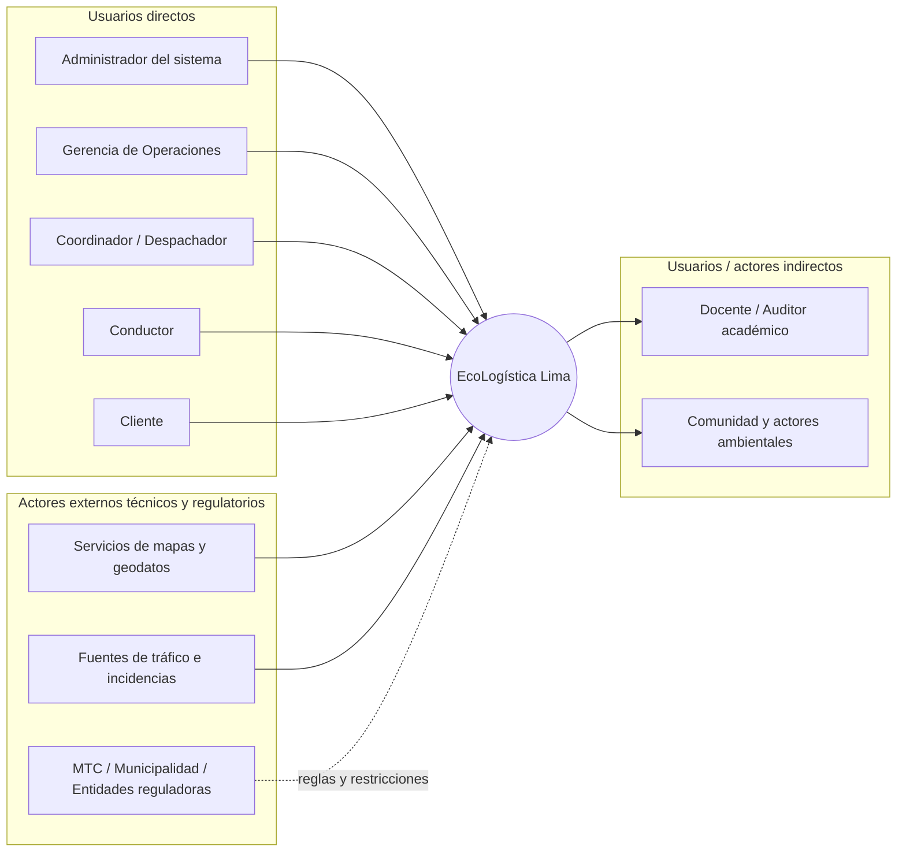
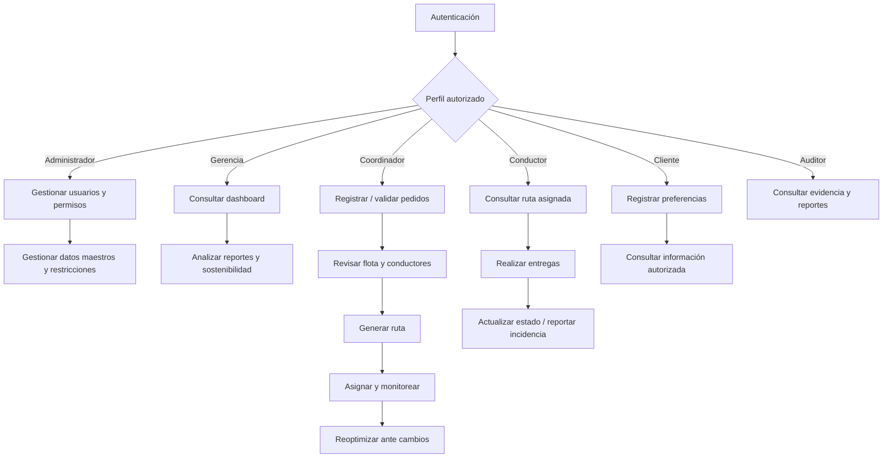
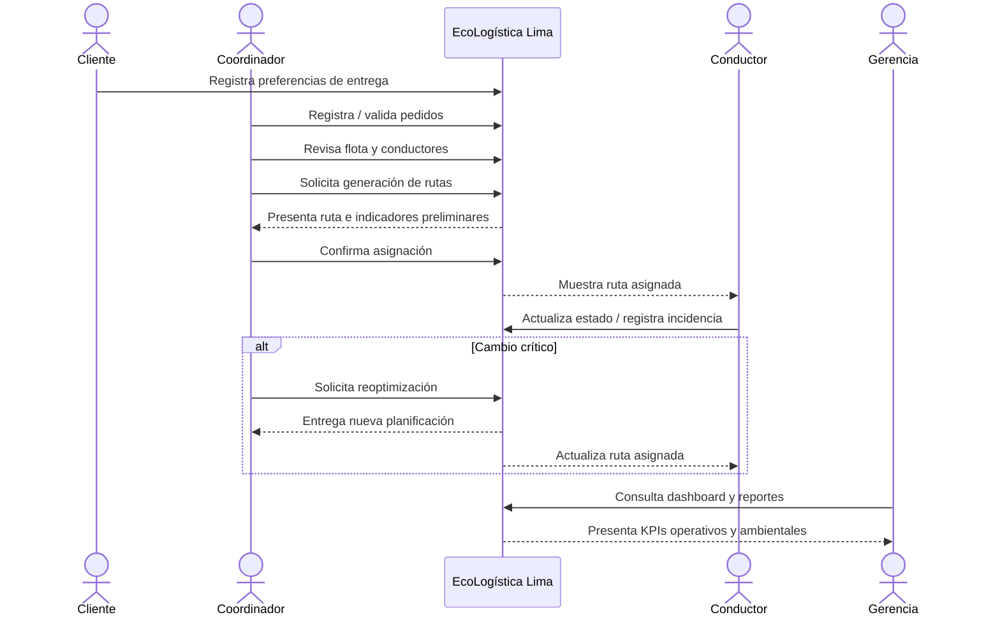
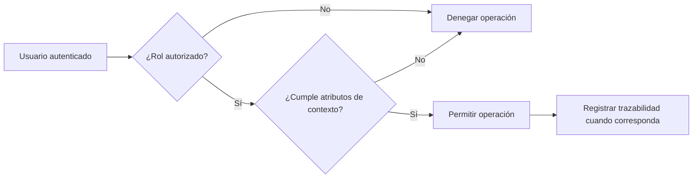
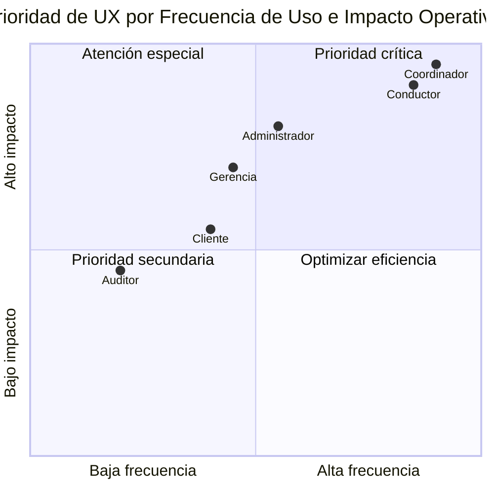

# Identificación y Perfiles de Usuarios

## 1. Metadatos del documento

| Campo | Información |
|---|---|
| Nombre del proyecto | EcoLogística Lima - Optimizador de Rutas Sostenibles para DistriRápido S.A.C. |
| Integrante | Jordy Steve Chancasanampa Torres |
| Fecha | 04/09/2026 |
| Versión | 1.0.0 |
| Estado | Línea base inicial de usuarios, actores y control de acceso |
| Ruta de repositorio | `docs/01 Inicio/08. Usuarios V_1_0_0.md` |

---

## 2. Objetivo del documento

El presente documento identifica, clasifica y caracteriza a los usuarios y actores que participan directa o indirectamente en **EcoLogística Lima**, definiendo sus objetivos, necesidades de información, interacciones principales, restricciones de acceso y relación con las capacidades del sistema.

El documento tiene tres propósitos principales:

1. Definir una **Matriz de Roles y Actores** que permita comprender quién interactúa con el sistema y con qué finalidad.
2. Elaborar **historias de uso resumidas** que representen de forma sintética las interacciones principales de cada perfil.
3. Establecer una **Matriz de Control de Acceso RBAC/ABAC** que limite las operaciones de acuerdo con el rol, el contexto y la relación del usuario con la información.

> **Consideración del caso académico:** DistriRápido S.A.C. es una empresa ficticia. Por ello, los perfiles empresariales definidos en este documento representan roles funcionales del caso y no personas reales. Una misma persona puede asumir más de un rol durante la demostración del MVP, siempre que el sistema mantenga separados los permisos correspondientes.

---

# 3. Fuentes utilizadas para identificar usuarios y actores

| Fuente | Información utilizada |
|---|---|
| Consigna oficial de EcoLogística Lima | Usuarios operativos, gestión de flota, pedidos, conductores, clientes, rutas, reportes y contexto de Lima |
| Acta de constitución | Alcance del MVP, requisitos de alto nivel, responsabilidades y criterios de éxito |
| Declaración de visión | Usuarios objetivo, necesidades principales y valor esperado |
| Registro de interesados | Actores internos, externos, poder/interés y estrategia de participación |
| Registro de supuestos y restricciones | Condiciones de seguridad, accesibilidad, datos y contexto operativo |
| Requisitos funcionales V_1_0_0 | Capacidades RF-001 a RF-018 y necesidad de autenticación/autorización |
| Requisitos no funcionales V_1_0_0 | Seguridad, accesibilidad, usabilidad, disponibilidad y calidad |

---

# 4. Clasificación general de actores

Se distingue entre:

- **Usuarios directos:** utilizan la plataforma para ejecutar actividades operativas o de gestión.
- **Usuarios indirectos:** reciben información, validan resultados o se ven afectados por decisiones del sistema.
- **Actores externos técnicos:** proporcionan información o servicios que alimentan funcionalidades del sistema.
- **Actores regulatorios o de contexto:** condicionan reglas, restricciones o criterios de cumplimiento.

## 4.1. Mapa general de actores

### Lectura del gráfico

El núcleo operativo está compuesto por **Administrador, Gerencia, Coordinador, Conductor y Cliente**.  
Los servicios externos suministran datos para mapas, tráfico o restricciones, mientras que el docente/auditor y otros actores indirectos verifican resultados o reciben evidencia del impacto del proyecto.

---

# 5. Matriz de Roles y Actores

| ID | Perfil / Actor | Tipo | Interacción | Objetivo principal | Información que necesita | Capacidades relacionadas |
|---|---|---|---|---|---|---|
| USR-01 | Administrador del sistema | Interno | Directa | Mantener cuentas, permisos, parámetros y datos maestros bajo control | Usuarios, roles, vehículos, conductores, restricciones, incidencias y trazabilidad | RF-001, RF-002, RF-003, RF-011, RF-012, RF-015, RF-016, RF-017, RF-018 |
| USR-02 | Gerencia de Operaciones | Interno | Directa | Supervisar desempeño operativo, económico y ambiental | KPIs, costos, cumplimiento, emisiones, reportes, resultados de rutas | RF-007, RF-008, RF-009, RF-014, RF-017, RF-018 |
| USR-03 | Coordinador / Despachador logístico | Interno | Directa | Planificar la operación diaria y responder a cambios | Pedidos, vehículos, conductores, restricciones, tráfico, rutas e incidencias | RF-001 a RF-010, RF-011, RF-012, RF-013, RF-015, RF-016, RF-017, RF-018 |
| USR-04 | Conductor de reparto | Interno | Directa | Ejecutar la ruta asignada y reportar novedades | Ruta asignada, secuencia de entregas, puntos de entrega, alertas, incidencias y datos mínimos del pedido | RF-005, RF-007, RF-012, RF-015, RF-017, RF-018 |
| USR-05 | Cliente | Externo | Directa limitada | Registrar preferencias de entrega y consultar información vinculada a su pedido cuando corresponda | Ventana de entrega, punto de referencia, restricciones de acceso y estado autorizado | RF-005, RF-013, RF-017, RF-018 |
| USR-06 | Docente / Auditor académico | Externo | Indirecta / consulta | Verificar cumplimiento, trazabilidad y evidencia del PFA | Requisitos, resultados, reportes, indicadores, pruebas y documentación | RF-008, RF-009 y evidencias documentales |
| ACT-01 | Proveedores de mapas y geodatos | Externo técnico | Sistema a sistema | Proporcionar datos cartográficos o geográficos | Solicitudes de georreferenciación o mapa necesarias para la operación | RF-006, RF-007, RF-010 |
| ACT-02 | Fuentes de tráfico e incidencias | Externo técnico | Sistema a sistema / apoyo manual | Proporcionar condiciones de tránsito que afecten la planificación | Segmentos de vía, congestión, accidentes o incidencias disponibles | RF-006, RF-010, RF-015 |
| ACT-03 | Entidades reguladoras y autoridades | Externo regulatorio | Indirecta | Condicionar el cumplimiento de reglas aplicables | Normas de tránsito, seguridad, datos y restricciones aplicables | RF-006, RF-016 y reglas de negocio |
| ACT-04 | Comunidad y actores ambientales | Externo contextual | Indirecta | Ser considerados en el impacto social y ambiental de las rutas | Indicadores ambientales agregados y consideración de zonas sensibles | RF-008, RF-009, RF-014, RF-016 |

---

# 6. Perfiles detallados de usuarios

## 6.1. USR-01 — Administrador del sistema

| Aspecto | Descripción |
|---|---|
| Propósito | Mantener la configuración operativa y controlar accesos autorizados |
| Nivel de interacción | Alto |
| Conocimiento esperado | Manejo general del sistema y comprensión de datos maestros |
| Necesidades | Gestionar usuarios, roles, vehículos, conductores, restricciones e incidencias |
| Riesgos de uso | Asignación incorrecta de permisos, modificación no autorizada o pérdida de trazabilidad |
| Consideraciones UX | Formularios estructurados, confirmación de operaciones críticas y mensajes explícitos |
| Restricción principal | No debe otorgar permisos superiores a los definidos por la política de acceso sin trazabilidad |

### Historia resumida

**Como** administrador  
**quiero** administrar usuarios, permisos y datos maestros  
**para** mantener la operación controlada y evitar accesos no autorizados.

---

## 6.2. USR-02 — Gerencia de Operaciones

| Aspecto | Descripción |
|---|---|
| Propósito | Supervisar resultados y apoyar decisiones |
| Nivel de interacción | Medio |
| Conocimiento esperado | Interpretación de indicadores operativos y económicos |
| Necesidades | Revisar cumplimiento, distancia, combustible, CO₂, costos y reportes |
| Riesgos de uso | Interpretar indicadores sin conocer su contexto o línea base |
| Consideraciones UX | Dashboard ejecutivo, indicadores resumidos y posibilidad de ampliar detalle |
| Restricción principal | Predominio de consulta; no requiere modificar datos transaccionales de la operación diaria |

### Historia resumida

**Como** responsable de gerencia  
**quiero** consultar indicadores y reportes de la operación  
**para** evaluar si las rutas reducen costos, retrasos y emisiones.

---

## 6.3. USR-03 — Coordinador / Despachador logístico

| Aspecto | Descripción |
|---|---|
| Propósito | Organizar y controlar la operación de reparto |
| Nivel de interacción | Muy alto |
| Conocimiento esperado | Operación logística, pedidos, flota, conductores y restricciones |
| Necesidades | Registrar pedidos, revisar recursos, generar rutas y reoptimizar ante cambios |
| Riesgos de uso | Datos incompletos, rutas inconsistentes o cambios no comunicados |
| Consideraciones UX | Flujo operativo concentrado, alertas visibles y rápida identificación de excepciones |
| Restricción principal | Puede actuar sobre información operativa, pero no administrar permisos globales del sistema |

### Historia resumida

**Como** coordinador logístico  
**quiero** consolidar pedidos, recursos y restricciones y generar rutas  
**para** asignar una planificación viable antes de iniciar el reparto.

---

## 6.4. USR-04 — Conductor de reparto

| Aspecto | Descripción |
|---|---|
| Propósito | Ejecutar la ruta asignada y comunicar incidencias |
| Nivel de interacción | Alto durante la jornada |
| Conocimiento esperado | Uso básico de dispositivos móviles o web y conocimiento de la zona |
| Necesidades | Ver la ruta, entregas pendientes, alertas y datos mínimos para completar cada entrega |
| Riesgos de uso | Sobrecarga de información, distracción, conectividad limitada o interpretación incorrecta |
| Consideraciones UX | Interfaz simplificada, botones e iconos claros, alto contraste y mínima carga cognitiva |
| Restricción principal | Solo debe acceder a información de rutas, pedidos y datos personales necesarios para su asignación |

### Historia resumida

**Como** conductor  
**quiero** visualizar mi ruta asignada y reportar incidencias  
**para** realizar las entregas con menos desvíos y mantener informada a la operación.

---

## 6.5. USR-05 — Cliente

| Aspecto | Descripción |
|---|---|
| Propósito | Comunicar condiciones relevantes de entrega |
| Nivel de interacción | Bajo / puntual |
| Conocimiento esperado | Uso básico de formularios |
| Necesidades | Registrar horario preferido, punto de referencia y restricciones de acceso |
| Riesgos de uso | Datos incompletos o exposición de información que no corresponde al cliente |
| Consideraciones UX | Lenguaje simple, pocos campos y validaciones claras |
| Restricción principal | Acceso limitado a sus propios datos y operaciones autorizadas |

### Historia resumida

**Como** cliente  
**quiero** registrar mis preferencias y referencias de entrega  
**para** facilitar que el pedido llegue dentro de la ventana acordada.

---

## 6.6. USR-06 — Docente / Auditor académico

| Aspecto | Descripción |
|---|---|
| Propósito | Verificar que el PFA cumpla la consigna y mantenga trazabilidad |
| Nivel de interacción | Bajo / revisión |
| Conocimiento esperado | Evaluación académica y técnica |
| Necesidades | Evidencias de requisitos, arquitectura, pruebas, indicadores y entregables |
| Riesgos de uso | Confundir datos simulados del caso con información real |
| Consideraciones UX | Acceso de consulta a evidencia y reportes, cuando el MVP lo incluya |
| Restricción principal | No modifica la operación transaccional |

### Historia resumida

**Como** docente o auditor académico  
**quiero** revisar evidencia trazable del sistema  
**para** verificar el cumplimiento de la consigna y los criterios de evaluación.

---

# 7. Mapa sintético de interacciones por perfil

---

# 8. Historias de uso resumidas

| HU | Perfil | Historia de uso resumida | RF relacionados | Resultado esperado |
|---|---|---|---|---|
| HU-01 | Administrador | Como administrador, quiero autenticar usuarios y asignar permisos autorizados para controlar el acceso al sistema. | RF-017, RF-018 | Acceso condicionado por identidad y perfil |
| HU-02 | Administrador | Como administrador, quiero mantener vehículos, conductores y restricciones para conservar datos operativos consistentes. | RF-001, RF-002, RF-003, RF-011, RF-016 | Catálogos vigentes y utilizables |
| HU-03 | Gerencia | Como gerencia, quiero consultar KPIs de operación y sostenibilidad para evaluar resultados. | RF-008, RF-009, RF-014 | Información consolidada para decisión |
| HU-04 | Coordinador | Como coordinador, quiero registrar pedidos completos para incluirlos en la planificación. | RF-004 | Pedido válido disponible para planificación |
| HU-05 | Coordinador | Como coordinador, quiero conocer disponibilidad de vehículos y conductores para asignar recursos viables. | RF-003, RF-011, RF-012 | Recursos elegibles identificados |
| HU-06 | Coordinador | Como coordinador, quiero generar una ruta considerando pedidos y restricciones para obtener una planificación operativa. | RF-006, RF-016 | Ruta calculada y disponible |
| HU-07 | Coordinador | Como coordinador, quiero reoptimizar una ruta cuando ocurre un cambio para mantener una planificación vigente. | RF-005, RF-010, RF-015 | Nueva ruta calculada |
| HU-08 | Conductor | Como conductor, quiero consultar únicamente la ruta que tengo asignada para ejecutar mis entregas. | RF-007, RF-018 | Vista de ruta y entregas autorizadas |
| HU-09 | Conductor | Como conductor, quiero registrar una incidencia para que la operación considere el cambio. | RF-015 | Incidencia registrada y trazable |
| HU-10 | Conductor | Como conductor, quiero actualizar mi disponibilidad cuando corresponda para evitar asignaciones inviables. | RF-012 | Disponibilidad actualizada |
| HU-11 | Cliente | Como cliente, quiero registrar mis preferencias de entrega para facilitar la atención del pedido. | RF-013 | Preferencias asociadas al cliente |
| HU-12 | Auditor académico | Como auditor, quiero consultar reportes y evidencia para verificar cumplimiento. | RF-008, RF-009 | Evidencia disponible en modo consulta |

---

# 9. Flujo operativo principal entre perfiles

---

# 10. Modelo de Control de Acceso

## 10.1. Enfoque RBAC

El sistema empleará **RBAC (Role-Based Access Control)** como modelo principal de autorización.  
Cada usuario autenticado estará asociado a uno o más perfiles autorizados y cada perfil dispondrá de un conjunto explícito de capacidades.

Principio base:

> **Ningún usuario recibe permisos por defecto fuera de las funciones necesarias para cumplir su rol.**

## 10.2. Complemento ABAC

Para operaciones que requieren mayor contexto, RBAC se complementa conceptualmente con condiciones **ABAC (Attribute-Based Access Control)**.

Ejemplos de atributos:

| Atributo | Ejemplo de regla |
|---|---|
| Identidad | La cuenta debe estar activa y autenticada |
| Rol | El perfil debe tener permiso sobre la acción |
| Propiedad | Un cliente consulta únicamente información vinculada a sus propios registros |
| Asignación | Un conductor accede únicamente a rutas y pedidos que tiene asignados |
| Estado | Un pedido cerrado no admite modificaciones operativas ordinarias |
| Contexto | Una acción puede restringirse si la ruta ya fue cerrada o la jornada no está vigente |
| Sensibilidad | Datos personales se muestran únicamente cuando son necesarios para la operación |
| Alcance | El auditor tiene acceso de consulta, no de modificación |

La decisión de acceso puede resumirse de la siguiente forma:

---

# 11. Leyenda de permisos

| Código | Significado |
|---|---|
| **C** | Crear / registrar |
| **R** | Leer / consultar |
| **U** | Actualizar |
| **D** | Desactivar o eliminar cuando la política lo permita |
| **E** | Ejecutar una operación de negocio |
| **X** | Exportar / descargar |
| **A** | Administrar permisos |
| **Propio** | Solo información perteneciente al usuario |
| **Asignado** | Solo información asignada al usuario |
| **Limitado** | Vista reducida a datos necesarios |
| **—** | Sin acceso |

> La eliminación física de información no se presume como permiso general. Cuando sea necesario retirar un registro operativo, se preferirá desactivación, cambio de estado o archivo conforme a las reglas de negocio que se definan posteriormente.

---

# 12. Matriz de Control de Acceso RBAC / ABAC

| Módulo / Capacidad | Administrador | Gerencia | Coordinador / Despachador | Conductor | Cliente | Auditor académico |
|---|---|---|---|---|---|---|
| Autenticación | E | E | E | E | E | E / según ambiente |
| Usuarios y permisos | C/R/U/D/A | R limitado | — | — | — | R limitado |
| Gestión de flota | C/R/U/D | R | C/R/U | R asignado | — | R |
| Gestión de conductores | C/R/U/D | R | C/R/U | R/U propio limitado | — | R |
| Gestión de pedidos | C/R/U/D | R | C/R/U/D | R asignado / U estado autorizado | R propio limitado | R |
| Preferencias de clientes | C/R/U/D | R | C/R/U | R asignado limitado | C/R/U propio | R |
| Generación de rutas | E/R | R | E/R | — | — | R evidencia |
| Reoptimización | E/R | R | E/R | — | — | R evidencia |
| Visualización de rutas | R | R | R | R asignado | R propio si se habilita | R |
| Dashboard de indicadores | R | R | R | R limitado | — | R |
| Reportes de sostenibilidad | R/X | R/X | R/X | R limitado | — | R/X |
| Compensación de carbono | R/E | R | R/E | — | — | R |
| Registro de incidencias | C/R/U/D | R | C/R/U | C/R propio | — | R |
| Restricciones operativas | C/R/U/D | R | C/R/U | R limitado | — | R |
| Trazabilidad / auditoría | R/X | R resumen | R operativo | R propio cuando aplique | R propio cuando aplique | R/X |
| Configuración global | C/R/U/D | R limitado | — | — | — | R limitado |

---

# 13. Reglas de segregación y mínimo privilegio

## 13.1. Administrador

Puede configurar y mantener información global, pero sus acciones críticas deben conservar trazabilidad.

## 13.2. Gerencia

Opera principalmente en modalidad de **consulta**. Su función es supervisar, no ejecutar la planificación diaria.

## 13.3. Coordinador / Despachador

Posee el mayor nivel de operación transaccional sobre pedidos, recursos y rutas, pero no administra permisos globales.

## 13.4. Conductor

Solo recibe acceso a la información necesaria para ejecutar su trabajo:

- ruta asignada;
- entregas asignadas;
- datos mínimos del punto de entrega;
- estado de las entregas;
- incidencias vinculadas a su recorrido.

No debe consultar datos de otros conductores ni pedidos fuera de su asignación.

## 13.5. Cliente

Solo accede a información propia y a las operaciones específicamente habilitadas para sus preferencias o pedidos.

## 13.6. Auditor académico

Opera en **solo lectura** para evidencias, resultados y documentos relacionados con la evaluación.

---

# 14. Matriz Perfil × Necesidad × Riesgo × Respuesta de diseño

| Perfil | Necesidad crítica | Riesgo principal | Respuesta de diseño prevista |
|---|---|---|---|
| Administrador | Control de acceso y configuración | Permisos excesivos o cambios incorrectos | Confirmaciones, mínimo privilegio y trazabilidad |
| Gerencia | Interpretar resultados | Sobrecarga de detalle | Dashboard resumido y reportes consolidados |
| Coordinador | Actuar rápido ante cambios | Información dispersa o inconsistente | Flujo centralizado de planificación y alertas |
| Conductor | Ruta clara durante la jornada | Distracción, baja alfabetización digital o conectividad | Modo simplificado, alto contraste e información esencial |
| Cliente | Registrar información de entrega | Formularios complejos o exposición de datos | Campos mínimos, lenguaje simple y acceso propio |
| Auditor | Verificar cumplimiento | Alteración accidental de datos | Acceso de consulta y evidencia trazable |

---

# 15. Mapa de prioridad de experiencia de usuario

### Interpretación

Los flujos de **Coordinador** y **Conductor** requieren la mayor atención de usabilidad porque combinan alta frecuencia de interacción con impacto directo sobre la operación. El Administrador también posee acciones de alto impacto, aunque con menor frecuencia. Gerencia, Cliente y Auditor requieren interfaces simplificadas y orientadas a tareas concretas.

---

# 16. Consideraciones de accesibilidad e inclusión por perfil

| Perfil | Consideración |
|---|---|
| Administrador | Formularios consistentes, validaciones visibles y navegación estructurada |
| Gerencia | Lectura clara de KPIs, contraste suficiente y tablas interpretables |
| Coordinador | Priorización visual de alertas, estados y conflictos de planificación |
| Conductor | Iconos grandes, alto contraste, pocas acciones por pantalla y lenguaje comprensible |
| Cliente | Campos mínimos, mensajes claros y tolerancia ante direcciones no estandarizadas |
| Auditor | Navegación documental clara y acceso a evidencia organizada |

Estas consideraciones complementan el requisito de accesibilidad y usabilidad definido para el proyecto y deberán revisarse posteriormente en pruebas de interfaz.

---

# 17. Trazabilidad entre perfiles y requisitos funcionales

| Perfil | Requisitos funcionales principales |
|---|---|
| Administrador | RF-001, RF-002, RF-003, RF-011, RF-012, RF-015, RF-016, RF-017, RF-018 |
| Gerencia | RF-007, RF-008, RF-009, RF-014, RF-017, RF-018 |
| Coordinador / Despachador | RF-001 a RF-018 según permiso operativo, excepto administración global de usuarios |
| Conductor | RF-005, RF-007, RF-012, RF-015, RF-017, RF-018 |
| Cliente | RF-005, RF-013, RF-017, RF-018 |
| Auditor académico | RF-008, RF-009 y evidencias asociadas |
| Servicios externos | RF-006, RF-007, RF-010, RF-015 |
| Reguladores / contexto | RF-006, RF-016 y reglas de negocio |

---

# 18. Criterios de aceptación del modelo de usuarios

El modelo de usuarios se considerará correctamente implementado cuando se verifique que:

1. todos los usuarios autenticados reciben únicamente las capacidades asociadas a su rol;
2. un conductor no puede consultar rutas o pedidos que no le hayan sido asignados;
3. un cliente no puede consultar o modificar información perteneciente a otro cliente;
4. un usuario sin permiso no puede ejecutar funciones administrativas;
5. gerencia puede consultar indicadores sin modificar transacciones operativas;
6. el coordinador puede gestionar la operación sin administrar permisos globales;
7. el auditor puede revisar evidencia sin modificar datos de operación;
8. las pantallas del conductor muestran únicamente información necesaria para su jornada;
9. las operaciones críticas respetan las condiciones de contexto definidas por ABAC cuando corresponda;
10. la autorización se mantiene coherente con RF-017 y RF-018.

---

# 19. Gestión de cambios de perfiles y permisos

Cualquier incorporación o modificación de un perfil deberá:

1. identificar la necesidad que origina el cambio;
2. determinar las capacidades funcionales afectadas;
3. evaluar impacto en seguridad, privacidad y experiencia de usuario;
4. actualizar la matriz RBAC/ABAC;
5. actualizar las historias de uso relacionadas;
6. revisar la trazabilidad con requisitos funcionales y no funcionales;
7. incrementar la versión del documento cuando el cambio sea sustancial;
8. conservar la versión anterior mediante Git.

---

# 20. Conclusión

La identificación de usuarios de **EcoLogística Lima** permite diferenciar con claridad las responsabilidades de administración, supervisión, coordinación, conducción, atención del cliente y evaluación académica.

El modelo propuesto evita tratar a todos los participantes como un único tipo de usuario y establece una separación explícita de capacidades mediante **RBAC**, complementada por reglas contextuales **ABAC** para información propia, rutas asignadas, estados y datos sensibles.

Los diagramas de actores, interacciones, secuencia y prioridad UX muestran de forma visual cómo se relacionan los distintos perfiles con la plataforma. Esta definición servirá como base para las **Reglas de Negocio y Trazabilidad**, el **Stack Tecnológico**, el **Diseño de Base de Datos** y el **Modelo C4** de los siguientes documentos.
