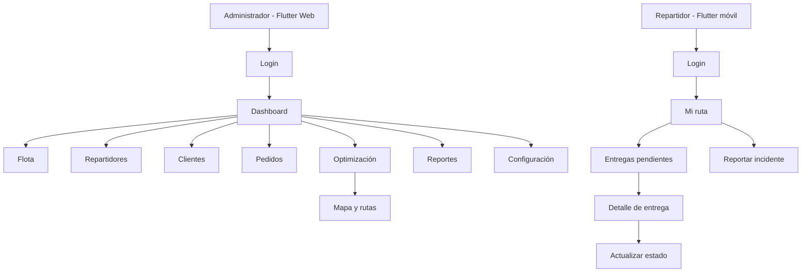

[⌂ README principal](../../README.md) | [← Anterior: 07. Requisitos no funcionales](07.%20Requisitos%20no%20funcionales%20V_1_0_0.md) | [Siguiente: 09. Reglas de negocio →](09.%20Reglas%20de%20negocio%20V_1_0_0.md)

# 08. Identificación y perfiles de usuarios

## 1. Metadatos

| Campo | Valor |
|---|---|
| Proyecto | **EcoLogística Huancayo - Optimizador de Rutas Sostenibles para DistriRápido S.A.C.** |
| Integrante | **Jordy Steve Chancasanampa Torres** |
| Modalidad | Proyecto individual |
| Fecha | **27/09/2026** |
| Versión | **1.0.0** |

> **Cómo leer esta tabla:** resume la identificación y las decisiones base del documento. Permite comprobar que todos los artefactos pertenecen al mismo proyecto, versión e integrante.

## 2. Definición de roles

| Rol | Canal | Objetivo | Acceso |
|---|---|---|---|
| Administrador | Flutter Web | Planificar, administrar y analizar la operación. | Amplio según RBAC. |
| Repartidor | Flutter móvil | Ejecutar la ruta asignada y reportar el estado operativo. | Solo recursos necesarios para su ruta/perfil. |
| Sistema | Backend | Ejecutar reglas, optimización y automatizaciones. | Servicio interno. |

> **Cómo leer esta tabla:** “repartidor” es el rol móvil de ejecución; corresponde al conductor operativo descrito en la consigna. No se define una app independiente para clientes en el MVP.

## 3. Matriz de acceso RBAC

| Capacidad | Administrador Web | Repartidor móvil |
|---|---|---|
| Usuarios/roles | CRUD | Sin acceso |
| Flota | CRUD | Consulta de vehículo asignado |
| Repartidores | CRUD | Perfil propio |
| Clientes | CRUD | Datos mínimos de entrega asignada |
| Pedidos | CRUD | Solo pedidos asignados |
| Optimización | Ejecutar/consultar | Sin acceso |
| Reoptimización | Ejecutar/confirmar | Reporta evento disparador |
| Mapa | Vista global | Ruta propia |
| Dashboard | Completo | Resumen operativo |
| Reportes PDF | Generar/descargar | Sin acceso |
| Incidentes | Gestionar | Crear/consultar propios |
| Auditoría | Lectura autorizada | Sin acceso |

> **Cómo leer esta tabla:** define el límite de permisos por canal. Es referencia para RBAC, pruebas de seguridad y criterios de aceptación.

## 4. Historias de uso resumidas

| Actor | Flujo |
|---|---|
| Administrador | Inicia sesión → gestiona datos → genera rutas → revisa mapa/KPIs → reoptimiza → genera reportes. |
| Repartidor | Inicia sesión → consulta ruta → revisa siguiente entrega → cambia estado → reporta incidente si ocurre. |

> **Cómo leer esta tabla:** muestra el recorrido funcional principal de cada actor y sirve como base para mapa de navegación y mockups Figma.

## 5. Mapa de navegación propuesto

```mermaid
flowchart TD
    A[Administrador - Flutter Web] --> A1[Login]
    A1 --> A2[Dashboard]
    A2 --> A3[Flota]
    A2 --> A4[Repartidores]
    A2 --> A5[Clientes]
    A2 --> A6[Pedidos]
    A2 --> A7[Optimización]
    A7 --> A8[Mapa y rutas]
    A2 --> A9[Reportes]
    A2 --> A10[Configuración]

    R[Repartidor - Flutter móvil] --> R1[Login]
    R1 --> R2[Mi ruta]
    R2 --> R3[Entregas pendientes]
    R3 --> R4[Detalle de entrega]
    R4 --> R5[Actualizar estado]
    R2 --> R6[Reportar incidente]
```

> **Interpretación del diagrama:** existen dos navegaciones independientes. El administrador controla el sistema desde Web; el repartidor solo accede a operación de campo desde móvil.

---

[⌂ README principal](../../README.md) | [← Anterior: 07. Requisitos no funcionales](07.%20Requisitos%20no%20funcionales%20V_1_0_0.md) | [Siguiente: 09. Reglas de negocio →](09.%20Reglas%20de%20negocio%20V_1_0_0.md)
