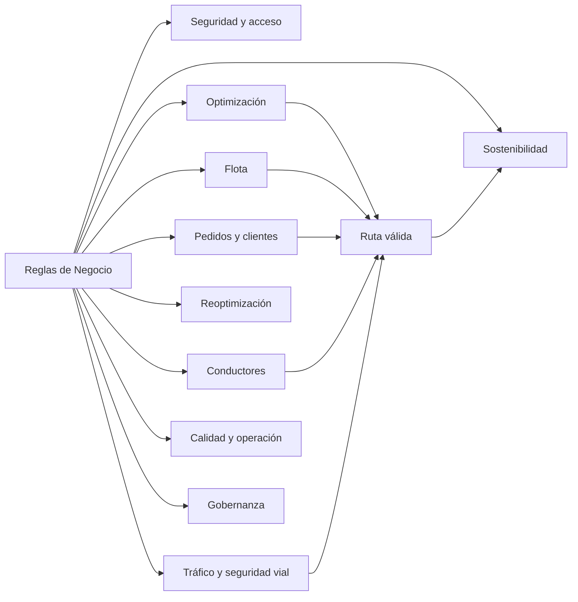
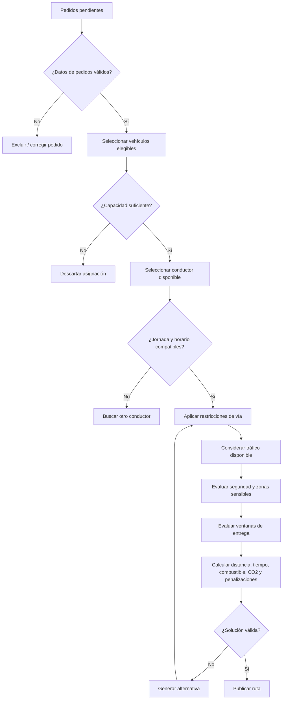
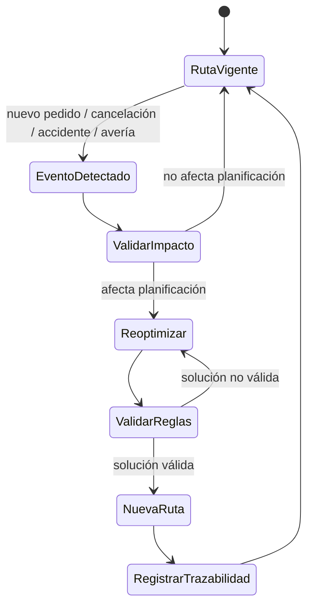
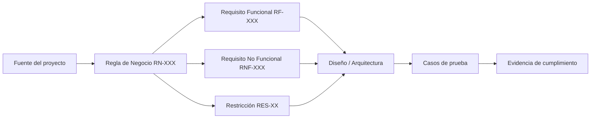
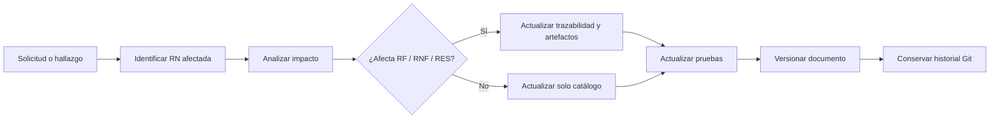

# Reglas de Negocio y Trazabilidad

## 1. Metadatos del documento

| Campo | Información |
|---|---|
| Nombre del proyecto | EcoLogística Lima - Optimizador de Rutas Sostenibles para DistriRápido S.A.C. |
| Integrante | Jordy Steve Chancasanampa Torres |
| Fecha | 04/09/2026 |
| Versión | 1.0.0 |
| Estado | Línea base inicial de reglas de negocio |
| Ruta de repositorio | `docs/01 Inicio/09. Reglas de negocio V_1_0_0.md` |

---

# 2. Objetivo del documento

El presente documento formaliza las **reglas de negocio de EcoLogística Lima** y establece su trazabilidad con los requisitos funcionales, requisitos no funcionales, restricciones y fuentes del proyecto.

Las reglas de negocio expresan políticas, restricciones, condiciones, validaciones y criterios que deben cumplirse durante la gestión de pedidos, flota, conductores, rutas, incidencias, seguridad, sostenibilidad y operación logística.

El documento busca evitar que una condición relevante quede únicamente implícita dentro de un requisito funcional o una restricción. Cada regla se identifica mediante un código único `RN-XXX` y debe poder relacionarse con los artefactos que la implementan y verifican.

---

# 3. Fuentes utilizadas

| Fuente | Aporte al documento |
|---|---|
| Consigna oficial de EcoLogística Lima | RF-01 a RF-10, RNF, restricciones, estándares, condiciones locales y métricas |
| Acta de constitución V_1_0_0 | Alcance, requisitos de alto nivel, objetivos medibles y criterios de éxito |
| Declaración de visión V_1_0_0 | Usuarios objetivo, KPIs y valor esperado |
| Registro de supuestos y restricciones V_1_0_0 | Restricciones técnicas, normativas, económicas y operativas |
| Registro de interesados V_1_0_0 | Roles afectados y necesidades de control |
| Requisitos funcionales V_1_0_0 | RF-001 a RF-018 |
| Requisitos no funcionales V_1_0_0 | RNF-001 a RNF-013 |
| Usuarios V_1_0_0 | Perfiles y matriz RBAC/ABAC |

> **Alcance de la versión 1.0.0:** este documento formaliza únicamente reglas respaldadas por la consigna y los documentos ya aprobados del proyecto. No se introducen políticas comerciales, contables, tributarias o de retención de datos que no hayan sido definidas por las fuentes del caso.

---

# 4. Convenciones de las reglas de negocio

## 4.1. Identificador

Las reglas se codifican con el formato:

`RN-XXX`

Ejemplo:

`RN-001`

## 4.2. Estructura de una regla

Cada regla contiene:

- **Código**
- **Nombre**
- **Categoría**
- **Declaración de la regla**
- **Condición / disparador**
- **Resultado esperado**
- **RF asociado**
- **RNF asociado**
- **Restricción asociada**
- **Fuente**

## 4.3. Categorías

| Categoría | Descripción |
|---|---|
| Seguridad y acceso | Control de identidad, autorización y exposición de información |
| Flota | Condiciones para registrar y utilizar vehículos |
| Pedidos y clientes | Validaciones de pedidos, ventanas y preferencias |
| Conductores | Registro, disponibilidad, jornada y asignación |
| Optimización | Condiciones que gobiernan el cálculo de rutas |
| Reoptimización | Eventos que obligan o permiten recalcular una ruta |
| Tráfico y seguridad vial | Condiciones de tránsito, incidentes y zonas de riesgo |
| Sostenibilidad | Emisiones, combustible, compensación y reportes |
| Calidad y operación | Rendimiento, disponibilidad, accesibilidad y documentación |
| Gobernanza | Trazabilidad, evidencia y cobertura del MVP |

---

# 5. Vista general del dominio de reglas

### Interpretación

Una ruta no se considera válida únicamente porque minimice distancia. Debe cumplir simultáneamente condiciones de pedidos, flota, conductores, restricciones viales, ventanas de tiempo, seguridad y criterios ambientales.

---

# 6. Catálogo de Reglas de Negocio

## RN-001 — Acceso únicamente para usuarios autenticados

| Campo | Definición |
|---|---|
| Categoría | Seguridad y acceso |
| Regla | Toda operación protegida del sistema debe ser ejecutada por un usuario autenticado. |
| Condición | Un usuario intenta ingresar a una capacidad protegida. |
| Resultado | El sistema permite continuar únicamente si la identidad ha sido validada. |
| RF asociado | RF-017 |
| RNF asociado | RNF-003 |
| Restricción | RES-09 |
| Fuente | Requisitos funcionales, RNF de seguridad y matriz de usuarios |

---

## RN-002 — Autorización según perfil

| Campo | Definición |
|---|---|
| Categoría | Seguridad y acceso |
| Regla | Un usuario solo puede ejecutar operaciones incluidas en los permisos de su perfil autorizado. |
| Condición | Usuario autenticado solicita una operación. |
| Resultado | La operación se permite o deniega según el rol y condiciones de acceso. |
| RF asociado | RF-018 |
| RNF asociado | RNF-003, RNF-004 |
| Restricción | RES-09 |
| Fuente | Usuarios V_1_0_0 y Requisitos funcionales V_1_0_0 |

---

## RN-003 — Acceso del conductor limitado a información asignada

| Campo | Definición |
|---|---|
| Categoría | Seguridad y acceso |
| Regla | El conductor solo puede consultar rutas, pedidos e información necesaria que estén asociados a su asignación operativa. |
| Condición | El conductor solicita consultar información de una ruta o pedido. |
| Resultado | Se muestra únicamente información vinculada a su asignación. |
| RF asociado | RF-007, RF-018 |
| RNF asociado | RNF-003, RNF-004, RNF-007 |
| Restricción | RES-09 |
| Fuente | Usuarios V_1_0_0 y consigna |

---

## RN-004 — Acceso del cliente limitado a información propia

| Campo | Definición |
|---|---|
| Categoría | Seguridad y acceso |
| Regla | Un cliente no debe consultar ni modificar información perteneciente a otro cliente. |
| Condición | Cliente solicita consultar o modificar una preferencia o información autorizada. |
| Resultado | Se permite la operación únicamente sobre registros asociados al propio cliente. |
| RF asociado | RF-013, RF-018 |
| RNF asociado | RNF-003, RNF-004 |
| Restricción | RES-09 |
| Fuente | Usuarios V_1_0_0 |

---

## RN-005 — Registro obligatorio de datos mínimos del vehículo

| Campo | Definición |
|---|---|
| Categoría | Flota |
| Regla | Todo vehículo debe registrar placa, tipo, capacidad de carga, consumo de combustible, factor de emisión de CO₂ y año de fabricación. |
| Condición | Se registra un nuevo vehículo. |
| Resultado | El vehículo solo se acepta si dispone de los datos mínimos requeridos. |
| RF asociado | RF-001 |
| RNF asociado | RNF-013 |
| Restricción | RES-12 |
| Fuente | RF-01 de la consigna |

---

## RN-006 — Elegibilidad operativa del vehículo

| Campo | Definición |
|---|---|
| Categoría | Flota |
| Regla | Un vehículo solo puede ser considerado para una ruta cuando su estado operativo y las restricciones aplicables permitan su utilización. |
| Condición | El sistema prepara recursos para generar una ruta. |
| Resultado | Los vehículos no elegibles quedan fuera del conjunto de asignación. |
| RF asociado | RF-003, RF-006, RF-016 |
| RNF asociado | RNF-001, RNF-013 |
| Restricción | RES-05, RES-11 |
| Fuente | Requisitos funcionales y restricciones del proyecto |

---

## RN-007 — Registro obligatorio de datos mínimos del pedido

| Campo | Definición |
|---|---|
| Categoría | Pedidos y clientes |
| Regla | Todo pedido debe contener identificación de cliente, ubicación de entrega, peso, volumen, ventana de entrega, prioridad y tipo de producto. |
| Condición | Se registra un pedido. |
| Resultado | El pedido solo puede incorporarse a la planificación cuando cumple los datos obligatorios. |
| RF asociado | RF-004 |
| RNF asociado | RNF-013 |
| Restricción | RES-08 |
| Fuente | RF-02 de la consigna y SUP-06 |

---

## RN-008 — Uso de punto de referencia para direcciones no estandarizadas

| Campo | Definición |
|---|---|
| Categoría | Pedidos y clientes |
| Regla | Cuando una dirección de entrega no pueda representarse suficientemente mediante nomenclatura convencional, el pedido puede incorporar un punto de referencia complementario. |
| Condición | Se registra una dirección no estandarizada. |
| Resultado | El sistema admite una referencia adicional asociada al pedido. |
| RF asociado | RF-004, RF-013 |
| RNF asociado | RNF-007 |
| Restricción | RES-08 |
| Fuente | Condición local de RF-02 |

---

## RN-009 — Validez de la ventana de entrega

| Campo | Definición |
|---|---|
| Categoría | Pedidos y clientes |
| Regla | La hora de inicio de una ventana de entrega debe ser anterior a su hora de fin. |
| Condición | Se registra o modifica una ventana de tiempo. |
| Resultado | El sistema rechaza ventanas inconsistentes. |
| RF asociado | RF-004, RF-013 |
| RNF asociado | RNF-013 |
| Restricción | Relacionada con restricciones operativas |
| Fuente | Requisito de ventana de tiempo de la consigna, formalizado para validación |

---

## RN-010 — Prioridades permitidas de pedido

| Campo | Definición |
|---|---|
| Categoría | Pedidos y clientes |
| Regla | La prioridad de un pedido debe corresponder a una de las categorías definidas por la consigna: `express`, `estándar` o `económico`. |
| Condición | Se registra o actualiza un pedido. |
| Resultado | El sistema almacena únicamente una prioridad válida. |
| RF asociado | RF-004 |
| RNF asociado | RNF-013 |
| Restricción | — |
| Fuente | RF-02 de la consigna |

---

## RN-011 — Tipos de producto permitidos

| Campo | Definición |
|---|---|
| Categoría | Pedidos y clientes |
| Regla | El tipo de producto debe corresponder como mínimo a las categorías `perecedero` o `no perecedero` definidas por la consigna. |
| Condición | Se registra o actualiza un pedido. |
| Resultado | El sistema valida el tipo antes de incorporar el pedido a planificación. |
| RF asociado | RF-004 |
| RNF asociado | RNF-013 |
| Restricción | — |
| Fuente | RF-02 de la consigna |

---

## RN-012 — Registro mínimo del conductor

| Campo | Definición |
|---|---|
| Categoría | Conductores |
| Regla | Todo conductor debe registrar nombre, DNI, licencia de conducir, años de experiencia, disponibilidad horaria y número de contacto. |
| Condición | Se registra un conductor. |
| Resultado | El conductor queda disponible en el catálogo únicamente si posee la información mínima requerida. |
| RF asociado | RF-011 |
| RNF asociado | RNF-004, RNF-013 |
| Restricción | RES-09 |
| Fuente | RF-08 de la consigna |

---

## RN-013 — Asignación condicionada por disponibilidad del conductor

| Campo | Definición |
|---|---|
| Categoría | Conductores |
| Regla | Un conductor solo puede ser asignado a una ruta cuando su disponibilidad horaria sea compatible con la operación planificada. |
| Condición | Se prepara una asignación de ruta. |
| Resultado | Conductores no disponibles quedan excluidos de la asignación. |
| RF asociado | RF-012, RF-006 |
| RNF asociado | RNF-001, RNF-013 |
| Restricción | RES-11 |
| Fuente | RF-08 y documentos de requisitos |

---

## RN-014 — Respeto de jornada y descansos del conductor

| Campo | Definición |
|---|---|
| Categoría | Conductores |
| Regla | La planificación debe respetar las condiciones de jornada y descanso indicadas en la consigna: máximo de 8 horas de conducción y descanso de 1 hora por cada 4 horas. |
| Condición | Se calcula o valida una ruta asignada a un conductor. |
| Resultado | Las rutas que incumplen la condición deben ser descartadas o ajustadas. |
| RF asociado | RF-006, RF-012, RF-016 |
| RNF asociado | RNF-001, RNF-013 |
| Restricción | RES-04 / RES-11 |
| Fuente | RF-03, RF-08 y RES-04 de la consigna |

---

## RN-015 — Restricción de capacidad vehicular

| Campo | Definición |
|---|---|
| Categoría | Optimización |
| Regla | La carga asignada a un vehículo no debe exceder la capacidad de carga registrada para dicho vehículo. |
| Condición | Se calcula una asignación de pedidos a vehículos. |
| Resultado | Una solución que exceda la capacidad se considera no válida. |
| RF asociado | RF-001, RF-004, RF-006 |
| RNF asociado | RNF-001, RNF-013 |
| Restricción | RES-05 |
| Fuente | Gestión de flota, pedidos y VRP de la consigna |

---

## RN-016 — Cumplimiento de ventanas de tiempo

| Campo | Definición |
|---|---|
| Categoría | Optimización |
| Regla | La planificación debe considerar las ventanas de entrega y penalizar o evitar incumplimientos según el modelo de optimización definido. |
| Condición | Se genera una ruta para pedidos con ventanas de tiempo. |
| Resultado | La solución registra y minimiza incumplimientos de ventanas. |
| RF asociado | RF-004, RF-006 |
| RNF asociado | RNF-001 |
| Restricción | RES-05 |
| Fuente | VRPTW y RF-03 de la consigna |

---

## RN-017 — Criterios de optimización obligatorios

| Campo | Definición |
|---|---|
| Categoría | Optimización |
| Regla | El cálculo de rutas debe considerar distancia total, tiempo total, consumo de combustible, emisiones de CO₂ y penalizaciones por entregas tardías. |
| Condición | Se ejecuta la generación de rutas. |
| Resultado | La función de evaluación considera los criterios definidos por el caso. |
| RF asociado | RF-006 |
| RNF asociado | RNF-001 |
| Restricción | RES-05, RES-12 |
| Fuente | RF-03 de la consigna |

---

## RN-018 — Aplicación de restricciones operativas de vía

| Campo | Definición |
|---|---|
| Categoría | Optimización |
| Regla | Las restricciones viales, ambientales, de infraestructura y de seguridad registradas deben ser consideradas antes de aceptar una ruta como válida. |
| Condición | Se genera o reoptimiza una ruta. |
| Resultado | Los tramos incompatibles con restricciones activas no se aceptan en la solución final. |
| RF asociado | RF-006, RF-010, RF-016 |
| RNF asociado | RNF-001, RNF-002, RNF-013 |
| Restricción | RES-11 |
| Fuente | RES-03, RES-04, RES-10, RES-11 y RES-12 de la consigna |

---

## RN-019 — Consideración de tráfico en la planificación

| Campo | Definición |
|---|---|
| Categoría | Tráfico y seguridad vial |
| Regla | Cuando exista información de tráfico disponible, esta debe ser considerada en la generación o actualización de las rutas. |
| Condición | Existe información de tráfico vigente para tramos relevantes. |
| Resultado | Los tiempos y decisiones de ruta consideran dicha condición. |
| RF asociado | RF-006, RF-010 |
| RNF asociado | RNF-001, RNF-002 |
| Restricción | RES-08 |
| Fuente | RF-03, RF-07 y RES-09 de la consigna |

---

## RN-020 — Contingencia ante ausencia de datos externos

| Campo | Definición |
|---|---|
| Categoría | Tráfico y seguridad vial |
| Regla | La ausencia o imprecisión de datos externos de tráfico no debe impedir la validación académica del sistema; se debe permitir utilizar datos simulados o carga manual según el alcance del proyecto. |
| Condición | La fuente externa no está disponible o no entrega datos suficientes. |
| Resultado | La operación de prueba continúa mediante la estrategia de contingencia definida. |
| RF asociado | RF-015, RF-016 |
| RNF asociado | RNF-008, RNF-009 |
| Restricción | RES-08, RES-14 |
| Fuente | Registro de supuestos y restricciones |

---

## RN-021 — Priorización de vías seguras

| Campo | Definición |
|---|---|
| Categoría | Tráfico y seguridad vial |
| Regla | La planificación debe considerar información registrada de zonas de alto riesgo de robo o accidente y evitar dichos tramos cuando exista una alternativa válida. |
| Condición | Una ruta candidata atraviesa una zona marcada como de riesgo. |
| Resultado | El sistema penaliza, descarta o propone una alternativa conforme a la restricción configurada. |
| RF asociado | RF-006, RF-016 |
| RNF asociado | RNF-001, RNF-013 |
| Restricción | RES-10 / RES-11 |
| Fuente | RF-04 y RES-10 de la consigna |

---

## RN-022 — Protección de zonas ambientales y sensibles

| Campo | Definición |
|---|---|
| Categoría | Tráfico y seguridad vial |
| Regla | Las rutas deben considerar restricciones sobre áreas de reserva ecológica, colegios, hospitales, parques zonales y demás zonas sensibles registradas para el escenario. |
| Condición | Una ruta candidata cruza una zona sensible con una restricción activa. |
| Resultado | La ruta debe ajustarse o descartarse según la regla configurada. |
| RF asociado | RF-006, RF-016 |
| RNF asociado | RNF-013 |
| Restricción | RES-03, RES-11 |
| Fuente | Restricciones ambientales de la consigna |

---

## RN-023 — Reoptimización por evento operativo

| Campo | Definición |
|---|---|
| Categoría | Reoptimización |
| Regla | La ruta puede ser recalculada ante nuevos pedidos, cancelaciones, accidentes de tránsito o averías de vehículos. |
| Condición | Se registra alguno de los eventos definidos y existe una ruta vigente afectada. |
| Resultado | El sistema genera una nueva planificación para los elementos afectados. |
| RF asociado | RF-005, RF-010, RF-015 |
| RNF asociado | RNF-002 |
| Restricción | RES-06 |
| Fuente | RF-07 de la consigna |

---

## RN-024 — Conservación de consistencia durante la reoptimización

| Campo | Definición |
|---|---|
| Categoría | Reoptimización |
| Regla | Una reoptimización no debe eliminar la trazabilidad entre pedidos, vehículos, conductores, incidencias y la nueva ruta generada. |
| Condición | Se reemplaza una planificación por una versión reoptimizada. |
| Resultado | La nueva ruta mantiene relación con el evento que causó el cambio y con los recursos afectados. |
| RF asociado | RF-010, RF-015 |
| RNF asociado | RNF-013 |
| Restricción | RES-13 |
| Fuente | Principios de trazabilidad del proyecto |

---

## RN-025 — Indicadores mínimos del dashboard

| Campo | Definición |
|---|---|
| Categoría | Sostenibilidad |
| Regla | El dashboard debe mostrar como mínimo distancia total, emisiones de CO₂, combustible ahorrado, cumplimiento de ventanas de tiempo, ahorro comparado con ruta secuencial y un equivalente ambiental cuando corresponda. |
| Condición | Usuario autorizado consulta el dashboard. |
| Resultado | Los indicadores definidos se presentan con los datos disponibles. |
| RF asociado | RF-008 |
| RNF asociado | RNF-007, RNF-012 |
| Restricción | RES-12 |
| Fuente | RF-05 de la consigna |

---

## RN-026 — Reporte mínimo de sostenibilidad

| Campo | Definición |
|---|---|
| Categoría | Sostenibilidad |
| Regla | El reporte de sostenibilidad debe incluir emisiones de CO₂ por ruta, costo del ciclo de vida de la flota, ahorro relacionado con carbono cuando esté disponible y cumplimiento de metas ambientales definidas en el caso. |
| Condición | Usuario autorizado genera un reporte. |
| Resultado | Se produce un reporte con los componentes exigidos por la consigna. |
| RF asociado | RF-009 |
| RNF asociado | RNF-010, RNF-013 |
| Restricción | RES-01, RES-02, RES-12 |
| Fuente | RF-06 de la consigna |

---

## RN-027 — Componentes del costo del ciclo de vida

| Campo | Definición |
|---|---|
| Categoría | Sostenibilidad |
| Regla | El análisis de costo del ciclo de vida debe considerar, según los datos definidos por el caso, adquisición, combustible, mantenimiento, seguros, depreciación y costos de operación. |
| Condición | Se calcula o presenta el TCO de la flota. |
| Resultado | El valor se obtiene a partir de los componentes definidos para el escenario. |
| RF asociado | RF-008, RF-009 |
| RNF asociado | RNF-013 |
| Restricción | RES-01 |
| Fuente | RES-01 y RF-06 de la consigna |

---

## RN-028 — Cálculo de emisiones de CO₂

| Campo | Definición |
|---|---|
| Categoría | Sostenibilidad |
| Regla | El cálculo de emisiones debe utilizar la distancia recorrida y el factor de emisión configurado para el vehículo, de acuerdo con los datos disponibles del caso. |
| Condición | Se calculan indicadores ambientales de una ruta. |
| Resultado | Se obtiene una estimación trazable de CO₂ por ruta o vehículo. |
| RF asociado | RF-001, RF-006, RF-008, RF-009, RF-014 |
| RNF asociado | RNF-013 |
| Restricción | RES-12 |
| Fuente | SUP-12, RF-01, RF-05, RF-06 y RF-10 |

---

## RN-029 — Propuesta de compensación de carbono

| Campo | Definición |
|---|---|
| Categoría | Sostenibilidad |
| Regla | A partir de las emisiones estimadas, el sistema debe poder calcular una propuesta de compensación expresada mediante equivalentes ambientales o número estimado de árboles cuando el factor correspondiente esté configurado. |
| Condición | Usuario autorizado solicita la propuesta de compensación. |
| Resultado | El sistema presenta una estimación vinculada al CO₂ calculado. |
| RF asociado | RF-014 |
| RNF asociado | RNF-013 |
| Restricción | RES-02, RES-12 |
| Fuente | RF-10 y RES-02 de la consigna |

---

## RN-030 — Meta de carbono neutral del caso

| Campo | Definición |
|---|---|
| Categoría | Sostenibilidad |
| Regla | Los reportes y propuestas ambientales deben poder evaluarse respecto del horizonte de 3 años de carbono neutral definido por la consigna. |
| Condición | Se analiza el plan de sostenibilidad. |
| Resultado | Los indicadores pueden compararse con la meta temporal definida en el caso. |
| RF asociado | RF-009, RF-014 |
| RNF asociado | RNF-013 |
| Restricción | RES-02 |
| Fuente | RES-02 de la consigna |

---

## RN-031 — Rendimiento máximo de generación de rutas

| Campo | Definición |
|---|---|
| Categoría | Calidad y operación |
| Regla | La generación de una solución válida para hasta 150 pedidos y 15 vehículos debe completarse en un máximo de 45 segundos. |
| Condición | Se ejecuta una prueba en el escenario objetivo. |
| Resultado | La solución se considera conforme si el tiempo es `≤ 45 s`. |
| RF asociado | RF-006 |
| RNF asociado | RNF-001 |
| Restricción | RES-05 |
| Fuente | RNF-01 de la consigna |

---

## RN-032 — Rendimiento máximo de reoptimización

| Campo | Definición |
|---|---|
| Categoría | Calidad y operación |
| Regla | La reoptimización ante cambios críticos debe completarse en menos de 30 segundos. |
| Condición | Existe una ruta vigente afectada por un evento crítico. |
| Resultado | La respuesta se considera conforme si el tiempo es `< 30 s`. |
| RF asociado | RF-010 |
| RNF asociado | RNF-002 |
| Restricción | RES-06 |
| Fuente | RNF-01 de la consigna |

---

## RN-033 — Disponibilidad durante horario operativo

| Campo | Definición |
|---|---|
| Categoría | Calidad y operación |
| Regla | El objetivo de disponibilidad del sistema es 99.5 % dentro del horario operativo definido de 05:00 a 22:00. |
| Condición | Se mide disponibilidad durante el periodo operativo. |
| Resultado | La conformidad se alcanza con disponibilidad `≥ 99.5 %`. |
| RF asociado | RF-017 y flujos críticos |
| RNF asociado | RNF-008 |
| Restricción | RES-08 |
| Fuente | RNF-06 de la consigna |

---

## RN-034 — Accesibilidad de flujos críticos

| Campo | Definición |
|---|---|
| Categoría | Calidad y operación |
| Regla | Los flujos críticos de interfaz deben considerar WCAG 2.1 nivel AA y las necesidades de usuarios con diferentes niveles de alfabetización digital. |
| Condición | Se diseña o valida una interfaz crítica. |
| Resultado | Los criterios aplicables deben ser verificados antes de aprobar la funcionalidad. |
| RF asociado | RF-007, RF-008, RF-013 |
| RNF asociado | RNF-005, RNF-007 |
| Restricción | RES-10 |
| Fuente | RNF-03, RNF-05 y WCAG 2.1 de la consigna |

---

## RN-035 — Modo de información simplificada para conductor

| Campo | Definición |
|---|---|
| Categoría | Calidad y operación |
| Regla | La vista del conductor debe priorizar ruta asignada, entregas pendientes y alertas relevantes, evitando información administrativa innecesaria. |
| Condición | Un conductor ingresa al sistema. |
| Resultado | Se presenta una vista restringida y orientada a ejecución de ruta. |
| RF asociado | RF-007, RF-015, RF-018 |
| RNF asociado | RNF-005, RNF-007, RNF-009 |
| Restricción | RES-10 |
| Fuente | RNF-05 y condiciones de accesibilidad de la consigna |

---

## RN-036 — Cobertura funcional mínima del MVP

| Campo | Definición |
|---|---|
| Categoría | Gobernanza |
| Regla | El MVP debe implementar y demostrar al menos el 70 % de los requerimientos funcionales RF-01 a RF-07 definidos en la consigna. |
| Condición | Se evalúa la versión final del MVP. |
| Resultado | La cobertura demostrada debe ser `≥ 70 %`. |
| RF asociado | RF-001 a RF-010 según correspondencia con RF-01 a RF-07 |
| RNF asociado | RNF-011 |
| Restricción | RES-02, RES-03 |
| Fuente | Entregables de la consigna y Acta de constitución |

---

## RN-037 — Documentación obligatoria

| Campo | Definición |
|---|---|
| Categoría | Gobernanza |
| Regla | El proyecto debe mantener documentados el proceso de desarrollo, arquitectura, manual de usuario, manual de administrador, API y pruebas exigidas por el alcance académico. |
| Condición | Se realiza una revisión de entregables o cierre de iteración. |
| Resultado | Los artefactos obligatorios deben encontrarse disponibles y versionados. |
| RF asociado | Transversal |
| RNF asociado | RNF-010, RNF-013 |
| Restricción | RES-13 |
| Fuente | RNF-07 y sección de entregables de la consigna |

---

## RN-038 — Trazabilidad obligatoria

| Campo | Definición |
|---|---|
| Categoría | Gobernanza |
| Regla | Toda regla de negocio vigente debe mantener relación verificable con su fuente y, cuando corresponda, con los requisitos funcionales, no funcionales y pruebas que la implementan. |
| Condición | Se crea, modifica o valida una regla. |
| Resultado | La regla dispone de relaciones de trazabilidad actualizadas. |
| RF asociado | Transversal |
| RNF asociado | RNF-013 |
| Restricción | RES-13 |
| Fuente | Gobernanza y trazabilidad definidas en los documentos de inicio |

---

# 7. Matriz de Trazabilidad Cruzada

| Código RN | Regla de Negocio | RF asociado | RNF asociado | Restricción / Fuente principal |
|---|---|---|---|---|
| RN-001 | Acceso únicamente para usuarios autenticados | RF-017 | RNF-003 | RES-09 |
| RN-002 | Autorización según perfil | RF-018 | RNF-003, RNF-004 | RES-09 |
| RN-003 | Conductor: solo información asignada | RF-007, RF-018 | RNF-003, RNF-004, RNF-007 | RES-09 |
| RN-004 | Cliente: solo información propia | RF-013, RF-018 | RNF-003, RNF-004 | Usuarios V_1_0_0 |
| RN-005 | Datos mínimos del vehículo | RF-001 | RNF-013 | RF-01 |
| RN-006 | Elegibilidad del vehículo | RF-003, RF-006, RF-016 | RNF-001, RNF-013 | RES-11 |
| RN-007 | Datos mínimos del pedido | RF-004 | RNF-013 | RF-02 / SUP-06 |
| RN-008 | Punto de referencia complementario | RF-004, RF-013 | RNF-007 | Condición local RF-02 |
| RN-009 | Validez de ventana de entrega | RF-004, RF-013 | RNF-013 | VRPTW |
| RN-010 | Prioridades de pedido | RF-004 | RNF-013 | RF-02 |
| RN-011 | Tipo de producto | RF-004 | RNF-013 | RF-02 |
| RN-012 | Datos mínimos del conductor | RF-011 | RNF-004, RNF-013 | RF-08 |
| RN-013 | Disponibilidad del conductor | RF-012, RF-006 | RNF-001, RNF-013 | RF-08 |
| RN-014 | Jornada y descansos | RF-006, RF-012, RF-016 | RNF-001, RNF-013 | RES-04 |
| RN-015 | Capacidad vehicular | RF-001, RF-004, RF-006 | RNF-001, RNF-013 | VRP |
| RN-016 | Ventanas de tiempo | RF-004, RF-006 | RNF-001 | VRPTW |
| RN-017 | Criterios de optimización | RF-006 | RNF-001 | RF-03 |
| RN-018 | Restricciones operativas de vía | RF-006, RF-010, RF-016 | RNF-001, RNF-002, RNF-013 | RES-03/04/10/11/12 |
| RN-019 | Consideración de tráfico | RF-006, RF-010 | RNF-001, RNF-002 | RES-08 |
| RN-020 | Contingencia de datos externos | RF-015, RF-016 | RNF-008, RNF-009 | RES-08, RES-14 |
| RN-021 | Priorización de vías seguras | RF-006, RF-016 | RNF-001, RNF-013 | RES-10 |
| RN-022 | Zonas ambientales y sensibles | RF-006, RF-016 | RNF-013 | RES-03 |
| RN-023 | Eventos de reoptimización | RF-005, RF-010, RF-015 | RNF-002 | RF-07 |
| RN-024 | Consistencia de reoptimización | RF-010, RF-015 | RNF-013 | Trazabilidad |
| RN-025 | Indicadores mínimos | RF-008 | RNF-007, RNF-012 | RF-05 |
| RN-026 | Reporte de sostenibilidad | RF-009 | RNF-010, RNF-013 | RF-06 |
| RN-027 | Componentes del TCO | RF-008, RF-009 | RNF-013 | RES-01 |
| RN-028 | Cálculo de CO₂ | RF-001, RF-006, RF-008, RF-009, RF-014 | RNF-013 | SUP-12 |
| RN-029 | Compensación de carbono | RF-014 | RNF-013 | RF-10 / RES-02 |
| RN-030 | Horizonte carbono neutral | RF-009, RF-014 | RNF-013 | RES-02 |
| RN-031 | Generación ≤ 45 s | RF-006 | RNF-001 | RNF-01 |
| RN-032 | Reoptimización < 30 s | RF-010 | RNF-002 | RNF-01 |
| RN-033 | Disponibilidad ≥ 99.5 % | RF-017 / flujos críticos | RNF-008 | RNF-06 |
| RN-034 | WCAG 2.1 AA | RF-007, RF-008, RF-013 | RNF-005, RNF-007 | RES-10 |
| RN-035 | Vista simplificada del conductor | RF-007, RF-015, RF-018 | RNF-005, RNF-007, RNF-009 | RNF-05 |
| RN-036 | Cobertura MVP ≥ 70 % | RF-001 a RF-010 según correspondencia | RNF-011 | Entregables |
| RN-037 | Documentación obligatoria | Transversal | RNF-010, RNF-013 | RES-13 |
| RN-038 | Trazabilidad obligatoria | Transversal | RNF-013 | Gobernanza |

---

# 8. Flujo de validación de una ruta

---

# 9. Flujo de reoptimización

---

# 10. Trazabilidad por capas

Este modelo permitirá que una regla pueda seguirse desde su origen hasta la evidencia de prueba correspondiente.

---

# 11. Priorización de reglas

| Prioridad | Criterio | Reglas principales |
|---|---|---|
| Crítica | Su incumplimiento invalida seguridad, ruta o criterio obligatorio del MVP | RN-001, RN-002, RN-006, RN-007, RN-014, RN-015, RN-016, RN-018, RN-023, RN-031, RN-032, RN-036 |
| Alta | Impacta directamente operación, seguridad vial, sostenibilidad o calidad | RN-003, RN-004, RN-005, RN-012, RN-013, RN-017, RN-019, RN-021, RN-022, RN-025, RN-026, RN-028, RN-033, RN-034, RN-035, RN-037, RN-038 |
| Media | Complementa operación o análisis del caso | RN-008, RN-009, RN-010, RN-011, RN-020, RN-024, RN-027, RN-029, RN-030 |

---

# 12. Criterios de aceptación del catálogo de reglas

El catálogo se considera consistente cuando:

1. cada regla dispone de un identificador único;
2. cada regla expresa una sola condición o política principal;
3. las reglas no contradicen los RF, RNF y restricciones vigentes;
4. cada regla crítica tiene al menos un RF, RNF, restricción o evidencia asociada;
5. las reglas de acceso son consistentes con la matriz RBAC/ABAC;
6. las reglas de optimización permiten determinar cuándo una solución es válida o inválida;
7. las reglas de reoptimización identifican eventos que modifican la planificación;
8. las reglas ambientales utilizan indicadores trazables;
9. las reglas de calidad conservan las métricas definidas por la consigna;
10. cualquier cambio sustancial actualiza la matriz de trazabilidad.

---

# 13. Gestión de cambios

Cuando una regla de negocio cambie se seguirá el siguiente procedimiento:

Un cambio sustancial que modifique reglas críticas, alcance, criterios de aceptación o decisiones de diseño deberá incrementar la versión del documento conforme al esquema de versionamiento del proyecto.

---

# 14. Conclusión

El catálogo de reglas de negocio formaliza las condiciones que gobiernan **EcoLogística Lima** y evita que las restricciones del caso queden dispersas entre requisitos, supuestos y documentos de gestión.

Las 38 reglas establecidas cubren control de acceso, flota, pedidos, conductores, generación de rutas, reoptimización, tráfico, seguridad vial, sostenibilidad, calidad y gobernanza.

La matriz de trazabilidad relaciona cada regla con los requisitos funcionales `RF-001` a `RF-018`, los requisitos no funcionales `RNF-001` a `RNF-013` y las restricciones que corresponden. De esta forma, el documento constituye una base directa para el **Stack Tecnológico**, el **Diseño de Base de Datos**, el **Modelo C4** y posteriormente los casos de prueba del MVP.
