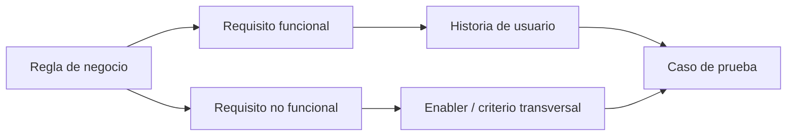

# 09. Reglas de negocio y trazabilidad

## 1. Metadatos

| Campo | Valor |
|---|---|
| Proyecto | **EcoLogística Huancayo - Optimizador de Rutas Sostenibles para DistriRápido S.A.C.** |
| Integrante | **Jordy Steve Chancasanampa Torres** |
| Fecha | **27/09/2026** |
| Versión | **1.0.0** |

## 2. Reglas de negocio

| Código | Descripción | RF asociado | RNF asociado |
|---|---|---|---|
| RN-001 | La placa de un vehículo debe ser única en el sistema. | RF-01 | RNF-02 |
| RN-002 | La capacidad utilizada de un vehículo no puede superar su capacidad de carga configurada. | RF-01, RF-03 | RNF-01 |
| RN-003 | Todo pedido debe tener una ventana de tiempo con hora de inicio menor que hora de fin. | RF-02 | RNF-05 |
| RN-004 | Un pedido debe poseer coordenadas GPS o un mecanismo de localización alternativo basado en referencia. | RF-02 | RNF-05 |
| RN-005 | El optimizador debe considerar distancia, tiempo, combustible, CO₂ y penalizaciones por tardanza. | RF-03 | RNF-01 |
| RN-006 | Una solución que viole una restricción dura de capacidad o disponibilidad no debe marcarse como ruta válida. | RF-03 | RNF-01 |
| RN-007 | El nivel de congestión mostrado debe asociarse al tramo de ruta correspondiente cuando existan datos. | RF-04 | RNF-05 |
| RN-008 | Los indicadores del dashboard deben calcularse a partir de rutas y datos persistidos o simulaciones identificadas. | RF-05 | RNF-07 |
| RN-009 | Los reportes PDF deben conservar el periodo, rutas y parámetros usados para sus cálculos. | RF-06 | RNF-07 |
| RN-010 | Un nuevo pedido, una cancelación, un accidente o una avería puede activar reoptimización. | RF-07 | RNF-01 |
| RN-011 | No se debe asignar un conductor fuera de su disponibilidad horaria configurada. | RF-08 | RNF-05 |
| RN-012 | Las preferencias del cliente no pueden invalidar restricciones obligatorias de seguridad o normativa. | RF-09 | RNF-02 |
| RN-013 | El cálculo de compensación debe partir del CO₂ total calculado para el periodo seleccionado. | RF-10 | RNF-07 |
| RN-014 | Los usuarios solo pueden ejecutar acciones autorizadas por su rol. | RF-01 a RF-10 | RNF-02 |
| RN-015 | Si el servicio externo de tráfico no está disponible, el sistema debe permitir operar con datos disponibles o carga manual según la consigna. | RF-03, RF-07 | RNF-06 |

## 3. Reglas del motor de optimización

La función objetivo debe permitir evaluar una solución mediante componentes medibles. Conceptualmente:

```text
CostoTotal =
    w1 * DistanciaTotal
  + w2 * TiempoTotal
  + w3 * ConsumoCombustible
  + w4 * EmisionesCO2
  + w5 * PenalizaciónTardanza
```

Los pesos `w1...w5` son parámetros del modelo y deben documentarse en cada experimento. No deben ocultar restricciones duras como capacidad, disponibilidad o reglas obligatorias.

## 4. Reglas de consistencia

- No crear rutas con pedidos inexistentes.
- No asignar el mismo pedido a dos rutas activas salvo que exista una regla explícita de reintento.
- No eliminar entidades que sean necesarias para mantener trazabilidad histórica; usar estados cuando corresponda.
- Toda reoptimización debe conservar la identificación del escenario anterior y el nuevo.
- Las métricas de ahorro deben identificar la línea base de comparación.

## 5. Trazabilidad


```mermaid
flowchart LR
    RN[Regla de negocio] --> RF[Requisito funcional]
    RN --> RNF[Requisito no funcional]
    RF --> US[Historia de usuario]
    RNF --> EN[Enabler / criterio transversal]
    US --> CP[Caso de prueba]
    EN --> CP
```

## 6. Control de cambios

Una regla modificada deberá actualizar:

1. requisito afectado;
2. historia o enabler asociado;
3. criterios de aceptación;
4. pruebas;
5. modelo de datos si corresponde;
6. versión del documento.
