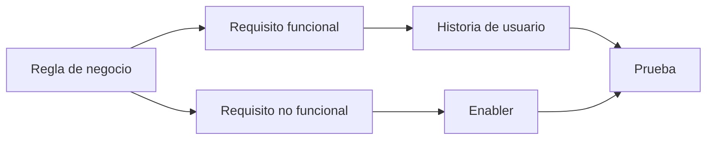

[⌂ README principal](../../README.md) | [← Anterior: 08. Usuarios](08.%20Usuarios%20V_1_0_0.md) | [Siguiente: 10. Stack tecnológico →](10.%20Stack%20tecnol%C3%B3gico%20V_1_0_0.md)

# 09. Reglas de negocio y trazabilidad

## 1. Metadatos

| Campo | Valor |
|---|---|
| Proyecto | **EcoLogística Huancayo - Optimizador de Rutas Sostenibles para DistriRápido S.A.C.** |
| Integrante | **Jordy Steve Chancasanampa Torres** |
| Modalidad | Proyecto individual |
| Fecha | **27/09/2026** |
| Versión | **1.0.0** |

> **Resumen de la tabla:** resume la identificación y las decisiones base del documento. Permite comprobar que todos los artefactos pertenecen al mismo proyecto, versión e integrante.

## 2. Catálogo de reglas

| Código | Regla | RF asociado | RNF asociado |
|---|---|---|---|
| RN-001 | La placa del vehículo debe ser única. | RF-01 | RNF-02 |
| RN-002 | La carga asignada no debe exceder la capacidad del vehículo. | RF-01, RF-03 | RNF-01 |
| RN-003 | La ventana de entrega debe tener inicio menor que fin. | RF-02 | RNF-05 |
| RN-004 | Todo pedido debe disponer de coordenadas o referencia utilizable. | RF-02 | RNF-05 |
| RN-005 | La función objetivo debe considerar distancia, tiempo, combustible, CO₂ y penalización. | RF-03 | RNF-01 |
| RN-006 | Una solución con violaciones duras no puede marcarse como válida. | RF-03 | RNF-01 |
| RN-007 | El repartidor solo visualiza su ruta y pedidos asignados. | RF-04 | RNF-02 |
| RN-008 | Los KPIs deben derivarse de rutas o simulaciones identificadas. | RF-05 | RNF-07 |
| RN-009 | El reporte debe conservar periodo y parámetros de cálculo. | RF-06 | RNF-07 |
| RN-010 | Nuevos pedidos, cancelaciones, accidentes o averías pueden disparar reoptimización. | RF-07 | RNF-01 |
| RN-011 | No asignar repartidor fuera de su disponibilidad. | RF-08 | RNF-05 |
| RN-012 | Las preferencias del cliente no anulan restricciones obligatorias. | RF-09 | RNF-02 |
| RN-013 | La compensación parte del CO₂ calculado para el periodo. | RF-10 | RNF-07 |
| RN-014 | Toda acción requiere permiso por rol/recurso. | Transversal | RNF-02 |
| RN-015 | La indisponibilidad del tráfico no debe corromper el estado; debe existir contingencia. | RF-03, RF-07 | RNF-06 |

> **Resumen de la tabla:** cada regla restringe comportamiento. RF/RNF indican qué requisitos y pruebas deben actualizarse si una regla cambia.

## 3. Función objetivo conceptual

```text
CostoTotal =
  w1 * DistanciaTotal +
  w2 * TiempoTotal +
  w3 * ConsumoCombustible +
  w4 * EmisionesCO2 +
  w5 * PenalizacionTardanza
```

> **Resumen:** los pesos se documentan por experimento. Las restricciones duras —capacidad, disponibilidad o permisos— no se “compensan” con pesos: deben cumplirse.

## 4. Trazabilidad


```mermaid
flowchart LR
    RN[Regla de negocio] --> RF[Requisito funcional]
    RN --> RNF[Requisito no funcional]
    RF --> US[Historia de usuario]
    RNF --> EN[Enabler]
    US --> TEST[Prueba]
    EN --> TEST
```

> **Resumen del diagrama:** la trazabilidad evita implementar historias desconectadas de la consigna. Cada prueba debe poder remontarse a un RF/RNF.

## 5. Control de cambios

Si una regla cambia, revisar requisito, historia/enabler, modelo de datos, criterios BDD, pruebas y documentación antes de cerrar el cambio.

---

[⌂ README principal](../../README.md) | [← Anterior: 08. Usuarios](08.%20Usuarios%20V_1_0_0.md) | [Siguiente: 10. Stack tecnológico →](10.%20Stack%20tecnol%C3%B3gico%20V_1_0_0.md)
