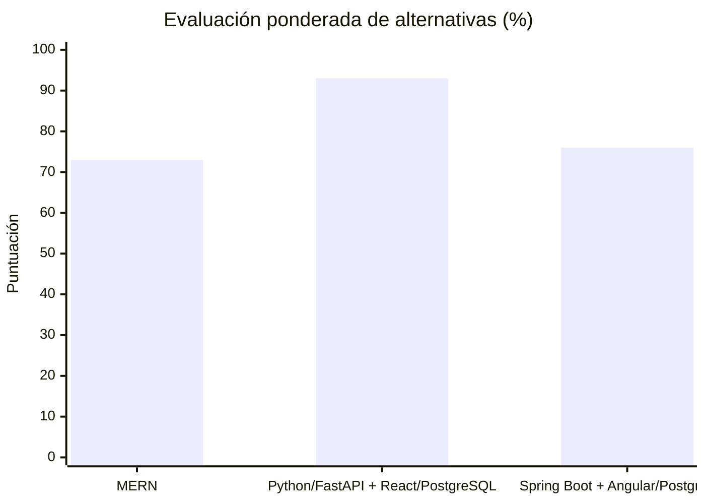
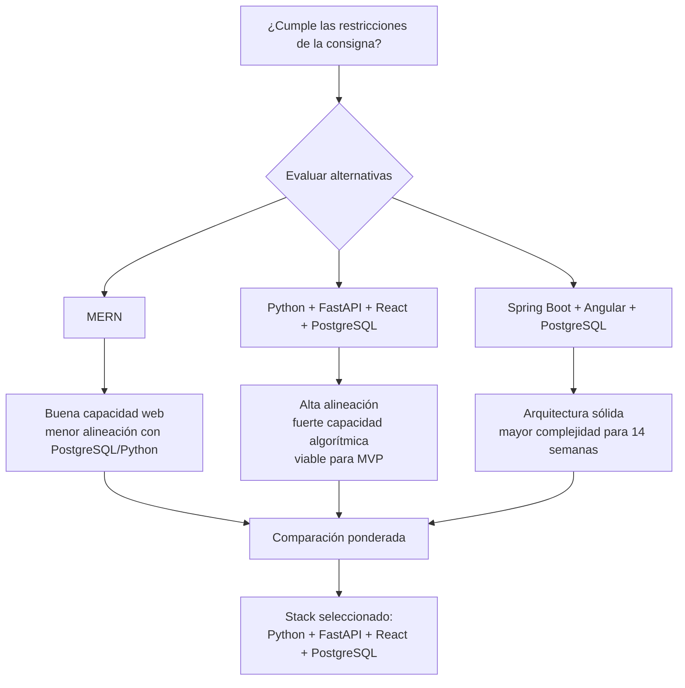
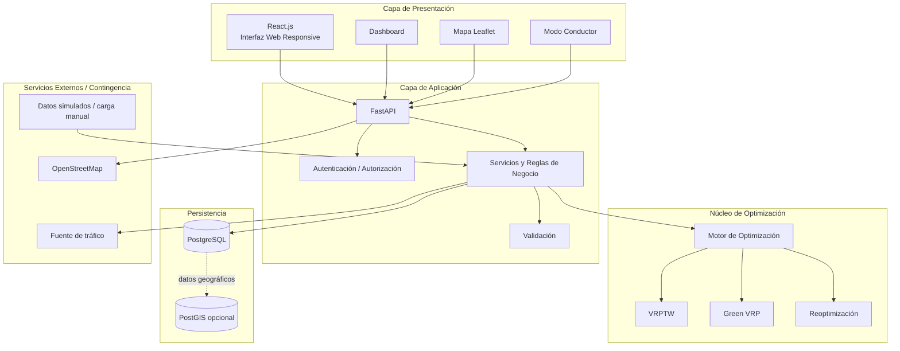
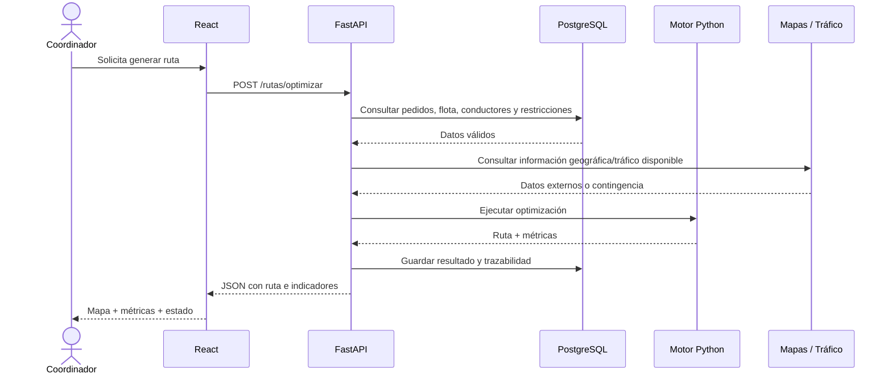
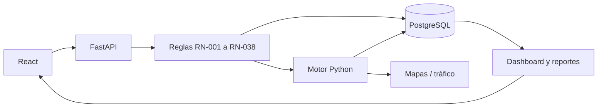
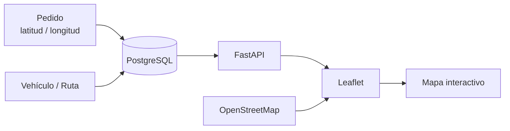
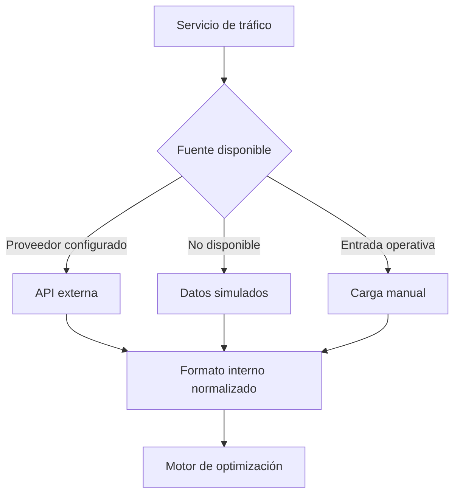
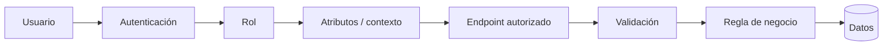
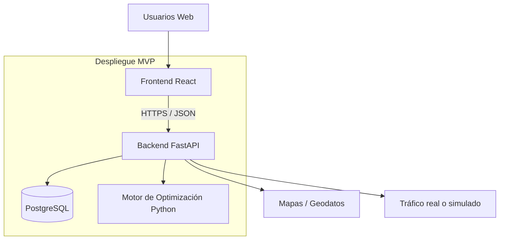

# Evaluación e Identificación del Stack Tecnológico

## 1. Metadatos del documento

| Campo | Información |
|---|---|
| Nombre del proyecto | EcoLogística Lima - Optimizador de Rutas Sostenibles para DistriRápido S.A.C. |
| Integrante | Jordy Steve Chancasanampa Torres |
| Fecha | 04/09/2026 |
| Versión | 1.0.0 |
| Estado | Stack tecnológico seleccionado para el MVP |
| Ruta de repositorio | `docs/01 Inicio/10. Stack tecnológico V_1_0_0.md` |

---

# 2. Objetivo del documento

El presente documento evalúa de manera estructurada **tres alternativas de stack tecnológico** para el desarrollo de **EcoLogística Lima**, considerando criterios técnicos, operativos, económicos, de sostenibilidad y de mantenibilidad.

La selección no se realiza únicamente por preferencia de lenguaje o framework. Se contrasta cada alternativa con:

- las restricciones tecnológicas establecidas en la consigna;
- la naturaleza algorítmica del proyecto;
- la necesidad de implementar optimización VRPTW y Green VRP;
- la integración con mapas y datos georreferenciados;
- la necesidad de reoptimización dinámica;
- la disponibilidad de un único integrante para desarrollar el MVP;
- los requisitos de seguridad, accesibilidad, rendimiento y mantenibilidad;
- el objetivo de utilizar tecnologías abiertas y reducir dependencia de proveedores.

El resultado de la evaluación será utilizado como línea base para los documentos posteriores de **Base de Datos** y **Modelo C4**.

---

# 3. Restricciones tecnológicas que condicionan la decisión

La consigna del proyecto establece como orientación tecnológica:

- **backend:** Python mediante FastAPI o Django;
- **frontend:** React.js o Vue.js;
- **base de datos:** PostgreSQL;
- **mapas:** Leaflet/OpenStreetMap, con posibilidad de utilizar Google Maps API si se justifica;
- arquitectura web responsive;
- funcionamiento bajo conectividad limitada;
- cumplimiento de OWASP Top 10;
- aplicación de ISO/IEC 25010;
- accesibilidad WCAG 2.1 AA;
- criterios de Green Software.

Por tanto, la alternativa elegida debe respetar estas restricciones o justificar claramente cualquier desviación.

---

# 4. Alternativas evaluadas

## 4.1. Alternativa A — MERN

**Composición principal**

- MongoDB
- Express.js
- React.js
- Node.js
- Leaflet / OpenStreetMap
- API REST

### Ventajas para el proyecto

- Unificación del lenguaje JavaScript/TypeScript entre frontend y backend.
- Amplio ecosistema web.
- React permite construir una interfaz responsive y modular.
- Node.js facilita integración con APIs y servicios externos.

### Limitaciones frente a EcoLogística Lima

- La consigna prioriza PostgreSQL como tecnología de persistencia.
- El dominio contiene datos relacionales fuertes: pedidos, vehículos, conductores, rutas, restricciones e incidencias.
- La implementación de algoritmos de optimización y experimentación matemática tiene una alineación menor con el ecosistema principal de Python definido por la consigna.
- Implicaría justificar el uso de MongoDB frente a una restricción tecnológica que ya orienta hacia PostgreSQL.

---

## 4.2. Alternativa B — Python + FastAPI + React + PostgreSQL

**Composición principal**

- Python
- FastAPI
- React.js
- PostgreSQL
- Leaflet
- OpenStreetMap
- API REST / OpenAPI

### Ventajas para el proyecto

- Se alinea directamente con las tecnologías priorizadas por la consigna.
- Python permite implementar y experimentar con algoritmos genéticos, búsqueda tabú, colonia de hormigas u otras metaheurísticas.
- FastAPI permite separar claramente la lógica de optimización de la interfaz.
- PostgreSQL resulta adecuado para mantener relaciones entre entidades operativas.
- React permite construir dashboard, formularios, mapas y una vista simplificada para conductores.
- Leaflet/OpenStreetMap reduce la dependencia de una plataforma cartográfica propietaria.
- La documentación OpenAPI puede generarse como parte natural de una API REST.
- Facilita construir el MVP con una arquitectura modular sin introducir una plataforma excesivamente pesada.

### Limitaciones

- El proyecto utiliza dos lenguajes principales: Python y JavaScript/TypeScript.
- Requiere disciplina para separar frontend, API, lógica de negocio y optimización.
- La integración de servicios de tráfico externos debe diseñarse de forma desacoplada.

---

## 4.3. Alternativa C — Java Spring Boot + Angular + PostgreSQL

**Composición principal**

- Java
- Spring Boot
- Angular
- PostgreSQL
- Leaflet / OpenStreetMap
- API REST

### Ventajas para el proyecto

- Arquitectura empresarial madura.
- Buen soporte para aplicaciones modulares y control de seguridad.
- PostgreSQL se alinea con la persistencia indicada por la consigna.
- Angular proporciona una estructura frontend completa.

### Limitaciones frente al contexto del MVP

- Mayor cantidad de configuración y componentes estructurales para un proyecto desarrollado por un único integrante.
- Curva de implementación más exigente dentro del horizonte de 14 semanas.
- La consigna prioriza Python para backend.
- Para experimentación rápida con metaheurísticas, el stack añade una complejidad innecesaria frente a Python.

---

# 5. Criterios de evaluación

La escala de puntuación utilizada es:

| Puntuación | Interpretación |
|---:|---|
| 1 | Muy desfavorable |
| 2 | Desfavorable |
| 3 | Aceptable |
| 4 | Favorable |
| 5 | Muy favorable |

Los pesos representan la importancia de cada criterio **para este proyecto académico**.

| ID | Criterio | Peso | Justificación |
|---|---|---:|---|
| CT-01 | Alineación con la consigna | 20 % | Evita desviaciones tecnológicas innecesarias |
| CT-02 | Adecuación para metaheurísticas y optimización | 15 % | El núcleo del proyecto es el cálculo de rutas |
| CT-03 | Integración geográfica y de mapas | 10 % | El sistema requiere mapas, coordenadas y rutas |
| CT-04 | Viabilidad para un único integrante | 15 % | El proyecto se desarrolla de forma individual |
| CT-05 | Costo y simplicidad de infraestructura | 10 % | El MVP debe evitar complejidad operativa innecesaria |
| CT-06 | Ecosistema y soporte técnico | 10 % | Reduce riesgo de bloqueo durante el desarrollo |
| CT-07 | Mantenibilidad y seguridad | 10 % | Debe cumplir calidad, trazabilidad y OWASP |
| CT-08 | Eficiencia / Eco-Design | 10 % | La consigna incorpora Green Software |

**Total: 100 %.**

---

# 6. Matriz de Evaluación Multidimensional

> Las puntuaciones de esta matriz son una **evaluación interna del proyecto V1.0.0**. No representan benchmarks universales entre tecnologías; expresan qué tan apropiada resulta cada alternativa para las restricciones y necesidades específicas de EcoLogística Lima.

| Criterio | Peso | A: MERN | B: Python + FastAPI + React + PostgreSQL | C: Spring Boot + Angular + PostgreSQL |
|---|---:|---:|---:|---:|
| CT-01 Alineación con la consigna | 20 % | 3 | **5** | 4 |
| CT-02 Metaheurísticas y optimización | 15 % | 3 | **5** | 4 |
| CT-03 Integración geográfica y mapas | 10 % | 4 | **5** | **5** |
| CT-04 Viabilidad para un único integrante | 15 % | **4** | **4** | 2 |
| CT-05 Costo / simplicidad de infraestructura | 10 % | **4** | **4** | 3 |
| CT-06 Ecosistema y soporte | 10 % | **5** | **5** | **5** |
| CT-07 Mantenibilidad y seguridad | 10 % | 4 | **5** | **5** |
| CT-08 Eficiencia / Eco-Design | 10 % | 3 | **4** | 3 |
| **Resultado ponderado / 5** | **100 %** | **3.65** | **4.65** | **3.80** |
| **Resultado porcentual** |  | **73 %** | **93 %** | **76 %** |

---

# 7. Representación visual del resultado



### Resultado

La **Alternativa B** obtiene **4.65/5 (93 %)** y presenta la mejor correspondencia con las necesidades del proyecto.

---

# 8. Mapa de decisión



---

# 9. Stack Tecnológico Seleccionado

## 9.1. Resumen

| Capa | Tecnología seleccionada | Propósito |
|---|---|---|
| Frontend | React.js | Interfaz web, dashboard, formularios y modo conductor |
| Lenguaje frontend | JavaScript / TypeScript | Implementación de componentes y lógica de interfaz |
| Backend | Python + FastAPI | API, reglas de negocio, autenticación e integración |
| Optimización | Python | Implementación y evaluación de metaheurísticas |
| Persistencia | PostgreSQL | Datos operativos y relaciones del dominio |
| Extensión geoespacial | PostGIS, si el diseño físico lo requiere | Consultas y datos geográficos avanzados |
| Mapas | Leaflet | Visualización interactiva |
| Datos cartográficos | OpenStreetMap | Mapa base y representación geográfica |
| API | REST + JSON | Comunicación frontend/backend |
| Documentación API | OpenAPI / Swagger | Documentación técnica del servicio |
| Control de versiones | Git + GitHub | Versionamiento del código y documentos |
| Pruebas backend | Pytest | Pruebas unitarias e integración |
| Pruebas frontend | Herramientas del ecosistema React | Validación de componentes y flujos |
| Contenedores | Docker, si aporta valor al despliegue | Repetibilidad del ambiente |
| Tráfico | Adaptador desacoplado | Permitir fuente real, simulada o carga manual |

> **Nota:** PostGIS, Docker y una fuente específica de tráfico se consideran decisiones de implementación sujetas a validación. La línea base obligatoria seleccionada es Python/FastAPI + React + PostgreSQL + Leaflet/OpenStreetMap.

---

# 10. Arquitectura lógica del stack seleccionado



---

# 11. Flujo tecnológico para generar una ruta



---

# 12. Distribución de responsabilidades

## 12.1. React.js

Responsabilidades:

- presentación de datos;
- formularios;
- dashboard;
- visualización de rutas;
- modo conductor;
- validaciones de interfaz;
- experiencia responsive;
- cumplimiento de criterios WCAG aplicables.

No debe contener la lógica central de optimización.

## 12.2. FastAPI

Responsabilidades:

- exponer endpoints;
- validar solicitudes;
- aplicar autenticación y autorización;
- coordinar reglas de negocio;
- acceder a persistencia;
- integrar servicios externos;
- invocar el motor de optimización;
- entregar respuestas JSON;
- registrar trazabilidad.

## 12.3. Motor de optimización en Python

Responsabilidades:

- generar soluciones de rutas;
- validar restricciones;
- considerar ventanas de tiempo;
- capacidad vehicular;
- disponibilidad;
- variables de distancia, tiempo, combustible y CO₂;
- ejecutar reoptimización;
- producir métricas de ejecución.

## 12.4. PostgreSQL

Responsabilidades:

- usuarios y roles;
- vehículos;
- conductores;
- clientes;
- pedidos;
- preferencias;
- rutas;
- detalle de rutas;
- incidencias;
- restricciones;
- indicadores;
- trazabilidad.

El diseño definitivo de tablas se desarrollará en:

`11. Base de datos V_1_0_0.md`

---

# 13. Relación entre requisitos de calidad y stack

| RNF | Necesidad | Decisión tecnológica relacionada |
|---|---|---|
| RNF-001 | Optimización ≤ 45 s | Motor separado en Python y pruebas de rendimiento |
| RNF-002 | Reoptimización < 30 s | Servicio de optimización desacoplado |
| RNF-003 | Seguridad | FastAPI + controles de autenticación/autorización + validaciones |
| RNF-004 | Protección de datos | PostgreSQL + RBAC/ABAC + minimización |
| RNF-005 | WCAG 2.1 AA | React con componentes accesibles |
| RNF-006 | Hasta 1,000 pedidos/día y 50 vehículos | API separada de frontend y persistencia relacional |
| RNF-007 | Usabilidad del conductor | Vista React especializada |
| RNF-008 | Disponibilidad | Arquitectura desacoplada y estrategia de despliegue |
| RNF-009 | Responsive / conectividad limitada | SPA optimizada y reducción de transferencia innecesaria |
| RNF-010 | Documentación | OpenAPI + Markdown + Git |
| RNF-011 | ≥ 70 % del MVP | Stack con bajo costo de complejidad para un desarrollador |
| RNF-012 | Interoperabilidad web | React + estándares web |
| RNF-013 | Trazabilidad | Separación clara de módulos y repositorio versionado |

---

# 14. Relación con reglas de negocio



Las reglas de negocio permanecen en la capa de aplicación y dominio. La interfaz no debe decidir por sí sola si una ruta es válida, si un usuario tiene permiso o si un vehículo puede ser asignado.

---

# 15. Estrategia de datos geográficos

La solución seleccionada prioriza:

- **Leaflet** para visualización de mapas;
- **OpenStreetMap** como mapa base;
- almacenamiento de coordenadas en PostgreSQL;
- uso de **PostGIS** únicamente si las consultas geoespaciales del diseño físico justifican su incorporación.



---

# 16. Estrategia de integración con tráfico

La precisión y disponibilidad de proveedores externos no está bajo control del proyecto. Por ello, el backend utilizará una abstracción de fuente de tráfico.



Esto permite validar la reoptimización sin convertir una API externa en un punto único de bloqueo para el MVP académico.

---

# 17. Seguridad del stack

La arquitectura deberá aplicar como mínimo:

- autenticación;
- autorización RBAC/ABAC;
- validación de entradas;
- parametrización de consultas;
- protección de datos personales;
- manejo seguro de sesiones o tokens;
- registro de eventos críticos;
- configuración segura por ambiente;
- revisión de categorías aplicables de OWASP Top 10;
- separación entre secretos y código fuente.



---

# 18. Eco-Design y Green Software

La selección tecnológica debe acompañar el objetivo ambiental del producto también en su implementación.

Medidas de diseño previstas:

1. evitar consultas repetitivas innecesarias;
2. transferir solo los datos necesarios;
3. paginar listados grandes;
4. evitar recalcular rutas si no existe un cambio relevante;
5. reutilizar resultados cuando sea válido;
6. optimizar consultas de base de datos;
7. limitar logs excesivos en producción;
8. escalar infraestructura únicamente cuando el uso lo requiera;
9. desacoplar integraciones externas para evitar llamadas innecesarias;
10. medir tiempos del algoritmo y revisar consumo de recursos durante pruebas.

---

# 19. Estructura lógica sugerida del repositorio de código

```text
ecologistica-lima/
│
├── frontend/
│   ├── src/
│   │   ├── components/
│   │   ├── pages/
│   │   ├── features/
│   │   ├── services/
│   │   └── maps/
│   └── ...
│
├── backend/
│   ├── app/
│   │   ├── api/
│   │   ├── auth/
│   │   ├── domain/
│   │   ├── services/
│   │   ├── repositories/
│   │   ├── optimization/
│   │   ├── integrations/
│   │   └── models/
│   ├── tests/
│   └── ...
│
├── docs/
│   └── 01 Inicio/
│
└── README.md
```

Esta estructura es orientativa y podrá refinarse en el Modelo C4 sin cambiar la decisión principal de stack.

---

# 20. Dependencias esenciales y opcionales

## 20.1. Esenciales para el MVP

| Componente | Decisión |
|---|---|
| Python | Sí |
| FastAPI | Sí |
| React.js | Sí |
| PostgreSQL | Sí |
| Leaflet | Sí |
| OpenStreetMap | Sí |
| REST / JSON | Sí |
| OpenAPI | Sí |
| Git/GitHub | Sí |

## 20.2. Opcionales o sujetos a prueba

| Componente | Condición de incorporación |
|---|---|
| PostGIS | Si aporta consultas geoespaciales necesarias |
| Docker | Si simplifica reproducción y despliegue |
| Proveedor de tráfico comercial | Si disponibilidad, costo y acceso son viables |
| Cache | Solo si las pruebas muestran necesidad |
| Cola de tareas | Solo si la ejecución asíncrona resulta necesaria |
| Servicio cloud específico | Se decidirá en función del despliegue del MVP |

Este criterio evita sobrearquitectura prematura.

---

# 21. Decisiones explícitamente descartadas para V1.0.0

## MERN como stack principal

No se selecciona porque la combinación MongoDB/Node.js se aleja de la orientación principal de la consigna hacia Python y PostgreSQL y aporta menor ventaja al núcleo algorítmico del proyecto.

## Spring Boot + Angular como stack principal

No se selecciona porque, aunque es técnicamente viable, introduce mayor complejidad estructural para un proyecto individual de 14 semanas y no mejora la alineación con la consigna frente a la alternativa Python/FastAPI.

---

# 22. Riesgos tecnológicos y mitigación

| ID | Riesgo | Impacto | Mitigación |
|---|---|---|---|
| RT-01 | El algoritmo no cumple tiempos | Alto | Pruebas progresivas desde la Iteración 2 |
| RT-02 | API de tráfico no disponible | Alto | Adaptador + datos simulados + carga manual |
| RT-03 | Exceso de complejidad frontend/backend | Medio | Mantener MVP y responsabilidades separadas |
| RT-04 | Consultas geográficas complejas | Medio | Evaluar PostGIS únicamente si es necesario |
| RT-05 | Dependencia excesiva de servicios externos | Alto | Priorizar OpenStreetMap y abstracciones |
| RT-06 | Vulnerabilidades web | Alto | Controles OWASP y pruebas de seguridad |
| RT-07 | Bajo rendimiento en conexiones limitadas | Medio | Reducir payloads, paginar y optimizar recursos |
| RT-08 | Sobrecarga por ser un solo desarrollador | Alto | Evitar microservicios y componentes no esenciales |

---

# 23. Arquitectura de despliegue conceptual

Para el MVP se prioriza una arquitectura simple.



No se adopta una arquitectura de microservicios como requisito inicial. La separación será principalmente **modular**, permitiendo evolucionar el sistema si el crecimiento futuro lo justifica.

---

# 24. Decisión Técnica Formal

Después de comparar las tres alternativas, se selecciona:

## **Python + FastAPI + React.js + PostgreSQL + Leaflet/OpenStreetMap**

como stack tecnológico principal de **EcoLogística Lima V1.0.0**.

La decisión se fundamenta en:

1. **alineación directa con la consigna;**
2. **capacidad de Python para desarrollar y ajustar metaheurísticas;**
3. **persistencia relacional adecuada al dominio logístico;**
4. **facilidad para integrar mapas y datos geográficos;**
5. **separación clara entre interfaz, API y motor de optimización;**
6. **viabilidad para un proyecto desarrollado por un único integrante;**
7. **posibilidad de documentar la API mediante OpenAPI;**
8. **menor necesidad de componentes estructurales adicionales durante el MVP;**
9. **compatibilidad con prácticas de seguridad, pruebas y trazabilidad;**
10. **posibilidad de aplicar criterios de Green Software mediante optimización de consultas, procesamiento y transferencia de datos.**

---

# 25. Criterios de aceptación de la decisión tecnológica

La decisión se considerará válida durante el desarrollo mientras:

- el backend pueda implementar las reglas del negocio;
- el motor de optimización pueda ser probado independientemente;
- el frontend pueda ejecutar los flujos críticos;
- PostgreSQL pueda modelar las relaciones del dominio;
- el mapa pueda visualizar las rutas requeridas;
- el stack pueda cumplir las métricas RNF;
- no aparezca una limitación técnica crítica que impida cumplir la consigna.

Si una limitación crítica obliga a cambiar un componente principal, deberá:

1. documentarse la causa;
2. comparar el impacto frente a la alternativa vigente;
3. actualizar este documento;
4. actualizar Modelo C4 y Base de Datos si corresponde;
5. incrementar la versión;
6. conservar la versión anterior en Git.

---

# 26. Conclusión

La evaluación multidimensional de tres alternativas determina que **Python + FastAPI + React + PostgreSQL** es la combinación con mejor ajuste al proyecto, obteniendo **4.65/5 (93 %)** en la matriz interna de selección.

La elección no se sustenta únicamente en popularidad tecnológica. Responde a la necesidad de combinar:

- optimización algorítmica;
- gestión de datos relacionales;
- mapas interactivos;
- reoptimización;
- seguridad;
- accesibilidad;
- mantenibilidad;
- viabilidad de implementación en 14 semanas.

Con esta decisión queda establecida la base tecnológica para desarrollar el siguiente artefacto:

`docs/01 Inicio/11. Base de datos V_1_0_0.md`
