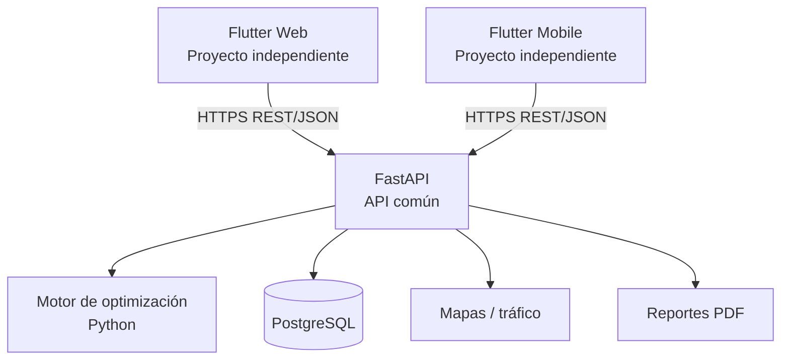

# 10. Evaluación e identificación del stack tecnológico

## 1. Metadatos

| Campo | Valor |
|---|---|
| Proyecto | **EcoLogística Huancayo - Optimizador de Rutas Sostenibles para DistriRápido S.A.C.** |
| Integrante | **Jordy Steve Chancasanampa Torres** |
| Fecha | **27/09/2026** |
| Versión | **1.0.0** |

## 2. Propósito

Este documento separa dos conceptos que no deben confundirse:

1. **Alternativas o propuestas similares de stack**, utilizadas para comparar enfoques tecnológicos.
2. **Propuesta real de desarrollo del estudiante**, que será implementada con **Flutter Web** y **Flutter móvil como aplicaciones separadas**.

La selección de Flutter corresponde a una decisión de implementación del proyecto. Los stacks comparativos se mantienen como alternativas de referencia y no representan la tecnología final elegida.

## 3. Alternativas de referencia / propuestas similares

| Criterio | Alternativa 1: MERN | Alternativa 2: FastAPI + React + PostgreSQL | Alternativa 3: Spring Boot + Angular + PostgreSQL |
|---|---|---|---|
| Frontend | React | React | Angular |
| Backend | Node.js / Express | Python / FastAPI | Java / Spring Boot |
| Base de datos | MongoDB | PostgreSQL | PostgreSQL |
| Curva de aprendizaje | Baja si se unifica JavaScript | Media | Alta |
| Adecuación para metaheurísticas | Media | Alta por ecosistema Python | Alta |
| Modelo relacional | Media | Alta | Alta |
| Velocidad para MVP | Alta | Alta | Media |
| Consumo de infraestructura | Moderado | Bajo/Moderado | Moderado/Alto |
| Comunidad | Muy alta | Alta | Muy alta |

Estas alternativas sirven para justificar técnicamente la decisión. **No son el stack final del proyecto.**

## 4. Propuesta real de desarrollo

### 4.1 Aplicación Web

- **Tecnología:** Flutter Web.
- **Lenguaje:** Dart.
- **Proyecto:** independiente.
- **Usuarios principales:** administrador, operador logístico y gerencia.
- **Funciones principales:**
  - gestión de flota;
  - gestión de pedidos;
  - gestión de conductores;
  - gestión de clientes;
  - configuración y ejecución de optimización;
  - visualización de rutas;
  - dashboard;
  - reportes;
  - administración del sistema.

### 4.2 Aplicación móvil

- **Tecnología:** Flutter.
- **Lenguaje:** Dart.
- **Proyecto:** independiente de Flutter Web.
- **Usuarios principales:** conductores.
- **Funciones principales:**
  - autenticación;
  - consulta de ruta asignada;
  - consulta de entregas pendientes;
  - navegación de la secuencia de entregas;
  - visualización de alertas;
  - reporte de incidentes;
  - actualización de estados operativos.

> Las dos aplicaciones se consideran **clientes diferentes**. No se documentan como una sola aplicación responsive.

## 5. Backend común

Flutter cubre la capa cliente. Para centralizar reglas, persistencia, seguridad e integración se propone un backend común:

- **Python + FastAPI** para API REST.
- **PostgreSQL** para persistencia.
- **OpenAPI/Swagger** para contrato de servicios.
- Servicio/módulo de optimización implementado en Python.
- Adaptador para mapas y tráfico.
- Generación de reportes desde backend.

Esta decisión permite aprovechar Python para el problema de optimización sin impedir que ambas interfaces se desarrollen completamente en Flutter.

## 6. Arquitectura tecnológica seleccionada


```mermaid
flowchart TD
    WEB[Flutter Web<br/>Proyecto independiente]
    MOBILE[Flutter Mobile<br/>Proyecto independiente]
    API[FastAPI<br/>API común]
    OPT[Motor de optimización<br/>Python]
    DB[(PostgreSQL)]
    MAP[Mapas / tráfico]
    REP[Reportes PDF]

    WEB -->|HTTPS REST/JSON| API
    MOBILE -->|HTTPS REST/JSON| API
    API --> OPT
    API --> DB
    API --> MAP
    API --> REP
```

## 7. Herramientas propuestas

| Área | Herramienta / tecnología |
|---|---|
| Web | Flutter Web + Dart |
| Móvil | Flutter + Dart |
| Backend | FastAPI + Python |
| Base de datos | PostgreSQL |
| API | REST + JSON + OpenAPI |
| Mapas | Integración compatible con Flutter y servicio cartográfico definido por el proyecto |
| Control de versiones | Git + GitHub/GitLab |
| Gestión | Jira Software |
| Diseño | Figma |
| Pruebas Flutter | `flutter_test`, pruebas widget/integración según corresponda |
| Pruebas backend | Pytest u herramienta equivalente |
| Seguridad | Análisis estático, revisión OWASP Top 10, gestión segura de secretos |

## 8. Justificación de Flutter

Flutter se selecciona porque permite mantener un ecosistema Dart coherente en ambas interfaces y construir:

- un cliente web para tareas administrativas;
- un cliente móvil específico para el conductor;
- componentes y patrones de interfaz consistentes;
- pruebas automatizadas del cliente;
- separación clara entre presentación y lógica de negocio centralizada en la API.

La decisión de mantener **dos proyectos Flutter separados** permite que la navegación, permisos, experiencia de usuario y ciclo de despliegue del sistema web y de la aplicación móvil evolucionen de manera independiente.

## 9. Organización propuesta del código

```text
/
├── apps/
│   ├── ecologistica_web/        # Flutter Web
│   └── ecologistica_mobile/     # Flutter móvil
├── backend/
│   └── api/                     # FastAPI + motor de optimización
├── database/
│   └── migrations/
└── docs/
    ├── 01 Inicio/
    └── 02 Planificación/
```

Esta estructura es una **propuesta de desarrollo**, no una estructura obligatoria impuesta por la consigna.

## 10. Criterios de sostenibilidad técnica

- evitar solicitudes redundantes desde ambos clientes;
- aplicar paginación y carga bajo demanda;
- minimizar transferencia de datos;
- reutilizar recursos y assets optimizados;
- medir rendimiento en Flutter Web y Flutter móvil de forma independiente;
- ejecutar la optimización en backend para no sobrecargar dispositivos móviles;
- evitar dependencias innecesarias.

## 11. Decisión final

La propuesta tecnológica del proyecto queda establecida como:

> **Flutter Web + Flutter móvil (aplicaciones separadas) + FastAPI/Python + PostgreSQL**, con una API común para centralizar la lógica de negocio y el motor de optimización.
