# Diseño e Ingeniería de Base de Datos

## 1. Metadatos del documento

| Campo | Información |
|---|---|
| Nombre del proyecto | EcoLogística Lima - Optimizador de Rutas Sostenibles para DistriRápido S.A.C. |
| Integrante | Jordy Steve Chancasanampa Torres |
| Fecha | 04/09/2026 |
| Versión | 1.0.0 |
| Estado | Diseño lógico y físico inicial de base de datos |
| Motor seleccionado | PostgreSQL |
| Extensión geoespacial | PostGIS opcional, sujeta a necesidad de implementación |
| Ruta de repositorio | `docs/01 Inicio/11. Base de datos V_1_0_0.md` |

---

# 2. Objetivo del documento

El presente documento define el **diseño conceptual, lógico y físico de la base de datos de EcoLogística Lima**, manteniendo trazabilidad con los requisitos funcionales, reglas de negocio, perfiles de usuario y restricciones ya establecidos.

La base de datos debe permitir almacenar de manera consistente y trazable la información necesaria para:

- usuarios, roles y permisos;
- clientes y preferencias de entrega;
- vehículos y conductores;
- pedidos y ventanas de tiempo;
- restricciones operativas;
- incidencias;
- ejecuciones de optimización y reoptimización;
- rutas y paradas;
- indicadores operativos y ambientales;
- información de tráfico utilizada por el sistema;
- trazabilidad y auditoría básica.

El objetivo no es únicamente “guardar datos”, sino soportar la operación del MVP con integridad referencial, reglas de validación, consulta eficiente y una estructura compatible con el stack seleccionado:

**Python + FastAPI + React + PostgreSQL + Leaflet/OpenStreetMap**.

---

# 3. Alcance del diseño de datos

## 3.1. Incluido

El diseño cubre las entidades necesarias para los módulos definidos en los documentos anteriores:

1. Seguridad y usuarios.
2. Gestión de flota.
3. Gestión de conductores.
4. Gestión de clientes.
5. Gestión de pedidos.
6. Preferencias de entrega.
7. Restricciones operativas.
8. Incidencias.
9. Optimización y reoptimización.
10. Rutas.
11. Paradas de ruta.
12. Indicadores.
13. Observaciones de tráfico.
14. Trazabilidad básica.

## 3.2. No incluido en V1.0.0

No se diseña en esta versión:

- facturación electrónica;
- contabilidad;
- planillas;
- mantenimiento mecánico detallado;
- pólizas de seguros como módulo independiente;
- historial médico de conductores;
- telemetría GPS continua de vehículos;
- sistema comercial completo;
- integración física con sensores IoT.

Estos elementos no forman parte del alcance académico mínimo definido para el MVP.

---

# 4. Principios de diseño

El modelo seguirá los siguientes principios:

| Principio | Aplicación |
|---|---|
| Integridad referencial | Uso de PK y FK |
| Normalización | Modelo lógico hasta 3FN |
| Mínimo dato necesario | Evitar campos no requeridos por el caso |
| Trazabilidad | Conservar relaciones entre rutas, pedidos, incidencias y optimizaciones |
| Seguridad | Separar identidad, rol y datos operativos |
| Flexibilidad | Parametrizar restricciones y catálogos |
| Auditabilidad | Fechas de creación/actualización y bitácora básica |
| Rendimiento | Índices sobre claves de búsqueda y relaciones frecuentes |
| Portabilidad | Uso de PostgreSQL estándar como línea base |
| Evolución geoespacial | PostGIS opcional sin volverlo requisito inicial |

---

# 5. Vista Conceptual del Dominio

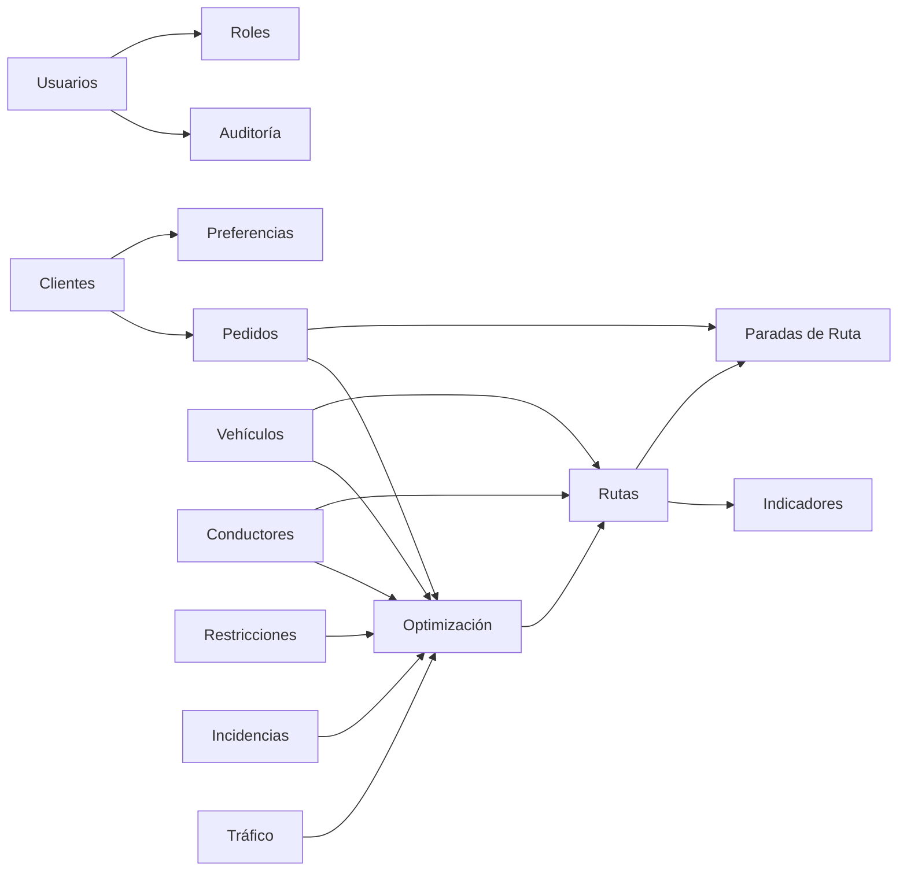

### Interpretación

El **núcleo transaccional** está compuesto por pedidos, vehículos, conductores y rutas.

El **núcleo de decisión** está compuesto por optimización, restricciones, incidencias y tráfico.

El **núcleo de control** está compuesto por usuarios, roles y auditoría.

---

# 6. Entidades principales

| Entidad | Propósito |
|---|---|
| `usuario` | Identidad autenticable |
| `rol` | Perfil de acceso |
| `usuario_rol` | Relación N:M entre usuarios y roles |
| `cliente` | Datos básicos del receptor o cliente |
| `preferencia_cliente` | Preferencias de entrega |
| `vehiculo` | Datos operativos y ambientales de la flota |
| `conductor` | Datos del conductor y disponibilidad |
| `pedido` | Solicitud de entrega |
| `restriccion_operativa` | Regla parametrizable que puede afectar rutas |
| `incidencia` | Evento operativo registrado |
| `observacion_trafico` | Estado de tráfico disponible o simulado |
| `ejecucion_optimizacion` | Cada corrida del motor de optimización |
| `ruta` | Ruta resultante asignada a vehículo/conductor |
| `ruta_parada` | Secuencia de pedidos dentro de una ruta |
| `indicador_ruta` | Métricas agregadas de una ruta |
| `auditoria_evento` | Registro básico de operaciones relevantes |

---

# 7. Modelo Entidad–Relación

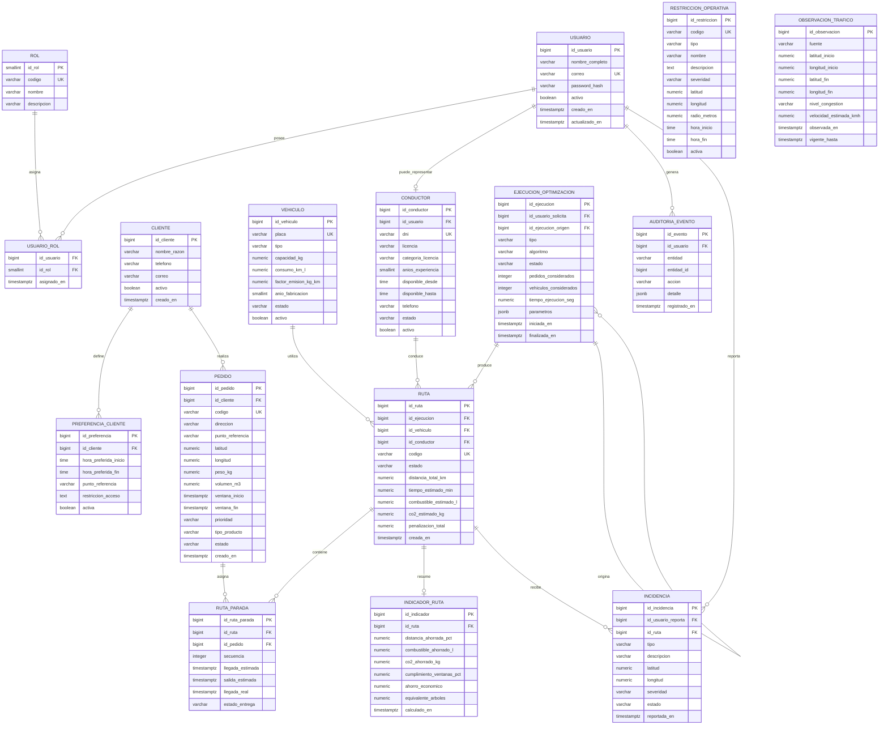

---

# 8. Cardinalidades principales

| Relación | Cardinalidad | Justificación |
|---|---|---|
| Usuario ↔ Rol | N:M | Un usuario puede tener uno o más roles y un rol puede pertenecer a varios usuarios |
| Cliente → Pedido | 1:N | Un cliente puede tener varios pedidos |
| Cliente → Preferencia | 1:N | Puede conservarse más de una preferencia; una puede marcarse activa |
| Usuario → Conductor | 1:0..1 | Un usuario puede representar un conductor |
| Vehículo → Ruta | 1:N | Un vehículo puede ejecutar muchas rutas en distintos momentos |
| Conductor → Ruta | 1:N | Un conductor puede tener muchas rutas a lo largo del tiempo |
| Ejecución → Ruta | 1:N | Una corrida puede generar varias rutas |
| Ruta → Parada | 1:N | Una ruta contiene varias paradas |
| Pedido → Parada | 1:N histórico | Un pedido puede aparecer en una ruta inicial y otra reoptimizada |
| Ruta → Indicador | 1:0..1 | Se mantiene un resumen de métricas por ruta |
| Ruta → Incidencia | 1:N | Una ruta puede registrar varias incidencias |
| Ejecución → Ejecución | 1:N | Una reoptimización puede referenciar la ejecución anterior |

---

# 9. Normalización hasta Tercera Forma Normal

## 9.1. Primera Forma Normal — 1FN

Cada tabla:

- posee una clave primaria;
- contiene valores atómicos;
- evita listas dentro de una misma columna;
- separa relaciones múltiples.

Ejemplo incorrecto:

```text
vehiculo.conductores = "DNI1,DNI2,DNI3"
```

Diseño correcto:

```text
conductor
ruta.id_conductor
```

## 9.2. Segunda Forma Normal — 2FN

Las tablas con claves compuestas mantienen atributos dependientes de la clave completa.

Ejemplo:

`usuario_rol(id_usuario, id_rol)`

La fecha de asignación depende de la relación completa usuario–rol.

## 9.3. Tercera Forma Normal — 3FN

Se evitan dependencias transitivas.

Por ejemplo, `pedido` no almacena:

- nombre del cliente;
- correo del cliente;
- teléfono del cliente;

sino únicamente:

`id_cliente`

Los datos del cliente se mantienen en `cliente`.

De forma similar, `ruta` no replica placa, DNI o nombre del conductor; utiliza claves foráneas.

---

# 10. Diagrama de normalización

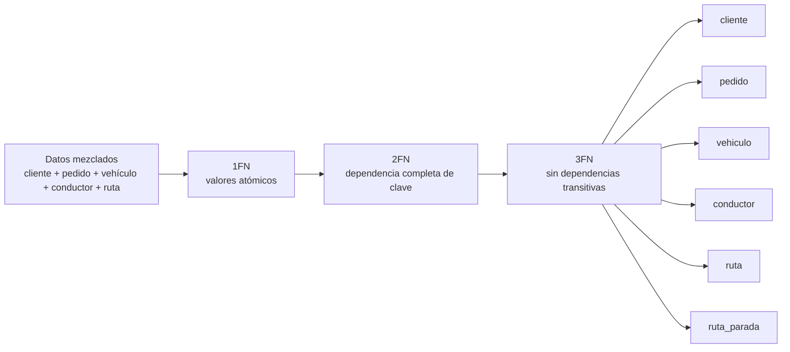

---

# 11. Modelo lógico por módulos

## 11.1. Seguridad

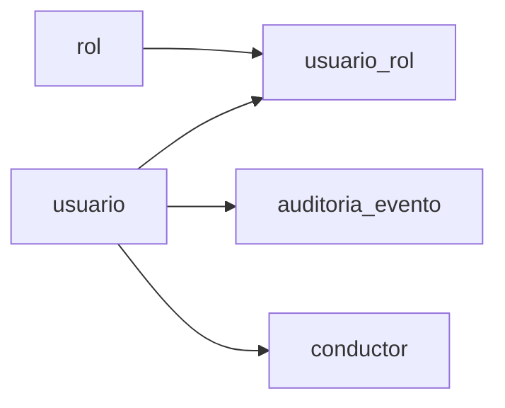

## 11.2. Operación logística

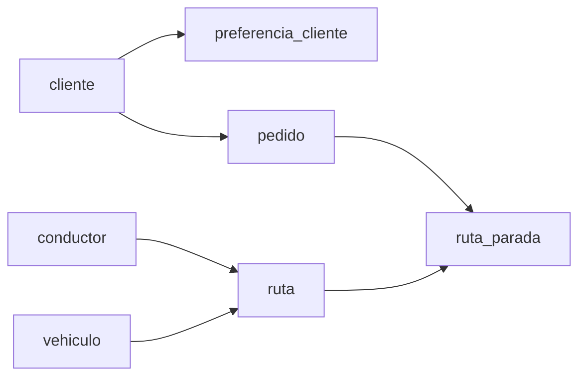

## 11.3. Optimización y reoptimización

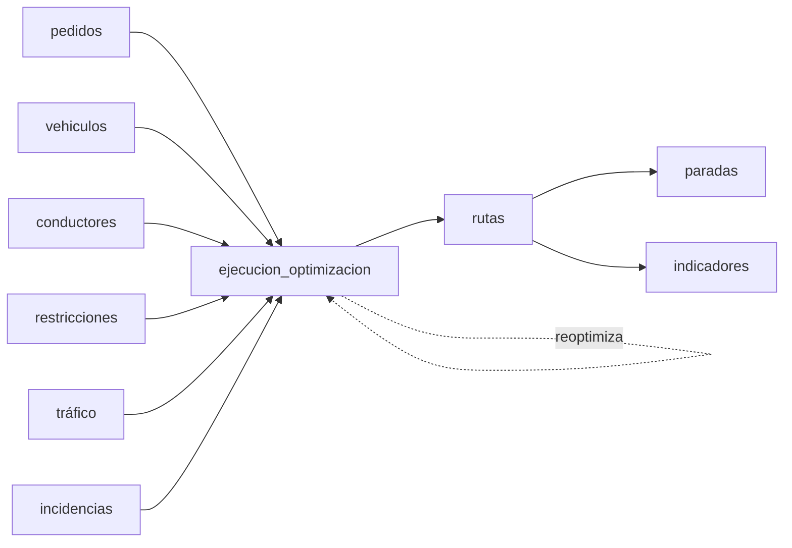

---

# 12. Diccionario de Datos

## 12.1. `usuario`

| Campo | Tipo | Nulo | Regla |
|---|---|---|---|
| id_usuario | BIGSERIAL | No | PK |
| nombre_completo | VARCHAR(150) | No | Nombre visible |
| correo | VARCHAR(180) | No | Único |
| password_hash | VARCHAR(255) | No | Nunca contraseña en texto plano |
| activo | BOOLEAN | No | Default TRUE |
| creado_en | TIMESTAMPTZ | No | Default NOW() |
| actualizado_en | TIMESTAMPTZ | No | Default NOW() |

## 12.2. `rol`

| Campo | Tipo | Nulo | Regla |
|---|---|---|---|
| id_rol | SMALLSERIAL | No | PK |
| codigo | VARCHAR(30) | No | Único |
| nombre | VARCHAR(80) | No | Descriptivo |
| descripcion | VARCHAR(250) | Sí | Opcional |

Roles iniciales sugeridos:

- `ADMIN`
- `GERENCIA`
- `COORDINADOR`
- `CONDUCTOR`
- `CLIENTE`
- `AUDITOR`

## 12.3. `cliente`

| Campo | Tipo | Nulo | Regla |
|---|---|---|---|
| id_cliente | BIGSERIAL | No | PK |
| nombre_razon | VARCHAR(160) | No | Nombre o razón de referencia |
| telefono | VARCHAR(30) | Sí | Dato mínimo cuando aplique |
| correo | VARCHAR(180) | Sí | Opcional |
| activo | BOOLEAN | No | Default TRUE |
| creado_en | TIMESTAMPTZ | No | Default NOW() |

## 12.4. `vehiculo`

| Campo | Tipo | Nulo | Regla |
|---|---|---|---|
| id_vehiculo | BIGSERIAL | No | PK |
| placa | VARCHAR(15) | No | Único |
| tipo | VARCHAR(20) | No | camioneta/furgón/moto u otro catálogo permitido |
| capacidad_kg | NUMERIC(10,2) | No | > 0 |
| consumo_km_l | NUMERIC(8,3) | No | > 0 |
| factor_emision_kg_km | NUMERIC(10,5) | No | >= 0 |
| anio_fabricacion | SMALLINT | No | Año válido |
| estado | VARCHAR(20) | No | DISPONIBLE, EN_RUTA, FUERA_SERVICIO |
| activo | BOOLEAN | No | Default TRUE |

## 12.5. `conductor`

| Campo | Tipo | Nulo | Regla |
|---|---|---|---|
| id_conductor | BIGSERIAL | No | PK |
| id_usuario | BIGINT | Sí | FK usuario |
| dni | VARCHAR(15) | No | Único |
| licencia | VARCHAR(30) | No | Obligatoria |
| categoria_licencia | VARCHAR(20) | Sí | Según caso |
| anios_experiencia | SMALLINT | No | >= 0 |
| disponible_desde | TIME | No | Inicio |
| disponible_hasta | TIME | No | Fin |
| telefono | VARCHAR(30) | Sí | Contacto |
| estado | VARCHAR(20) | No | DISPONIBLE, ASIGNADO, NO_DISPONIBLE |
| activo | BOOLEAN | No | Default TRUE |

## 12.6. `pedido`

| Campo | Tipo | Nulo | Regla |
|---|---|---|---|
| id_pedido | BIGSERIAL | No | PK |
| id_cliente | BIGINT | No | FK |
| codigo | VARCHAR(30) | No | Único |
| direccion | VARCHAR(250) | No | Dirección textual |
| punto_referencia | VARCHAR(250) | Sí | Para direcciones no estandarizadas |
| latitud | NUMERIC(9,6) | No | -90 a 90 |
| longitud | NUMERIC(9,6) | No | -180 a 180 |
| peso_kg | NUMERIC(10,2) | No | > 0 |
| volumen_m3 | NUMERIC(10,3) | No | > 0 |
| ventana_inicio | TIMESTAMPTZ | No | < ventana_fin |
| ventana_fin | TIMESTAMPTZ | No | > ventana_inicio |
| prioridad | VARCHAR(15) | No | EXPRESS, ESTANDAR, ECONOMICO |
| tipo_producto | VARCHAR(20) | No | PERECEDERO, NO_PERECEDERO |
| estado | VARCHAR(20) | No | PENDIENTE, PLANIFICADO, EN_RUTA, ENTREGADO, CANCELADO |
| creado_en | TIMESTAMPTZ | No | Default NOW() |

## 12.7. `ejecucion_optimizacion`

| Campo | Tipo | Nulo | Regla |
|---|---|---|---|
| id_ejecucion | BIGSERIAL | No | PK |
| id_usuario_solicita | BIGINT | No | FK usuario |
| id_ejecucion_origen | BIGINT | Sí | FK autorreferenciada |
| tipo | VARCHAR(20) | No | INICIAL / REOPTIMIZACION |
| algoritmo | VARCHAR(50) | No | Algoritmo usado |
| estado | VARCHAR(20) | No | INICIADA, COMPLETADA, FALLIDA |
| pedidos_considerados | INTEGER | No | >= 0 |
| vehiculos_considerados | INTEGER | No | >= 0 |
| tiempo_ejecucion_seg | NUMERIC(10,3) | Sí | Métrica RNF |
| parametros | JSONB | Sí | Parámetros del algoritmo |
| iniciada_en | TIMESTAMPTZ | No | Inicio |
| finalizada_en | TIMESTAMPTZ | Sí | Fin |

## 12.8. `ruta`

| Campo | Tipo | Nulo | Regla |
|---|---|---|---|
| id_ruta | BIGSERIAL | No | PK |
| id_ejecucion | BIGINT | No | FK |
| id_vehiculo | BIGINT | No | FK |
| id_conductor | BIGINT | No | FK |
| codigo | VARCHAR(30) | No | Único |
| estado | VARCHAR(20) | No | PLANIFICADA, EN_CURSO, COMPLETADA, REEMPLAZADA, CANCELADA |
| distancia_total_km | NUMERIC(10,3) | No | >= 0 |
| tiempo_estimado_min | NUMERIC(10,2) | No | >= 0 |
| combustible_estimado_l | NUMERIC(10,3) | No | >= 0 |
| co2_estimado_kg | NUMERIC(10,3) | No | >= 0 |
| penalizacion_total | NUMERIC(12,3) | No | >= 0 |
| creada_en | TIMESTAMPTZ | No | Default NOW() |

## 12.9. `ruta_parada`

| Campo | Tipo | Nulo | Regla |
|---|---|---|---|
| id_ruta_parada | BIGSERIAL | No | PK |
| id_ruta | BIGINT | No | FK |
| id_pedido | BIGINT | No | FK |
| secuencia | INTEGER | No | > 0 y única por ruta |
| llegada_estimada | TIMESTAMPTZ | Sí | — |
| salida_estimada | TIMESTAMPTZ | Sí | — |
| llegada_real | TIMESTAMPTZ | Sí | — |
| estado_entrega | VARCHAR(20) | No | PENDIENTE, ENTREGADO, FALLIDO, OMITIDO |

---

# 13. Modelo físico propuesto — PostgreSQL DDL

```sql
-- ============================================================
-- EcoLogística Lima
-- Base de Datos V1.0.0
-- PostgreSQL
-- ============================================================

CREATE TABLE rol (
    id_rol SMALLSERIAL PRIMARY KEY,
    codigo VARCHAR(30) NOT NULL UNIQUE,
    nombre VARCHAR(80) NOT NULL,
    descripcion VARCHAR(250)
);

CREATE TABLE usuario (
    id_usuario BIGSERIAL PRIMARY KEY,
    nombre_completo VARCHAR(150) NOT NULL,
    correo VARCHAR(180) NOT NULL UNIQUE,
    password_hash VARCHAR(255) NOT NULL,
    activo BOOLEAN NOT NULL DEFAULT TRUE,
    creado_en TIMESTAMPTZ NOT NULL DEFAULT NOW(),
    actualizado_en TIMESTAMPTZ NOT NULL DEFAULT NOW()
);

CREATE TABLE usuario_rol (
    id_usuario BIGINT NOT NULL,
    id_rol SMALLINT NOT NULL,
    asignado_en TIMESTAMPTZ NOT NULL DEFAULT NOW(),
    PRIMARY KEY (id_usuario, id_rol),
    CONSTRAINT fk_usuario_rol_usuario
        FOREIGN KEY (id_usuario)
        REFERENCES usuario(id_usuario)
        ON DELETE CASCADE,
    CONSTRAINT fk_usuario_rol_rol
        FOREIGN KEY (id_rol)
        REFERENCES rol(id_rol)
        ON DELETE RESTRICT
);

CREATE TABLE cliente (
    id_cliente BIGSERIAL PRIMARY KEY,
    nombre_razon VARCHAR(160) NOT NULL,
    telefono VARCHAR(30),
    correo VARCHAR(180),
    activo BOOLEAN NOT NULL DEFAULT TRUE,
    creado_en TIMESTAMPTZ NOT NULL DEFAULT NOW()
);

CREATE TABLE preferencia_cliente (
    id_preferencia BIGSERIAL PRIMARY KEY,
    id_cliente BIGINT NOT NULL,
    hora_preferida_inicio TIME,
    hora_preferida_fin TIME,
    punto_referencia VARCHAR(250),
    restriccion_acceso TEXT,
    activa BOOLEAN NOT NULL DEFAULT TRUE,
    CONSTRAINT fk_preferencia_cliente
        FOREIGN KEY (id_cliente)
        REFERENCES cliente(id_cliente)
        ON DELETE CASCADE,
    CONSTRAINT ck_preferencia_horas
        CHECK (
            hora_preferida_inicio IS NULL
            OR hora_preferida_fin IS NULL
            OR hora_preferida_inicio < hora_preferida_fin
        )
);

CREATE TABLE vehiculo (
    id_vehiculo BIGSERIAL PRIMARY KEY,
    placa VARCHAR(15) NOT NULL UNIQUE,
    tipo VARCHAR(20) NOT NULL,
    capacidad_kg NUMERIC(10,2) NOT NULL CHECK (capacidad_kg > 0),
    consumo_km_l NUMERIC(8,3) NOT NULL CHECK (consumo_km_l > 0),
    factor_emision_kg_km NUMERIC(10,5) NOT NULL CHECK (factor_emision_kg_km >= 0),
    anio_fabricacion SMALLINT NOT NULL CHECK (anio_fabricacion BETWEEN 1950 AND 2100),
    estado VARCHAR(20) NOT NULL DEFAULT 'DISPONIBLE'
        CHECK (estado IN ('DISPONIBLE','EN_RUTA','FUERA_SERVICIO')),
    activo BOOLEAN NOT NULL DEFAULT TRUE
);

CREATE TABLE conductor (
    id_conductor BIGSERIAL PRIMARY KEY,
    id_usuario BIGINT UNIQUE,
    dni VARCHAR(15) NOT NULL UNIQUE,
    licencia VARCHAR(30) NOT NULL,
    categoria_licencia VARCHAR(20),
    anios_experiencia SMALLINT NOT NULL DEFAULT 0
        CHECK (anios_experiencia >= 0),
    disponible_desde TIME NOT NULL,
    disponible_hasta TIME NOT NULL,
    telefono VARCHAR(30),
    estado VARCHAR(20) NOT NULL DEFAULT 'DISPONIBLE'
        CHECK (estado IN ('DISPONIBLE','ASIGNADO','NO_DISPONIBLE')),
    activo BOOLEAN NOT NULL DEFAULT TRUE,
    CONSTRAINT fk_conductor_usuario
        FOREIGN KEY (id_usuario)
        REFERENCES usuario(id_usuario)
        ON DELETE SET NULL,
    CONSTRAINT ck_conductor_disponibilidad
        CHECK (disponible_desde < disponible_hasta)
);

CREATE TABLE pedido (
    id_pedido BIGSERIAL PRIMARY KEY,
    id_cliente BIGINT NOT NULL,
    codigo VARCHAR(30) NOT NULL UNIQUE,
    direccion VARCHAR(250) NOT NULL,
    punto_referencia VARCHAR(250),
    latitud NUMERIC(9,6) NOT NULL CHECK (latitud BETWEEN -90 AND 90),
    longitud NUMERIC(9,6) NOT NULL CHECK (longitud BETWEEN -180 AND 180),
    peso_kg NUMERIC(10,2) NOT NULL CHECK (peso_kg > 0),
    volumen_m3 NUMERIC(10,3) NOT NULL CHECK (volumen_m3 > 0),
    ventana_inicio TIMESTAMPTZ NOT NULL,
    ventana_fin TIMESTAMPTZ NOT NULL,
    prioridad VARCHAR(15) NOT NULL
        CHECK (prioridad IN ('EXPRESS','ESTANDAR','ECONOMICO')),
    tipo_producto VARCHAR(20) NOT NULL
        CHECK (tipo_producto IN ('PERECEDERO','NO_PERECEDERO')),
    estado VARCHAR(20) NOT NULL DEFAULT 'PENDIENTE'
        CHECK (estado IN ('PENDIENTE','PLANIFICADO','EN_RUTA','ENTREGADO','CANCELADO')),
    creado_en TIMESTAMPTZ NOT NULL DEFAULT NOW(),
    CONSTRAINT fk_pedido_cliente
        FOREIGN KEY (id_cliente)
        REFERENCES cliente(id_cliente)
        ON DELETE RESTRICT,
    CONSTRAINT ck_pedido_ventana
        CHECK (ventana_inicio < ventana_fin)
);

CREATE TABLE restriccion_operativa (
    id_restriccion BIGSERIAL PRIMARY KEY,
    codigo VARCHAR(30) NOT NULL UNIQUE,
    tipo VARCHAR(30) NOT NULL,
    nombre VARCHAR(150) NOT NULL,
    descripcion TEXT,
    severidad VARCHAR(15) NOT NULL
        CHECK (severidad IN ('BAJA','MEDIA','ALTA','CRITICA')),
    latitud NUMERIC(9,6) CHECK (latitud BETWEEN -90 AND 90),
    longitud NUMERIC(9,6) CHECK (longitud BETWEEN -180 AND 180),
    radio_metros NUMERIC(10,2) CHECK (radio_metros IS NULL OR radio_metros >= 0),
    hora_inicio TIME,
    hora_fin TIME,
    activa BOOLEAN NOT NULL DEFAULT TRUE,
    CONSTRAINT ck_restriccion_horas
        CHECK (
            hora_inicio IS NULL
            OR hora_fin IS NULL
            OR hora_inicio < hora_fin
        )
);

CREATE TABLE observacion_trafico (
    id_observacion BIGSERIAL PRIMARY KEY,
    fuente VARCHAR(40) NOT NULL,
    latitud_inicio NUMERIC(9,6) NOT NULL CHECK (latitud_inicio BETWEEN -90 AND 90),
    longitud_inicio NUMERIC(9,6) NOT NULL CHECK (longitud_inicio BETWEEN -180 AND 180),
    latitud_fin NUMERIC(9,6) NOT NULL CHECK (latitud_fin BETWEEN -90 AND 90),
    longitud_fin NUMERIC(9,6) NOT NULL CHECK (longitud_fin BETWEEN -180 AND 180),
    nivel_congestion VARCHAR(15) NOT NULL
        CHECK (nivel_congestion IN ('BAJO','MEDIO','ALTO','CRITICO')),
    velocidad_estimada_kmh NUMERIC(7,2)
        CHECK (velocidad_estimada_kmh IS NULL OR velocidad_estimada_kmh >= 0),
    observada_en TIMESTAMPTZ NOT NULL DEFAULT NOW(),
    vigente_hasta TIMESTAMPTZ
);

CREATE TABLE ejecucion_optimizacion (
    id_ejecucion BIGSERIAL PRIMARY KEY,
    id_usuario_solicita BIGINT NOT NULL,
    id_ejecucion_origen BIGINT,
    tipo VARCHAR(20) NOT NULL
        CHECK (tipo IN ('INICIAL','REOPTIMIZACION')),
    algoritmo VARCHAR(50) NOT NULL,
    estado VARCHAR(20) NOT NULL DEFAULT 'INICIADA'
        CHECK (estado IN ('INICIADA','COMPLETADA','FALLIDA')),
    pedidos_considerados INTEGER NOT NULL DEFAULT 0
        CHECK (pedidos_considerados >= 0),
    vehiculos_considerados INTEGER NOT NULL DEFAULT 0
        CHECK (vehiculos_considerados >= 0),
    tiempo_ejecucion_seg NUMERIC(10,3)
        CHECK (tiempo_ejecucion_seg IS NULL OR tiempo_ejecucion_seg >= 0),
    parametros JSONB,
    iniciada_en TIMESTAMPTZ NOT NULL DEFAULT NOW(),
    finalizada_en TIMESTAMPTZ,
    CONSTRAINT fk_ejecucion_usuario
        FOREIGN KEY (id_usuario_solicita)
        REFERENCES usuario(id_usuario)
        ON DELETE RESTRICT,
    CONSTRAINT fk_ejecucion_origen
        FOREIGN KEY (id_ejecucion_origen)
        REFERENCES ejecucion_optimizacion(id_ejecucion)
        ON DELETE SET NULL,
    CONSTRAINT ck_ejecucion_fechas
        CHECK (
            finalizada_en IS NULL
            OR iniciada_en <= finalizada_en
        )
);

CREATE TABLE ruta (
    id_ruta BIGSERIAL PRIMARY KEY,
    id_ejecucion BIGINT NOT NULL,
    id_vehiculo BIGINT NOT NULL,
    id_conductor BIGINT NOT NULL,
    codigo VARCHAR(30) NOT NULL UNIQUE,
    estado VARCHAR(20) NOT NULL DEFAULT 'PLANIFICADA'
        CHECK (estado IN ('PLANIFICADA','EN_CURSO','COMPLETADA','REEMPLAZADA','CANCELADA')),
    distancia_total_km NUMERIC(10,3) NOT NULL DEFAULT 0
        CHECK (distancia_total_km >= 0),
    tiempo_estimado_min NUMERIC(10,2) NOT NULL DEFAULT 0
        CHECK (tiempo_estimado_min >= 0),
    combustible_estimado_l NUMERIC(10,3) NOT NULL DEFAULT 0
        CHECK (combustible_estimado_l >= 0),
    co2_estimado_kg NUMERIC(10,3) NOT NULL DEFAULT 0
        CHECK (co2_estimado_kg >= 0),
    penalizacion_total NUMERIC(12,3) NOT NULL DEFAULT 0
        CHECK (penalizacion_total >= 0),
    creada_en TIMESTAMPTZ NOT NULL DEFAULT NOW(),
    CONSTRAINT fk_ruta_ejecucion
        FOREIGN KEY (id_ejecucion)
        REFERENCES ejecucion_optimizacion(id_ejecucion)
        ON DELETE RESTRICT,
    CONSTRAINT fk_ruta_vehiculo
        FOREIGN KEY (id_vehiculo)
        REFERENCES vehiculo(id_vehiculo)
        ON DELETE RESTRICT,
    CONSTRAINT fk_ruta_conductor
        FOREIGN KEY (id_conductor)
        REFERENCES conductor(id_conductor)
        ON DELETE RESTRICT
);

CREATE TABLE ruta_parada (
    id_ruta_parada BIGSERIAL PRIMARY KEY,
    id_ruta BIGINT NOT NULL,
    id_pedido BIGINT NOT NULL,
    secuencia INTEGER NOT NULL CHECK (secuencia > 0),
    llegada_estimada TIMESTAMPTZ,
    salida_estimada TIMESTAMPTZ,
    llegada_real TIMESTAMPTZ,
    estado_entrega VARCHAR(20) NOT NULL DEFAULT 'PENDIENTE'
        CHECK (estado_entrega IN ('PENDIENTE','ENTREGADO','FALLIDO','OMITIDO')),
    CONSTRAINT fk_ruta_parada_ruta
        FOREIGN KEY (id_ruta)
        REFERENCES ruta(id_ruta)
        ON DELETE CASCADE,
    CONSTRAINT fk_ruta_parada_pedido
        FOREIGN KEY (id_pedido)
        REFERENCES pedido(id_pedido)
        ON DELETE RESTRICT,
    CONSTRAINT uq_ruta_secuencia UNIQUE (id_ruta, secuencia),
    CONSTRAINT uq_ruta_pedido UNIQUE (id_ruta, id_pedido),
    CONSTRAINT ck_ruta_parada_estimados
        CHECK (
            salida_estimada IS NULL
            OR llegada_estimada IS NULL
            OR llegada_estimada <= salida_estimada
        )
);

CREATE TABLE indicador_ruta (
    id_indicador BIGSERIAL PRIMARY KEY,
    id_ruta BIGINT NOT NULL UNIQUE,
    distancia_ahorrada_pct NUMERIC(7,3),
    combustible_ahorrado_l NUMERIC(10,3),
    co2_ahorrado_kg NUMERIC(10,3),
    cumplimiento_ventanas_pct NUMERIC(7,3)
        CHECK (
            cumplimiento_ventanas_pct IS NULL
            OR cumplimiento_ventanas_pct BETWEEN 0 AND 100
        ),
    ahorro_economico NUMERIC(12,2),
    equivalente_arboles NUMERIC(12,3),
    calculado_en TIMESTAMPTZ NOT NULL DEFAULT NOW(),
    CONSTRAINT fk_indicador_ruta
        FOREIGN KEY (id_ruta)
        REFERENCES ruta(id_ruta)
        ON DELETE CASCADE
);

CREATE TABLE incidencia (
    id_incidencia BIGSERIAL PRIMARY KEY,
    id_usuario_reporta BIGINT NOT NULL,
    id_ruta BIGINT,
    tipo VARCHAR(30) NOT NULL,
    descripcion VARCHAR(500) NOT NULL,
    latitud NUMERIC(9,6) CHECK (latitud BETWEEN -90 AND 90),
    longitud NUMERIC(9,6) CHECK (longitud BETWEEN -180 AND 180),
    severidad VARCHAR(15) NOT NULL
        CHECK (severidad IN ('BAJA','MEDIA','ALTA','CRITICA')),
    estado VARCHAR(20) NOT NULL DEFAULT 'ABIERTA'
        CHECK (estado IN ('ABIERTA','EN_REVISION','RESUELTA','DESCARTADA')),
    reportada_en TIMESTAMPTZ NOT NULL DEFAULT NOW(),
    CONSTRAINT fk_incidencia_usuario
        FOREIGN KEY (id_usuario_reporta)
        REFERENCES usuario(id_usuario)
        ON DELETE RESTRICT,
    CONSTRAINT fk_incidencia_ruta
        FOREIGN KEY (id_ruta)
        REFERENCES ruta(id_ruta)
        ON DELETE SET NULL
);

CREATE TABLE auditoria_evento (
    id_evento BIGSERIAL PRIMARY KEY,
    id_usuario BIGINT,
    entidad VARCHAR(60) NOT NULL,
    entidad_id BIGINT,
    accion VARCHAR(40) NOT NULL,
    detalle JSONB,
    registrado_en TIMESTAMPTZ NOT NULL DEFAULT NOW(),
    CONSTRAINT fk_auditoria_usuario
        FOREIGN KEY (id_usuario)
        REFERENCES usuario(id_usuario)
        ON DELETE SET NULL
);
```

---

# 14. Índices recomendados

Los índices se concentran en búsquedas frecuentes, relaciones y filtros operativos.

```sql
-- Pedidos
CREATE INDEX idx_pedido_cliente
    ON pedido(id_cliente);

CREATE INDEX idx_pedido_estado
    ON pedido(estado);

CREATE INDEX idx_pedido_ventana
    ON pedido(ventana_inicio, ventana_fin);

CREATE INDEX idx_pedido_prioridad
    ON pedido(prioridad);

-- Conductores y vehículos
CREATE INDEX idx_conductor_estado
    ON conductor(estado, activo);

CREATE INDEX idx_vehiculo_estado
    ON vehiculo(estado, activo);

-- Rutas
CREATE INDEX idx_ruta_ejecucion
    ON ruta(id_ejecucion);

CREATE INDEX idx_ruta_vehiculo
    ON ruta(id_vehiculo);

CREATE INDEX idx_ruta_conductor
    ON ruta(id_conductor);

CREATE INDEX idx_ruta_estado
    ON ruta(estado);

-- Paradas
CREATE INDEX idx_ruta_parada_pedido
    ON ruta_parada(id_pedido);

-- Incidencias
CREATE INDEX idx_incidencia_ruta
    ON incidencia(id_ruta);

CREATE INDEX idx_incidencia_estado
    ON incidencia(estado, severidad);

-- Tráfico
CREATE INDEX idx_trafico_vigencia
    ON observacion_trafico(observada_en, vigente_hasta);

-- Auditoría
CREATE INDEX idx_auditoria_entidad
    ON auditoria_evento(entidad, entidad_id);

CREATE INDEX idx_auditoria_usuario_fecha
    ON auditoria_evento(id_usuario, registrado_en DESC);
```

---

# 15. Justificación de índices

| Índice | Motivo |
|---|---|
| `pedido(estado)` | Buscar pedidos pendientes |
| `pedido(ventana_inicio, ventana_fin)` | Filtrar por ventanas |
| `vehiculo(estado, activo)` | Seleccionar flota elegible |
| `conductor(estado, activo)` | Seleccionar conductores disponibles |
| `ruta(id_ejecucion)` | Recuperar resultados de una optimización |
| `ruta_parada(id_pedido)` | Trazar un pedido entre rutas |
| `incidencia(id_ruta)` | Evaluar reoptimización por incidencia |
| `observacion_trafico(...)` | Consultar datos vigentes |
| `auditoria_evento(...)` | Revisar trazabilidad |

> No se deben agregar índices indiscriminadamente. Cada índice también tiene costo de escritura y almacenamiento.

---

# 16. Reglas de Integridad de Datos

## 16.1. Pedido

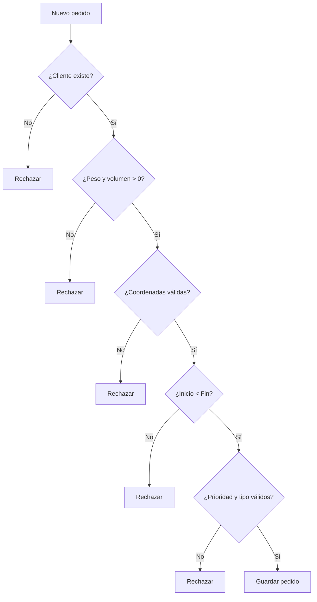

## 16.2. Ruta

La base de datos valida:

- existencia de ejecución;
- existencia de vehículo;
- existencia de conductor;
- métricas no negativas;
- estado válido.

Las validaciones algorítmicas más complejas, como:

- suma total de pesos por ruta;
- compatibilidad completa de horarios;
- restricciones geográficas;
- penalización multiobjetivo;

pertenecen principalmente a la capa de negocio/motor de optimización y posteriormente se persisten como resultado válido.

---

# 17. Trazabilidad de reoptimización

Una reoptimización se representa mediante:

`ejecucion_optimizacion.id_ejecucion_origen`

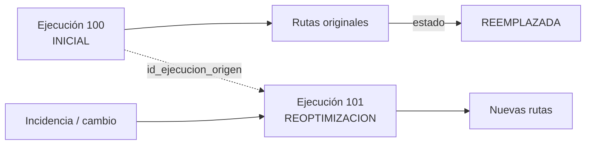

Esto permite responder:

- ¿qué ejecución originó la ruta?
- ¿qué reoptimización reemplazó el resultado?
- ¿qué rutas pertenecen a cada corrida?
- ¿cuánto demoró cada ejecución?

---

# 18. Datos geográficos

## 18.1. Línea base V1.0.0

Se almacenan:

```text
latitud  NUMERIC(9,6)
longitud NUMERIC(9,6)
```

Esto permite iniciar el MVP sin exigir PostGIS.

## 18.2. Evolución opcional a PostGIS

Si las pruebas demuestran necesidad de:

- consultas por radio;
- intersección con zonas;
- cálculo espacial;
- geometrías de rutas;
- índices espaciales;

se podrá incorporar PostGIS.

Ejemplo conceptual:

```sql
CREATE EXTENSION IF NOT EXISTS postgis;

-- Ejemplo futuro, no obligatorio en V1.0.0:
-- ALTER TABLE pedido ADD COLUMN ubicacion geometry(Point, 4326);
-- CREATE INDEX idx_pedido_ubicacion
--     ON pedido USING GIST (ubicacion);
```

---

# 19. Estrategia de catálogos

Para el MVP, algunos catálogos pequeños se expresan mediante `CHECK` para mantener simplicidad:

- prioridad;
- tipo de producto;
- estado de vehículo;
- estado de conductor;
- estado de pedido;
- estado de ruta;
- severidad.

Si el proyecto requiere parametrización dinámica, esos valores podrán migrarse a tablas catálogo.


---

# 20. Matriz de trazabilidad RF → Tablas

| Requisito | Tablas principales |
|---|---|
| RF-001 Gestión de vehículos | `vehiculo` |
| RF-002 / RF-003 Estado y elegibilidad de flota | `vehiculo`, `ruta` |
| RF-004 Gestión de pedidos | `pedido`, `cliente` |
| RF-005 Cambios en pedidos | `pedido`, `ejecucion_optimizacion` |
| RF-006 Generación de rutas | `ejecucion_optimizacion`, `ruta`, `ruta_parada`, `restriccion_operativa`, `observacion_trafico` |
| RF-007 Visualización de rutas | `ruta`, `ruta_parada`, `pedido` |
| RF-008 Dashboard | `ruta`, `indicador_ruta` |
| RF-009 Reportes | `ruta`, `indicador_ruta`, `vehiculo` |
| RF-010 Reoptimización | `ejecucion_optimizacion`, `ruta`, `incidencia` |
| RF-011 Conductores | `conductor` |
| RF-012 Disponibilidad de conductores | `conductor`, `ruta` |
| RF-013 Preferencias de clientes | `cliente`, `preferencia_cliente` |
| RF-014 Compensación | `indicador_ruta` |
| RF-015 Incidencias | `incidencia`, `ruta` |
| RF-016 Restricciones | `restriccion_operativa` |
| RF-017 Autenticación | `usuario` |
| RF-018 Autorización | `usuario`, `rol`, `usuario_rol` |

---

# 21. Matriz RN → Restricciones de Base de Datos

| Regla | Implementación principal |
|---|---|
| RN-001 | `usuario`, estado activo y capa de autenticación |
| RN-002 | `rol`, `usuario_rol` + capa de autorización |
| RN-003 | FK de conductor/ruta + filtrado por usuario |
| RN-004 | FK cliente/pedido/preferencia + filtrado de propiedad |
| RN-005 | `NOT NULL`, `CHECK`, `UNIQUE` en `vehiculo` |
| RN-007 | `NOT NULL`, `CHECK`, FK en `pedido` |
| RN-009 | `CHECK (ventana_inicio < ventana_fin)` |
| RN-010 | `CHECK prioridad` |
| RN-011 | `CHECK tipo_producto` |
| RN-012 | `NOT NULL` y `UNIQUE` en `conductor` |
| RN-013 | disponibilidad y estado de conductor |
| RN-015 | capacidad persistida; validación total en lógica de negocio |
| RN-023 | relación `id_ejecucion_origen` |
| RN-024 | FK entre ejecución, ruta y parada |
| RN-028 | campos de distancia, factor de emisión y CO₂ |
| RN-031 | `tiempo_ejecucion_seg` |
| RN-032 | `tiempo_ejecucion_seg` en reoptimización |
| RN-038 | `auditoria_evento` y FKs |

---

# 22. Consultas operativas de ejemplo

## 22.1. Pedidos pendientes

```sql
SELECT
    id_pedido,
    codigo,
    id_cliente,
    direccion,
    peso_kg,
    volumen_m3,
    ventana_inicio,
    ventana_fin,
    prioridad
FROM pedido
WHERE estado = 'PENDIENTE'
ORDER BY
    CASE prioridad
        WHEN 'EXPRESS' THEN 1
        WHEN 'ESTANDAR' THEN 2
        ELSE 3
    END,
    ventana_inicio;
```

## 22.2. Vehículos elegibles

```sql
SELECT
    id_vehiculo,
    placa,
    tipo,
    capacidad_kg,
    consumo_km_l,
    factor_emision_kg_km
FROM vehiculo
WHERE activo = TRUE
  AND estado = 'DISPONIBLE';
```

## 22.3. Conductores disponibles

```sql
SELECT
    id_conductor,
    dni,
    licencia,
    categoria_licencia,
    disponible_desde,
    disponible_hasta
FROM conductor
WHERE activo = TRUE
  AND estado = 'DISPONIBLE';
```

## 22.4. Ruta con secuencia de paradas

```sql
SELECT
    r.codigo AS ruta,
    rp.secuencia,
    p.codigo AS pedido,
    p.direccion,
    p.latitud,
    p.longitud,
    rp.llegada_estimada,
    rp.estado_entrega
FROM ruta r
JOIN ruta_parada rp
    ON rp.id_ruta = r.id_ruta
JOIN pedido p
    ON p.id_pedido = rp.id_pedido
WHERE r.id_ruta = :id_ruta
ORDER BY rp.secuencia;
```

## 22.5. Reoptimizaciones de una ejecución

```sql
SELECT
    e.id_ejecucion,
    e.id_ejecucion_origen,
    e.tipo,
    e.algoritmo,
    e.estado,
    e.tiempo_ejecucion_seg,
    e.iniciada_en
FROM ejecucion_optimizacion e
WHERE e.id_ejecucion = :id_ejecucion
   OR e.id_ejecucion_origen = :id_ejecucion
ORDER BY e.iniciada_en;
```

---

# 23. Vistas recomendadas

## 23.1. Resumen de ruta

```sql
CREATE VIEW vw_resumen_ruta AS
SELECT
    r.id_ruta,
    r.codigo AS codigo_ruta,
    r.estado,
    v.placa,
    c.dni AS conductor_dni,
    r.distancia_total_km,
    r.tiempo_estimado_min,
    r.combustible_estimado_l,
    r.co2_estimado_kg,
    i.cumplimiento_ventanas_pct,
    i.ahorro_economico,
    COUNT(rp.id_ruta_parada) AS total_paradas
FROM ruta r
JOIN vehiculo v ON v.id_vehiculo = r.id_vehiculo
JOIN conductor c ON c.id_conductor = r.id_conductor
LEFT JOIN indicador_ruta i ON i.id_ruta = r.id_ruta
LEFT JOIN ruta_parada rp ON rp.id_ruta = r.id_ruta
GROUP BY
    r.id_ruta,
    r.codigo,
    r.estado,
    v.placa,
    c.dni,
    r.distancia_total_km,
    r.tiempo_estimado_min,
    r.combustible_estimado_l,
    r.co2_estimado_kg,
    i.cumplimiento_ventanas_pct,
    i.ahorro_economico;
```

---

# 24. Seguridad y privacidad de datos

La base de datos no debe almacenar contraseñas en texto plano.

`password_hash` representa únicamente el valor derivado mediante un mecanismo seguro implementado en backend.

Además:

- los conductores no deben consultar datos de otros conductores;
- los clientes no deben consultar registros de otros clientes;
- el acceso directo a base de datos no forma parte del flujo normal del usuario;
- FastAPI será responsable de aplicar RBAC/ABAC;
- los secretos de conexión no deben almacenarse en el repositorio;
- los datos personales visibles en una ruta deben limitarse a lo necesario para la entrega;
- operaciones sensibles deben poder registrarse en `auditoria_evento`.

---

# 25. Ciclo de persistencia de una operación

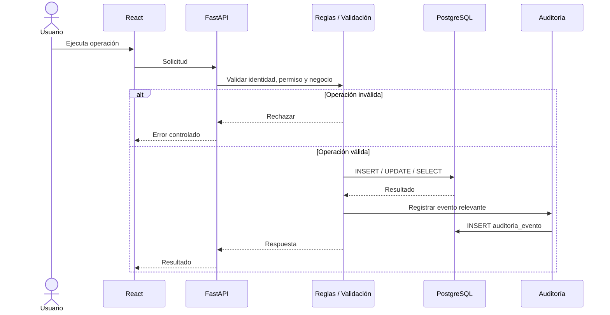

---

# 26. Estrategia de transacciones

Se recomienda utilizar transacciones para operaciones que afecten varias tablas.

Ejemplo: guardar una nueva optimización puede implicar:

1. crear `ejecucion_optimizacion`;
2. insertar una o más `ruta`;
3. insertar `ruta_parada`;
4. insertar `indicador_ruta`;
5. cambiar pedidos a `PLANIFICADO`;
6. registrar auditoría.

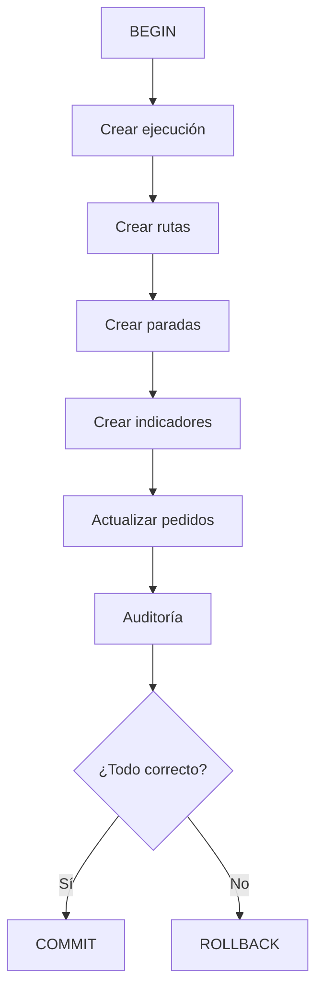

---

# 27. Respaldo y recuperación

Para el MVP académico se recomienda documentar una estrategia simple:

- respaldo lógico periódico mediante herramientas de PostgreSQL;
- restauración verificada en ambiente de prueba;
- exportación antes de cambios estructurales importantes;
- scripts DDL versionados en Git;
- migraciones controladas.

El documento no fija una frecuencia operativa definitiva porque la consigna no establece una política concreta de backup.

---

# 28. Versionamiento del esquema

Los cambios de base de datos deberán:

1. registrarse mediante scripts de migración;
2. evitar modificaciones manuales no documentadas;
3. actualizar el diccionario de datos;
4. actualizar el ERD si cambian relaciones;
5. actualizar la trazabilidad RF/RN;
6. conservar el historial en Git.

Ejemplo:

```text
backend/
└── migrations/
    ├── V001__schema_inicial.sql
    ├── V002__indices.sql
    └── V003__ajuste_rutas.sql
```

---

# 29. Validaciones que pertenecen al backend y no únicamente a SQL

No toda regla debe implementarse como `CHECK`.

La capa FastAPI / dominio debe validar:

- capacidad acumulada de pedidos por vehículo;
- superposición de disponibilidad;
- compatibilidad conductor–ruta;
- restricciones de tránsito activas;
- restricciones ambientales;
- zonas de riesgo;
- consistencia de reoptimización;
- límites de acceso RBAC/ABAC;
- métricas de algoritmo;
- cálculo de combustible y CO₂;
- equivalentes ambientales;
- reglas temporales complejas.

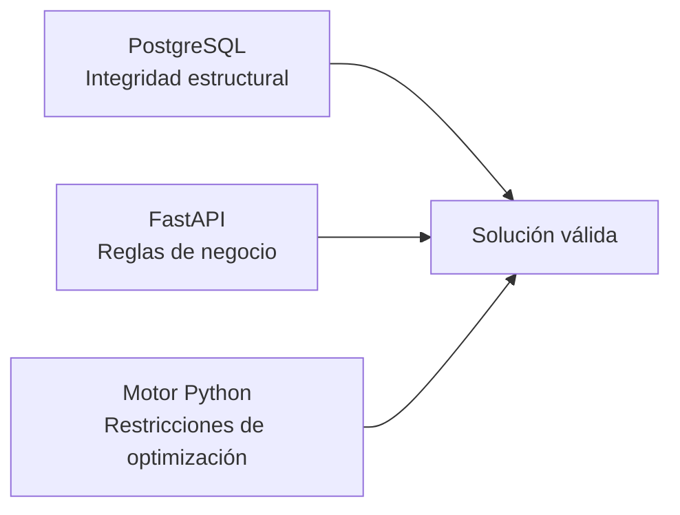

---

# 30. Criterios de aceptación del diseño de base de datos

El diseño V1.0.0 será considerado aceptable si:

1. existe una PK en cada entidad principal;
2. todas las relaciones principales están protegidas con FK;
3. se evita duplicación innecesaria de datos;
4. el modelo alcanza 3FN para las entidades operativas principales;
5. los pedidos conservan cliente, ubicación, peso, volumen y ventana;
6. vehículos y conductores conservan datos suficientes para optimización;
7. las rutas mantienen vínculo con ejecución, vehículo y conductor;
8. las paradas mantienen secuencia y relación con pedido;
9. la reoptimización mantiene relación con la ejecución de origen;
10. se puede trazar una incidencia hacia una ruta;
11. se pueden almacenar métricas de distancia, combustible y CO₂;
12. se soportan usuarios y roles;
13. se pueden almacenar restricciones operativas;
14. existen índices para las consultas operativas principales;
15. el DDL puede ejecutarse en PostgreSQL sin depender obligatoriamente de PostGIS.

---

# 31. Decisiones de diseño relevantes

| Decisión | Motivo |
|---|---|
| PostgreSQL como base principal | Stack seleccionado y naturaleza relacional |
| Coordenadas numéricas en V1.0.0 | Simplicidad del MVP |
| PostGIS opcional | Evitar dependencia temprana si no es necesaria |
| `usuario_rol` N:M | Flexibilidad RBAC |
| Ejecución de optimización separada de ruta | Permite trazabilidad y reoptimización |
| `ruta_parada` separada | Mantiene orden, horario y estado de cada entrega |
| Indicadores en tabla independiente | Separa resultado operativo de analítica |
| Auditoría separada | Evita mezclar historial con tablas transaccionales |
| JSONB solo para parámetros variables | Evita convertir todo el modelo en datos no estructurados |
| Eliminación restringida | Protege trazabilidad histórica |

---

# 32. Conclusión

El diseño de base de datos de **EcoLogística Lima V1.0.0** se estructura sobre PostgreSQL y separa claramente:

- seguridad;
- actores operativos;
- pedidos;
- recursos;
- optimización;
- rutas;
- incidencias;
- restricciones;
- indicadores;
- auditoría.

El modelo lógico se encuentra normalizado hasta **Tercera Forma Normal (3FN)** para las entidades principales y utiliza claves primarias, claves foráneas, restricciones `CHECK`, valores únicos e índices para proteger integridad y rendimiento.

La relación entre `ejecucion_optimizacion`, `ruta` y `ruta_parada` permite conservar la trazabilidad de una planificación inicial y sus posteriores reoptimizaciones.

Con esta base queda definido el modelo de datos que utilizará el siguiente artefacto:

`docs/01 Inicio/12. Modelo C4 V_1_0_0.md`

En dicho documento se mostrará cómo React, FastAPI, PostgreSQL, el motor de optimización y las integraciones externas se organizan arquitectónicamente en los niveles **Contexto, Contenedores y Componentes**.
