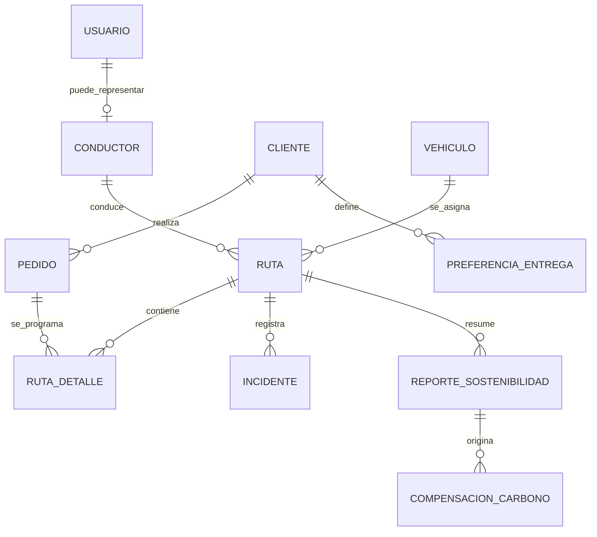

# 11. Diseño e ingeniería de base de datos

## 1. Metadatos

| Campo | Valor |
|---|---|
| Proyecto | **EcoLogística Huancayo - Optimizador de Rutas Sostenibles para DistriRápido S.A.C.** |
| Integrante | **Jordy Steve Chancasanampa Torres** |
| Fecha | **27/09/2026** |
| Versión | **1.0.0** |
| Motor propuesto | PostgreSQL |

## 2. Modelo conceptual


```mermaid
erDiagram
    USUARIO ||--o| CONDUCTOR : puede_representar
    CLIENTE ||--o{ PEDIDO : realiza
    CONDUCTOR ||--o{ RUTA : conduce
    VEHICULO ||--o{ RUTA : se_asigna
    RUTA ||--o{ RUTA_DETALLE : contiene
    PEDIDO ||--o{ RUTA_DETALLE : se_programa
    CLIENTE ||--o{ PREFERENCIA_ENTREGA : define
    RUTA ||--o{ INCIDENTE : registra
    RUTA ||--o{ REPORTE_SOSTENIBILIDAD : resume
    REPORTE_SOSTENIBILIDAD ||--o{ COMPENSACION_CARBONO : origina
```

## 3. Modelo lógico

### 3.1 `usuario`
- `usuario_id` UUID PK
- `email` VARCHAR(255) UNIQUE NOT NULL
- `password_hash` VARCHAR(255) NOT NULL
- `rol` VARCHAR(30) NOT NULL
- `estado` VARCHAR(20) NOT NULL
- `creado_en` TIMESTAMPTZ NOT NULL

### 3.2 `vehiculo`
- `vehiculo_id` UUID PK
- `placa` VARCHAR(15) UNIQUE NOT NULL
- `tipo` VARCHAR(30) NOT NULL
- `capacidad_kg` NUMERIC(10,2) NOT NULL
- `consumo_km_l` NUMERIC(8,3) NOT NULL
- `factor_emision_kg_km` NUMERIC(10,4) NOT NULL
- `anio_fabricacion` SMALLINT NOT NULL
- `estado` VARCHAR(20) NOT NULL

### 3.3 `conductor`
- `conductor_id` UUID PK
- `usuario_id` UUID FK nullable
- `nombre` VARCHAR(160) NOT NULL
- `dni` VARCHAR(20) UNIQUE NOT NULL
- `licencia` VARCHAR(30) NOT NULL
- `categoria_licencia` VARCHAR(20) NOT NULL
- `anios_experiencia` SMALLINT
- `disponible_desde`, `disponible_hasta` TIME
- `contacto` VARCHAR(50)

### 3.4 `cliente`
- `cliente_id` UUID PK
- `nombre` VARCHAR(160) NOT NULL
- `contacto` VARCHAR(80)
- `estado` VARCHAR(20) NOT NULL

### 3.5 `preferencia_entrega`
- `preferencia_id` UUID PK
- `cliente_id` UUID FK
- `hora_preferida_inicio`, `hora_preferida_fin` TIME
- `punto_referencia` TEXT
- `restriccion_acceso` TEXT

### 3.6 `pedido`
- `pedido_id` UUID PK
- `cliente_id` UUID FK
- `direccion` TEXT NOT NULL
- `punto_referencia` TEXT
- `latitud`, `longitud` NUMERIC
- `peso_kg` NUMERIC(10,2)
- `volumen_m3` NUMERIC(10,3)
- `ventana_inicio`, `ventana_fin` TIMESTAMPTZ
- `prioridad` VARCHAR(20)
- `tipo_producto` VARCHAR(30)
- `estado` VARCHAR(20)

### 3.7 `ruta`
- `ruta_id` UUID PK
- `vehiculo_id` UUID FK
- `conductor_id` UUID FK
- `estado` VARCHAR(20)
- `algoritmo` VARCHAR(50)
- `distancia_km`, `tiempo_min`, `combustible_l`, `co2_kg` NUMERIC
- `penalizacion_total` NUMERIC
- `creado_en` TIMESTAMPTZ

### 3.8 `ruta_detalle`
- `ruta_detalle_id` UUID PK
- `ruta_id` UUID FK
- `pedido_id` UUID FK
- `secuencia` INTEGER
- `eta` TIMESTAMPTZ
- `estado_entrega` VARCHAR(20)

### 3.9 `incidente`
- `incidente_id` UUID PK
- `ruta_id` UUID FK
- `tipo` VARCHAR(30)
- `descripcion` TEXT
- `latitud`, `longitud` NUMERIC
- `ocurrido_en` TIMESTAMPTZ

### 3.10 `reporte_sostenibilidad`
- `reporte_id` UUID PK
- `ruta_id` UUID FK nullable
- `periodo_inicio`, `periodo_fin` DATE
- `co2_kg`, `combustible_l`, `ahorro_estimado` NUMERIC
- `archivo_url` TEXT

### 3.11 `compensacion_carbono`
- `compensacion_id` UUID PK
- `reporte_id` UUID FK
- `co2_objetivo_kg` NUMERIC
- `descripcion_plan` TEXT

## 4. Normalización

El modelo se plantea en **Tercera Forma Normal (3FN)**:

1. cada tabla representa un concepto principal;
2. los atributos dependen de su clave primaria;
3. relaciones muchos-a-muchos o secuenciales se resuelven mediante tablas asociativas como `ruta_detalle`;
4. preferencias se separan de `cliente` para admitir evolución sin duplicación;
5. los reportes conservan resultados derivados necesarios para auditoría histórica.

## 5. Modelo físico - DDL PostgreSQL

```sql
CREATE EXTENSION IF NOT EXISTS pgcrypto;

CREATE TABLE usuario (
    usuario_id UUID PRIMARY KEY DEFAULT gen_random_uuid(),
    email VARCHAR(255) NOT NULL UNIQUE,
    password_hash VARCHAR(255) NOT NULL,
    rol VARCHAR(30) NOT NULL,
    estado VARCHAR(20) NOT NULL DEFAULT 'ACTIVO',
    creado_en TIMESTAMPTZ NOT NULL DEFAULT CURRENT_TIMESTAMP
);

CREATE TABLE vehiculo (
    vehiculo_id UUID PRIMARY KEY DEFAULT gen_random_uuid(),
    placa VARCHAR(15) NOT NULL UNIQUE,
    tipo VARCHAR(30) NOT NULL,
    capacidad_kg NUMERIC(10,2) NOT NULL CHECK (capacidad_kg > 0),
    consumo_km_l NUMERIC(8,3) NOT NULL CHECK (consumo_km_l > 0),
    factor_emision_kg_km NUMERIC(10,4) NOT NULL CHECK (factor_emision_kg_km >= 0),
    anio_fabricacion SMALLINT NOT NULL,
    estado VARCHAR(20) NOT NULL DEFAULT 'ACTIVO'
);

CREATE TABLE conductor (
    conductor_id UUID PRIMARY KEY DEFAULT gen_random_uuid(),
    usuario_id UUID NULL REFERENCES usuario(usuario_id),
    nombre VARCHAR(160) NOT NULL,
    dni VARCHAR(20) NOT NULL UNIQUE,
    licencia VARCHAR(30) NOT NULL,
    categoria_licencia VARCHAR(20) NOT NULL,
    anios_experiencia SMALLINT CHECK (anios_experiencia >= 0),
    disponible_desde TIME,
    disponible_hasta TIME,
    contacto VARCHAR(50)
);

CREATE TABLE cliente (
    cliente_id UUID PRIMARY KEY DEFAULT gen_random_uuid(),
    nombre VARCHAR(160) NOT NULL,
    contacto VARCHAR(80),
    estado VARCHAR(20) NOT NULL DEFAULT 'ACTIVO'
);

CREATE TABLE preferencia_entrega (
    preferencia_id UUID PRIMARY KEY DEFAULT gen_random_uuid(),
    cliente_id UUID NOT NULL REFERENCES cliente(cliente_id),
    hora_preferida_inicio TIME,
    hora_preferida_fin TIME,
    punto_referencia TEXT,
    restriccion_acceso TEXT,
    CHECK (
      hora_preferida_inicio IS NULL OR
      hora_preferida_fin IS NULL OR
      hora_preferida_inicio < hora_preferida_fin
    )
);

CREATE TABLE pedido (
    pedido_id UUID PRIMARY KEY DEFAULT gen_random_uuid(),
    cliente_id UUID NOT NULL REFERENCES cliente(cliente_id),
    direccion TEXT NOT NULL,
    punto_referencia TEXT,
    latitud NUMERIC(9,6),
    longitud NUMERIC(9,6),
    peso_kg NUMERIC(10,2) NOT NULL CHECK (peso_kg > 0),
    volumen_m3 NUMERIC(10,3) CHECK (volumen_m3 >= 0),
    ventana_inicio TIMESTAMPTZ NOT NULL,
    ventana_fin TIMESTAMPTZ NOT NULL,
    prioridad VARCHAR(20) NOT NULL,
    tipo_producto VARCHAR(30) NOT NULL,
    estado VARCHAR(20) NOT NULL DEFAULT 'PENDIENTE',
    CHECK (ventana_inicio < ventana_fin)
);

CREATE TABLE ruta (
    ruta_id UUID PRIMARY KEY DEFAULT gen_random_uuid(),
    vehiculo_id UUID NOT NULL REFERENCES vehiculo(vehiculo_id),
    conductor_id UUID NOT NULL REFERENCES conductor(conductor_id),
    estado VARCHAR(20) NOT NULL DEFAULT 'PLANIFICADA',
    algoritmo VARCHAR(50) NOT NULL,
    distancia_km NUMERIC(12,3) CHECK (distancia_km >= 0),
    tiempo_min NUMERIC(12,2) CHECK (tiempo_min >= 0),
    combustible_l NUMERIC(12,3) CHECK (combustible_l >= 0),
    co2_kg NUMERIC(12,3) CHECK (co2_kg >= 0),
    penalizacion_total NUMERIC(14,2) NOT NULL DEFAULT 0,
    creado_en TIMESTAMPTZ NOT NULL DEFAULT CURRENT_TIMESTAMP
);

CREATE TABLE ruta_detalle (
    ruta_detalle_id UUID PRIMARY KEY DEFAULT gen_random_uuid(),
    ruta_id UUID NOT NULL REFERENCES ruta(ruta_id) ON DELETE CASCADE,
    pedido_id UUID NOT NULL REFERENCES pedido(pedido_id),
    secuencia INTEGER NOT NULL CHECK (secuencia > 0),
    eta TIMESTAMPTZ,
    estado_entrega VARCHAR(20) NOT NULL DEFAULT 'PENDIENTE',
    UNIQUE (ruta_id, secuencia),
    UNIQUE (ruta_id, pedido_id)
);

CREATE TABLE incidente (
    incidente_id UUID PRIMARY KEY DEFAULT gen_random_uuid(),
    ruta_id UUID REFERENCES ruta(ruta_id),
    tipo VARCHAR(30) NOT NULL,
    descripcion TEXT,
    latitud NUMERIC(9,6),
    longitud NUMERIC(9,6),
    ocurrido_en TIMESTAMPTZ NOT NULL DEFAULT CURRENT_TIMESTAMP
);

CREATE TABLE reporte_sostenibilidad (
    reporte_id UUID PRIMARY KEY DEFAULT gen_random_uuid(),
    ruta_id UUID REFERENCES ruta(ruta_id),
    periodo_inicio DATE NOT NULL,
    periodo_fin DATE NOT NULL,
    co2_kg NUMERIC(14,3) NOT NULL DEFAULT 0,
    combustible_l NUMERIC(14,3) NOT NULL DEFAULT 0,
    ahorro_estimado NUMERIC(14,2) NOT NULL DEFAULT 0,
    archivo_url TEXT,
    CHECK (periodo_inicio <= periodo_fin)
);

CREATE TABLE compensacion_carbono (
    compensacion_id UUID PRIMARY KEY DEFAULT gen_random_uuid(),
    reporte_id UUID NOT NULL REFERENCES reporte_sostenibilidad(reporte_id),
    co2_objetivo_kg NUMERIC(14,3) NOT NULL CHECK (co2_objetivo_kg >= 0),
    descripcion_plan TEXT NOT NULL
);

CREATE INDEX idx_pedido_cliente ON pedido(cliente_id);
CREATE INDEX idx_pedido_estado ON pedido(estado);
CREATE INDEX idx_pedido_ventana ON pedido(ventana_inicio, ventana_fin);
CREATE INDEX idx_ruta_vehiculo ON ruta(vehiculo_id);
CREATE INDEX idx_ruta_conductor ON ruta(conductor_id);
CREATE INDEX idx_ruta_estado ON ruta(estado);
CREATE INDEX idx_ruta_detalle_pedido ON ruta_detalle(pedido_id);
CREATE INDEX idx_incidente_ruta ON incidente(ruta_id);
```

## 6. Integridad y seguridad

- Contraseñas: almacenar únicamente hashes seguros.
- Datos personales: acceso restringido por rol.
- Logs: no incluir credenciales.
- Backups: definidos en operación.
- Migraciones: cada cambio de esquema debe quedar versionado.
- Borrado: preferir estados o borrado lógico cuando exista trazabilidad histórica.
