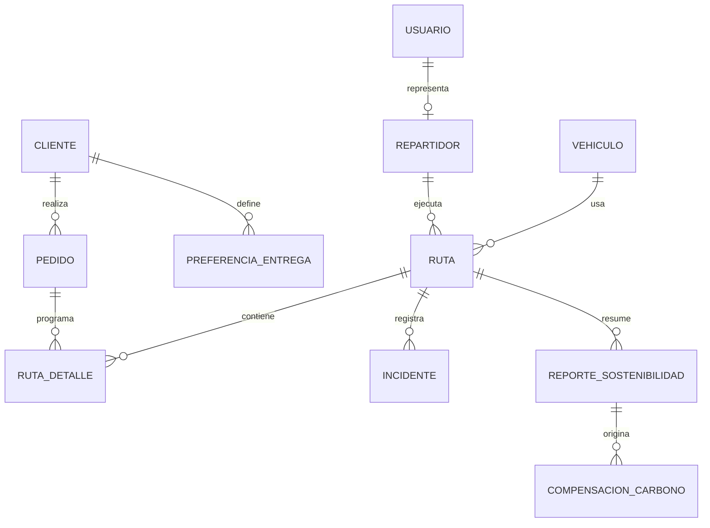

[⌂ README principal](../../README.md) | [← Anterior: 10. Stack tecnológico](10.%20Stack%20tecnol%C3%B3gico%20V_1_0_0.md) | [Siguiente: 12. Modelo C4 →](12.%20Modelo%20C4%20V_1_0_0.md)

# 11. Diseño e ingeniería de base de datos

## 1. Metadatos

| Campo | Valor |
|---|---|
| Proyecto | **EcoLogística Huancayo - Optimizador de Rutas Sostenibles para DistriRápido S.A.C.** |
| Integrante | **Jordy Steve Chancasanampa Torres** |
| Modalidad | Proyecto individual |
| Fecha | **27/09/2026** |
| Versión | **1.0.0** |
| Motor | PostgreSQL |

> **Resumen de la tabla:** resume la identificación y las decisiones base del documento. Permite comprobar que todos los artefactos pertenecen al mismo proyecto, versión e integrante.

## 2. Modelo conceptual


```mermaid
erDiagram
    USUARIO ||--o| REPARTIDOR : representa
    CLIENTE ||--o{ PEDIDO : realiza
    CLIENTE ||--o{ PREFERENCIA_ENTREGA : define
    VEHICULO ||--o{ RUTA : usa
    REPARTIDOR ||--o{ RUTA : ejecuta
    RUTA ||--o{ RUTA_DETALLE : contiene
    PEDIDO ||--o{ RUTA_DETALLE : programa
    RUTA ||--o{ INCIDENTE : registra
    RUTA ||--o{ REPORTE_SOSTENIBILIDAD : resume
    REPORTE_SOSTENIBILIDAD ||--o{ COMPENSACION_CARBONO : origina
```

> **Resumen del diagrama:** el pedido pertenece a un cliente; la ruta combina vehículo y repartidor; `ruta_detalle` conserva secuencia de pedidos; incidentes y reportes mantienen trazabilidad operativa.

## 3. Modelo lógico

| Entidad | PK | FK principales | Atributos clave | Normalización |
|---|---|---|---|---|
| usuario | usuario_id | - | email, password_hash, rol, estado | 3FN |
| vehiculo | vehiculo_id | - | placa, tipo, capacidad, consumo, factor_emision, año | 3FN |
| repartidor | repartidor_id | usuario_id | DNI, licencia, experiencia, disponibilidad, contacto | 3FN |
| cliente | cliente_id | - | nombre, contacto, estado | 3FN |
| preferencia_entrega | preferencia_id | cliente_id | horario, referencia, restricción | 3FN |
| pedido | pedido_id | cliente_id | dirección, GPS, peso, volumen, ventana, prioridad, tipo | 3FN |
| ruta | ruta_id | vehiculo_id, repartidor_id | algoritmo, distancia, tiempo, combustible, CO₂, estado | 3FN |
| ruta_detalle | ruta_detalle_id | ruta_id, pedido_id | secuencia, ETA, estado_entrega | 3FN |
| incidente | incidente_id | ruta_id, repartidor_id | tipo, descripción, ubicación, fecha | 3FN |
| reporte_sostenibilidad | reporte_id | ruta_id opcional | periodo, CO₂, combustible, ahorro | 3FN |
| compensacion_carbono | compensacion_id | reporte_id | CO₂ objetivo, plan | 3FN |

> **Resumen de la tabla:** muestra entidades, claves y responsabilidad de cada tabla. La separación evita duplicación y facilita auditoría de rutas y entregas.

## 4. Relaciones y cardinalidades

| Relación | Cardinalidad | Regla |
|---|---|---|
| Cliente-Pedido | 1:N | Un cliente puede tener múltiples pedidos. |
| Cliente-Preferencia | 1:N | Puede conservar distintas preferencias. |
| Vehículo-Ruta | 1:N | Un vehículo participa en múltiples rutas históricas. |
| Repartidor-Ruta | 1:N | Un repartidor puede ejecutar varias rutas en el tiempo. |
| Ruta-Pedido | N:M vía ruta_detalle | Permite secuencia y estado por asignación. |
| Ruta-Incidente | 1:N | Una ruta puede registrar varios eventos. |

> **Resumen de la tabla:** explica por qué existen claves foráneas y tablas intermedias; también evita relaciones ambiguas durante implementación.

## 5. Modelo físico DDL

```sql
CREATE EXTENSION IF NOT EXISTS pgcrypto;

CREATE TABLE usuario (
  usuario_id UUID PRIMARY KEY DEFAULT gen_random_uuid(),
  email VARCHAR(255) NOT NULL UNIQUE,
  password_hash VARCHAR(255) NOT NULL,
  rol VARCHAR(30) NOT NULL CHECK (rol IN ('ADMIN','REPARTIDOR')),
  estado VARCHAR(20) NOT NULL DEFAULT 'ACTIVO',
  creado_en TIMESTAMPTZ NOT NULL DEFAULT CURRENT_TIMESTAMP
);

CREATE TABLE vehiculo (
  vehiculo_id UUID PRIMARY KEY DEFAULT gen_random_uuid(),
  placa VARCHAR(15) NOT NULL UNIQUE,
  tipo VARCHAR(30) NOT NULL,
  capacidad_kg NUMERIC(10,2) NOT NULL CHECK (capacidad_kg > 0),
  consumo_km_l NUMERIC(8,3) NOT NULL CHECK (consumo_km_l > 0),
  factor_emision_kg_km NUMERIC(10,4) NOT NULL CHECK (factor_emision_kg_km >= 0),
  anio_fabricacion SMALLINT NOT NULL,
  estado VARCHAR(20) NOT NULL DEFAULT 'ACTIVO'
);

CREATE TABLE repartidor (
  repartidor_id UUID PRIMARY KEY DEFAULT gen_random_uuid(),
  usuario_id UUID NOT NULL UNIQUE REFERENCES usuario(usuario_id),
  nombre VARCHAR(160) NOT NULL,
  dni VARCHAR(20) NOT NULL UNIQUE,
  licencia VARCHAR(30) NOT NULL,
  categoria_licencia VARCHAR(20) NOT NULL,
  anios_experiencia SMALLINT CHECK (anios_experiencia >= 0),
  disponible_desde TIME,
  disponible_hasta TIME,
  contacto VARCHAR(50)
);

CREATE TABLE cliente (
  cliente_id UUID PRIMARY KEY DEFAULT gen_random_uuid(),
  nombre VARCHAR(160) NOT NULL,
  contacto VARCHAR(80),
  estado VARCHAR(20) NOT NULL DEFAULT 'ACTIVO'
);

CREATE TABLE preferencia_entrega (
  preferencia_id UUID PRIMARY KEY DEFAULT gen_random_uuid(),
  cliente_id UUID NOT NULL REFERENCES cliente(cliente_id),
  hora_preferida_inicio TIME,
  hora_preferida_fin TIME,
  punto_referencia TEXT,
  restriccion_acceso TEXT,
  CHECK (hora_preferida_inicio IS NULL OR hora_preferida_fin IS NULL OR hora_preferida_inicio < hora_preferida_fin)
);

CREATE TABLE pedido (
  pedido_id UUID PRIMARY KEY DEFAULT gen_random_uuid(),
  cliente_id UUID NOT NULL REFERENCES cliente(cliente_id),
  direccion TEXT NOT NULL,
  punto_referencia TEXT,
  latitud NUMERIC(9,6),
  longitud NUMERIC(9,6),
  peso_kg NUMERIC(10,2) NOT NULL CHECK (peso_kg > 0),
  volumen_m3 NUMERIC(10,3) CHECK (volumen_m3 >= 0),
  ventana_inicio TIMESTAMPTZ NOT NULL,
  ventana_fin TIMESTAMPTZ NOT NULL,
  prioridad VARCHAR(20) NOT NULL CHECK (prioridad IN ('EXPRESS','ESTANDAR','ECONOMICO')),
  tipo_producto VARCHAR(30) NOT NULL,
  estado VARCHAR(20) NOT NULL DEFAULT 'PENDIENTE',
  CHECK (ventana_inicio < ventana_fin)
);

CREATE TABLE ruta (
  ruta_id UUID PRIMARY KEY DEFAULT gen_random_uuid(),
  vehiculo_id UUID NOT NULL REFERENCES vehiculo(vehiculo_id),
  repartidor_id UUID NOT NULL REFERENCES repartidor(repartidor_id),
  estado VARCHAR(20) NOT NULL DEFAULT 'PLANIFICADA',
  algoritmo VARCHAR(50) NOT NULL,
  distancia_km NUMERIC(12,3) CHECK (distancia_km >= 0),
  tiempo_min NUMERIC(12,2) CHECK (tiempo_min >= 0),
  combustible_l NUMERIC(12,3) CHECK (combustible_l >= 0),
  co2_kg NUMERIC(12,3) CHECK (co2_kg >= 0),
  penalizacion_total NUMERIC(14,2) NOT NULL DEFAULT 0,
  creado_en TIMESTAMPTZ NOT NULL DEFAULT CURRENT_TIMESTAMP
);

CREATE TABLE ruta_detalle (
  ruta_detalle_id UUID PRIMARY KEY DEFAULT gen_random_uuid(),
  ruta_id UUID NOT NULL REFERENCES ruta(ruta_id) ON DELETE CASCADE,
  pedido_id UUID NOT NULL REFERENCES pedido(pedido_id),
  secuencia INTEGER NOT NULL CHECK (secuencia > 0),
  eta TIMESTAMPTZ,
  estado_entrega VARCHAR(20) NOT NULL DEFAULT 'PENDIENTE',
  UNIQUE (ruta_id, secuencia),
  UNIQUE (ruta_id, pedido_id)
);

CREATE TABLE incidente (
  incidente_id UUID PRIMARY KEY DEFAULT gen_random_uuid(),
  ruta_id UUID NOT NULL REFERENCES ruta(ruta_id),
  repartidor_id UUID NOT NULL REFERENCES repartidor(repartidor_id),
  tipo VARCHAR(30) NOT NULL,
  descripcion TEXT,
  latitud NUMERIC(9,6),
  longitud NUMERIC(9,6),
  ocurrido_en TIMESTAMPTZ NOT NULL DEFAULT CURRENT_TIMESTAMP
);

CREATE TABLE reporte_sostenibilidad (
  reporte_id UUID PRIMARY KEY DEFAULT gen_random_uuid(),
  ruta_id UUID REFERENCES ruta(ruta_id),
  periodo_inicio DATE NOT NULL,
  periodo_fin DATE NOT NULL,
  co2_kg NUMERIC(14,3) NOT NULL DEFAULT 0,
  combustible_l NUMERIC(14,3) NOT NULL DEFAULT 0,
  ahorro_estimado NUMERIC(14,2) NOT NULL DEFAULT 0,
  archivo_url TEXT,
  CHECK (periodo_inicio <= periodo_fin)
);

CREATE TABLE compensacion_carbono (
  compensacion_id UUID PRIMARY KEY DEFAULT gen_random_uuid(),
  reporte_id UUID NOT NULL REFERENCES reporte_sostenibilidad(reporte_id),
  co2_objetivo_kg NUMERIC(14,3) NOT NULL CHECK (co2_objetivo_kg >= 0),
  descripcion_plan TEXT NOT NULL
);

CREATE INDEX idx_pedido_cliente ON pedido(cliente_id);
CREATE INDEX idx_pedido_estado ON pedido(estado);
CREATE INDEX idx_pedido_ventana ON pedido(ventana_inicio, ventana_fin);
CREATE INDEX idx_ruta_vehiculo ON ruta(vehiculo_id);
CREATE INDEX idx_ruta_repartidor ON ruta(repartidor_id);
CREATE INDEX idx_ruta_estado ON ruta(estado);
CREATE INDEX idx_ruta_detalle_pedido ON ruta_detalle(pedido_id);
CREATE INDEX idx_incidente_ruta ON incidente(ruta_id);
```

> **Resumen del DDL:** el esquema implementa PK/FK, validaciones básicas e índices frecuentes. Las migraciones reales deberán versionarse y no ejecutarse manualmente en producción.

---

[⌂ README principal](../../README.md) | [← Anterior: 10. Stack tecnológico](10.%20Stack%20tecnol%C3%B3gico%20V_1_0_0.md) | [Siguiente: 12. Modelo C4 →](12.%20Modelo%20C4%20V_1_0_0.md)
