# Arquitectura de Software - Modelo C4

## 1. Metadatos del documento

| Campo | Información |
|---|---|
| Nombre del proyecto | EcoLogística Lima - Optimizador de Rutas Sostenibles para DistriRápido S.A.C. |
| Integrante | Jordy Steve Chancasanampa Torres |
| Fecha | 04/09/2026 |
| Versión | 1.0.0 |
| Estado | Arquitectura lógica inicial del MVP |
| Estilo arquitectónico | Monolito modular web con separación por capas |
| Stack base | React + FastAPI/Python + PostgreSQL + Leaflet/OpenStreetMap |
| Ruta de repositorio | `docs/01 Inicio/12. Modelo C4 V_1_0_0.md` |

---

# 2. Objetivo del documento

El presente documento describe la arquitectura de **EcoLogística Lima** mediante el **Modelo C4**, representando progresivamente el sistema desde su relación con usuarios y sistemas externos hasta los componentes internos del backend.

La arquitectura se construye sobre las decisiones ya establecidas en los documentos anteriores:

- aplicación web responsive;
- frontend en React;
- backend en Python con FastAPI;
- base de datos PostgreSQL;
- visualización geográfica con Leaflet/OpenStreetMap;
- integración desacoplada con fuentes de tráfico;
- motor de optimización implementado en Python;
- control de acceso RBAC/ABAC;
- API REST/JSON;
- documentación OpenAPI;
- arquitectura modular, evitando microservicios innecesarios para el MVP.

El objetivo principal es hacer visible **quién usa el sistema, qué contenedores lo conforman, cómo se comunican y qué componentes internos implementan las responsabilidades principales**.

---

# 3. Alcance del Modelo C4

La versión V1.0.0 incluye los tres niveles solicitados:

1. **Nivel 1 — Diagrama de Contexto**
2. **Nivel 2 — Diagrama de Contenedores**
3. **Nivel 3 — Diagrama de Componentes**

Además, para mejorar la comprensión se incorporan diagramas complementarios de:

- flujo de optimización;
- flujo de reoptimización;
- límites de seguridad;
- persistencia;
- despliegue conceptual;
- trazabilidad arquitectura → requisitos.

> **Nota de modelado:** los diagramas se escriben en `mermaid` para que puedan mantenerse en el repositorio como código. Se utiliza notación C4 adaptada a Mermaid mediante `flowchart`, ya que esto facilita su renderización en herramientas compatibles sin depender de imágenes externas.

---

# 4. Principios Arquitectónicos

| Principio | Aplicación en EcoLogística Lima |
|---|---|
| Separación de responsabilidades | React presenta; FastAPI coordina; PostgreSQL persiste; Python optimiza |
| Monolito modular | El backend se despliega como una unidad, pero internamente está dividido en módulos |
| Bajo acoplamiento | Mapas y tráfico se acceden mediante adaptadores |
| Alta cohesión | Cada módulo concentra responsabilidades del mismo dominio |
| Seguridad por diseño | Autenticación, autorización y validación antes de ejecutar reglas |
| API como frontera | Frontend y backend se comunican mediante REST/JSON |
| Trazabilidad | Rutas, optimizaciones, incidencias y auditoría conservan relación |
| Escalabilidad evolutiva | La arquitectura puede separarse más adelante si las métricas lo justifican |
| Eco-Design | Evitar llamadas, cálculos y transferencias innecesarias |
| Simplicidad del MVP | No se incorporan microservicios, colas o caché sin evidencia de necesidad |

---

# 5. Vista General de la Arquitectura

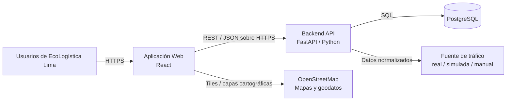

Esta vista resume la solución completa antes de entrar a los niveles C4.

---

# 6. Nivel 1 — Diagrama de Contexto

## 6.1. Propósito

El diagrama de contexto muestra a **EcoLogística Lima como una única caja** y representa las personas y sistemas externos que interactúan con ella.

## 6.2. Actores

| Actor | Tipo | Interacción principal |
|---|---|---|
| Administrador | Persona | Gestiona usuarios, parámetros, datos maestros y restricciones |
| Gerencia de Operaciones | Persona | Consulta KPIs y reportes |
| Coordinador / Despachador | Persona | Gestiona pedidos, recursos, genera y reoptimiza rutas |
| Conductor | Persona | Consulta ruta asignada y registra incidencias/estados |
| Cliente | Persona | Registra preferencias y consulta información autorizada |
| Docente / Auditor académico | Persona | Consulta evidencia, reportes y resultados en ambiente de demostración |
| Servicio cartográfico | Sistema externo | Proporciona mapas/geodatos |
| Fuente de tráfico | Sistema externo | Proporciona tráfico o incidencias cuando está disponible |
| Datos simulados / carga manual | Fuente alternativa | Permite validación académica si no existe fuente externa disponible |

## 6.3. Diagrama de Contexto

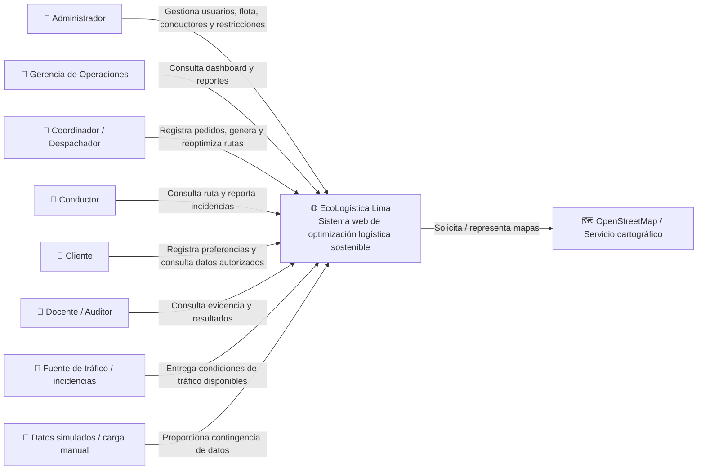

---

# 7. Explicación del Contexto

## Administrador

Mantiene la configuración global y los datos maestros del sistema. Su acceso está limitado por controles RBAC/ABAC y debe conservar trazabilidad para acciones críticas.

## Gerencia de Operaciones

Consume información agregada: distancia, cumplimiento de ventanas, combustible, CO₂, ahorro económico y reportes.

## Coordinador / Despachador

Es el actor operativo con mayor interacción funcional. Coordina pedidos, vehículos, conductores, restricciones, optimización y reoptimización.

## Conductor

Accede únicamente a la información asignada: ruta, entregas, alertas e incidencias necesarias para su operación.

## Cliente

Interactúa de forma limitada sobre información propia, especialmente preferencias de entrega y datos autorizados del pedido.

## Sistemas externos

OpenStreetMap y las fuentes de tráfico **no forman parte de EcoLogística Lima**. La arquitectura los trata como dependencias externas y evita que una de ellas se convierta en un punto único de bloqueo.

---

# 8. Nivel 2 — Diagrama de Contenedores

## 8.1. Decisión de contenedores

Para el MVP se definen **tres contenedores principales**:

1. Aplicación Web React.
2. Backend API FastAPI.
3. Base de Datos PostgreSQL.

El motor de optimización **no se modela como microservicio independiente en V1.0.0**. Se implementa como un componente interno del backend FastAPI, manteniendo el despliegue simple para un proyecto de 14 semanas desarrollado por un único integrante.

## 8.2. Tabla de Contenedores

| ID | Contenedor | Tecnología | Responsabilidad |
|---|---|---|---|
| C-01 | Web Application | React + JavaScript/TypeScript + Leaflet | Interfaz, formularios, dashboard, mapas y modo conductor |
| C-02 | Backend API | Python + FastAPI | API REST, seguridad, reglas, optimización, integraciones y reportes |
| C-03 | Base de Datos | PostgreSQL | Persistencia relacional y trazabilidad |

## 8.3. Diagrama de Contenedores

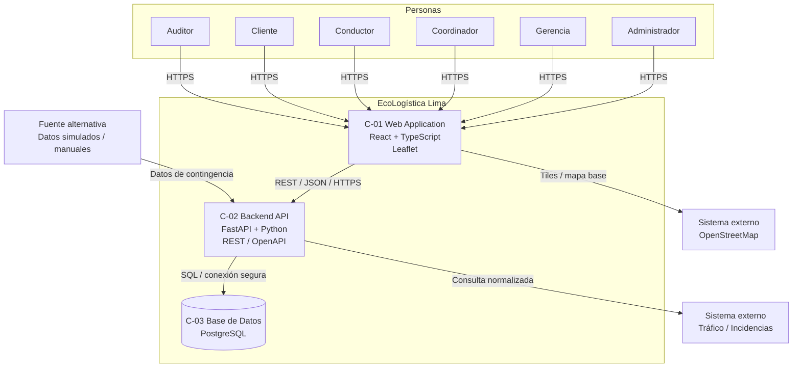

---

# 9. Responsabilidades por Contenedor

## 9.1. C-01 — Web Application

Responsabilidades:

- autenticación desde la interfaz;
- presentación de formularios;
- dashboard;
- mapa interactivo;
- visualización de rutas;
- modo conductor;
- captura de incidencias;
- presentación de errores;
- validaciones de experiencia de usuario;
- accesibilidad WCAG aplicable;
- consumo de API REST.

No debe:

- calcular una ruta como autoridad de negocio;
- decidir permisos por sí sola;
- acceder directamente a PostgreSQL.

## 9.2. C-02 — Backend API

Responsabilidades:

- autenticación;
- autorización RBAC/ABAC;
- validación de datos;
- reglas de negocio;
- gestión de pedidos;
- flota y conductores;
- motor de optimización;
- reoptimización;
- integración con tráfico;
- generación de indicadores;
- reportes;
- persistencia;
- auditoría;
- documentación OpenAPI.

## 9.3. C-03 — PostgreSQL

Responsabilidades:

- integridad referencial;
- almacenamiento transaccional;
- usuarios y roles;
- vehículos;
- conductores;
- clientes;
- pedidos;
- restricciones;
- incidencias;
- ejecuciones de optimización;
- rutas y paradas;
- indicadores;
- auditoría.

---

# 10. Comunicación entre Contenedores

| Origen | Destino | Protocolo / formato | Ejemplo |
|---|---|---|---|
| Navegador | React | HTTPS | Carga de aplicación |
| React | FastAPI | HTTPS + REST + JSON | `/api/v1/rutas/optimizar` |
| FastAPI | PostgreSQL | SQL | Consulta/actualización |
| React | OpenStreetMap | HTTPS | Tiles o capas base |
| FastAPI | Fuente de tráfico | HTTPS/API o adaptador | Consulta de condiciones |
| Carga manual | FastAPI | REST/JSON | Registro de incidencia/tráfico |

---

# 11. Nivel 3 — Diagrama de Componentes del Backend

## 11.1. Objetivo

Este nivel muestra la **estructuración interna del contenedor Backend API**, como exige la consigna: controladores, servicios, repositorios y middleware de seguridad, ampliados con los componentes específicos del dominio de EcoLogística Lima.

## 11.2. Componentes del Backend

| ID | Componente | Responsabilidad |
|---|---|---|
| CMP-01 | Routers / Controllers | Recibir solicitudes HTTP y entregar respuestas |
| CMP-02 | Security Middleware | Autenticación, roles, atributos y contexto |
| CMP-03 | Application Services | Orquestar casos de uso |
| CMP-04 | Domain Validators / Rules | Aplicar RN-001 a RN-038 y validaciones |
| CMP-05 | Optimization Service | Ejecutar VRPTW/Green VRP y reoptimización |
| CMP-06 | Fleet & Driver Service | Gestionar vehículos, conductores y elegibilidad |
| CMP-07 | Order & Client Service | Gestionar pedidos, clientes y preferencias |
| CMP-08 | Route Service | Gestionar rutas, paradas, estados y asignaciones |
| CMP-09 | Indicator & Report Service | Calcular KPIs y generar reportes |
| CMP-10 | Incident Service | Registrar incidencias y disparadores de reoptimización |
| CMP-11 | Integration Adapters | Aislar mapas, tráfico y fuentes alternativas |
| CMP-12 | Repository Layer | Persistencia y consultas PostgreSQL |
| CMP-13 | Audit Service | Registrar eventos relevantes |
| CMP-14 | API Schemas / DTO | Validar entrada/salida y contratos JSON |

## 11.3. Diagrama de Componentes

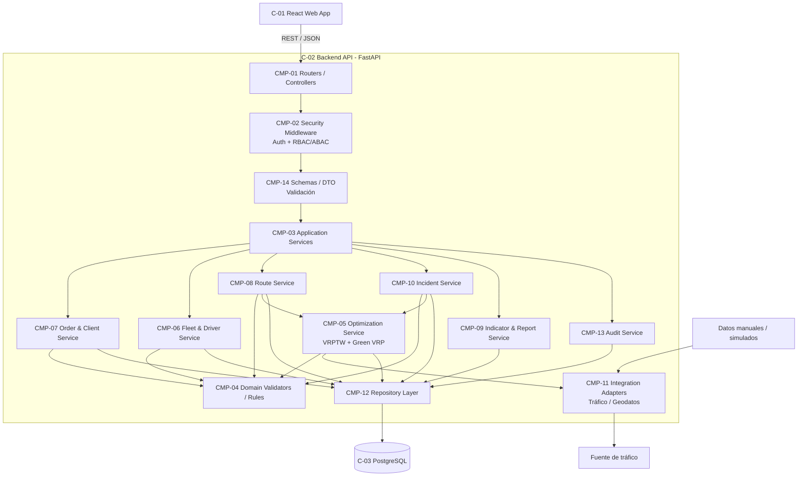

---

# 12. Dependencias permitidas entre Componentes

Para evitar acoplamiento excesivo se aplican las siguientes reglas:

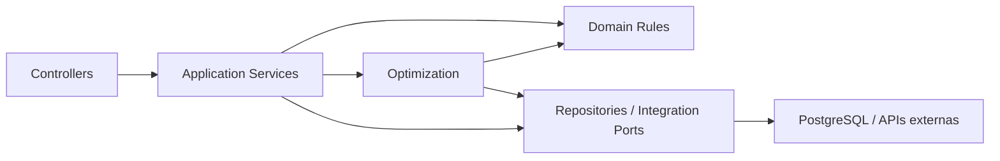

### Regla arquitectónica

Los controladores **no acceden directamente a PostgreSQL**.

Los componentes de dominio **no deben depender de React ni de detalles de infraestructura**.

---

# 13. Componentes de Seguridad


Una solicitud se ejecuta únicamente después de superar las fronteras de identidad, permiso, contexto y validación.

---

# 14. Componentes del Frontend — Vista Complementaria

Aunque el Nivel 3 obligatorio se concentra en la API, el frontend se organiza conceptualmente en módulos.

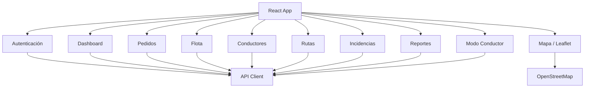

---

# 15. Flujo Arquitectónico de Optimización

```mermaid
sequenceDiagram
    actor C as Coordinador
    participant FE as React
    participant API as Router FastAPI
    participant SEC as Seguridad
    participant APP as Servicio de Aplicación
    participant REP as Repositorios
    participant DB as PostgreSQL
    participant INT as Adaptador Tráfico
    participant OPT as Motor Optimización

    C->>FE: Solicita generar rutas
    FE->>API: POST /rutas/optimizar
    API->>SEC: Validar identidad y permiso
    SEC-->>API: Autorizado
    API->>APP: Ejecutar caso de uso
    APP->>REP: Obtener pedidos, flota y conductores
    REP->>DB: SELECT
    DB-->>REP: Datos operativos
    REP-->>APP: Datos válidos
    APP->>INT: Obtener condiciones disponibles
    INT-->>APP: Tráfico / contingencia
    APP->>OPT: Optimizar escenario
    OPT-->>APP: Rutas + métricas
    APP->>REP: Persistir ejecución, rutas y paradas
    REP->>DB: TRANSACTION
    DB-->>REP: Commit
    APP-->>API: Resultado
    API-->>FE: JSON
    FE-->>C: Mapa + indicadores
```

---

# 16. Flujo Arquitectónico de Reoptimización

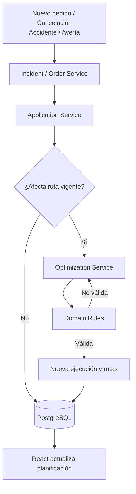

---

# 17. Arquitectura de Persistencia

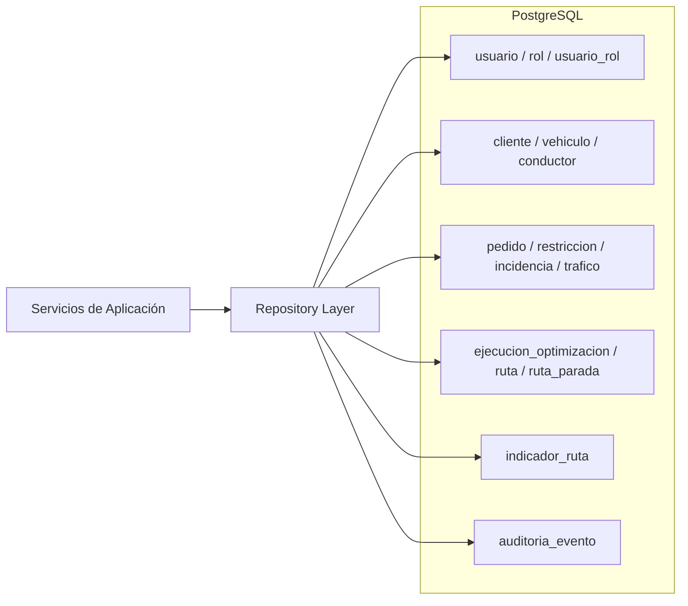

---

# 18. Manejo de Integraciones Externas

Las fuentes externas se aíslan mediante adaptadores.

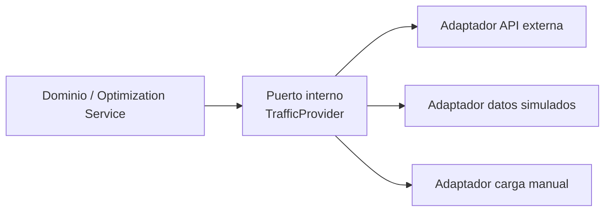

### Beneficio

Si una API externa deja de estar disponible, la lógica de optimización no debe cambiar. Solo cambia el adaptador o la fuente utilizada.

---

# 19. Vista de Despliegue Conceptual

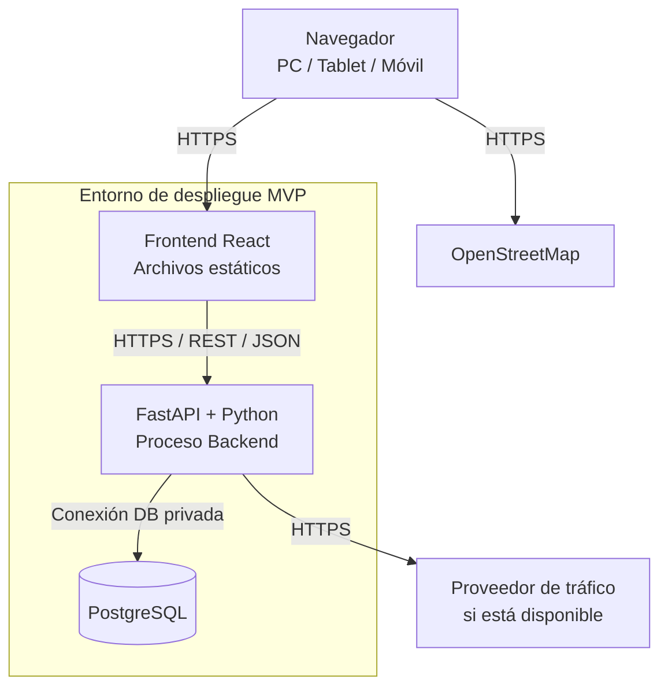

## 19.1. Consideración de V1.0.0

No se fija todavía un proveedor cloud específico. La consigna menciona servicios cloud como posibles dependencias, pero la decisión de AWS, Azure, Google Cloud u otra plataforma corresponde al despliegue posterior.

---

# 20. Fronteras de Confianza

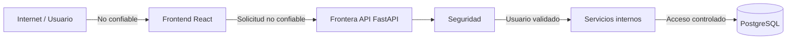

### Reglas

- todo dato recibido desde frontend se valida;
- React no es una frontera de seguridad suficiente;
- la autorización se repite en backend;
- PostgreSQL no se expone al navegador;
- secretos de conexión permanecen fuera del repositorio;
- consultas deben realizarse de manera parametrizada.

---

# 21. Trazabilidad Arquitectónica con Requisitos Funcionales

| Elemento C4 | RF principales |
|---|---|
| React — Pedidos | RF-004, RF-005 |
| React — Flota | RF-001, RF-002, RF-003 |
| React — Conductores | RF-011, RF-012 |
| React — Mapas/Rutas | RF-007 |
| React — Dashboard | RF-008 |
| React — Reportes | RF-009 |
| React — Modo Conductor | RF-007, RF-015, RF-018 |
| FastAPI — Order Service | RF-004, RF-005, RF-013 |
| FastAPI — Fleet Service | RF-001, RF-002, RF-003, RF-011, RF-012 |
| Optimization Service | RF-006, RF-010, RF-016 |
| Incident Service | RF-015 |
| Report Service | RF-008, RF-009, RF-014 |
| Security Middleware | RF-017, RF-018 |
| Integration Adapters | RF-006, RF-010, RF-015 |
| PostgreSQL | Soporte transversal RF-001 a RF-018 |

---

# 22. Trazabilidad Arquitectónica con RNF

| RNF | Decisión arquitectónica |
|---|---|
| RNF-001 Rendimiento | Motor de optimización como módulo independiente dentro de backend para medir y perfilar |
| RNF-002 Reoptimización | Caso de uso y ejecución separada con trazabilidad |
| RNF-003 Seguridad | Middleware + RBAC/ABAC |
| RNF-004 Protección de datos | Backend como única vía de acceso normal a PostgreSQL |
| RNF-005 Accesibilidad | React y componentes accesibles |
| RNF-006 Escalabilidad | Separación frontend/API/DB permite evolucionar cada contenedor |
| RNF-007 Usabilidad | Módulos por perfil y modo conductor |
| RNF-008 Disponibilidad | Bajo número de contenedores y dependencias desacopladas |
| RNF-009 Conectividad limitada | Payloads REST reducidos y carga selectiva |
| RNF-010 Documentación | OpenAPI + Markdown |
| RNF-011 Cobertura MVP | Arquitectura modular y control de alcance |
| RNF-012 Compatibilidad | Frontend basado en estándares web |
| RNF-013 Mantenibilidad/Trazabilidad | Servicios, repositorios, componentes y auditoría separados |

---

# 23. Trazabilidad Arquitectónica con Reglas de Negocio

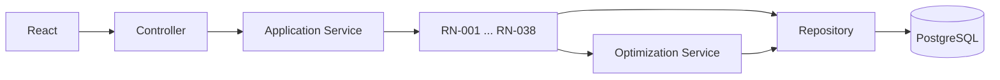

Las reglas de negocio no deben implementarse exclusivamente en la interfaz. La autoridad de validación se mantiene en backend y dominio.

---

# 24. Mapeo de Componentes con Tablas

| Componente | Tablas principales |
|---|---|
| Security Middleware / Auth Service | `usuario`, `rol`, `usuario_rol` |
| Order & Client Service | `cliente`, `preferencia_cliente`, `pedido` |
| Fleet & Driver Service | `vehiculo`, `conductor` |
| Incident Service | `incidencia` |
| Integration Adapter | `observacion_trafico` cuando se persiste |
| Optimization Service | `ejecucion_optimizacion`, `restriccion_operativa` |
| Route Service | `ruta`, `ruta_parada` |
| Indicator & Report Service | `indicador_ruta`, `ruta`, `vehiculo` |
| Audit Service | `auditoria_evento` |

---

# 25. Decisiones Arquitectónicas Principales

## ADR-01 — Monolito modular para el MVP

**Decisión:** utilizar un backend FastAPI único con módulos internos.

**Motivo:** el proyecto es desarrollado por un único integrante en 14 semanas y no existe evidencia que justifique microservicios.

**Consecuencia positiva:** menor complejidad de despliegue.

**Consecuencia:** los límites internos deben respetarse mediante estructura de código y responsabilidades claras.

---

## ADR-02 — API REST como frontera entre React y FastAPI

**Decisión:** utilizar REST/JSON sobre HTTPS.

**Motivo:** simplicidad, interoperabilidad, documentación OpenAPI y compatibilidad con el stack.

---

## ADR-03 — Motor de optimización como componente del backend

**Decisión:** implementar el motor en Python dentro del contenedor FastAPI.

**Motivo:** evitar crear un servicio distribuido antes de demostrar necesidad.

**Evolución futura:** si el cálculo exige aislamiento o escalamiento independiente, podrá extraerse sin cambiar el dominio funcional.

---

## ADR-04 — PostgreSQL como única base transaccional principal

**Decisión:** centralizar persistencia relacional en PostgreSQL.

**Motivo:** coherencia con el diseño de Base de Datos V1.0.0 y con la restricción tecnológica de la consigna.

---

## ADR-05 — Integraciones externas mediante adaptadores

**Decisión:** no acoplar el dominio a Waze, Google Maps u otra fuente específica.

**Motivo:** disponibilidad, costo y precisión no están bajo control del proyecto.

---

## ADR-06 — OpenStreetMap + Leaflet para visualización

**Decisión:** utilizar Leaflet en frontend y OpenStreetMap como opción principal de mapa base.

**Motivo:** alineación con el stack seleccionado y reducción de dependencia propietaria.

---

# 26. Arquitectura y Escenarios de Fallo

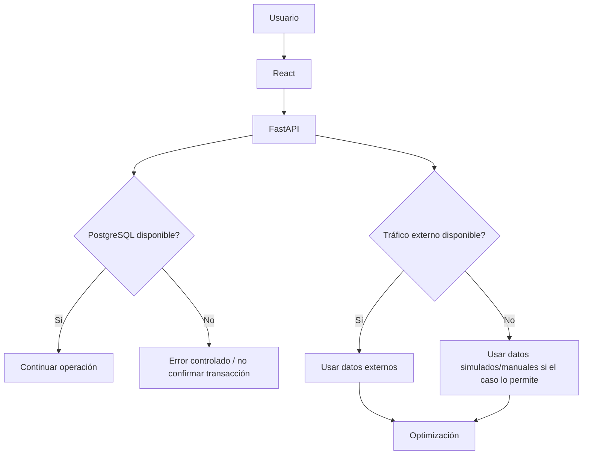

### Principios de respuesta ante fallos

- no confirmar datos parciales;
- mantener mensajes explícitos;
- utilizar transacciones;
- permitir contingencia de tráfico;
- registrar fallos relevantes;
- no exponer detalles internos sensibles al usuario.

---

# 27. Arquitectura para Cumplimiento de Rendimiento

Los tiempos definidos para el proyecto son:

- generación de ruta: **≤ 45 segundos** para hasta 150 pedidos y 15 vehículos;
- reoptimización: **< 30 segundos** ante cambios críticos.

La arquitectura permite medir estos tiempos en el componente `Optimization Service`.

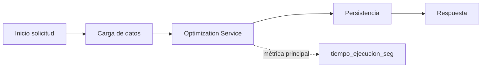

La base de datos almacena `tiempo_ejecucion_seg` en `ejecucion_optimizacion` para conservar evidencia.

---

# 28. Arquitectura para Accesibilidad y Modo Conductor

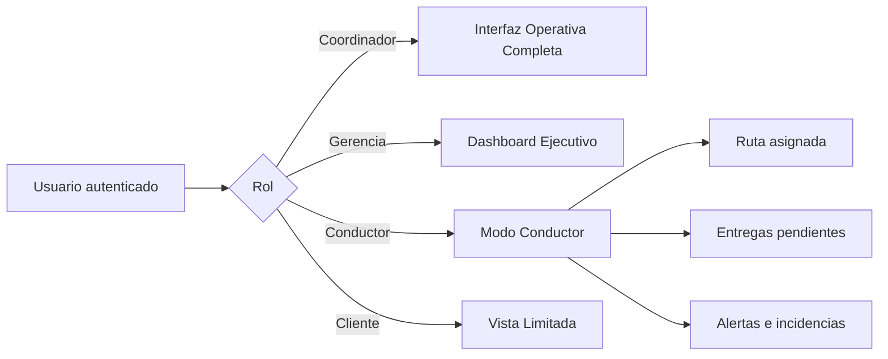

El frontend adapta la experiencia, pero los permisos reales son validados en backend.

---

# 29. Estructura de Código Derivada del Modelo C4

```text
ecologistica-lima/
│
├── frontend/
│   └── src/
│       ├── app/
│       ├── components/
│       ├── features/
│       │   ├── auth/
│       │   ├── orders/
│       │   ├── fleet/
│       │   ├── drivers/
│       │   ├── routes/
│       │   ├── dashboard/
│       │   ├── incidents/
│       │   └── reports/
│       ├── maps/
│       └── services/
│
├── backend/
│   └── app/
│       ├── api/
│       │   └── routers/
│       ├── auth/
│       ├── schemas/
│       ├── services/
│       ├── domain/
│       │   └── rules/
│       ├── optimization/
│       ├── repositories/
│       ├── integrations/
│       ├── models/
│       └── audit/
│
├── tests/
│
└── docs/
    └── 01 Inicio/
```

---

# 30. Relación entre los Niveles C4

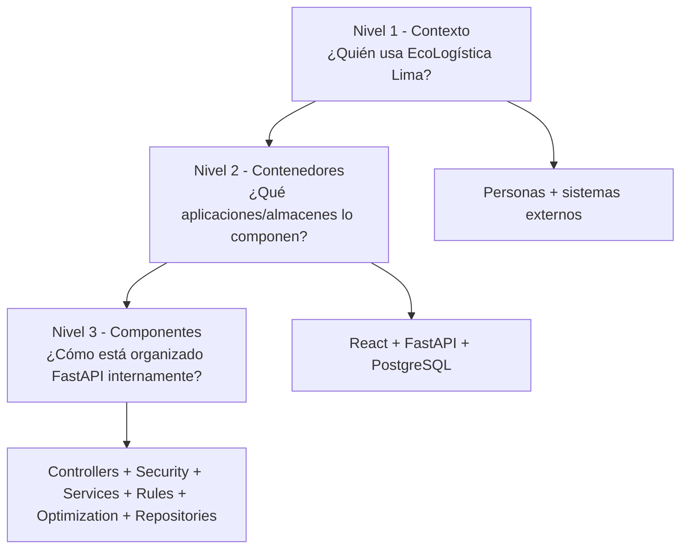

---

# 31. Criterios de Aceptación del Modelo C4

El documento se considera consistente si:

1. el Nivel 1 representa EcoLogística Lima como un solo sistema;
2. los actores corresponden a perfiles definidos en `08. Usuarios V_1_0_0.md`;
3. los servicios externos se muestran fuera del límite del sistema;
4. el Nivel 2 identifica React, FastAPI y PostgreSQL como contenedores principales;
5. el motor de optimización no se presenta como microservicio obligatorio en V1.0.0;
6. el Nivel 3 muestra controllers, middleware de seguridad, servicios, repositorios y componentes de optimización;
7. ningún controlador accede directamente a PostgreSQL;
8. las integraciones externas están desacopladas mediante adaptadores;
9. las decisiones son coherentes con `10. Stack tecnológico V_1_0_0.md`;
10. la persistencia es coherente con `11. Base de datos V_1_0_0.md`;
11. los componentes pueden trazarse hacia RF y RNF;
12. los diagramas se mantienen en código Mermaid dentro del archivo Markdown.

---

# 32. Riesgos Arquitectónicos

| ID | Riesgo | Impacto | Respuesta arquitectónica |
|---|---|---|---|
| RA-01 | Motor de optimización demasiado lento | Alto | Componente aislado lógicamente y medición independiente |
| RA-02 | Dependencia de API de tráfico | Alto | Adaptadores + datos simulados/manuales |
| RA-03 | Backend demasiado acoplado | Alto | Capas y componentes explícitos |
| RA-04 | React contiene lógica de negocio crítica | Alto | Validación autoritativa en backend |
| RA-05 | Acceso indebido a datos | Alto | Security Middleware + RBAC/ABAC |
| RA-06 | Base de datos expuesta | Crítico | Solo backend accede a PostgreSQL |
| RA-07 | Sobrearquitectura | Alto | Monolito modular, sin microservicios obligatorios |
| RA-08 | Integración geográfica compleja | Medio | Adapter/Integration Layer y PostGIS opcional |
| RA-09 | Cambio futuro de proveedor externo | Medio | Puertos/adaptadores |
| RA-10 | Dificultad de mantenimiento | Alto | Módulos alineados con dominios funcionales |

---

# 33. Evolución Arquitectónica Posterior al MVP

La arquitectura permite evolución futura sin que dichas opciones formen parte de V1.0.0.

Posibles evoluciones:

- separar Optimization Service en un proceso independiente;
- incorporar caché si las métricas muestran necesidad;
- utilizar procesamiento asíncrono;
- incorporar PostGIS;
- utilizar un proveedor cloud concreto;
- implementar balanceo horizontal;
- aislar generación de reportes;
- agregar observabilidad avanzada.

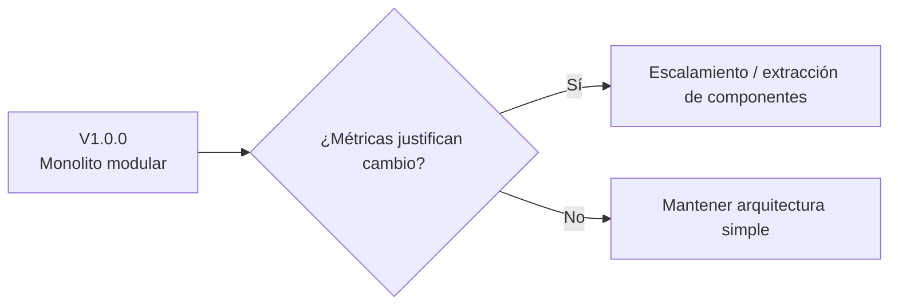

---

# 34. Conclusión

El Modelo C4 de **EcoLogística Lima V1.0.0** establece una arquitectura web simple, modular y trazable compuesta por:

- **React** como contenedor de presentación;
- **FastAPI/Python** como contenedor de aplicación y dominio;
- **PostgreSQL** como contenedor de persistencia;
- **OpenStreetMap** y fuentes de tráfico como dependencias externas desacopladas.

En el Nivel 3, el backend se divide en controladores, seguridad, servicios de aplicación, reglas de dominio, motor de optimización, servicios funcionales, adaptadores, repositorios y auditoría.

Esta arquitectura satisface la estructura exigida en la consigna para los niveles **Contexto, Contenedores y Componentes**, y mantiene coherencia con los documentos previos de requisitos, usuarios, reglas de negocio, stack tecnológico y base de datos.

La arquitectura definida servirá como entrada directa para:

`docs/01 Inicio/13. Restricciones V_1_0_0.md`
