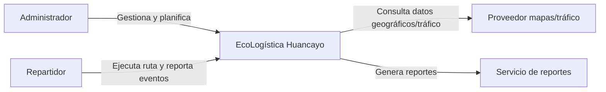
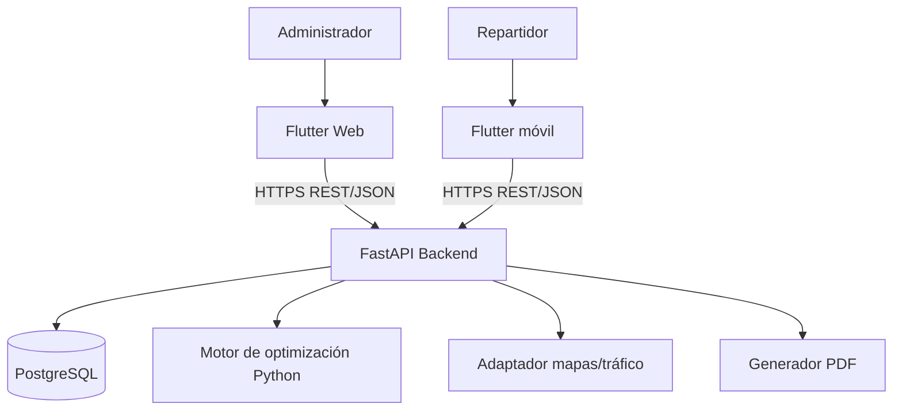
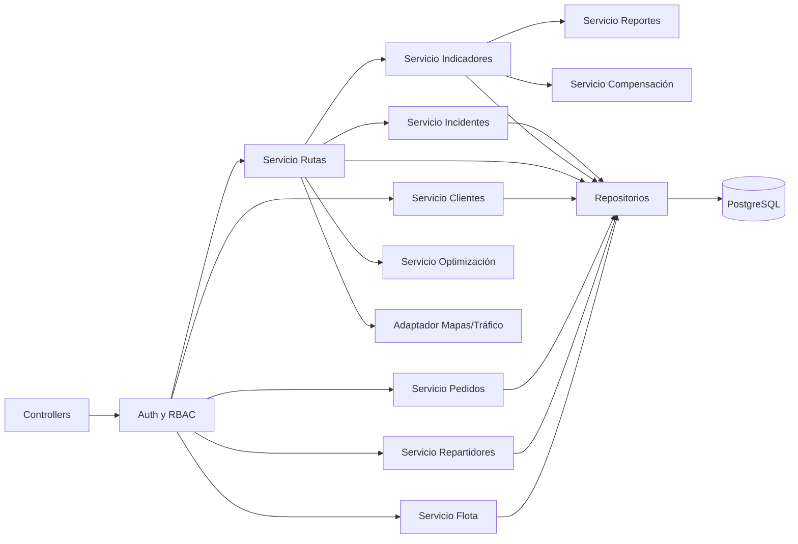
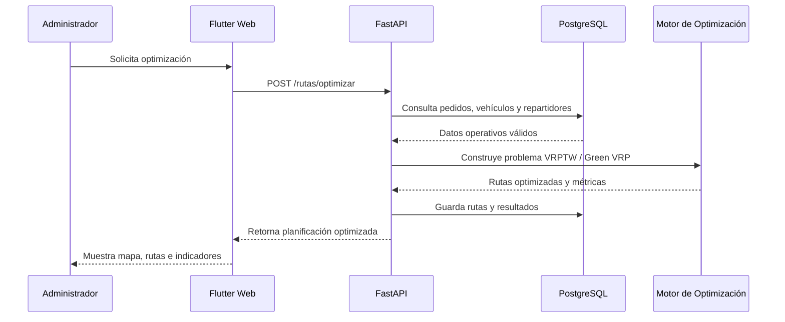
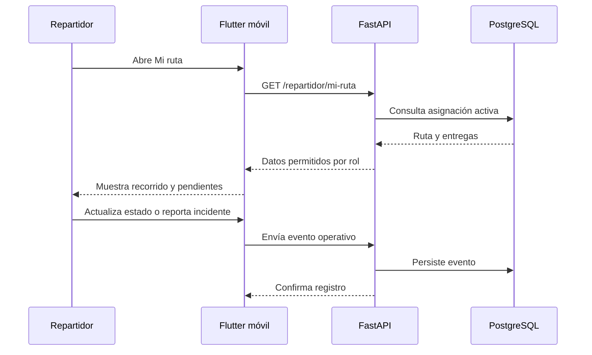

[⌂ README principal](../../README.md) | [← Anterior: 11. Base de datos](11.%20Base%20de%20datos%20V_1_0_0.md) | [Siguiente: 13. Restricciones →](13.%20Restricciones%20V_1_0_0.md)

# 12. Arquitectura de software - Modelo C4

## 1. Metadatos

| Campo | Valor |
|---|---|
| Proyecto | **EcoLogística Huancayo - Optimizador de Rutas Sostenibles para DistriRápido S.A.C.** |
| Integrante | **Jordy Steve Chancasanampa Torres** |
| Modalidad | Proyecto individual |
| Fecha | **27/09/2026** |
| Versión | **1.0.0** |
| Estilo | Backend modular + dos clientes Flutter independientes |

> **Resumen de la tabla:** resume la identificación y las decisiones base del documento. Permite comprobar que todos los artefactos pertenecen al mismo proyecto, versión e integrante.

## 2. Decisión arquitectónica

Flutter Web será exclusivamente el canal del **administrador** y Flutter móvil será el canal del **repartidor**. Las reglas de negocio, autenticación, optimización y persistencia permanecen en backend.

## 3. C4 Nivel 1 - Contexto

```mermaid
flowchart LR
    ADMIN[Administrador] -->|Gestiona y planifica| SYS[EcoLogística Huancayo]
    REP[Repartidor] -->|Ejecuta ruta y reporta eventos| SYS
    SYS -->|Consulta datos geográficos/tráfico| MAP[Proveedor mapas/tráfico]
    SYS -->|Genera reportes| PDF[Servicio de reportes]
```

> **Resumen del diagrama:** el sistema tiene dos actores humanos directos. Los servicios externos no toman decisiones; solo suministran datos o generan artefactos.

## 4. C4 Nivel 2 - Contenedores

```mermaid
flowchart TD
    ADMIN[Administrador] --> WEB[Flutter Web]
    REP[Repartidor] --> MOB[Flutter móvil]
    WEB -->|HTTPS REST/JSON| API[FastAPI Backend]
    MOB -->|HTTPS REST/JSON| API
    API --> DB[(PostgreSQL)]
    API --> OPT[Motor de optimización Python]
    API --> MAP[Adaptador mapas/tráfico]
    API --> REPGEN[Generador PDF]
```

> **Resumen del diagrama:** Web y móvil nunca acceden directamente a BD u optimizador. Ambos pasan por la API, que centraliza seguridad y consistencia.

## 5. C4 Nivel 3 - Componentes backend

```mermaid
flowchart LR
    CTRL[Controllers] --> AUTH[Auth y RBAC]
    AUTH --> FLEET[Servicio Flota]
    AUTH --> DRV[Servicio Repartidores]
    AUTH --> ORD[Servicio Pedidos]
    AUTH --> CLI[Servicio Clientes]
    AUTH --> ROUTE[Servicio Rutas]
    ROUTE --> OPT[Servicio Optimización]
    ROUTE --> MAP[Adaptador Mapas/Tráfico]
    ROUTE --> KPI[Servicio Indicadores]
    KPI --> REPORT[Servicio Reportes]
    KPI --> CARB[Servicio Compensación]
    ROUTE --> INC[Servicio Incidentes]
    FLEET --> REPO[Repositorios]
    DRV --> REPO
    ORD --> REPO
    CLI --> REPO
    ROUTE --> REPO
    KPI --> REPO
    INC --> REPO
    REPO --> DB[(PostgreSQL)]
```

> **Resumen del diagrama:** cada servicio encapsula una responsabilidad del dominio; los repositorios concentran acceso a datos y permiten pruebas aisladas.

## 6. Flujo arquitectónico de optimización

```mermaid
sequenceDiagram
    participant A as Administrador
    participant W as Flutter Web
    participant API as FastAPI
    participant DB as PostgreSQL
    participant OP as Motor de Optimización

    A->>W: Solicita optimización
    W->>API: POST /rutas/optimizar
    API->>DB: Consulta pedidos, vehículos y repartidores
    DB-->>API: Datos operativos válidos
    API->>OP: Construye problema VRPTW / Green VRP
    OP-->>API: Rutas optimizadas y métricas
    API->>DB: Guarda rutas y resultados
    API-->>W: Retorna planificación optimizada
    W-->>A: Muestra mapa, rutas e indicadores
```

> **Resumen del diagrama:** este es el flujo que fallaba por un conflicto Git. Se eliminan `<<<<<<< HEAD`, `=======` y `>>>>>>>`; el Mermaid queda con participantes y mensajes válidos.

## 7. Flujo móvil del repartidor

```mermaid
sequenceDiagram
    participant R as Repartidor
    participant M as Flutter móvil
    participant API as FastAPI
    participant DB as PostgreSQL

    R->>M: Abre Mi ruta
    M->>API: GET /repartidor/mi-ruta
    API->>DB: Consulta asignación activa
    DB-->>API: Ruta y entregas
    API-->>M: Datos permitidos por rol
    M-->>R: Muestra recorrido y pendientes
    R->>M: Actualiza estado o reporta incidente
    M->>API: Envía evento operativo
    API->>DB: Persiste evento
    API-->>M: Confirma registro
```

> **Resumen del diagrama:** la app móvil opera únicamente sobre información asignada al repartidor; cualquier evento queda persistido y puede alimentar una reoptimización.

## 8. Matriz de responsabilidad por aplicación

| Capacidad | Flutter Web | Flutter móvil | Backend |
|---|:---:|:---:|:---:|
| Gestión flota/pedidos/clientes | ✓ | - | Reglas/persistencia |
| Gestión repartidores | ✓ | Perfil propio | Reglas/persistencia |
| Optimización | Ejecuta | - | Calcula |
| Mapa | Global | Ruta propia | Datos/ruta |
| Estado de entrega | Consulta | Actualiza | Valida/persiste |
| Incidente | Gestiona | Registra | Valida/persiste |
| Dashboard/reportes | ✓ | Resumen mínimo | Calcula/genera |

> **Resumen de la tabla:** confirma qué responsabilidad vive en cada contenedor y evita implementar lógica crítica en Flutter.

## 9. Seguridad arquitectónica

- HTTPS obligatorio.
- RBAC por rol y recurso.
- Secretos solo en backend/infraestructura.
- Validación server-side.
- Tokens gestionados de forma segura en cada plataforma.
- PostgreSQL accesible únicamente desde backend.

---

[⌂ README principal](../../README.md) | [← Anterior: 11. Base de datos](11.%20Base%20de%20datos%20V_1_0_0.md) | [Siguiente: 13. Restricciones →](13.%20Restricciones%20V_1_0_0.md)
