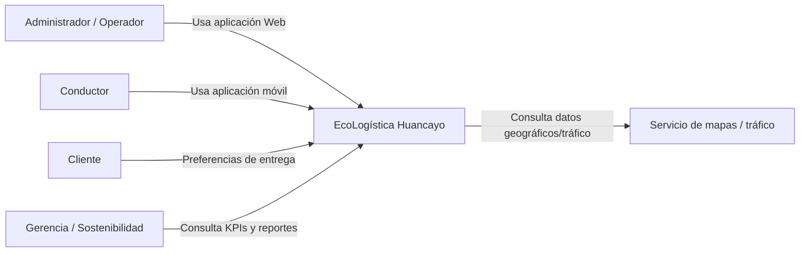
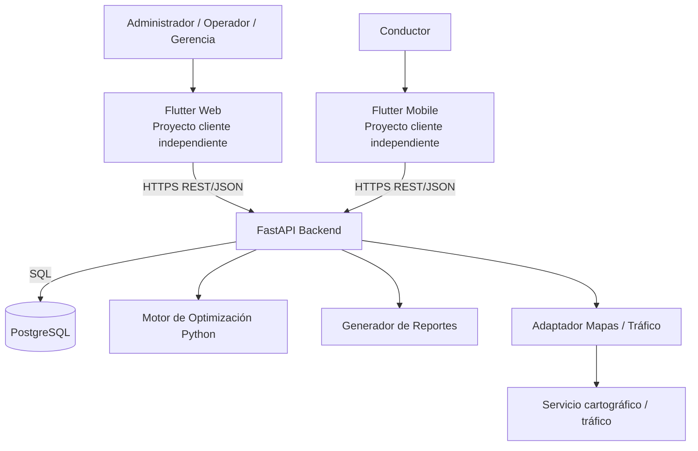
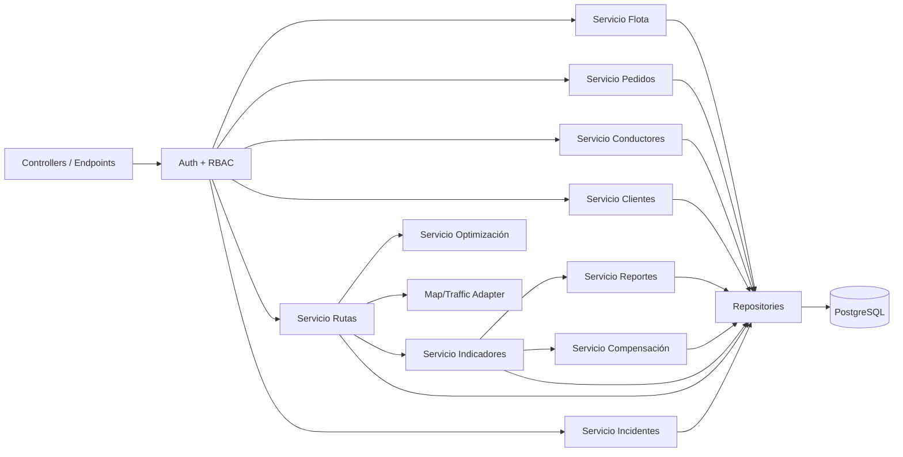
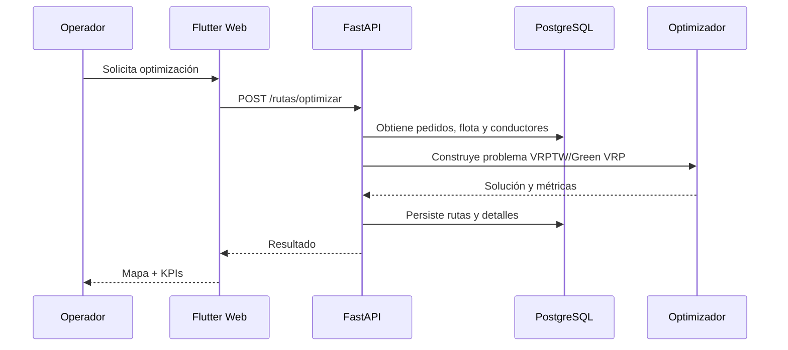
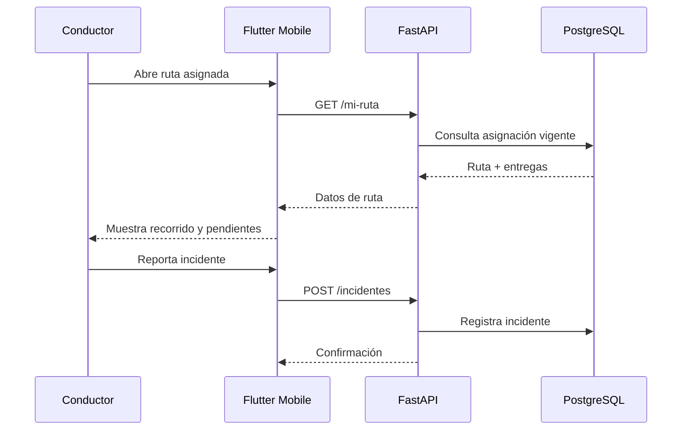

# 12. Arquitectura de software - Modelo C4

## 1. Metadatos

| Campo | Valor |
|---|---|
| Proyecto | **EcoLogística Huancayo - Optimizador de Rutas Sostenibles para DistriRápido S.A.C.** |
| Integrante | **Jordy Steve Chancasanampa Torres** |
| Fecha | **27/09/2026** |
| Versión | **1.0.0** |
| Estilo | Backend modular con dos clientes Flutter independientes |

## 2. Decisión arquitectónica

La solución tendrá **dos aplicaciones cliente separadas**:

1. **EcoLogística Web:** desarrollada con Flutter Web.
2. **EcoLogística Mobile:** desarrollada con Flutter para dispositivos móviles.

Ambas se comunican con una **API backend común**. La lógica crítica de negocio, persistencia, seguridad, cálculo de indicadores y motor de optimización se centralizan en backend.

Esto evita duplicar reglas de negocio en los dos clientes y permite que cada aplicación tenga navegación, componentes, permisos y despliegue propios.

## 3. Nivel 1 - Contexto

```mermaid
flowchart LR
    Admin[Administrador / Operador]
    Driver[Conductor]
    Client[Cliente]
    Mgmt[Gerencia / Sostenibilidad]
    System[EcoLogística Huancayo]
    Maps[Servicio de mapas / tráfico]

    Admin -->|Usa aplicación Web| System
    Driver -->|Usa aplicación móvil| System
    Client -->|Preferencias de entrega| System
    Mgmt -->|Consulta KPIs y reportes| System
    System -->|Consulta datos geográficos/tráfico| Maps
```

## 4. Nivel 2 - Contenedores

```mermaid
flowchart TD
    ADMIN[Administrador / Operador / Gerencia] --> WEB[Flutter Web<br/>Proyecto cliente independiente]
    DRIVER[Conductor] --> MOB[Flutter Mobile<br/>Proyecto cliente independiente]

    WEB -->|HTTPS REST/JSON| API[FastAPI Backend]
    MOB -->|HTTPS REST/JSON| API

    API -->|SQL| DB[(PostgreSQL)]
    API --> OPT[Motor de Optimización Python]
    API --> REP[Generador de Reportes]
    API --> MAP[Adaptador Mapas / Tráfico]
    MAP --> EXT[Servicio cartográfico / tráfico]
```

## 5. Responsabilidad por contenedor

| Contenedor | Tecnología | Responsabilidad |
|---|---|---|
| Flutter Web | Flutter/Dart | Administración, despacho, mapa, dashboard, reportes y configuración. |
| Flutter Mobile | Flutter/Dart | Experiencia del conductor, ruta asignada, entregas y reporte de incidentes. |
| API Backend | FastAPI/Python | Reglas de negocio, autenticación/autorización, validación y casos de uso. |
| PostgreSQL | PostgreSQL | Persistencia e integridad de datos. |
| Motor de Optimización | Python | VRPTW/Green VRP y reoptimización. |
| Adaptador mapas/tráfico | Backend | Aislar proveedor externo y fallos de integración. |
| Generador de reportes | Backend | Construcción de PDF y consolidación de métricas. |

## 6. Nivel 3 - Componentes del backend

```mermaid
flowchart LR
    CTRL[Controllers / Endpoints]
    AUTH[Auth + RBAC]
    FLEET[Servicio Flota]
    ORDER[Servicio Pedidos]
    DRIVER[Servicio Conductores]
    CLIENT[Servicio Clientes]
    ROUTE[Servicio Rutas]
    OPT[Servicio Optimización]
    DASH[Servicio Indicadores]
    REPORT[Servicio Reportes]
    CARBON[Servicio Compensación]
    INCIDENT[Servicio Incidentes]
    REPO[Repositories]
    DB[(PostgreSQL)]
    MAP[Map/Traffic Adapter]

    CTRL --> AUTH
    AUTH --> FLEET
    AUTH --> ORDER
    AUTH --> DRIVER
    AUTH --> CLIENT
    AUTH --> ROUTE
    AUTH --> INCIDENT
    ROUTE --> OPT
    ROUTE --> MAP
    ROUTE --> DASH
    DASH --> REPORT
    DASH --> CARBON
    FLEET --> REPO
    ORDER --> REPO
    DRIVER --> REPO
    CLIENT --> REPO
    ROUTE --> REPO
    INCIDENT --> REPO
    DASH --> REPO
    REPORT --> REPO
    CARBON --> REPO
    REPO --> DB
```

## 7. Distribución funcional Web / Móvil

| Capacidad | Flutter Web | Flutter móvil |
|---|:---:|:---:|
| Administración de usuarios | Sí | No |
| Gestión de flota | Sí | Consulta limitada |
| Gestión de conductores | Sí | Perfil propio |
| Gestión de pedidos | Sí | Pedidos asignados |
| Ejecutar optimización | Sí | No |
| Visualizar rutas | Sí | Sí, ruta asignada |
| Reoptimización | Sí | Puede generar evento/incidente |
| Dashboard | Sí | Vista operativa reducida |
| Reportes PDF | Sí | No |
| Reportar incidentes | Consulta/gestión | Sí |

## 8. Mapeo arquitectura - requisitos

| Componente | RF principales | RNF relevantes |
|---|---|---|
| Flutter Web | RF-01 a RF-10 según rol | RNF-03, RNF-05 |
| Flutter Mobile | RF-04, RF-07, RF-08 | RNF-03, RNF-05, RNF-06 |
| Flota | RF-01 | RNF-02 |
| Pedidos | RF-02, RF-09 | RNF-02 |
| Optimización | RF-03, RF-07 | RNF-01, RNF-04 |
| Map/Traffic Adapter | RF-04, RF-07 | RNF-06 |
| Dashboard | RF-05 | RNF-05 |
| Reportes | RF-06 | RNF-07 |
| Conductores | RF-08 | RNF-02 |
| Compensación | RF-10 | RNF-07 |
| Auth/RBAC | Transversal | RNF-02 |

## 9. Flujo crítico de optimización

```mermaid
sequenceDiagram
    participant O as Operador
    participant W as Flutter Web
    participant A as FastAPI
    participant DB as PostgreSQL
    participant OP as Optimizador

    O->>W: Solicita optimización
    W->>A: POST /rutas/optimizar
    A->>DB: Obtiene pedidos, flota y conductores
    A->>OP: Construye problema VRPTW/Green VRP
    OP-->>A: Solución y métricas
    A->>DB: Persiste rutas y detalles
    A-->>W: Resultado
    W-->>O: Mapa + KPIs
```

## 10. Flujo móvil del conductor

```mermaid
sequenceDiagram
    participant C as Conductor
    participant M as Flutter Mobile
    participant A as FastAPI
    participant DB as PostgreSQL

    C->>M: Abre ruta asignada
    M->>A: GET /mi-ruta
    A->>DB: Consulta asignación vigente
    DB-->>A: Ruta + entregas
    A-->>M: Datos de ruta
    M-->>C: Muestra recorrido y pendientes

    C->>M: Reporta incidente
    M->>A: POST /incidentes
    A->>DB: Registra incidente
    A-->>M: Confirmación
```

## 11. Fronteras de seguridad

- HTTPS entre ambos clientes y backend.
- Autenticación común con autorización por rol/recurso.
- Tokens almacenados de forma segura según plataforma.
- Validación server-side obligatoria.
- La base de datos no es accesible directamente desde Flutter Web ni Flutter móvil.
- Secretos de servicios externos permanecen en backend.
- No incluir claves privadas en repositorios de Flutter.

## 12. Decisión final

La arquitectura queda alineada con la decisión de desarrollo:

> **dos aplicaciones Flutter independientes (Web y móvil) conectadas a una API backend común**, con el motor de optimización ejecutándose en backend y PostgreSQL como persistencia central.
