# Análisis Multidimensional de Restricciones

## 1. Metadatos del documento

| Campo | Información |
|---|---|
| Nombre del proyecto | EcoLogística Lima - Optimizador de Rutas Sostenibles para DistriRápido S.A.C. |
| Integrante | Jordy Steve Chancasanampa Torres |
| Fecha | 04/09/2026 |
| Versión | 1.0.0 |
| Estado | Línea base del análisis multidimensional de restricciones |
| Ruta de repositorio | `docs/01 Inicio/13. Restricciones V_1_0_0.md` |

---

# 2. Objetivo del documento

El presente documento analiza las restricciones que condicionan el diseño, desarrollo, operación y evaluación de **EcoLogística Lima**, organizándolas en dimensiones técnicas, económicas, ambientales, sociales, culturales, normativas, de seguridad pública, datos e infraestructura.

El propósito es transformar las restricciones declaradas en la consigna en decisiones verificables de diseño, definiendo para cada una:

- impacto sobre el sistema;
- severidad;
- componentes afectados;
- estrategia de mitigación;
- mecanismo de cumplimiento o evidencia;
- requisitos funcionales y no funcionales relacionados;
- responsable de tratamiento;
- estado de control.

El análisis busca evitar que una restricción se convierta únicamente en una observación documental. Las restricciones críticas deben reflejarse en **reglas de negocio, arquitectura, base de datos, controles de acceso, algoritmo de optimización y pruebas**.

---

# 3. Fuentes del análisis

| Fuente | Elementos utilizados |
|---|---|
| Consigna oficial de EcoLogística Lima | RES-01 a RES-12, RF, RNF, estándares y condiciones locales |
| Acta de constitución | Alcance, presupuesto, cronograma, riesgos y criterios de éxito |
| Registro de supuestos y restricciones | Priorización y tratamiento inicial |
| Requisitos funcionales | Capacidades afectadas por restricciones |
| Requisitos no funcionales | Calidad, seguridad, rendimiento, accesibilidad y disponibilidad |
| Usuarios | Perfiles, RBAC/ABAC y necesidades de accesibilidad |
| Reglas de negocio | RN-001 a RN-038 |
| Stack tecnológico | React, FastAPI/Python, PostgreSQL, Leaflet/OpenStreetMap |
| Base de datos | Integridad, privacidad, georreferenciación y trazabilidad |
| Modelo C4 | Ubicación arquitectónica de los controles |

> **Nota de trazabilidad normativa:** las referencias legales y regulatorias se mantienen como aparecen en la consigna académica. Antes de un despliegue real deberán verificarse contra fuentes oficiales vigentes; esta versión no sustituye una validación jurídica o regulatoria.

---

# 4. Enfoque multidimensional

Las restricciones se agrupan en nueve dimensiones.

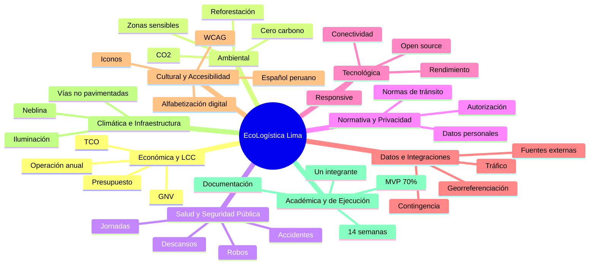

---

# 5. Escala de impacto y severidad

## 5.1. Impacto

| Nivel | Definición |
|---|---|
| Bajo | Afecta una funcionalidad secundaria sin comprometer el MVP |
| Medio | Requiere ajuste de diseño o proceso, pero existe alternativa viable |
| Alto | Puede invalidar una capacidad importante o un criterio de aceptación |
| Crítico | Puede impedir la entrega, comprometer seguridad/datos o invalidar el proyecto |

## 5.2. Tratamiento

| Código | Tratamiento |
|---|---|
| EV | Evitar |
| MT | Mitigar |
| AC | Aceptar controladamente |
| TR | Transferir / depender de tercero con contingencia |

---

# 6. Matriz Ejecutiva de Restricciones

| ID | Dimensión | Restricción | Impacto | Tratamiento | Componente principal |
|---|---|---|---|---|---|
| RES-01 | Económica / LCC | Optimización del costo del ciclo de vida de flota | Alto | MT | Reportes / Indicadores |
| RES-02 | Ambiental | Meta de cero carbono neto en 3 años | Alto | MT | Indicadores / Reportes |
| RES-03 | Ambiental / Social | Evitar reservas y reducir impacto en zonas sensibles | Alto | EV/MT | Optimización / Restricciones |
| RES-04 | Social / Seguridad | Jornadas, descansos y restricciones de tránsito | Crítico | EV | Optimización / Conductores |
| RES-05 | Económica | Presupuesto MVP S/ 500,000 y operación anual S/ 120,000 | Alto | MT | Gestión / Arquitectura |
| RES-06 | Tecnológica | Stack web de código abierto y operación con baja conectividad | Alto | MT | React / FastAPI / PostgreSQL |
| RES-07 | Cultural | Español peruano, iconografía y lenguaje comprensible | Medio | MT | Frontend |
| RES-08 | Normativa / Privacidad | Protección de datos y acceso mínimo necesario | Crítico | EV/MT | Seguridad / Datos |
| RES-09 | Datos | Dependencia de datos georreferenciados y tráfico | Alto | MT/TR | Adaptadores / Optimización |
| RES-10 | Seguridad pública | Evitar zonas con mayor riesgo de robo/accidente | Alto | MT | Optimización / Restricciones |
| RES-11 | Climática | Neblina y baja visibilidad en invierno | Medio | MT | Restricciones / Optimización |
| RES-12 | Infraestructura | Vías no pavimentadas y limitaciones para vehículos pesados | Alto | EV/MT | Optimización / Restricciones |
| RES-13 | Académica | Entrega en 14 semanas y cuatro iteraciones | Crítico | MT | Gestión del proyecto |
| RES-14 | Capacidad del equipo | Desarrollo realizado por un único integrante | Crítico | MT | Alcance / Arquitectura |
| RES-15 | Alcance MVP | Implementar al menos 70 % de RF-01 a RF-07 | Crítico | MT | Backlog / Pruebas |
| RES-16 | Rendimiento | Optimización ≤45 s y reoptimización <30 s | Crítico | MT | Optimization Service |
| RES-17 | Calidad | Aplicar ISO/IEC 25010, OWASP, WCAG y criterios Green Software | Alto | MT | Transversal |
| RES-18 | Dependencias externas | Costos, límites o indisponibilidad de servicios externos | Alto | MT/TR | Integraciones |

> `RES-13` a `RES-18` consolidan restricciones ya presentes en el Acta, RNF y Registro de Supuestos/Restricciones para mantener una visión completa del proyecto.

---

# 7. Diagrama de impacto de restricciones

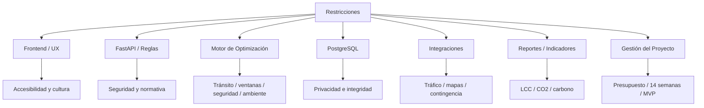

---

# 8. Dimensión 1 — Análisis de Costo del Ciclo de Vida (LCC)

## 8.1. Restricciones relacionadas

- RES-01 — Costo del Ciclo de Vida.
- RES-05 — Restricciones Económicas.
- RES-18 — Dependencias externas y costos asociados.

## 8.2. Variables del caso

La consigna establece como datos de referencia:

| Variable | Valor de referencia del caso |
|---|---:|
| Diésel | S/ 17.50 por galón |
| Mantenimiento | S/ 1.20 por km |
| Depreciación | 20 % anual |
| Sueldo de conductor | S/ 1,500 mensuales |
| GNV | S/ 12.50 por m³ |
| Conversión a GNV | S/ 5,000 por vehículo |
| Presupuesto de desarrollo MVP | S/ 500,000 |
| Operación anual de referencia | S/ 120,000 |

Estos valores se utilizan como **parámetros del caso académico** y no como cotizaciones dinámicas del sistema.

## 8.3. Modelo conceptual de LCC

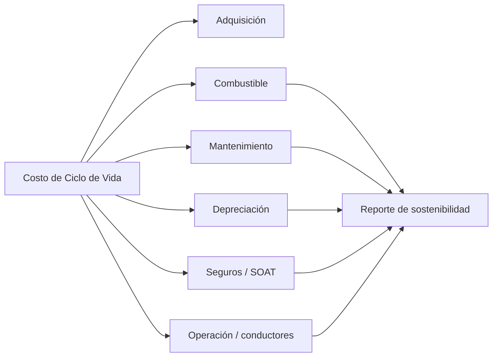

## 8.4. Mitigación / Diseño

- parametrizar componentes del TCO;
- separar costos del vehículo de los costos de la ruta;
- evitar valores económicos embebidos en código;
- permitir comparar línea base vs. ruta optimizada;
- documentar cualquier evaluación de ROI de GNV como escenario del caso;
- evitar servicios cloud o APIs pagadas si existe una alternativa suficiente para el MVP.

## 8.5. Evidencia de cumplimiento

- dashboard;
- reporte de sostenibilidad;
- `indicador_ruta`;
- métricas de combustible;
- escenarios de prueba comparativos.

---

# 9. Dimensión 2 — Cero Carbono Neto y Sostenibilidad

## 9.1. Restricciones relacionadas

- RES-02 — Cero Carbono Neto.
- RES-03 — Restricciones Ambientales.
- RES-11 — Restricciones Climáticas.
- RES-12 — ISO 14083 / medición ambiental según documentos previos.

## 9.2. Impactos

La dimensión ambiental afecta:

- función objetivo del algoritmo;
- cálculo de CO₂;
- reportes;
- selección de rutas;
- equivalentes ambientales;
- plan de compensación;
- zonas sensibles.

## 9.3. Flujo ambiental

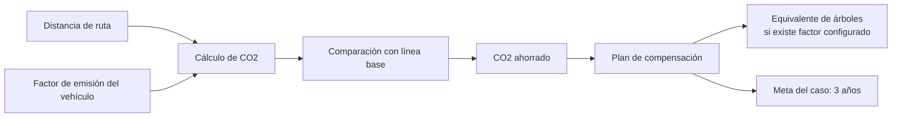

## 9.4. Estrategias de mitigación

- minimizar distancia y consumo;
- utilizar factores de emisión configurables;
- evitar rutas ambientalmente restringidas;
- registrar zonas sensibles;
- mostrar CO₂ por ruta;
- mantener trazabilidad del cálculo;
- separar “reducción operativa” de “compensación”.

## 9.5. Regla de diseño

> La compensación no reemplaza la reducción de emisiones. Primero se optimiza la operación; luego se calcula el remanente que podría compensarse.

---

# 10. Dimensión 3 — Salud, Seguridad Pública y Seguridad Vial

## 10.1. Restricciones relacionadas

- RES-04 — Jornadas y descansos.
- RES-10 — Zonas con riesgo de robo o accidente.
- RES-11 — Visibilidad por neblina.
- RES-12 — Calles no pavimentadas y riesgo para vehículos.

## 10.2. Principio

Una ruta de menor distancia puede ser rechazada si incrementa de manera inaceptable el riesgo operativo o incumple una restricción activa.

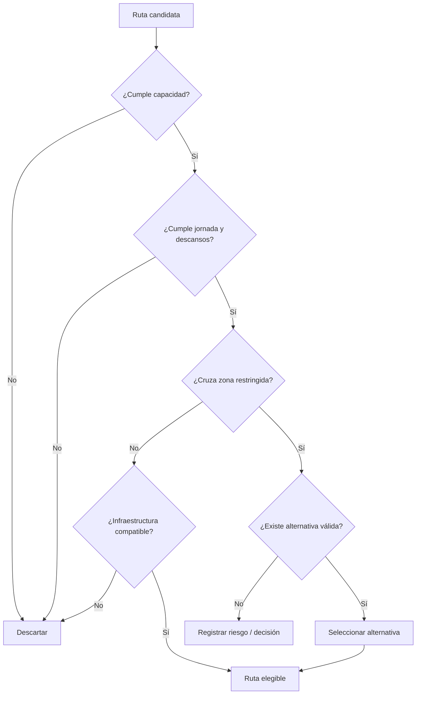

## 10.3. Medidas de diseño

- restricciones parametrizables;
- severidad por zona o tramo;
- incidentes reportados por conductores;
- reoptimización ante accidente;
- evitar vías incompatibles con vehículo pesado;
- considerar disponibilidad horaria del conductor;
- alertas visibles en modo conductor.

---

# 11. Dimensión 4 — Aspectos Normativos, Privacidad y Protección de Datos

## 11.1. Restricciones relacionadas

- RES-08 — Normativas del caso.
- RNF de seguridad.
- OWASP Top 10.
- Ley N.° 29733 indicada por la consigna.
- referencias de tránsito indicadas por la consigna.

## 11.2. Riesgo principal

La plataforma procesa datos de:

- clientes;
- conductores;
- ubicaciones;
- pedidos;
- rutas;
- incidencias.

Por ello, el sistema debe evitar exposición innecesaria.

## 11.3. Arquitectura de cumplimiento

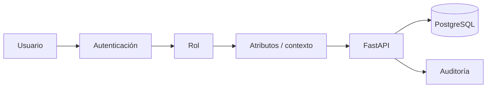

## 11.4. Estrategias de mitigación

- mínimo privilegio;
- RBAC + ABAC;
- contraseñas no almacenadas en texto plano;
- validación de entradas;
- consultas parametrizadas;
- datos personales visibles solo cuando son necesarios;
- conductor limitado a sus rutas;
- cliente limitado a registros propios;
- auditor en modo lectura;
- secretos de conexión fuera del repositorio.

## 11.5. Evidencia

- matriz de usuarios;
- reglas RN-001 a RN-004;
- middleware de seguridad;
- pruebas de autorización;
- auditoría de eventos críticos.

---

# 12. Dimensión 5 — Restricciones Tecnológicas

## 12.1. Restricciones

La línea base tecnológica del caso se consolidó como:

- Python + FastAPI;
- React;
- PostgreSQL;
- Leaflet/OpenStreetMap;
- arquitectura web responsive;
- compatibilidad con conexiones de baja velocidad.

## 12.2. Restricción de arquitectura

No se incorporarán microservicios, colas, caché distribuida o plataformas complejas como requisito inicial si las métricas del MVP no justifican su uso.

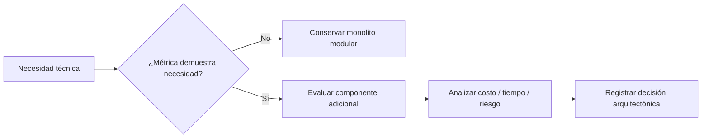

## 12.3. Mitigación

- stack reducido;
- módulos internos claros;
- APIs documentadas;
- pruebas progresivas;
- PostGIS opcional;
- proveedor cloud no fijado prematuramente;
- componentes externos encapsulados mediante adaptadores.

---

# 13. Dimensión 6 — Datos, Georreferenciación e Integraciones Externas

## 13.1. Restricciones relacionadas

- RES-09 — datos georreferenciados y tráfico;
- RES-18 — dependencia de terceros;
- RNF de disponibilidad y rendimiento.

## 13.2. Problema

La calidad de una ruta depende de datos cuyo control no pertenece completamente al proyecto.

Fuentes posibles del caso:

- OpenStreetMap;
- proveedor de tráfico;
- Waze/Google Maps según disponibilidad;
- reportes manuales;
- datos simulados.

## 13.3. Estrategia de contingencia

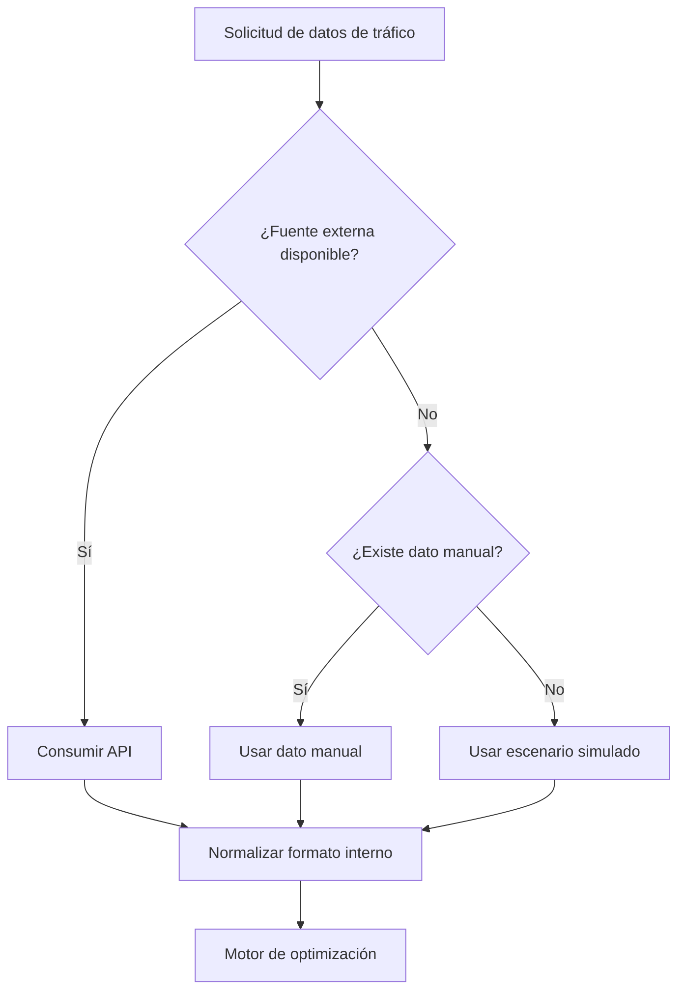

## 13.4. Medidas

- normalizar fuentes;
- conservar origen del dato;
- no acoplar el dominio a un proveedor específico;
- registrar vigencia temporal;
- permitir simulación académica;
- usar coordenadas validadas;
- considerar PostGIS solo si las pruebas lo justifican.

---

# 14. Dimensión 7 — Aspectos Culturales, Sociales y Accesibilidad

## 14.1. Restricciones relacionadas

- RES-07 — Restricciones culturales.
- WCAG 2.1 AA.
- RNF de usabilidad.
- perfiles de conductor y cliente.

## 14.2. Factores del contexto

La consigna señala que algunos usuarios pueden:

- tener baja familiaridad con mapas digitales;
- poseer distintos niveles de educación formal;
- utilizar dispositivos de bajo costo;
- requerir iconos grandes y alto contraste.

## 14.3. Respuesta de diseño

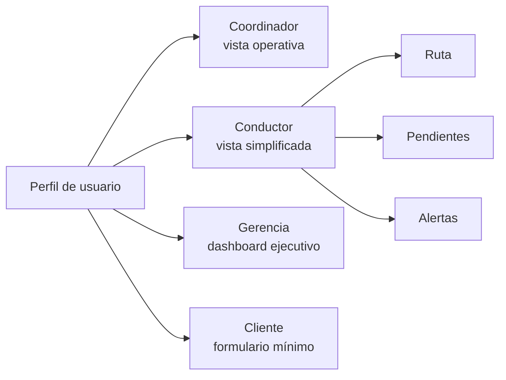

## 14.4. Mitigación

- texto en español comprensible;
- lenguaje operativo cercano al contexto local cuando resulte adecuado;
- iconografía universal;
- no depender únicamente del color;
- botones y áreas de interacción suficientemente visibles;
- modo conductor;
- reducción de campos innecesarios;
- puntos de referencia para direcciones no estandarizadas.

---

# 15. Dimensión 8 — Clima e Infraestructura Vial

## 15.1. Restricciones relacionadas

- RES-11 — clima y neblina.
- RES-12 — vías no pavimentadas.

## 15.2. Datos relevantes del caso

La consigna plantea:

- neblina y baja visibilidad en invierno;
- necesidad de considerar vías con mejor iluminación;
- calles no pavimentadas en zonas periféricas;
- riesgo de atasco o daño en vehículos pesados.

## 15.3. Modelo de decisión

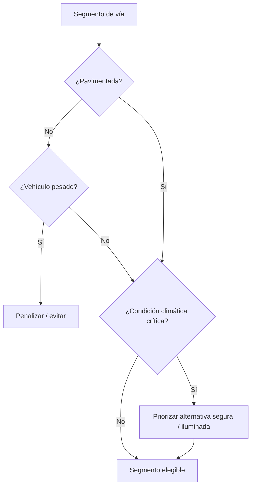

---

# 16. Dimensión 9 — Restricciones Académicas y de Gestión

## 16.1. Restricciones

- duración de 14 semanas;
- cuatro iteraciones;
- un único integrante;
- MVP con al menos 70 % de RF-01 a RF-07;
- documentación obligatoria;
- pruebas de rendimiento y aceptación;
- presupuesto referencial del caso.

## 16.2. Impacto

Estas restricciones condicionan directamente el nivel de arquitectura y el alcance técnico.

Por ello:

- se adopta monolito modular;
- se priorizan RF-01 a RF-07;
- se evitan integraciones no esenciales;
- se mantienen PostGIS, Docker, caché y servicios avanzados como opcionales;
- la reoptimización se desarrolla progresivamente;
- la documentación se genera junto con el desarrollo.

## 16.3. Triángulo de control

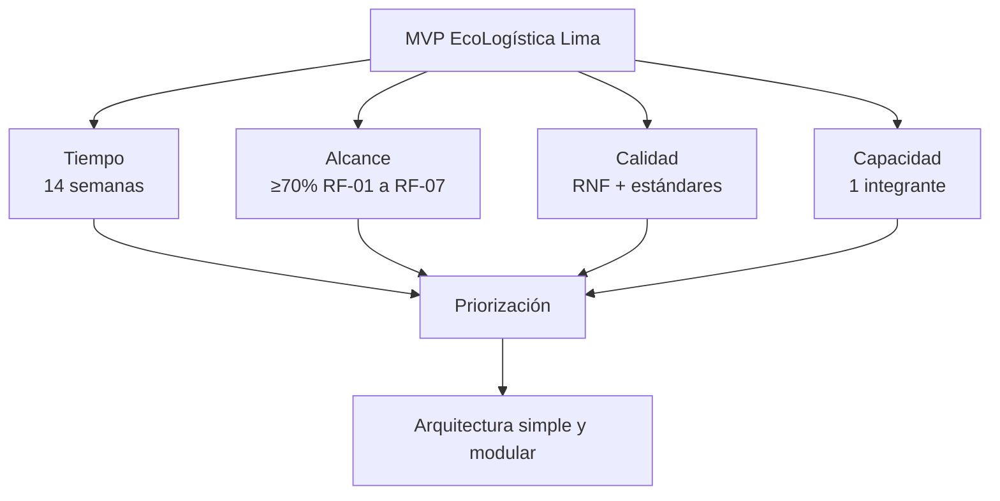

---

# 17. Matriz Multidimensional de Impacto, Mitigación y Cumplimiento

| Dimensión | Descripción de la restricción | Impacto en el sistema | Estrategia de Mitigación / Diseño | Evidencia de cumplimiento |
|---|---|---|---|---|
| Salud y Seguridad Pública | Riesgo de rutas por zonas inseguras, accidentes, jornadas y condiciones viales | Puede comprometer conductor, entrega y validez de ruta | Restricciones parametrizadas, incidentes, reoptimización, control de jornada y rutas alternativas | Casos de prueba de ruta, incidencias y reglas RN-014/RN-021 |
| Análisis de Costo del Ciclo de Vida (LCC) | TCO limitado por combustible, mantenimiento, depreciación, seguros y operación | Afecta indicadores económicos y decisiones de flota | Parametrización de costos, indicadores y comparación contra línea base | Dashboard, reporte y consultas de TCO |
| Cero Carbono Neto y Sostenibilidad | Emisiones de flota y meta ambiental del caso | Afecta función objetivo y reportes | Cálculo de CO₂, reducción de distancia/consumo y compensación posterior | `indicador_ruta`, reportes, RN-028/RN-029/RN-030 |
| Aspectos Culturales, Sociales y Económicos | Diferentes niveles de alfabetización digital, lenguaje local, costo y conectividad | Puede impedir adopción o uso seguro | Modo conductor, interfaz simple, WCAG, bajo payload y stack abierto | Pruebas UX/accesibilidad y RNF |
| Normativa y Privacidad | Protección de datos y acceso por rol | Riesgo crítico de exposición o uso indebido | RBAC/ABAC, mínimo privilegio, validación, auditoría | Pruebas de autorización y eventos de auditoría |
| Tecnología | Stack y capacidad del equipo | Riesgo de sobrearquitectura y retrasos | React + FastAPI + PostgreSQL, monolito modular | ADR y Modelo C4 |
| Datos e Integraciones | Tráfico y geodatos variables | Puede degradar precisión o impedir reoptimización | Adaptadores, simulación, carga manual y normalización | Pruebas con fuente real y contingencia |
| Clima e Infraestructura | Neblina, baja iluminación y vías no pavimentadas | Riesgo de ruta inviable o insegura | Restricciones de segmentos y tipo de vehículo | Casos de prueba con restricciones activas |
| Académica / Gestión | 14 semanas, un integrante y alcance mínimo | Riesgo de no entrega | Priorización del MVP y control de cambios | Backlog, hitos y matriz de cobertura |

---

# 18. Matriz de Trazabilidad RES → RN → RF/RNF → Arquitectura

| Restricción | RN relacionadas | RF/RNF relacionados | Elemento arquitectónico |
|---|---|---|---|
| RES-01 LCC | RN-027 | RF-008, RF-009 / RNF-013 | Indicator & Report Service |
| RES-02 Cero Carbono | RN-029, RN-030 | RF-009, RF-014 | Report Service |
| RES-03 Ambiental | RN-022 | RF-006, RF-016 | Optimization + Restrictions |
| RES-04 Social/Jornada | RN-014 | RF-006, RF-012, RF-016 | Fleet/Driver + Optimization |
| RES-05 Económica | RN-036, RN-037 | RNF-011, RNF-013 | Gestión + arquitectura |
| RES-06 Tecnología | Varias | RNF-006, RNF-009, RNF-013 | React / FastAPI / PostgreSQL |
| RES-07 Cultural | RN-034, RN-035 | RF-007 / RNF-005, RNF-007 | React |
| RES-08 Normativa | RN-001 a RN-004 | RF-017, RF-018 / RNF-003, RNF-004 | Security Middleware |
| RES-09 Datos | RN-019, RN-020 | RF-006, RF-010, RF-015 | Integration Adapters |
| RES-10 Seguridad vial | RN-021 | RF-006, RF-016 | Optimization Service |
| RES-11 Clima | RN-018 | RF-006, RF-016 | Domain Rules |
| RES-12 Infraestructura | RN-018 | RF-006, RF-016 | Optimization Service |
| RES-13 Tiempo | RN-036, RN-037 | RNF-011 | Gestión |
| RES-14 Un integrante | RN-036 | RNF-011, RNF-013 | Monolito modular |
| RES-15 MVP 70 % | RN-036 | RF-001 a RF-010 | Backlog / pruebas |
| RES-16 Rendimiento | RN-031, RN-032 | RNF-001, RNF-002 | Optimization Service |
| RES-17 Calidad | RN-034, RN-037, RN-038 | RNF-003..RNF-013 | Transversal |
| RES-18 Dependencias | RN-020 | RNF-008, RNF-009 | Integration Adapters |

---

# 19. Mapa de criticidad

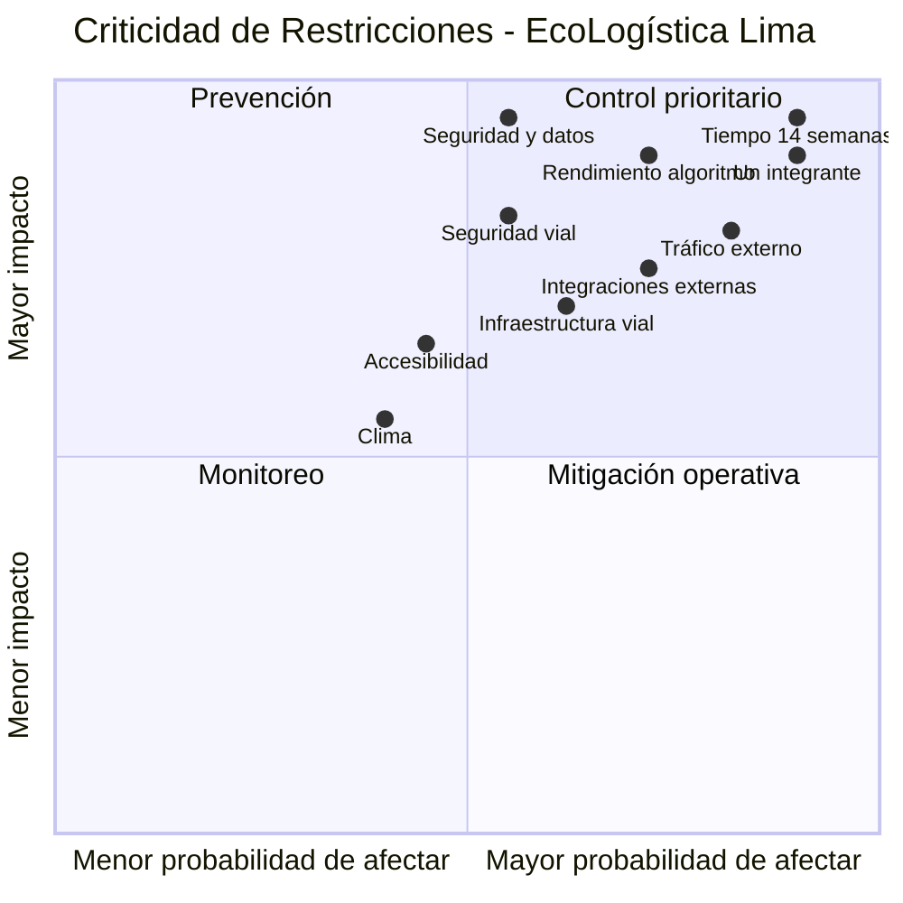

> La ubicación del cuadrante es una valoración interna cualitativa del proyecto V1.0.0 para priorizar tratamiento; no representa una medición estadística de frecuencia real.

---

# 20. Priorización de restricciones críticas

Se consideran **críticas** las siguientes:

1. RES-04 — jornada y restricciones sociales/operativas;
2. RES-08 — privacidad y autorización;
3. RES-13 — plazo de 14 semanas;
4. RES-14 — capacidad limitada por un único integrante;
5. RES-15 — cobertura mínima del MVP;
6. RES-16 — tiempos de optimización y reoptimización.

Estas restricciones deben revisarse en cada iteración.

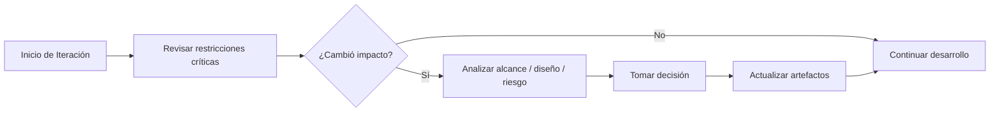

---

# 21. Plan de Mitigación Consolidado

| ID | Acción de mitigación | Responsable | Momento |
|---|---|---|---|
| MIT-01 | Mantener backlog priorizado por cobertura del MVP | Project Manager | Semanal |
| MIT-02 | Ejecutar pruebas de rendimiento desde Iteración 2 | Project Manager / Desarrollo | Iteraciones 2–4 |
| MIT-03 | Aplicar RBAC/ABAC desde el diseño del backend | Desarrollo | Desde Iteración 2 |
| MIT-04 | Usar adaptador de tráfico con contingencia manual/simulada | Desarrollo | Iteraciones 2–4 |
| MIT-05 | Mantener restricciones de ruta parametrizadas | Desarrollo | Iteraciones 2–4 |
| MIT-06 | Validar interfaz del conductor con criterios de simplicidad | Desarrollo / Validación | Iteraciones 2–4 |
| MIT-07 | Versionar DDL, arquitectura y reglas | Project Manager | Continuo |
| MIT-08 | Evitar componentes técnicos opcionales sin evidencia | Project Manager | Continuo |
| MIT-09 | Medir CO₂, combustible y distancia con línea base | Desarrollo | Iteraciones 3–4 |
| MIT-10 | Mantener matriz de trazabilidad actualizada | Project Manager | Cada cierre de iteración |

---

# 22. Cumplimiento de estándares

| Estándar / referencia | Restricción tratada | Evidencia prevista |
|---|---|---|
| ISO/IEC 25010 | Calidad general | RNF, pruebas y criterios de aceptación |
| OWASP Top 10 | Seguridad web | Middleware, validación y pruebas |
| WCAG 2.1 AA | Accesibilidad | Revisión de interfaz y modo conductor |
| Green Software | Eficiencia del propio sistema | Consultas, transferencia y procesamiento optimizados |
| ISO 14083 | Medición de emisiones logísticas según enfoque del caso | Indicadores y reportes de CO₂ |
| Ley N.° 29733 indicada en la consigna | Protección de datos | RBAC/ABAC y minimización |
| Referencias de tránsito indicadas en la consigna | Restricciones operativas | Domain Rules / Optimization |

---

# 23. Restricciones que deben implementarse como datos parametrizables

No todas las restricciones deben quedar codificadas directamente en el algoritmo.

Se recomienda parametrizar:

- zonas sensibles;
- severidad;
- horarios restringidos;
- tipo de vía;
- condición pavimentada/no pavimentada;
- riesgo de seguridad;
- factor de emisión;
- costos de referencia;
- factores de compensación;
- fuente de tráfico;
- parámetros de la metaheurística.

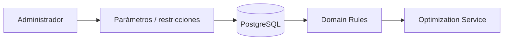

---

# 24. Restricciones que no deben depender solo de la base de datos

La base de datos protege integridad estructural, pero las siguientes restricciones requieren lógica de aplicación o algoritmo:

- capacidad acumulada de un vehículo;
- cumplimiento completo de ventanas;
- jornada acumulada del conductor;
- rutas sobre zonas sensibles;
- seguridad vial;
- penalización por congestión;
- evaluación multiobjetivo;
- reoptimización;
- cálculo de TCO;
- cálculo de CO₂;
- autorización contextual ABAC.

---

# 25. Criterios de Aceptación del Análisis de Restricciones

El documento se considera completo cuando:

1. todas las restricciones de la consigna están representadas;
2. las restricciones críticas tienen estrategia de mitigación;
3. existe trazabilidad con RF/RNF/RN;
4. se identifica el componente arquitectónico responsable;
5. las restricciones ambientales afectan el algoritmo o indicadores cuando corresponde;
6. las restricciones de privacidad afectan seguridad y datos;
7. las restricciones culturales afectan UX;
8. las restricciones de datos disponen de contingencia;
9. las restricciones académicas afectan priorización y arquitectura;
10. la severidad y tratamiento pueden revisarse por iteración;
11. los diagramas se mantienen como código Mermaid;
12. cambios sustanciales generan una nueva versión del artefacto.

---

# 26. Gestión de Cambios

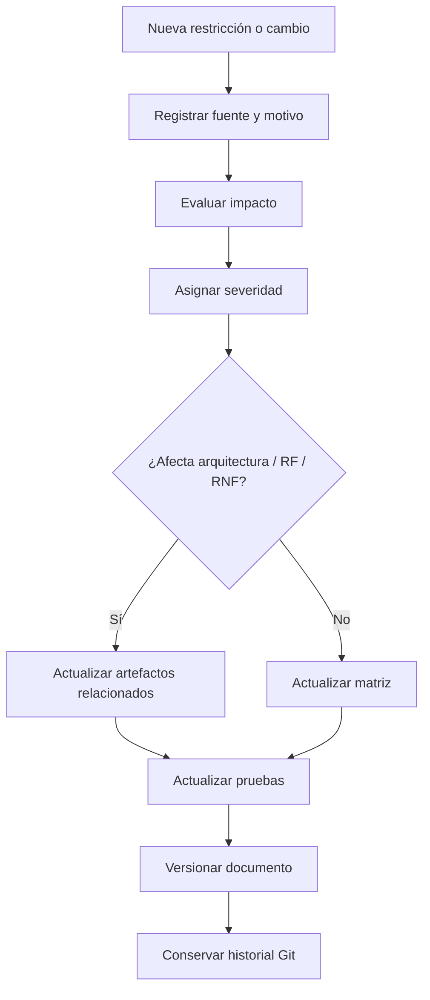

Un cambio deberá incrementar la versión cuando altere:

- una restricción crítica;
- la arquitectura;
- el alcance del MVP;
- una métrica de calidad;
- una regla de negocio;
- una condición de cumplimiento.

---

# 27. Relación con los Documentos 06–12

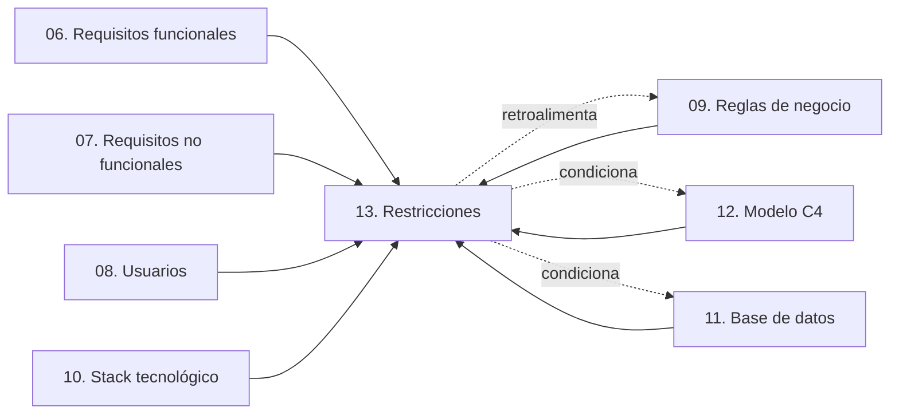

El Documento 13 funciona como un punto de consolidación: demuestra cómo las restricciones del caso se reflejan en todo el diseño técnico realizado.

---

# 28. Conclusión

El análisis multidimensional confirma que **EcoLogística Lima** no puede evaluarse únicamente desde la perspectiva funcional. La solución está condicionada simultáneamente por costos, sostenibilidad, seguridad, privacidad, contexto social, restricciones viales, calidad de datos, conectividad, infraestructura y limitaciones académicas.

Las restricciones de mayor criticidad para el MVP son:

- el plazo de 14 semanas;
- el desarrollo por un único integrante;
- la cobertura mínima funcional;
- los tiempos de optimización;
- la protección de datos;
- la seguridad y validez de las rutas.

La respuesta de diseño consolidada utiliza:

- arquitectura monolítica modular;
- React + FastAPI + PostgreSQL;
- RBAC/ABAC;
- restricciones parametrizables;
- adaptadores para fuentes externas;
- contingencia de tráfico;
- trazabilidad de optimizaciones;
- indicadores ambientales y económicos;
- pruebas de rendimiento, seguridad, accesibilidad y aceptación.

Con este documento queda completada la serie de artefactos técnicos comprendida entre:

`06. Requisitos funcionales V_1_0_0.md`

y

`13. Restricciones V_1_0_0.md`.
