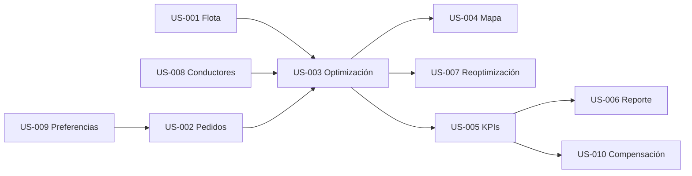

[← Volver al README Principal](../../README.md)

# 01 Transformando a ágil

## 1. Metadatos

| Campo | Valor |
|---|---|
| Proyecto | **EcoLogística Huancayo - Optimizador de Rutas Sostenibles para DistriRápido S.A.C.** |
| Integrante | **Jordy Steve Chancasanampa Torres** |
| Fecha | **27/09/2026** |
| Versión | **1.0.0** |
| Marco | Scrum / enfoque adaptativo |

## 2. Metodología de transformación

- Los **RF** se mapean a **Épicas** y se materializan como **Historias de Usuario**.
- Los **RNF** se transforman en **Historias Técnicas (Enablers)** o criterios transversales.
- Cada historia posee valor, trazabilidad, Story Points y aceptación BDD.
- El backlog se prioriza por dependencia, valor y riesgo técnico.

## 3. Épicas

| ID | Épica | RF/RNF |
|---|---|---|
| EP-01 | Gestión de recursos logísticos | RF-01, RF-08 |
| EP-02 | Pedidos y clientes | RF-02, RF-09 |
| EP-03 | Optimización y reoptimización | RF-03, RF-07 |
| EP-04 | Operación geográfica | RF-04 |
| EP-05 | Analítica y sostenibilidad | RF-05, RF-06, RF-10 |
| EP-06 | Calidad técnica transversal | RNF-01 a RNF-07 |
| EP-07 | Canales Flutter Web y Flutter móvil | Soporte transversal de interfaz por rol |

## 4. Historias de Usuario

### US-001 - Registrar y administrar flota

- **Épica relacionada:** EP-01 Gestión de recursos
- **RF origen:** RF-01
- **Story Points:** 5
- **Historia:** Como **Operador logístico**, quiero **registrar y actualizar vehículos**, para **disponer de capacidades, consumos y emisiones correctas para planificar rutas**.

**Escenario 1 - Operación válida**  
**Dado** que el usuario tiene permisos y los datos requeridos son válidos,  
**Cuando** ejecuta la función descrita en US-001,  
**Entonces** el sistema completa la operación, conserva trazabilidad y muestra un resultado verificable.

**Escenario 2 - Validación o fallo**  
**Dado** que existe un dato inválido, una restricción incumplida o una dependencia no disponible,  
**Cuando** el usuario intenta completar la función,  
**Entonces** el sistema impide un estado inconsistente y comunica el motivo sin exponer información sensible.

### US-002 - Registrar pedidos

- **Épica relacionada:** EP-02 Pedidos y clientes
- **RF origen:** RF-02
- **Story Points:** 8
- **Historia:** Como **Operador logístico**, quiero **registrar pedidos georreferenciados con ventana y prioridad**, para **incluirlos en la planificación de reparto**.

**Escenario 1 - Operación válida**  
**Dado** que el usuario tiene permisos y los datos requeridos son válidos,  
**Cuando** ejecuta la función descrita en US-002,  
**Entonces** el sistema completa la operación, conserva trazabilidad y muestra un resultado verificable.

**Escenario 2 - Validación o fallo**  
**Dado** que existe un dato inválido, una restricción incumplida o una dependencia no disponible,  
**Cuando** el usuario intenta completar la función,  
**Entonces** el sistema impide un estado inconsistente y comunica el motivo sin exponer información sensible.

### US-003 - Optimizar rutas

- **Épica relacionada:** EP-03 Optimización
- **RF origen:** RF-03
- **Story Points:** 13
- **Historia:** Como **Operador logístico**, quiero **generar rutas optimizadas**, para **reducir distancia, consumo, CO₂ y tardanzas**.

**Escenario 1 - Operación válida**  
**Dado** que el usuario tiene permisos y los datos requeridos son válidos,  
**Cuando** ejecuta la función descrita en US-003,  
**Entonces** el sistema completa la operación, conserva trazabilidad y muestra un resultado verificable.

**Escenario 2 - Validación o fallo**  
**Dado** que existe un dato inválido, una restricción incumplida o una dependencia no disponible,  
**Cuando** el usuario intenta completar la función,  
**Entonces** el sistema impide un estado inconsistente y comunica el motivo sin exponer información sensible.

### US-004 - Visualizar rutas

- **Épica relacionada:** EP-04 Operación geográfica
- **RF origen:** RF-04
- **Story Points:** 8
- **Historia:** Como **Operador / Conductor**, quiero **ver las rutas y puntos de entrega en un mapa**, para **comprender el recorrido y condiciones por tramo**.

**Escenario 1 - Operación válida**  
**Dado** que el usuario tiene permisos y los datos requeridos son válidos,  
**Cuando** ejecuta la función descrita en US-004,  
**Entonces** el sistema completa la operación, conserva trazabilidad y muestra un resultado verificable.

**Escenario 2 - Validación o fallo**  
**Dado** que existe un dato inválido, una restricción incumplida o una dependencia no disponible,  
**Cuando** el usuario intenta completar la función,  
**Entonces** el sistema impide un estado inconsistente y comunica el motivo sin exponer información sensible.

### US-005 - Consultar dashboard

- **Épica relacionada:** EP-05 Sostenibilidad
- **RF origen:** RF-05
- **Story Points:** 5
- **Historia:** Como **Gerencia / Operador**, quiero **consultar indicadores de operación y sostenibilidad**, para **evaluar desempeño y ahorro**.

**Escenario 1 - Operación válida**  
**Dado** que el usuario tiene permisos y los datos requeridos son válidos,  
**Cuando** ejecuta la función descrita en US-005,  
**Entonces** el sistema completa la operación, conserva trazabilidad y muestra un resultado verificable.

**Escenario 2 - Validación o fallo**  
**Dado** que existe un dato inválido, una restricción incumplida o una dependencia no disponible,  
**Cuando** el usuario intenta completar la función,  
**Entonces** el sistema impide un estado inconsistente y comunica el motivo sin exponer información sensible.

### US-006 - Descargar reporte de sostenibilidad

- **Épica relacionada:** EP-05 Sostenibilidad
- **RF origen:** RF-06
- **Story Points:** 5
- **Historia:** Como **Gerencia**, quiero **generar un reporte PDF**, para **documentar impacto ambiental y económico**.

**Escenario 1 - Operación válida**  
**Dado** que el usuario tiene permisos y los datos requeridos son válidos,  
**Cuando** ejecuta la función descrita en US-006,  
**Entonces** el sistema completa la operación, conserva trazabilidad y muestra un resultado verificable.

**Escenario 2 - Validación o fallo**  
**Dado** que existe un dato inválido, una restricción incumplida o una dependencia no disponible,  
**Cuando** el usuario intenta completar la función,  
**Entonces** el sistema impide un estado inconsistente y comunica el motivo sin exponer información sensible.

### US-007 - Reoptimizar por eventos

- **Épica relacionada:** EP-03 Optimización
- **RF origen:** RF-07
- **Story Points:** 8
- **Historia:** Como **Operador**, quiero **recalcular rutas cuando cambien las condiciones**, para **mantener un plan vigente y factible**.

**Escenario 1 - Operación válida**  
**Dado** que el usuario tiene permisos y los datos requeridos son válidos,  
**Cuando** ejecuta la función descrita en US-007,  
**Entonces** el sistema completa la operación, conserva trazabilidad y muestra un resultado verificable.

**Escenario 2 - Validación o fallo**  
**Dado** que existe un dato inválido, una restricción incumplida o una dependencia no disponible,  
**Cuando** el usuario intenta completar la función,  
**Entonces** el sistema impide un estado inconsistente y comunica el motivo sin exponer información sensible.

### US-008 - Administrar conductores

- **Épica relacionada:** EP-01 Gestión de recursos
- **RF origen:** RF-08
- **Story Points:** 5
- **Historia:** Como **Operador logístico**, quiero **registrar disponibilidad y datos del conductor**, para **asignar rutas compatibles con su disponibilidad**.

**Escenario 1 - Operación válida**  
**Dado** que el usuario tiene permisos y los datos requeridos son válidos,  
**Cuando** ejecuta la función descrita en US-008,  
**Entonces** el sistema completa la operación, conserva trazabilidad y muestra un resultado verificable.

**Escenario 2 - Validación o fallo**  
**Dado** que existe un dato inválido, una restricción incumplida o una dependencia no disponible,  
**Cuando** el usuario intenta completar la función,  
**Entonces** el sistema impide un estado inconsistente y comunica el motivo sin exponer información sensible.

### US-009 - Gestionar preferencias del cliente

- **Épica relacionada:** EP-02 Pedidos y clientes
- **RF origen:** RF-09
- **Story Points:** 5
- **Historia:** Como **Cliente / Operador**, quiero **registrar horarios y referencias de entrega**, para **mejorar la factibilidad de la entrega**.

**Escenario 1 - Operación válida**  
**Dado** que el usuario tiene permisos y los datos requeridos son válidos,  
**Cuando** ejecuta la función descrita en US-009,  
**Entonces** el sistema completa la operación, conserva trazabilidad y muestra un resultado verificable.

**Escenario 2 - Validación o fallo**  
**Dado** que existe un dato inválido, una restricción incumplida o una dependencia no disponible,  
**Cuando** el usuario intenta completar la función,  
**Entonces** el sistema impide un estado inconsistente y comunica el motivo sin exponer información sensible.

### US-010 - Planificar compensación de carbono

- **Épica relacionada:** EP-05 Sostenibilidad
- **RF origen:** RF-10
- **Story Points:** 5
- **Historia:** Como **Gerencia**, quiero **obtener un plan de compensación basado en CO₂ calculado**, para **conocer la magnitud de compensación requerida**.

**Escenario 1 - Operación válida**  
**Dado** que el usuario tiene permisos y los datos requeridos son válidos,  
**Cuando** ejecuta la función descrita en US-010,  
**Entonces** el sistema completa la operación, conserva trazabilidad y muestra un resultado verificable.

**Escenario 2 - Validación o fallo**  
**Dado** que existe un dato inválido, una restricción incumplida o una dependencia no disponible,  
**Cuando** el usuario intenta completar la función,  
**Entonces** el sistema impide un estado inconsistente y comunica el motivo sin exponer información sensible.

## 5. Historias Técnicas / Enablers

### EN-001 - Rendimiento del optimizador

- **RNF origen:** RNF-01
- **Story Points:** 8
- **Objetivo técnico:** Optimización ≤ 45 s; reoptimización < 30 s.

**Escenario 1**  
**Dado** el entorno de prueba definido para RNF-01,  
**Cuando** se ejecuta la validación correspondiente,  
**Entonces** la métrica objetivo debe quedar registrada con evidencia reproducible.

**Escenario 2**  
**Dado** que la métrica no se cumple,  
**Cuando** se evalúa el incremento,  
**Entonces** el elemento no puede considerarse Done hasta corregirse o existir una excepción aprobada y documentada.

### EN-002 - Seguridad web y datos

- **RNF origen:** RNF-02
- **Story Points:** 5
- **Objetivo técnico:** Controles OWASP, autenticación/autorización y 0 vulnerabilidades críticas ejecutables.

**Escenario 1**  
**Dado** el entorno de prueba definido para RNF-02,  
**Cuando** se ejecuta la validación correspondiente,  
**Entonces** la métrica objetivo debe quedar registrada con evidencia reproducible.

**Escenario 2**  
**Dado** que la métrica no se cumple,  
**Cuando** se evalúa el incremento,  
**Entonces** el elemento no puede considerarse Done hasta corregirse o existir una excepción aprobada y documentada.

### EN-003 - Accesibilidad WCAG

- **RNF origen:** RNF-03
- **Story Points:** 5
- **Objetivo técnico:** Conformidad WCAG 2.1 AA en criterios auditados.

**Escenario 1**  
**Dado** el entorno de prueba definido para RNF-03,  
**Cuando** se ejecuta la validación correspondiente,  
**Entonces** la métrica objetivo debe quedar registrada con evidencia reproducible.

**Escenario 2**  
**Dado** que la métrica no se cumple,  
**Cuando** se evalúa el incremento,  
**Entonces** el elemento no puede considerarse Done hasta corregirse o existir una excepción aprobada y documentada.

### EN-004 - Escalabilidad

- **RNF origen:** RNF-04
- **Story Points:** 5
- **Objetivo técnico:** Soportar objetivo de 1,000 pedidos/día y 50 vehículos.

**Escenario 1**  
**Dado** el entorno de prueba definido para RNF-04,  
**Cuando** se ejecuta la validación correspondiente,  
**Entonces** la métrica objetivo debe quedar registrada con evidencia reproducible.

**Escenario 2**  
**Dado** que la métrica no se cumple,  
**Cuando** se evalúa el incremento,  
**Entonces** el elemento no puede considerarse Done hasta corregirse o existir una excepción aprobada y documentada.

### EN-005 - Modo conductor usable

- **RNF origen:** RNF-05
- **Story Points:** 3
- **Objetivo técnico:** Interfaz simplificada y prueba de tareas críticas.

**Escenario 1**  
**Dado** el entorno de prueba definido para RNF-05,  
**Cuando** se ejecuta la validación correspondiente,  
**Entonces** la métrica objetivo debe quedar registrada con evidencia reproducible.

**Escenario 2**  
**Dado** que la métrica no se cumple,  
**Cuando** se evalúa el incremento,  
**Entonces** el elemento no puede considerarse Done hasta corregirse o existir una excepción aprobada y documentada.

### EN-006 - Disponibilidad y contingencia

- **RNF origen:** RNF-06
- **Story Points:** 5
- **Objetivo técnico:** Disponibilidad 99.5% en horario operativo y degradación controlada.

**Escenario 1**  
**Dado** el entorno de prueba definido para RNF-06,  
**Cuando** se ejecuta la validación correspondiente,  
**Entonces** la métrica objetivo debe quedar registrada con evidencia reproducible.

**Escenario 2**  
**Dado** que la métrica no se cumple,  
**Cuando** se evalúa el incremento,  
**Entonces** el elemento no puede considerarse Done hasta corregirse o existir una excepción aprobada y documentada.

### EN-007 - Documentación técnica

- **RNF origen:** RNF-07
- **Story Points:** 3
- **Objetivo técnico:** Documentación y OpenAPI actualizados por release.

**Escenario 1**  
**Dado** el entorno de prueba definido para RNF-07,  
**Cuando** se ejecuta la validación correspondiente,  
**Entonces** la métrica objetivo debe quedar registrada con evidencia reproducible.

**Escenario 2**  
**Dado** que la métrica no se cumple,  
**Cuando** se evalúa el incremento,  
**Entonces** el elemento no puede considerarse Done hasta corregirse o existir una excepción aprobada y documentada.

## 6. Definition of Done global

Un elemento solo puede pasar a **Done** cuando cumple todo lo aplicable:

- [ ] criterios de aceptación BDD aprobados;
- [ ] pruebas unitarias con cobertura del módulo **≥ 80%**;
- [ ] pruebas de integración aplicables ejecutadas;
- [ ] análisis estático sin vulnerabilidades críticas;
- [ ] revisión de código aprobada mediante Pull Request; en equipo unipersonal, se realiza auto-revisión documentada y revisión docente cuando corresponda;
- [ ] despliegue reproducible en ambiente de staging/pruebas;
- [ ] OpenAPI/Swagger actualizado cuando cambie la API;
- [ ] migraciones y documentación actualizadas cuando cambien datos;
- [ ] trazabilidad RF/RNF → historia → prueba conservada;
- [ ] no existen secretos reales en el repositorio.

## 7. Priorización inicial

| Orden | Elemento | Motivo |
|---:|---|---|
| 1 | EN-002 | Seguridad transversal desde el inicio. |
| 2 | US-001 | Datos de vehículos requeridos por optimización. |
| 3 | US-008 | Disponibilidad de conductores requerida por asignación. |
| 4 | US-002 | Pedidos son entrada central del optimizador. |
| 5 | US-003 | Núcleo de valor del proyecto. |
| 6 | EN-001 | Valida el límite de rendimiento del núcleo. |
| 7 | US-004 | Hace observable la solución. |
| 8 | US-007 | Permite adaptación operativa. |
| 9 | US-005 | Mide el resultado. |
| 10 | US-006 | Formaliza reporte. |
| 11 | US-009 | Completa preferencias. |
| 12 | US-010 | Completa compensación. |

## 8. Dependencias principales

## 9. Decisión de canales de implementación

- **Flutter Web** y **Flutter móvil** serán proyectos independientes.
- Las Historias de Usuario administrativas se implementarán principalmente en Flutter Web.
- Las historias del conductor se implementarán principalmente en Flutter móvil.
- Ambos clientes consumirán el mismo contrato OpenAPI del backend.
- Una historia que afecte a ambos canales deberá contener subtareas separadas por cliente para mantener trazabilidad.
