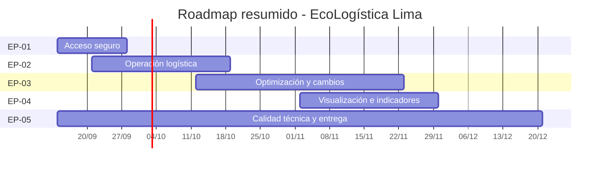
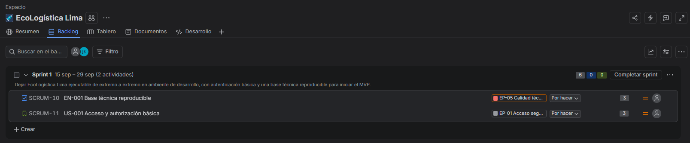
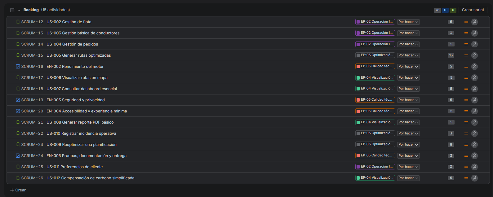
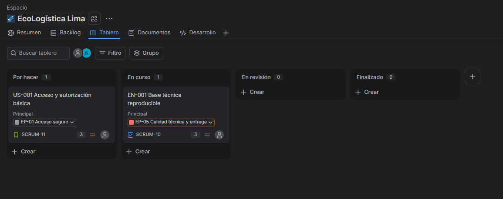
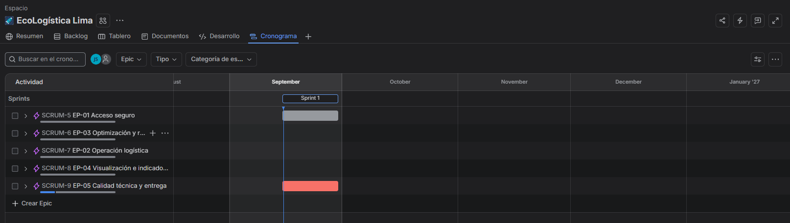
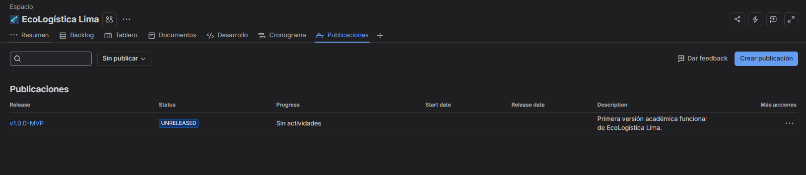

[← Volver al README principal](../../README.md)

# Artefactos Jira

## 1. Metadatos

| Campo | Información |
|---|---|
| Proyecto | EcoLogística Lima |
| Integrante | Jordy Steve Chancasanampa Torres |
| Versión | 1.0.0 |
| Estado | Guía de configuración y evidencia Jira |
| Versión Jira objetivo | `v1.0.0-MVP` |

## 2. Objetivo

Documentar cómo debe quedar configurado Jira Software y qué evidencias deben incorporarse para demostrar Roadmap, Backlog, Sprint 1, tablero Scrum y Release.

> **Importante:** este documento define la configuración objetivo. Las capturas deben obtenerse del Jira realmente configurado y recortarse únicamente al panel o elemento que se desea evidenciar.

## 3. Configuración recomendada de Jira

- Plantilla: **Scrum**.
- Nombre: `EcoLogística Lima`.
- Clave sugerida: `ECO`.
- Responsable: Jordy Steve Chancasanampa Torres.

### Jerarquía

```text
Épica
├── Historia de Usuario (Story)
│   └── Subtareas <= 8 h
└── Historia Técnica / Enabler (Task/Story)
    └── Subtareas <= 8 h
```

### Flujo del tablero

```text
To Do → In Progress → In Review / QA → Done
```

Si Jira no permite el nombre combinado `In Review / QA`, usar `In Review` y considerar QA como criterio de salida.

## 4. Épicas

| ID | Nombre en Jira | Objetivo | Ventana sugerida |
|---|---|---|---|
| EP-01 | Acceso seguro | Autenticación y permisos básicos | Semanas 1-2 |
| EP-02 | Operación logística | Flota, conductores y pedidos | Semanas 2-5 |
| EP-03 | Optimización y respuesta a cambios | Algoritmo, incidencias y reoptimización | Semanas 5-10 |
| EP-04 | Visualización e indicadores | Mapa, dashboard y reporte | Semanas 8-11 |
| EP-05 | Calidad técnica y entrega | Rendimiento, seguridad, pruebas y documentación | Semanas 1-14 |

## 5. Roadmap objetivo



Las fechas son referenciales. Si el calendario académico oficial difiere, ajustar Jira sin cambiar la secuencia lógica.

## 6. Backlog priorizado

| Orden | ID | Tipo | Resumen | Épica | SP | Prioridad | Versión |
|---:|---|---|---|---|---:|---|---|
| 1 | EN-001 | Enabler | Base técnica reproducible | EP-05 | 3 | Highest | v1.0.0-MVP |
| 2 | US-001 | Story | Acceso y autorización básica | EP-01 | 3 | Highest | v1.0.0-MVP |
| 3 | US-002 | Story | Gestión de flota | EP-02 | 5 | Highest | v1.0.0-MVP |
| 4 | US-003 | Story | Gestión básica de conductores | EP-02 | 3 | High | v1.0.0-MVP |
| 5 | US-004 | Story | Gestión de pedidos | EP-02 | 5 | Highest | v1.0.0-MVP |
| 6 | US-005 | Story | Generar rutas optimizadas | EP-03 | 13 | Highest | v1.0.0-MVP |
| 7 | EN-002 | Enabler | Rendimiento del motor | EP-05 | 5 | High | v1.0.0-MVP |
| 8 | US-006 | Story | Visualizar rutas en mapa | EP-04 | 5 | High | v1.0.0-MVP |
| 9 | US-007 | Story | Consultar dashboard esencial | EP-04 | 5 | High | v1.0.0-MVP |
| 10 | EN-003 | Enabler | Seguridad y privacidad | EP-05 | 5 | High | v1.0.0-MVP |
| 11 | EN-004 | Enabler | Accesibilidad y experiencia mínima | EP-05 | 5 | Medium | v1.0.0-MVP |
| 12 | US-008 | Story | Generar reporte PDF básico | EP-04 | 5 | Medium | v1.0.0-MVP |
| 13 | US-010 | Story | Registrar incidencia operativa | EP-03 | 3 | Medium | v1.0.0-MVP |
| 14 | US-009 | Story | Reoptimizar una planificación | EP-03 | 8 | Medium | v1.0.0-MVP |
| 15 | EN-005 | Enabler | Pruebas, documentación y entrega | EP-05 | 3 | High | v1.0.0-MVP |
| 16 | US-011 | Story | Preferencias de cliente | EP-02 | 3 | Low | Post-MVP |
| 17 | US-012 | Story | Compensación de carbono simplificada | EP-04 | 5 | Low | Post-MVP |

## 7. Plan de Sprints

Se recomienda una cadencia de **2 semanas** para las 14 semanas.

| Sprint | Objetivo | Ítems principales |
|---|---|---|
| Sprint 1 | Tener una base ejecutable y acceso controlado | EN-001, US-001 |
| Sprint 2 | Disponer de datos operativos | US-002, US-003, US-004 |
| Sprint 3 | Obtener la primera optimización válida | US-005 |
| Sprint 4 | Mostrar el resultado al usuario | US-006, US-007 |
| Sprint 5 | Incorporar evidencia y cambios operativos | US-008, US-010 |
| Sprint 6 | Reoptimizar y validar calidad | US-009, EN-002, EN-003 |
| Sprint 7 | Corregir, documentar y preparar entrega | EN-004, EN-005, defectos críticos |

## 8. Sprint 1

**Duración:** 2 semanas  
**Sprint Goal:** `Dejar EcoLogística Lima ejecutable de extremo a extremo en ambiente de desarrollo, con autenticación básica y una base técnica reproducible para iniciar el MVP.`

| ID | Ítem | SP | Subtareas sugeridas |
|---|---|---:|---|
| EN-001 | Base técnica reproducible | 3 | Estructura React/FastAPI; conexión PostgreSQL; variables; README de arranque. |
| US-001 | Acceso y autorización básica | 3 | modelo usuario/rol; login API; formulario login; protección de endpoint; pruebas. |

**Compromiso Sprint 1: 6 SP.** Se mantiene bajo intencionalmente por tratarse del primer Sprint de un desarrollador individual.

## 9. Subtareas de máximo 8 horas

| Historia | Subtarea | Estimación |
|---|---|---:|
| EN-001 | Inicializar backend FastAPI | 3 h |
| EN-001 | Inicializar frontend React | 3 h |
| EN-001 | Configurar PostgreSQL y variables | 4 h |
| US-001 | Crear modelo usuario/rol | 5 h |
| US-001 | Implementar endpoint login | 6 h |
| US-001 | Implementar formulario login | 5 h |
| US-001 | Probar acceso permitido/denegado | 4 h |

## 10. Versiones / Releases

Crear en Jira:

- **Nombre:** `v1.0.0-MVP`
- **Descripción:** `Primera versión académica funcional de EcoLogística Lima.`
- Asociar todos los ítems del MVP a esta versión.
- `US-011` y `US-012` pueden quedar en `Post-MVP`.

## 11. Evidencias fotográficas obligatorias

### Política estricta de captura

Mostrar **únicamente el panel de Jira** a demostrar. No incluir escritorio completo, barra de tareas, pestañas del navegador ni espacio sobrante.

### Evidencia 1 — Roadmap
Debe mostrar las cinco Épicas en la línea de tiempo.



### Evidencia 2 — Backlog priorizado
Debe mostrar orden, Story Points y asociación con Épicas.



### Evidencia 3 — Sprint Planning y Sprint Goal
Debe mostrar Sprint 1, EN-001, US-001 y Sprint Goal visible.



### Evidencia 4 — Tablero Scrum activo
Debe mostrar `To Do`, `In Progress`, `In Review / QA` y `Done` con tarjetas distribuidas.



### Evidencia 5 — Releases
Debe mostrar `v1.0.0-MVP` y su asociación con historias.



## 12. Pasos exactos para Jira

1. Crear proyecto Scrum `EcoLogística Lima`, clave sugerida `ECO`.
2. Crear versión `v1.0.0-MVP`.
3. Crear las cinco Épicas.
4. Crear o importar los ítems del backlog.
5. Asignar Story Points y prioridades.
6. Ordenar el backlog como en la sección 6.
7. Crear Sprint 1 y mover `EN-001` y `US-001`.
8. Configurar el Sprint Goal de la sección 8.
9. Configurar columnas del tablero.
10. Iniciar Sprint 1.
11. Mover tarjetas solo según el estado real del trabajo.
12. Tomar las cinco capturas recortadas.

## 13. Criterio de aceptación

Este artefacto queda completo cuando las cinco capturas reales reemplazan los placeholders y demuestran la configuración descrita.

[← Volver al README principal](../../README.md)
