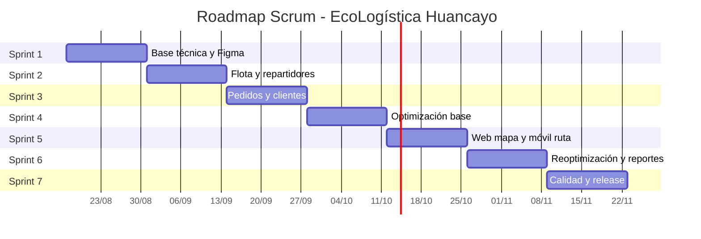

[⌂ README principal](../../README.md) | [← Anterior: 01 Transformando a ágil](01%20Transformando%20a%20%C3%A1gil%20V_1_0_0.md) | [Siguiente: 03 Registro de riesgos →](03%20Registro%20de%20riesgos%20V_1_0_0.md)

# 02 Artefactos Jira

## 1. Metadatos

| Campo | Valor |
|---|---|
| Proyecto | **EcoLogística Huancayo - Optimizador de Rutas Sostenibles para DistriRápido S.A.C.** |
| Integrante | **Jordy Steve Chancasanampa Torres** |
| Modalidad | Proyecto individual |
| Fecha | **27/09/2026** |
| Versión | **1.0.0** |
| Herramienta | Atlassian Jira Software |
| Proyecto sugerido | Scrum |

> **Cómo leer esta tabla:** resume la identificación y las decisiones base del documento. Permite comprobar que todos los artefactos pertenecen al mismo proyecto, versión e integrante.

## 2. Estructura del proyecto en Jira

| Nivel | Tipo de issue | Uso |
|---|---|---|
| 1 | Epic | Módulo/gran objetivo. |
| 2 | Story | Valor funcional para administrador o repartidor. |
| 2 | Task / Enabler | Arquitectura, seguridad, Figma, BD, rendimiento o documentación. |
| 3 | Sub-task | Unidad técnica pequeña (idealmente ≤8 horas). |
| Incidencia | Bug | Defecto descubierto durante QA/Sprint. |

> **Cómo leer esta tabla:** define la jerarquía que debe verse en Jira. No convertir todos los trabajos técnicos en User Stories si no entregan valor directo al actor.

## 3. Campos que debe tener cada issue

| Campo | Uso |
|---|---|
| Summary | Título breve y verificable. |
| Description | Como/Quiero/Para o descripción técnica. |
| Acceptance Criteria | Gherkin. |
| Epic Link / Parent | Trazabilidad al bloque funcional. |
| Story Points | Fibonacci 1,2,3,5,8,13. |
| Priority | Highest/High/Medium/Low según riesgo/valor. |
| Component | `flutter-web`, `flutter-mobile`, `backend-api`, `database`, `optimization`, `security`, `qa`, `figma`, `documentation`. |
| Sprint | Sprint de ejecución. |
| Fix Version | `v1.0.0-MVP`. |
| Labels | RF/RNF, por ejemplo `RF-03`, `RNF-01`. |

> **Cómo leer esta tabla:** estos campos permiten que Roadmap, filtros, reportes y evidencias tengan información suficiente para ser útiles y no solo decorativos.

## 4. Workflow

```mermaid
flowchart LR
    TD[To Do] --> IP[In Progress]
    IP --> QA[In Review / QA]
    QA --> D[Done]
    QA -->|Falla prueba| IP
```

> **Interpretación del gráfico:** una tarjeta solo llega a Done después de revisión/QA. Si falla una prueba, regresa a trabajo activo.

## 5. Product Backlog priorizado

| ID | Historia | Épica | RF | Sprint inicial |
|---|---|---|---|---|
| US-001 | Autenticación administrador | EP-01 | 3 | RF transversal |
| US-002 | Autenticación repartidor | EP-01 | 3 | RF transversal |
| US-003 | Gestionar flota | EP-02 | 5 | RF-01 |
| US-004 | Gestionar repartidores | EP-02 | 5 | RF-08 |
| US-005 | Gestionar pedidos | EP-03 | 8 | RF-02 |
| US-006 | Gestionar clientes/preferencias | EP-03 | 5 | RF-09 |
| US-007 | Generar rutas optimizadas | EP-04 | 13 | RF-03 |
| US-008 | Visualizar mapa global | EP-05 | 8 | RF-04 |
| US-009 | Consultar mi ruta | EP-05 | 8 | RF-04 |
| US-010 | Actualizar entrega/reportar incidente | EP-05 | 5 | RF-07 |
| US-011 | Reoptimizar rutas | EP-04 | 8 | RF-07 |
| US-012 | Consultar dashboard | EP-06 | 5 | RF-05 |
| US-013 | Generar reporte PDF | EP-06 | 5 | RF-06 |
| US-014 | Plan de compensación | EP-06 | 5 | RF-10 |

> **Cómo leer esta tabla:** es la versión resumida del Product Backlog funcional. Los Enablers de calidad se agregan en paralelo dentro de los Sprints.

## 6. Roadmap por Sprints

```mermaid
gantt
    title Roadmap Scrum - EcoLogística Huancayo
    dateFormat YYYY-MM-DD
    axisFormat %d/%m
    section Sprint 1
    Base técnica y Figma : 2026-08-17, 14d
    section Sprint 2
    Flota y repartidores : 2026-08-31, 14d
    section Sprint 3
    Pedidos y clientes : 2026-09-14, 14d
    section Sprint 4
    Optimización base : 2026-09-28, 14d
    section Sprint 5
    Web mapa y móvil ruta : 2026-10-12, 14d
    section Sprint 6
    Reoptimización y reportes : 2026-10-26, 14d
    section Sprint 7
    Calidad y release : 2026-11-09, 14d
```

> **Interpretación del gráfico:** muestra la secuencia de valor del MVP. Las fechas son una planificación de referencia de 14 semanas y deben ajustarse en Jira al calendario real del curso si fuera necesario.

## 7. Plan detallado de Sprints

### Sprint 1 — Semanas 1-2

**Sprint Goal:** Establecer la base técnica, seguridad inicial, arquitectura, BD y prototipos Figma para Web administrador y móvil repartidor.

| Issue | Trabajo | Story Points |
|---|---|---:|
| US-001 | Login administrador | 3 |
| US-002 | Login repartidor | 3 |
| EN-001 | Estructura Flutter Web/Móvil + backend | 3 |
| EN-002 | BD/migraciones base | 5 |
| EN-007 | Mockups Figma iniciales | 5 |
| EN-003 | RBAC base | 3 |
| **Total planificado** |  | **22** |

> **Cómo leer esta tabla:** estos issues forman el Sprint Backlog inicial. En Jira deben estar dentro de Sprint 1 y vinculados a su épica/componente.

**Product Increment:** Dos clientes Flutter ejecutables, API base, esquema inicial, login por rol y prototipos Figma.

**Sprint Review — evidencia a demostrar:** Demostrar navegación inicial, login por rol, repositorio, diagrama/BD y Figma.

**Sprint Retrospective — preguntas guía:** ¿La estructura separa realmente Web/Móvil? ¿Qué bloqueo consumió más tiempo? ¿La capacidad de SP fue realista?

**Cierre del Sprint en Jira:** verificar Done real, mover incompletos al Backlog, registrar impedimentos, capturar Sprint Report y actualizar velocidad.

### Sprint 2 — Semanas 3-4

**Sprint Goal:** Completar gestión de flota y repartidores desde Flutter Web y preparar el perfil móvil del repartidor.

| Issue | Trabajo | Story Points |
|---|---|---:|
| US-003 | Gestión de flota | 5 |
| US-004 | Gestión de repartidores | 5 |
| EN-005 | Accesibilidad de formularios | 3 |
| EN-007 | Mockups Figma refinados | 3 |
| EN-009 | OpenAPI/documentación | 3 |
| **Total planificado** |  | **19** |

> **Cómo leer esta tabla:** estos issues forman el Sprint Backlog inicial. En Jira deben estar dentro de Sprint 2 y vinculados a su épica/componente.

**Product Increment:** Administrador puede gestionar vehículos/repartidores y repartidor puede consultar su perfil básico.

**Sprint Review — evidencia a demostrar:** Crear/editar vehículo y repartidor, demostrar validaciones y permisos.

**Sprint Retrospective — preguntas guía:** ¿Los formularios son claros? ¿Qué validaciones faltaron? ¿La BD soporta reglas sin duplicación?

**Cierre del Sprint en Jira:** verificar Done real, mover incompletos al Backlog, registrar impedimentos, capturar Sprint Report y actualizar velocidad.

### Sprint 3 — Semanas 5-6

**Sprint Goal:** Implementar pedidos, clientes, preferencias y georreferenciación para preparar entradas del optimizador.

| Issue | Trabajo | Story Points |
|---|---|---:|
| US-005 | Gestión de pedidos | 8 |
| US-006 | Clientes/preferencias | 5 |
| EN-003 | Seguridad de datos | 3 |
| EN-009 | OpenAPI/documentación | 3 |
| **Total planificado** |  | **19** |

> **Cómo leer esta tabla:** estos issues forman el Sprint Backlog inicial. En Jira deben estar dentro de Sprint 3 y vinculados a su épica/componente.

**Product Increment:** Pedidos válidos, clientes y preferencias persistidos con coordenadas/referencias.

**Sprint Review — evidencia a demostrar:** Registrar pedido completo, validar ventana, prioridad, ubicación y preferencia.

**Sprint Retrospective — preguntas guía:** ¿Qué datos son realmente obligatorios? ¿Cómo se manejaron direcciones incompletas? ¿Qué deuda quedó?

**Cierre del Sprint en Jira:** verificar Done real, mover incompletos al Backlog, registrar impedimentos, capturar Sprint Report y actualizar velocidad.

### Sprint 4 — Semanas 7-8

**Sprint Goal:** Construir el motor de optimización base y demostrar una solución VRPTW/Green VRP medible.

| Issue | Trabajo | Story Points |
|---|---|---:|
| US-007 | Generación de rutas | 13 |
| EN-004 | Benchmark inicial | 5 |
| EN-003 | Validación backend | 3 |
| **Total planificado** |  | **21** |

> **Cómo leer esta tabla:** estos issues forman el Sprint Backlog inicial. En Jira deben estar dentro de Sprint 4 y vinculados a su épica/componente.

**Product Increment:** Motor devuelve rutas factibles con métricas y persiste resultado.

**Sprint Review — evidencia a demostrar:** Ejecutar dataset controlado, mostrar tiempo de cálculo, rutas, distancia, CO₂ y restricciones.

**Sprint Retrospective — preguntas guía:** ¿El algoritmo cumple factibilidad? ¿Qué cuello de botella apareció? ¿Qué parámetro necesita ajuste?

**Cierre del Sprint en Jira:** verificar Done real, mover incompletos al Backlog, registrar impedimentos, capturar Sprint Report y actualizar velocidad.

### Sprint 5 — Semanas 9-10

**Sprint Goal:** Hacer observable la planificación en Web y ejecutable la ruta desde la app móvil del repartidor.

| Issue | Trabajo | Story Points |
|---|---|---:|
| US-008 | Mapa global administrador | 8 |
| US-009 | Mi ruta móvil | 8 |
| US-010 | Estados/incidentes móvil | 5 |
| EN-008 | Contingencia móvil inicial | 3 |
| **Total planificado** |  | **24** |

> **Cómo leer esta tabla:** estos issues forman el Sprint Backlog inicial. En Jira deben estar dentro de Sprint 5 y vinculados a su épica/componente.

**Product Increment:** Administrador ve mapa global; repartidor ve solo su ruta y puede actualizar estado/reportar incidente.

**Sprint Review — evidencia a demostrar:** Mostrar misma ruta en Web y móvil con permisos distintos; registrar un incidente.

**Sprint Retrospective — preguntas guía:** ¿Se expuso información innecesaria al móvil? ¿La navegación es suficiente en campo? ¿Qué debe funcionar con conectividad débil?

**Cierre del Sprint en Jira:** verificar Done real, mover incompletos al Backlog, registrar impedimentos, capturar Sprint Report y actualizar velocidad.

### Sprint 6 — Semanas 11-12

**Sprint Goal:** Incorporar reoptimización, dashboard, reportes y consolidar indicadores de sostenibilidad.

| Issue | Trabajo | Story Points |
|---|---|---:|
| US-011 | Reoptimización | 8 |
| US-012 | Dashboard | 5 |
| US-013 | Reporte PDF | 5 |
| EN-006 | Rendimiento API/BD | 3 |
| EN-004 | Benchmark reoptimización | 3 |
| **Total planificado** |  | **24** |

> **Cómo leer esta tabla:** estos issues forman el Sprint Backlog inicial. En Jira deben estar dentro de Sprint 6 y vinculados a su épica/componente.

**Product Increment:** Cambio operativo produce nueva planificación; administrador dispone de KPIs y PDF.

**Sprint Review — evidencia a demostrar:** Simular cancelación/incidente, reoptimizar, comparar métricas y descargar reporte.

**Sprint Retrospective — preguntas guía:** ¿La reoptimización <30 s? ¿Las métricas son trazables? ¿El PDF comunica el valor del producto?

**Cierre del Sprint en Jira:** verificar Done real, mover incompletos al Backlog, registrar impedimentos, capturar Sprint Report y actualizar velocidad.

### Sprint 7 — Semanas 13-14

**Sprint Goal:** Cerrar el MVP con compensación de carbono, endurecimiento de seguridad, accesibilidad, pruebas y documentación.

| Issue | Trabajo | Story Points |
|---|---|---:|
| US-014 | Compensación CO₂ | 5 |
| EN-003 | Hardening seguridad | 3 |
| EN-005 | Auditoría accesibilidad | 3 |
| EN-006 | Prueba escala | 3 |
| EN-008 | Prueba contingencia | 3 |
| EN-009 | Documentación final | 3 |
| **Total planificado** |  | **20** |

> **Cómo leer esta tabla:** estos issues forman el Sprint Backlog inicial. En Jira deben estar dentro de Sprint 7 y vinculados a su épica/componente.

**Product Increment:** Release v1.0.0-MVP probado, documentado y preparado para presentación.

**Sprint Review — evidencia a demostrar:** Demostrar RF principales, resultados de pruebas, seguridad/accesibilidad, compensación y documentación.

**Sprint Retrospective — preguntas guía:** ¿Qué se mantendría/cambiaría para una siguiente release? ¿Qué deuda técnica queda? ¿Se cumplió el Sprint Goal final?

**Cierre del Sprint en Jira:** verificar Done real, mover incompletos al Backlog, registrar impedimentos, capturar Sprint Report y actualizar velocidad.

## 8. Subtareas estándar por historia

| Tipo de subtarea | Cuándo aplica |
|---|---|
| Figma / UX | Si cambia interfaz. |
| Modelo/migración BD | Si cambia persistencia. |
| Endpoint/servicio backend | Si requiere lógica/API. |
| Flutter Web | Si participa administrador. |
| Flutter móvil | Si participa repartidor. |
| Prueba unitaria | Lógica de negocio/componente. |
| Prueba integración | API/BD/integración. |
| QA/seguridad/accesibilidad | Según RNF. |
| Documentación | Si cambia contrato, flujo o arquitectura. |

> **Cómo leer esta tabla:** sirve como checklist para descomponer una Story sin convertir subtareas en historias independientes.

## 9. Gráficos y vistas que debes obtener de Jira

| Evidencia | Cuándo | Qué debe demostrar | Obligación |
|---|---|---|---|
| Roadmap/Timeline | Antes de Sprint 1 | Épicas y horizonte. | Requerida por consigna. |
| Backlog priorizado | Antes de Sprint 1 | SP, prioridad, componentes. | Requerida. |
| Sprint Planning + Sprint Goal | Cada Sprint | Scope y meta. | Requerida al menos para Sprint 1. |
| Scrum Board | Durante Sprint | Flujo To Do→Done. | Requerida. |
| Release/Version | Durante planificación/cierre | `v1.0.0-MVP`. | Requerida. |
| Burndown | Fin de Sprint | Trabajo restante vs tiempo. | Complementaria útil. |
| Sprint Report | Fin de Sprint | Completado/no completado. | Complementaria útil. |
| Velocity | Desde ≥2 Sprints | Capacidad histórica. | Complementaria útil. |
| Cumulative Flow | Con historial | WIP y cuellos de botella. | Complementaria útil. |

> **Cómo leer esta tabla:** separa lo que la consigna pide expresamente de gráficos que ayudan a demostrar Scrum, evitando presentar extras como requisitos obligatorios.

## 10. Capturas obligatorias

1. Roadmap del Proyecto.
2. Backlog priorizado con Story Points y componentes.
3. Sprint Planning & Sprint Goal del Sprint 1.
4. Tablero Scrum con To Do, In Progress, In Review / QA y Done.
5. Releases con `v1.0.0-MVP` y issues asociados.

**Regla:** usar únicamente capturas reales, recortadas al panel de Jira. No colocar escritorio, barra de tareas, pestañas u otro contenido ajeno.

## 11. Product Increment, Review y Retrospective

| Evento | Resultado que debe quedar registrado |
|---|---|
| Product Increment | Funcionalidad integrada que cumple DoD. |
| Sprint Review | Qué se terminó, qué se demostró, feedback y cambios de backlog. |
| Sprint Retrospective | Qué funcionó, qué no, acción de mejora con responsable y Sprint objetivo. |

> **Cómo leer esta tabla:** estas tres evidencias demuestran que Scrum no se limita a mover tarjetas. Deben generar decisiones y aprendizaje para el siguiente Sprint.

---

[⌂ README principal](../../README.md) | [← Anterior: 01 Transformando a ágil](01%20Transformando%20a%20%C3%A1gil%20V_1_0_0.md) | [Siguiente: 03 Registro de riesgos →](03%20Registro%20de%20riesgos%20V_1_0_0.md)
