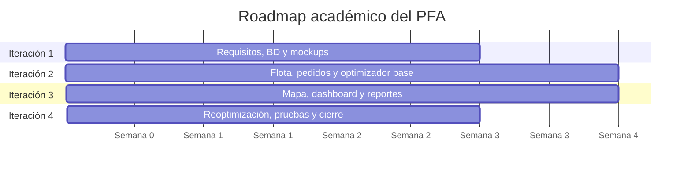

[← Volver al README Principal](../../README.md)

# 02 Artefactos Jira

## 1. Metadatos

| Campo | Valor |
|---|---|
| Proyecto | **EcoLogística Huancayo - Optimizador de Rutas Sostenibles para DistriRápido S.A.C.** |
| Integrante | **Jordy Steve Chancasanampa Torres** |
| Fecha | **27/09/2026** |
| Versión | **1.0.0** |
| Herramienta | Atlassian Jira Software |

## 2. Configuración objetivo de Jira

### Jerarquía
- **Epic:** módulos/grandes bloques.
- **Story:** funcionalidad orientada al usuario.
- **Task/Enabler:** arquitectura, seguridad, rendimiento, BD o DevOps.
- **Sub-task:** unidad técnica de trabajo de hasta 8 horas.
- **Bug:** incidencia detectada.

### Workflow
`To Do → In Progress → In Review / QA → Done`

### Estimación
Fibonacci: `1, 2, 3, 5, 8, 13`.

### Release
**v1.0.0-MVP**

## 3. Roadmap del proyecto

```mermaid
gantt
    title Roadmap académico del PFA
    dateFormat  X
    axisFormat  Semana %s
    section Iteración 1
    Requisitos, BD y mockups           :a1, 1, 3
    section Iteración 2
    Flota, pedidos y optimizador base  :a2, 4, 4
    section Iteración 3
    Mapa, dashboard y reportes         :a3, 8, 4
    section Iteración 4
    Reoptimización, pruebas y cierre   :a4, 12, 3
```

> En Jira, las épicas deben alinearse a esta línea temporal de referencia sin alterar las cuatro iteraciones de la consigna.

## 4. Backlog priorizado

| ID | Resumen | Épica | Prioridad | Story Points | Estado de planificación |
|---|---|---|---|---:|---|
| EN-002 | Seguridad web y datos | EP-06 | Alta | 5 | Sprint 1 |
| US-001 | Registrar y administrar flota | EP-01 | Alta | 5 | Sprint 1 |
| US-008 | Administrar conductores | EP-01 | Alta | 5 | Sprint 1 |
| US-002 | Registrar pedidos | EP-02 | Alta | 8 | Sprint 1 |
| US-003 | Optimizar rutas | EP-03 | Alta | 13 | Backlog |
| EN-001 | Rendimiento del optimizador | EP-06 | Alta | 8 | Backlog |
| US-004 | Visualizar rutas | EP-04 | Alta | 8 | Backlog |
| US-007 | Reoptimizar por eventos | EP-03 | Alta | 8 | Backlog |
| US-005 | Consultar dashboard | EP-05 | Media | 5 | Backlog |
| US-006 | Descargar reporte | EP-05 | Media | 5 | Backlog |
| US-009 | Preferencias del cliente | EP-02 | Media | 5 | Backlog |
| US-010 | Compensación de carbono | EP-05 | Media | 5 | Backlog |
| EN-003 | Accesibilidad WCAG | EP-06 | Media | 5 | Backlog |
| EN-004 | Escalabilidad | EP-06 | Media | 5 | Backlog |
| EN-005 | Modo conductor usable | EP-06 | Media | 3 | Backlog |
| EN-006 | Disponibilidad | EP-06 | Media | 5 | Backlog |
| EN-007 | Documentación técnica | EP-06 | Alta | 3 | Transversal |

## 5. Sprint Planning - Sprint 1

- **Duración:** 2 semanas.
- **Sprint Goal:** **Construir la base operativa segura para registrar vehículos, conductores y pedidos que alimentarán el posterior motor de optimización.**
- **Capacidad planificada:** 23 Story Points.

### Ítems del Sprint 1

| ID | SP | Entregable verificable |
|---|---:|---|
| EN-002 | 5 | Autenticación/autorización base, validación y controles de seguridad aplicables. |
| US-001 | 5 | CRUD de flota en Flutter Web + API con validaciones. |
| US-008 | 5 | Gestión de conductores en Flutter Web y base para perfil/ruta en Flutter móvil. |
| US-002 | 8 | CRUD de pedidos en Flutter Web con coordenadas, ventanas y validaciones. |

### Subtareas técnicas sugeridas

Cada subtarea debe mantenerse en **≤ 8 horas**:

- modelar tablas y migraciones;
- crear esquemas de validación;
- implementar repositorio/servicio;
- implementar endpoints;
- implementar pantalla/formulario;
- pruebas unitarias;
- pruebas de integración;
- revisión de accesibilidad básica;
- documentación OpenAPI;
- revisión de seguridad.

## 6. Componentes de Jira

- `flutter-web`
- `flutter-mobile`
- `backend-api`
- `database`
- `optimization`
- `maps`
- `security`
- `qa`
- `documentation`

## 7. Criterios para mover tarjetas

### To Do
Elemento refinado, estimado, con aceptación y dependencias identificadas.

### In Progress
Trabajo iniciado y responsable asignado.

### In Review / QA
Implementación concluida; pruebas y revisión en curso.

### Done
Cumple Definition of Done global y criterios de aceptación.

## 8. Evidencias obligatorias

> **No se incluyen capturas ficticias.** Esta sección debe completarse únicamente con capturas reales de Jira. La consigna prohíbe capturas de pantalla completa; debe recortarse solo el panel correspondiente.

### Evidencia 1 - Roadmap del Proyecto
**Archivo sugerido:** `evidencias/jira/01-roadmap.png`  
**Debe mostrar:** épicas y su ubicación en la línea de tiempo.

`[PENDIENTE: insertar captura real recortada del Roadmap de Jira]`

### Evidencia 2 - Backlog Priorizado
**Archivo sugerido:** `evidencias/jira/02-backlog.png`  
**Debe mostrar:** Story Points, prioridad y componentes.

`[PENDIENTE: insertar captura real recortada del Backlog]`

### Evidencia 3 - Sprint Planning & Sprint Goal
**Archivo sugerido:** `evidencias/jira/03-sprint-planning.png`  
**Debe mostrar:** Sprint 1, objetivo e ítems seleccionados.

`[PENDIENTE: insertar captura real recortada de Sprint Planning]`

### Evidencia 4 - Tablero Scrum Activo
**Archivo sugerido:** `evidencias/jira/04-board.png`  
**Debe mostrar:** To Do, In Progress, In Review / QA y Done.

`[PENDIENTE: insertar captura real recortada del tablero]`

### Evidencia 5 - Versiones / Release
**Archivo sugerido:** `evidencias/jira/05-release.png`  
**Debe mostrar:** versión `v1.0.0-MVP` y asociación de issues.

`[PENDIENTE: insertar captura real recortada de Releases]`

## 9. Checklist antes de entregar

- [ ] Épicas creadas.
- [ ] Historias y Enablers creados.
- [ ] Story Points asignados.
- [ ] Backlog ordenado.
- [ ] Componentes asignados.
- [ ] Roadmap configurado.
- [ ] Release `v1.0.0-MVP` creada.
- [ ] Sprint 1 activo con Sprint Goal.
- [ ] Workflow correcto.
- [ ] Cinco evidencias reales insertadas.
- [ ] Capturas recortadas al panel de Jira.
