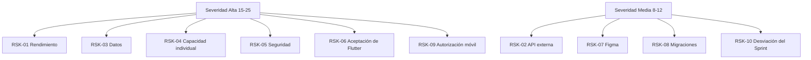

[⌂ README principal](../../README.md) | [← Anterior: 02 Artefactos Jira](02%20Artefactos%20Jira%20V_1_0_0.md) | [Siguiente: 04 Presupuesto del proyecto →](04%20Presupuesto%20del%20proyecto%20V_1_0_0.md)

# 03 Registro de riesgos

## 1. Metadatos

| Campo | Valor |
|---|---|
| Proyecto | **EcoLogística Huancayo - Optimizador de Rutas Sostenibles para DistriRápido S.A.C.** |
| Integrante | **Jordy Steve Chancasanampa Torres** |
| Modalidad | Proyecto individual |
| Fecha | **27/09/2026** |
| Versión | **1.0.0** |

> **Resumen de la tabla:** resume la identificación y las decisiones base del documento. Permite comprobar que todos los artefactos pertenecen al mismo proyecto, versión e integrante.

## 2. Método

**Severidad = Probabilidad (1-5) × Impacto (1-5)**. Clasificación: Baja 1-6, Media 8-12, Alta 15-25.

## 3. Matriz de riesgos

| ID | Riesgo | Categoría | P | I | Severidad | Mitigación | Contingencia | Responsable |
|---|---|---|---:|---:|---|---|---|---|
| RSK-01 | Optimizador supera 45 s. | Técnica | 4 | 5 | 20 (Alta) | Benchmark temprano, profiling y dataset incremental. | Ajustar metaheurística/parámetros o estrategia permitida. | Jordy Steve Chancasanampa Torres |
| RSK-02 | API de mapas/tráfico indisponible. | Integración | 3 | 4 | 12 (Media) | Adaptador, timeout, mock y fallback. | Operar con datos disponibles/carga alternativa. | Jordy Steve Chancasanampa Torres |
| RSK-03 | Coordenadas/direcciones insuficientes. | Datos | 4 | 4 | 16 (Alta) | Validación y puntos de referencia. | Solicitar corrección o excluir pedido de planificación. | Jordy Steve Chancasanampa Torres |
| RSK-04 | Sobrecarga por proyecto individual. | Gestión | 5 | 4 | 20 (Alta) | Limitar WIP y capacidad por Sprint. | Diferir alcance no obligatorio conservando RF-01..07. | Jordy Steve Chancasanampa Torres |
| RSK-05 | Vulnerabilidad crítica. | Seguridad | 3 | 5 | 15 (Alta) | SAST, OWASP y dependencias controladas. | Bloquear release, corregir y regresión. | Jordy Steve Chancasanampa Torres |
| RSK-06 | Flutter no aceptado frente a RES-06. | Académica/Técnica | 3 | 5 | 15 (Alta) | Justificación documentada y validación docente. | Ajustar cliente tecnológico si fuera requisito obligatorio. | Jordy Steve Chancasanampa Torres |
| RSK-07 | Mockups Figma no cubren ambos canales. | UX | 3 | 3 | 9 (Media) | Checklist de pantallas Web/móvil. | Refinar prototipos antes de continuar UI. | Jordy Steve Chancasanampa Torres |
| RSK-08 | Datos o migraciones inconsistentes. | BD | 2 | 5 | 10 (Media) | Migraciones versionadas y backups. | Restaurar y corregir migración. | Jordy Steve Chancasanampa Torres |
| RSK-09 | Móvil expone datos fuera de la ruta asignada. | Seguridad | 3 | 5 | 15 (Alta) | Autorización server-side por recurso. | Revocar acceso, corregir y auditar. | Jordy Steve Chancasanampa Torres |
| RSK-10 | Sprint con >30% no terminado. | Planificación | 3 | 4 | 12 (Media) | Refinement y capacidad basada en velocidad. | Replanificar y reducir WIP. | Jordy Steve Chancasanampa Torres |

> **Resumen de la tabla:** P e I cuantifican exposición. Los riesgos altos deben influir en prioridad de backlog y en el Sprint donde se ejecuta la mitigación.

## 4. Mapa de severidad

> **Resumen del diagrama:** los riesgos de rendimiento, seguridad, tecnología y capacidad del equipo requieren atención temprana porque podrían impedir la entrega del MVP.

## 5. Revisión de riesgos en Scrum

- Refinement: revisar riesgos de historias candidatas.
- Sprint Planning: seleccionar mitigaciones necesarias.
- Daily/seguimiento personal: registrar impedimentos.
- Sprint Review: verificar si algún riesgo afectó el incremento.
- Retrospective: definir una acción de mejora.

---

[⌂ README principal](../../README.md) | [← Anterior: 02 Artefactos Jira](02%20Artefactos%20Jira%20V_1_0_0.md) | [Siguiente: 04 Presupuesto del proyecto →](04%20Presupuesto%20del%20proyecto%20V_1_0_0.md)
